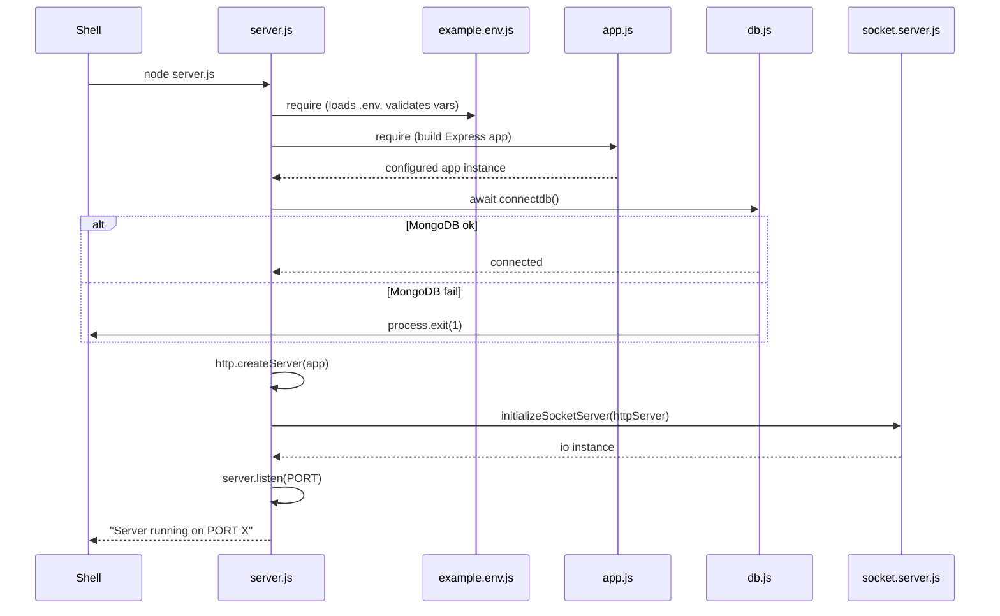

# APILogs Backend — Root-Level Files Documentation

> **Source of truth:** All claims in this document are verified directly from the source code in `backend/`. Do not assume any behavior; read the code.

---

## Table of Contents

1. [Directory Structure](#1-directory-structure)
2. [Startup Sequence](#2-startup-sequence)
3. [server.js — Entry Point](#3-serverjs--entry-point)
4. [app.js — Express Application Factory](#4-appjs--express-application-factory)
5. [example.env.js — Environment Configuration](#5-exampleenvjs--environment-configuration)
6. [package.json — Dependency Manifest](#6-packagejson--dependency-manifest)
7. [script.js — Load Testing Utility](#7-scriptjs--load-testing-utility)
8. [Dependency Reference: src/Database/db.js](#8-dependency-reference-srcdatabasedbjs)
9. [Dependency Reference: src/realtime/socket.server.js](#9-dependency-reference-srcrealtimesocketserverjs)
10. [Dependency Reference: src/realtime/socket.auth.js](#10-dependency-reference-srcrealtimesocketauthjs)
11. [Dependency Reference: src/realtime/socket.manager.js](#11-dependency-reference-srcrealtimesocketmanagerjs)
12. [Dependency Reference: src/middleware/performanceTimer.js](#12-dependency-reference-srcmiddlewareperformancetimerjs)
13. [Full Startup Lifecycle Diagram](#13-full-startup-lifecycle-diagram)
14. [Route Mounting Map](#14-route-mounting-map)
15. [Security Implementation Notes](#15-security-implementation-notes)
16. [Documentation Discrepancies](#16-documentation-discrepancies)
17. [Unverified Assumptions](#17-unverified-assumptions)
18. [Interview Preparation Notes](#18-interview-preparation-notes)

---

## 1. Directory Structure

```
backend/
├── app.js              ← Express app factory (middleware + routes, no server.listen)
├── server.js           ← Entry point: connects DB, starts HTTP server, inits Socket.IO
├── script.js           ← Load testing utility (manual invocation, not part of app)
├── example.env.js      ← Environment variable loader, parser, and validator
├── package.json        ← Project metadata, dependencies, npm scripts
├── .env                ← Actual environment secrets (git-ignored, not documented here)
├── src.md              ← This file
└── src/
    ├── Database/
    │   └── db.js           ← MongoDB connection logic
    ├── controllers/        ← Business logic
    ├── middleware/         ← Express middleware (auth, ratelimit, perf)
    ├── models/             ← Mongoose schemas
    ├── realtime/           ← Socket.IO server, auth, manager
    ├── routes/             ← Express routers
    ├── utils/              ← JWT, OTP, email, metrics helpers
    └── validations/        ← Joi validation middleware
```

All five root-level files (`app.js`, `server.js`, `script.js`, `example.env.js`, `package.json`) are in `backend/` — NOT inside `backend/src/`.

---

## 2. Startup Sequence

```
node server.js
  │
  ├─ 1. require("./example.env")   → loads .env, validates required vars, exports config
  ├─ 2. require("./app")           → builds Express app with middleware + routes
  ├─ 3. connectdb()                → connects to MongoDB (exits process on failure)
  ├─ 4. http.createServer(app)     → wraps Express in Node.js HTTP server
  ├─ 5. initializeSocketServer()   → attaches Socket.IO to the HTTP server
  └─ 6. server.listen(PORT)        → begins accepting connections
```

If step 3 (MongoDB) fails, `process.exit(1)` is called and the server never starts. Socket.IO initialization failure is warned but does **not** crash the server.

---

## 3. `server.js` — Entry Point

**File:** `backend/server.js`  
**Role:** Composes and launches the entire backend.

### Imports

| Import | Source | Purpose |
|---|---|---|
| `http` | Node built-in | Creates the raw HTTP server to share with Socket.IO |
| `net` | Node built-in | Imported but **not used** in any logic — dead import |
| `app` | `./app` | The configured Express application |
| `connectdb` | `./src/Database/db` | Async MongoDB connection function |
| `initializeSocketServer`, `getIO` | `./src/realtime/socket.server` | Socket.IO initialization and getter |
| `PORT` | `./example.env` | Server port from environment |

> **Note:** `net` is imported but never used. This is a dead import — not a bug, just clutter.  
> **Note:** `getIO` is imported but also never called inside `server.js`. It is used in other files (controllers) by re-importing from `socket.server`.

### Module-Level State

```js
let socketServerInitialized = false;
```

A module-level boolean flag, set to `true` if `initializeSocketServer()` returns a truthy `io` instance. Exported as `{ socketServerInitialized }` — available to any module that requires `server.js`, though no current code imports it.

### `startServer()` — async function

The sole non-trivial function. Steps in execution order:

1. **`await connectdb()`** — Establishes the MongoDB connection. If this throws, execution jumps to the `catch` block → `process.exit(1)`.
2. **`http.createServer(app)`** — Creates the HTTP server around the Express app. This is required because Socket.IO needs the raw `http.Server` instance, not the Express app directly.
3. **`initializeSocketServer(server)`** — Passes the HTTP server to the Socket.IO setup function. Returns the `io` instance.
4. **`socketServerInitialized = !!io`** — Coerces `io` to boolean. If `io` is `null` or `undefined`, the flag is `false` and a warning is logged.
5. **`server.listen(PORT, callback)`** — Begins listening on the configured port and logs a confirmation.

### Error Handling

```
try { ... } catch (error) {
    console.error("Server startup failed: ", error);
    process.exit(1);
}
```

Any synchronous or async error inside `startServer()` results in `process.exit(1)`. No graceful shutdown (closing DB connections, draining requests) is implemented.

### Exports

```js
module.exports = { socketServerInitialized };
```

Exports the initialization flag. Not used by any other file in the current codebase.

### Interview Explanation

> "server.js is the entry point. It uses a clear sequential startup: connect to MongoDB first, then build the HTTP server from the Express app, then attach Socket.IO to that same HTTP server, then start listening. If MongoDB fails at startup, we exit immediately — there's no point running without a database. I wrap everything in a try-catch so any unexpected failure also exits the process cleanly."

---

## 4. `app.js` — Express Application Factory

**File:** `backend/app.js`  
**Role:** Creates and configures the Express app. Does NOT start the server (that's server.js).

### Imports and Usage

| Import | Source | Usage |
|---|---|---|
| `express` | npm | Creates the app and router |
| `cors` | npm | Cross-Origin Resource Sharing configuration |
| `helmet` | npm | Sets security-related HTTP headers |
| `CLIENT_PRO_URL` | `./example.env` | The allowed frontend origin for CORS |
| `performanceTimer` | `./src/middleware/performanceTimer` | Request duration logger |
| `authRoutes` | `./src/routes/auth.Routes` | Auth endpoint group |
| `projectRoutes` | `./src/routes/project.Routes` | Project endpoint group |
| `eventRoutes` | `./src/routes/event.Routes` | Event endpoint group |
| `IncidentRoutes` | `./src/routes/incident.Routes` | Incident endpoint group |
| `systemRoutes` | `./src/routes/system.routes` | System health/metrics endpoints |

> **Commented-out import:** `globalLimiter` from `ratelimiter.js` is commented out on lines 6 and 29. The global IP-based rate limiter is **not active**.

### Middleware Stack (in registration order)

```
1. cors(...)             → applied to all routes
2. helmet()              → applied to all routes
3. express.json(...)     → applied to all routes
4. performanceTimer      → applied to all routes
5. (globalLimiter)       → COMMENTED OUT — not active
```

#### 4.1 CORS

```js
app.use(cors({
    origin: CLIENT_PRO_URL,
    credentials: true,
    methods: ["GET", "POST", "PUT", "DELETE", "OPTIONS", "PATCH"],
    allowedHeaders: ["Content-Type", "Authorization"]
}));
```

- `origin: CLIENT_PRO_URL` — only one origin allowed. Read from env; if the env var is missing, `CLIENT_PRO_URL` will be `undefined` (no fallback in `example.env.js`). With `undefined` as origin, the `cors` library may reject all cross-origin requests.
- `credentials: true` — cookies and `Authorization` headers are forwarded.
- `methods` — all standard HTTP verbs explicitly listed.
- `allowedHeaders` — only `Content-Type` and `Authorization`. Custom headers (e.g., `x-api-key`) are **not** in `allowedHeaders`. This is a potential issue: browsers making preflight requests for the event ingest endpoint (which uses `x-api-key`) will be blocked by CORS. Server-side direct POST requests are unaffected.

#### 4.2 Helmet

```js
app.use(helmet());
```

Default Helmet configuration. Sets 11 security-related response headers:
- `Content-Security-Policy`
- `Cross-Origin-Embedder-Policy`
- `Cross-Origin-Opener-Policy`
- `Cross-Origin-Resource-Policy`
- `Referrer-Policy`
- `Strict-Transport-Security`
- `X-Content-Type-Options`
- `X-DNS-Prefetch-Control`
- `X-Download-Options`
- `X-Frame-Options`
- `X-XSS-Protection`

No custom Helmet configuration is applied.

#### 4.3 Body Parser

```js
app.use(express.json({ limit: "10kb" }));
```

Parses JSON request bodies. The `10kb` limit prevents large-payload denial-of-service attacks. Requests with a JSON body larger than 10 KB will receive a 413 error from Express before reaching any route handler.

> **Note:** This addresses the body size gap that would otherwise exist in the validation middleware. The 10 KB limit is enforced here at the application level.

#### 4.4 Performance Timer

```js
app.use(performanceTimer);
```

Logs every request that takes longer than 500 ms as `[SLOW REQUEST]`. See [Section 12](#12-dependency-reference-srcmiddlewareperformancetimerjs) for implementation details.

#### 4.5 Commented-out Global Rate Limiter

```js
// app.use(globalLimiter);
```

The global IP-based rate limiter is **disabled**. Only the OTP-specific and project-specific rate limiters are active (applied at the route level). There is no global rate limiting on any endpoint.

### Route Mounting

```js
app.use("/api/auth",      authRoutes);
app.use("/api/project",   projectRoutes);
app.use("/api/events",    eventRoutes);
app.use("/api/incidents", IncidentRoutes);
app.use("/api/system",    systemRoutes);
```

All routes are mounted under `/api/`. There is no catch-all 404 handler — undefined routes will fall through with Express 5.x default behavior.

### Exports

```js
module.exports = app;
```

Returns the configured Express app (not yet listening). `server.js` receives it and wraps it in an HTTP server.

### Interview Explanation

> "app.js is the Express application factory. It sets up all global middleware — CORS, Helmet for security headers, a 10 KB JSON body limit to prevent large payload attacks, and a performance timer — then mounts all five route groups under /api. It's intentionally separate from server.js so you can import the app in tests without starting the server."

---

## 5. `example.env.js` — Environment Configuration

**File:** `backend/example.env.js`  
**Role:** Single source of truth for all environment variable parsing, validation, and export.

### Why This File Exists

Instead of calling `process.env.VAR` across many files, all environment variables are centralized here. This means:
- Type coercion (strings from `.env` → numbers/ms) happens once.
- Required variable validation happens once, at startup.
- All consumers import from this file, not from `process.env` directly.

> **Exception:** `socket.auth.js` reads `process.env.JWT_ACCESS_SECRET` directly instead of importing from `example.env`. This is a consistency bug — see [Section 16](#16-documentation-discrepancies).

### Required Environment Variables

Enforced only when `NODE_ENV === "production"`:

| Variable | Description |
|---|---|
| `PORT` | Server port |
| `MONGO_URI` | MongoDB connection string |
| `SaltValue` | bcrypt salt rounds |
| `JWT_ACCESS_SECRET` | Secret for signing access tokens |
| `JWT_REFRESH_SECRET` | Secret for signing refresh tokens |
| `JWT_ACCESS_EXPIRES_IN` | Access token lifetime (e.g., `"15m"`) |
| `JWT_REFRESH_EXPIRES_IN` | Refresh token lifetime (e.g., `"7d"`) |
| `OTP_LENGTH` | Number of digits in OTP |
| `OTP_TTL_SECONDS` | OTP expiry time in seconds |
| `OTP_MAX_ATTEMPTS` | Max allowed OTP verification attempts |
| `SMTP_FROM` | Sender email address |
| `SENDGRID_API_KEY` | SendGrid API key for email delivery |
| `RATE_LIMIT_WINDOW_MS` | Rate limit window (used by ratelimiter.js) |
| `RATE_LIMIT_MAX` | Max requests per window |
| `NODE_ENV` | Environment name (`production`, `development`, etc.) |
| `CLIENT_URL` | Frontend origin URL (used for Socket.IO CORS) |

> **In development:** Missing required variables do NOT throw. The validation loop only runs when `NODE_ENV === "production"`. This means the server can start in development with an incomplete `.env`, potentially failing later with cryptic errors.

### Helper Functions

#### `parseMs(val)`

Converts a string value to milliseconds:
- Pure digits (e.g., `"60000"`) → parsed as integer directly.
- `"N m"` format (e.g., `"10 m"`, `"30m"`) → converted: `N * 60 * 1000`.
- Any other format → `undefined`.

Used for `RATE_LIMIT_WINDOW_MS` and `GLOBAL_RATE_LIMIT_WINDOW_MS`.

#### `getEnv(key, fallback)`

Thin wrapper around `process.env[key]`:
- If `fallback` is defined: returns `process.env[key] || fallback`.
- If no fallback: returns `process.env[key]` (may be `undefined`).

### Exported Config Object

| Exported Key | Source Variable | Type | Default |
|---|---|---|---|
| `GLOBAL_RATE_LIMIT_WINDOW_MS` | `GLOBAL_RATE_LIMIT_WINDOW_MS` | number (ms) or undefined | undefined |
| `PORT` | `PORT` | string | `3000` |
| `MONGO_URI` | `MONGO_URI` | string | undefined |
| `SALT` | `SaltValue` | number | `10` |
| `JWT_ACCESS_SECRET` | `JWT_ACCESS_SECRET` | string | undefined |
| `JWT_REFRESH_SECRET` | `JWT_REFRESH_SECRET` | string | undefined |
| `JWT_ACCESS_EXPIRES_IN` | `JWT_ACCESS_EXPIRES_IN` | string | `"15m"` |
| `JWT_REFRESH_EXPIRES_IN` | `JWT_REFRESH_EXPIRES_IN` | string | `"7d"` |
| `OTP_LENGTH` | `OTP_LENGTH` | number | `6` |
| `OTP_TTL_SECONDS` | `OTP_TTL_SECONDS` | number | `600` |
| `OTP_MAX_ATTEMPTS` | `OTP_MAX_ATTEMPTS` | number | `5` |
| `SMTP_FROM` | `SMTP_FROM` | string | undefined |
| `SENDGRID_API_KEY` | `SENDGRID_API_KEY` | string | undefined |
| `RATE_LIMIT_WINDOW_MS` | `RATE_LIMIT_WINDOW_MS` | number (ms) or undefined | undefined |
| `RATE_LIMIT_MAX` | `RATE_LIMIT_MAX` | number or undefined | undefined |
| `NODE_ENV` | `NODE_ENV` | string | undefined |
| `CLIENT_URL` | `CLIENT_URL` | string | undefined |
| `CLIENT_PRO_URL` | `CLIENT_PRO_URL` | string | undefined |

> **Note on naming:** The export key is `SALT` but the env variable is `SaltValue`. The parse is `parseInt(getEnv("SaltValue", 10), 10) || 10`. This double-extracts: first parses `SaltValue` from env with fallback string `"10"`, then `parseInt`s the result. If the env var is missing, the fallback is `"10"` which `parseInt`s to `10`. If the env var is present but non-numeric, `parseInt` returns `NaN` and `|| 10` kicks in.

### Interview Explanation

> "example.env.js acts as the environment configuration gateway. Every file that needs a config value imports from here rather than reading process.env directly. It also enforces that all required variables are present in production before the server boots. parseMs lets us write readable time values like '30m' in the .env file."

---

## 6. `package.json` — Dependency Manifest

**File:** `backend/package.json`

### Project Metadata

| Field | Value |
|---|---|
| `name` | `backend` |
| `version` | `1.0.0` |
| `main` | `server.js` |
| `type` | `commonjs` |
| `license` | `ISC` |

### npm Scripts

| Script | Command | Notes |
|---|---|---|
| `start` | `node server.js` | Production start |
| `test` | `echo "Error: no test specified" && exit 1` | No tests implemented |

### Production Dependencies

| Package | Version | Purpose |
|---|---|---|
| `@sendgrid/mail` | ^8.1.6 | Email delivery via SendGrid API |
| `axios` | ^1.13.5 | HTTP client — used only in `script.js` (load test) |
| `bcrypt` | ^6.0.0 | Password hashing in `Users.js` model |
| `cors` | ^2.8.6 | CORS middleware in `app.js` |
| `crypto` | ^1.0.1 | **Note:** this is the npm shim; Node.js built-in `crypto` is already available. This likely should be removed |
| `dotenv` | ^17.2.3 | Loads `.env` file into `process.env` in `example.env.js` |
| `express` | ^5.2.1 | HTTP framework — Express **v5** (not v4) |
| `express-mongo-sanitize` | ^2.2.0 | NoSQL injection prevention — **installed but not used in app.js** |
| `express-rate-limit` | ^8.2.1 | Rate limiting middleware |
| `helmet` | ^8.1.0 | Security HTTP headers |
| `hpp` | ^0.2.3 | HTTP Parameter Pollution prevention — **installed but not used in app.js** |
| `http` | ^0.0.1-security | npm shim for Node built-in — unnecessary, same issue as `crypto` |
| `joi` | ^18.0.2 | Request validation schemas |
| `jsonwebtoken` | ^9.0.3 | JWT creation and verification |
| `mongodb` | ^7.1.0 | MongoDB driver — used by Mongoose transitively; direct import not verified |
| `mongoose` | ^9.1.6 | MongoDB ODM |
| `net` | ^1.0.2 | npm shim for Node built-in — imported in server.js but not used |
| `nodemailer` | ^8.0.0 | Email sending — verify if used alongside or instead of SendGrid |
| `os` | ^0.1.2 | npm shim for Node built-in — used in system.controller.js for host metrics |
| `socket.io` | ^4.8.3 | WebSocket server |
| `xss-clean` | ^0.1.4 | XSS sanitization — **installed but not used in app.js** |

### Security Packages Installed but NOT Applied

| Package | Status |
|---|---|
| `express-mongo-sanitize` | Installed, not mounted in `app.js` |
| `hpp` | Installed, not mounted in `app.js` |
| `xss-clean` | Installed, not mounted in `app.js` |

These three packages would provide NoSQL injection sanitization, HTTP parameter pollution protection, and XSS cleaning respectively. Their absence from `app.js` means these protections are **not active**, despite being listed as dependencies. This is a significant security gap.

### Express v5 Note

The project uses Express **5.x** (not the commonly documented v4). Express 5 includes:
- Async errors in route handlers are now **automatically forwarded to error handlers** (no need to call `next(err)` for async functions).
- Some breaking API changes vs. v4.

---

## 7. `script.js` — Load Testing Utility

**File:** `backend/script.js`  
**Role:** A standalone script for generating synthetic load against the event ingest endpoint. Not part of the running application; run manually with `node script.js`.

### Configuration Constants

| Constant | Value | Meaning |
|---|---|---|
| `PROJECT_ID` | `"69ad186912aa27c90fc442c1"` | Hardcoded project ObjectId for testing |
| `API_KEY` | `"eed914205e072877..."` | Hardcoded plaintext API key |
| `BASE_URL` | `"https://lastproject-0dc1.onrender.com/api/events/ingest"` | Production URL — points at deployed backend |
| `TOTAL_EVENTS` | `2000` | Total events to send |
| `DELAY_MS` | `200` | Milliseconds to sleep between each request |

> **Security warning:** Real credentials (`PROJECT_ID` and `API_KEY`) are hardcoded in the source file. If this file is committed to a public repository, the credentials are exposed. The API key should be rotated.

### Helper Functions

#### `sleep(ms)`

```js
function sleep(ms) {
    return new Promise(resolve => setTimeout(resolve, ms));
}
```

Returns a promise that resolves after `ms` milliseconds. Used to throttle requests.

#### `randomSeverity()`

```js
const weights = [
    ...Array(8).fill("INFO"),
    ...Array(6).fill("WARN"),
    ...Array(3).fill("ERROR"),
    ...Array(1).fill("CRITICAL"),
];
return weights[Math.floor(Math.random() * weights.length)];
```

Returns a severity string with weighted probability:
- `INFO`: 8/18 ≈ 44%
- `WARN`: 6/18 ≈ 33%
- `ERROR`: 3/18 ≈ 17%
- `CRITICAL`: 1/18 ≈ 6%

This mimics a realistic production log distribution that leans toward INFO/WARN.

#### `randomString(length = 8)`

Generates a random lowercase alphanumeric string of the given length. Used to make each event's `message` unique, preventing deduplication/caching issues.

#### `validateServerResponse(res)`

```js
if (res && typeof res === "object" && res.data && res.data.message) {
    if (/error|fail/i.test(res.data.message)) {
        console.warn("Server responded with message:", res.data.message);
    }
}
```

Checks the axios response for error-like messages even on 200/201 responses. Useful for catching application-level errors wrapped in successful HTTP responses.

### `runLoadTest()` — Main Function

Executes the load test loop:

1. Initializes counters: `successCount`, `error500Count`, `otherErrorCount`.
2. Iterates `TOTAL_EVENTS` times:
   - Generates a random severity and unique message.
   - POSTs to `${BASE_URL}/${PROJECT_ID}` with headers `x-api-key: API_KEY`.
   - On success: increments `successCount`, logs progress every 100 events, calls `validateServerResponse`.
   - On error: categorizes into 500, other HTTP, connection refused, timeout, or unknown.
   - On 500: waits extra 500ms before continuing.
   - On `ECONNREFUSED`: waits 2000ms.
3. Awaits `sleep(DELAY_MS)` between every request regardless of success/failure.
4. Prints final summary.

### Request Body Sent

```json
{
  "service": "load-test-service",
  "severity": "<random>",
  "message": "Load test event <i> <random6chars>",
  "eventTimestamp": "<ISO string>",
  "metadata": { "batch": "phase5", "iteration": <i> },
  "environment": "production"
}
```

---

## 8. Dependency Reference: `src/Database/db.js`

**Called by:** `server.js` at startup.

```js
const connectdb = async () => {
    if (!MONGO_URI) throw new Error("MONGO_URI environment variable is not defined.");
    await mongoose.connect(MONGO_URI);
    console.log("MongoDB connected successfully.");
};
```

- Uses `mongoose.connect()` with no additional options. Mongoose 9.x defaults are used.
- On failure: logs to `console.error` and calls `process.exit(1)`.
- No connection pool configuration, reconnection logic, or graceful shutdown handling.
- No Mongoose `strictQuery` setting — Mongoose 9 default applies.

---

## 9. Dependency Reference: `src/realtime/socket.server.js`

**Called by:** `server.js` to attach Socket.IO to the HTTP server.

### `initializeSocketServer(httpServer)`

1. Creates a `new Server(httpServer, { cors: { origin: "*", methods: [...] } })`.
   - **Note:** Socket.IO CORS is set to `origin: "*"` — allows all origins. This is different from the Express CORS configuration, which restricts to `CLIENT_PRO_URL`. WebSocket connections are not restricted by origin.
2. Registers an `io.use()` authentication middleware that:
   - Reads the token from `socket.handshake.auth.token`.
   - Calls `verifySocketToken(token)`.
   - On success: sets `socket.userId = user.sub`.
   - On failure: calls `next(new Error("Authentication failed"))` — socket is rejected.
3. On successful connection (`io.on("connection")`):
   - Logs the `socket.id` and `socket.userId`.
   - Calls `registerSocketHandlers(io, socket)`.
   - Registers a disconnect log handler.

### `getIO()`

Returns the singleton `io` instance. Throws `"Socket.io not initialized"` if called before `initializeSocketServer`. Used by event/incident controllers to broadcast events.

---

## 10. Dependency Reference: `src/realtime/socket.auth.js`

**Called by:** `socket.server.js` to verify JWT tokens on WebSocket connections.

```js
const { JWT_ACCESS_SECRET } = process.env;
```

> **Bug:** This file reads `process.env.JWT_ACCESS_SECRET` directly instead of importing from `example.env.js`. This violates the project's config centralization pattern. If the variable name ever changes in `example.env.js`, this file would break silently.

### `verifySocketToken(token)`

Steps:
1. Checks `JWT_ACCESS_SECRET` is defined.
2. Checks `token` is truthy.
3. Calls `jwt.verify(token, JWT_ACCESS_SECRET)`.
4. Checks `decoded.sub` is present.
5. Returns `decoded` on success.
6. Any error: throws `"Unauthorized socket connection"`.

> **Note:** This verifies the access token signature and expiry, but does **not** verify `tokenVersion`. A user who calls `logoutEverywhere` will have their `tokenVersion` incremented, invalidating HTTP access tokens. However, existing Socket.IO connections authenticated with the old token will remain connected until they disconnect and reconnect — their token is only verified once at connection time.

---

## 11. Dependency Reference: `src/realtime/socket.manager.js`

**Called by:** `socket.server.js` on each new connection; `event.controller.js` for broadcasting.

### `registerSocketHandlers(io, socket)`

Handles three socket events per connection:

#### `"subscribe"` event

Client sends: `{ projectId: string }`

Steps:
1. Validates `projectId` is present.
2. Validates `projectId` is a valid ObjectId (`mongoose.Types.ObjectId.isValid`).
3. Queries `Project.findById(projectId).select("ownerId")`.
4. If project not found → emits `"subscription-error"`.
5. If `project.ownerId !== socket.userId` → attempts `AuditLog.create(...)` and emits `"subscription-error"`. 
   > **Bug:** `AuditLog` is referenced but **never imported** in `socket.manager.js`. This will throw `ReferenceError: AuditLog is not defined` every time an unauthorized subscription attempt is made. The audit logging fails and the error is swallowed by the inner try-catch.
6. If authorized → calls `socket.join(`project:${projectId}`)` and emits `"subscription-success"`.

#### `"unsubscribe"` event

Client sends: `{ projectId: string }`

Calls `socket.leave(`project:${projectId}`)`. No authorization check — any authenticated user can `leave` any room.

#### `"disconnect"` event

Calls `metrics.decrementSocketConnections()`.

On connection: `metrics.incrementSocketConnections()` is called.

### `emitEventToProject(io, projectId, eventData)`

```js
const roomName = `project:${projectId}`;
io.to(roomName).emit("new-event", eventData);
```

Called by `event.controller.js` after a successful event ingest to broadcast to all subscribed clients. The room name is deterministic: `project:<ObjectId_string>`.

---

## 12. Dependency Reference: `src/middleware/performanceTimer.js`

**Mounted in:** `app.js` as a global middleware.

```js
const performanceTimer = (req, res, next) => {
    const start = Date.now();
    res.on("finish", () => {
        const duration = Date.now() - start;
        if (duration > 500) {
            console.warn(`[SLOW REQUEST] ${req.method} ${req.originalUrl} - ${duration}ms`);
        }
    });
    next();
};
```

- Uses `res.on("finish")` — fires after the response is fully sent to the client.
- Records start time with `Date.now()` (millisecond precision).
- Logs `[SLOW REQUEST]` to stderr if request takes more than 500ms.
- Does not expose timing in response headers.
- Does not persist or aggregate timing data.

---

## 13. Full Startup Lifecycle Diagram



---

## 14. Route Mounting Map

All routes are mounted in `app.js`. The full path prefix is shown below:

| Prefix | Router File | Endpoints |
|---|---|---|
| `/api/auth` | `src/routes/auth.Routes.js` | register, login, OTP, refresh, logout |
| `/api/project` | `src/routes/project.Routes.js` | create project, list, rotate API key |
| `/api/events` | `src/routes/event.Routes.js` | ingest event, get events |
| `/api/incidents` | `src/routes/incident.Routes.js` | get incidents, update status |
| `/api/system` | `src/routes/system.routes.js` | health check, metrics |

---

## 15. Security Implementation Notes

### What IS Implemented

| Protection | Where |
|---|---|
| CORS origin restriction | `app.js` — `CLIENT_PRO_URL` only |
| Helmet security headers | `app.js` — default Helmet config |
| JSON body size limit (10 KB) | `app.js` — `express.json({ limit: "10kb" })` |
| OTP rate limiter (5 req / 10 min per IP) | `middleware/ratelimiter.js` + auth routes |
| Project-level event rate limiter | `middleware/projectRateLimiter.js` |
| JWT access + refresh token auth | `middleware/auth.js` |
| API key auth (SHA-256 hash compare) | `middleware/apiKeyAuth.js` |
| bcrypt password hashing | `models/Users.js` pre-save hook |
| Joi input validation | `validations/` folder |
| Socket.IO JWT authentication | `realtime/socket.auth.js` |

### What is NOT Implemented Despite Packages Being Installed

| Protection | Package | Status |
|---|---|---|
| NoSQL injection sanitization | `express-mongo-sanitize` | Installed, **not mounted** |
| HTTP Parameter Pollution | `hpp` | Installed, **not mounted** |
| XSS string sanitization | `xss-clean` | Installed, **not mounted** |
| Global IP rate limiting | `express-rate-limit` + `globalLimiter` | Code exists, **commented out** |

### Other Security Gaps

| Gap | Location | Detail |
|---|---|---|
| `x-api-key` not in CORS `allowedHeaders` | `app.js` | Browser clients using the ingest API will have preflight requests blocked |
| Socket.IO CORS is `origin: "*"` | `socket.server.js` | No origin restriction on WebSocket connections |
| `JWT_ACCESS_SECRET` read from `process.env` directly | `socket.auth.js` | Bypasses centralized config validation |
| No graceful shutdown | `server.js` | No SIGTERM/SIGINT handler; abrupt process.exit(1) on DB failure |
| Hardcoded credentials | `script.js` | `PROJECT_ID` and `API_KEY` in committed code |
| `tokenVersion` not checked on WebSocket | `socket.auth.js` | `logoutEverywhere` does not invalidate existing socket sessions |
| `AuditLog` not imported | `socket.manager.js` | `ReferenceError` on unauthorized subscription attempt |

---

## 16. Documentation Discrepancies

| # | Location | Issue |
|---|---|---|
| D1 | `socket.auth.js` line 2 | Reads `process.env.JWT_ACCESS_SECRET` directly instead of from `example.env`. All other files use the centralized config. |
| D2 | `socket.manager.js` line 31 | References `AuditLog` which is never imported. Call will throw `ReferenceError` at runtime. |
| D3 | `app.js` line 22 | `x-api-key` is not in `allowedHeaders` but is used as an auth header for event ingestion. |
| D4 | `socket.server.js` line 13 | Socket.IO CORS uses `origin: "*"` while Express CORS uses `CLIENT_PRO_URL`. |
| D5 | `package.json` | `express-mongo-sanitize`, `hpp`, `xss-clean` are installed dependencies but are not applied in `app.js`. |
| D6 | `server.js` line 2 | `net` is imported but never used. |
| D7 | `server.js` line 5 | `getIO` is imported but never called in `server.js`. |

---

## 17. Unverified Assumptions

| Assumption | Reason |
|---|---|
| `.env` file structure | The actual `.env` file is not documented here. Values must be confirmed against `REQUIRED_VARS` in `example.env.js`. |
| `nodemailer` vs `@sendgrid/mail` | Both are installed. Which is actually used for email delivery must be confirmed in `src/utils/`. |
| MongoDB connection options | `mongoose.connect(MONGO_URI)` uses library defaults — actual pool size, timeout, and retry settings are not configured explicitly. |
| Deployment environment | `script.js` targets `https://lastproject-0dc1.onrender.com`. Whether this is still the active deployment cannot be verified. |

---

## 18. Interview Preparation Notes

### Q: Why does the project have two separate files — app.js and server.js?

**Reason:** Separation of concerns. `app.js` creates and configures the Express app (middleware, routes). `server.js` handles infrastructure concerns (DB connection, HTTP server lifecycle, Socket.IO). This pattern allows you to `require('./app')` in integration tests and call endpoints without actually starting the server.

### Q: What happens if MongoDB fails to connect at startup?

`connectdb()` is awaited inside a try-catch in `startServer()`. If it throws, `process.exit(1)` is called immediately. The server never starts listening. No graceful shutdown or retry logic is implemented.

### Q: What is example.env.js and why use it instead of process.env directly?

It is the centralized environment configuration module. All values are parsed, type-coerced, and validated in one place. It enforces that required variables are present in production at startup, rather than failing mysteriously later.

### Q: Why does the global rate limiter exist in the code but not be active?

`globalLimiter` is defined in `middleware/ratelimiter.js` and was imported and applied in `app.js`, but both lines are commented out. The per-route limiters (`otpLimiter`, `projectRateLimiter`) are still active. This means endpoints like `/api/auth/login` and `/api/auth/register` have no IP-level rate limiting applied.

### Q: What is the purpose of script.js?

A development/load-testing utility. It fires 2000 POST requests with random severities to the event ingest endpoint at 200ms intervals, to generate realistic data in the database and test the system under load. It is not part of the application — it is run manually with `node script.js`.

### Q: How does Socket.IO authentication work?

When a client connects, the Socket.IO server-side middleware (`io.use(...)`) intercepts the handshake and reads `socket.handshake.auth.token`. This JWT is passed to `verifySocketToken()` which calls `jwt.verify()`. If valid, `socket.userId` is set to the `sub` claim and `next()` is called. If invalid, `next(new Error(...))` rejects the connection. Importantly, token version is NOT checked here, meaning a `logoutEverywhere` call does not disconnect existing socket sessions.

### Q: What three security packages are installed but not applied?

`express-mongo-sanitize` (NoSQL injection), `hpp` (HTTP Parameter Pollution), and `xss-clean` (XSS sanitization) are all in `package.json` but not mounted in `app.js`. This is a meaningful security gap that an interviewer may probe.

### Q: What does the performanceTimer middleware do?

It records `Date.now()` at the start of every request, then listens on the `res.finish` event to calculate the total duration. If the duration exceeds 500ms, it logs `[SLOW REQUEST]` with the method, URL, and duration to the console. It does not affect request processing or response headers.

---

*Last updated: 2026-09-16. All documentation is based on direct source code inspection. No behavior is assumed or invented.*
