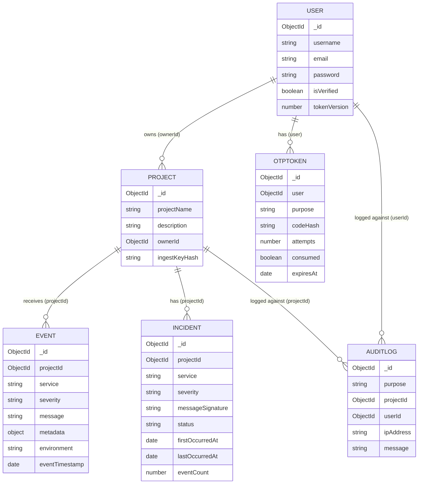

# APILogs Backend — Models Complete Technical Reference

> **Audience:** Developer preparing for technical interviews.
> **Source of truth:** Actual `.js` source files in `backend/src/models/`.
> **All claims are verified against source code. Unverified items are explicitly labelled.**
> **Last updated:** 2026-09-15

---

## Table of Contents

1. [Model Architecture Overview](#1-model-architecture-overview)
2. [Model Relationship Diagram](#2-model-relationship-diagram)
3. [Model: User](#3-model-user)
4. [Model: OtpToken](#4-model-otptoken)
5. [Model: Project](#5-model-project)
6. [Model: Event](#6-model-event)
7. [Model: Incident](#7-model-incident)
8. [Model: AuditLog](#8-model-auditlog)
9. [Index Reference Summary](#9-index-reference-summary)
10. [Cross-Model Query Patterns](#10-cross-model-query-patterns)
11. [Security Implementation in Models](#11-security-implementation-in-models)
12. [Known Issues and Implementation Risks](#12-known-issues-and-implementation-risks)
13. [Documentation Discrepancies Found](#13-documentation-discrepancies-found)
14. [Interview Preparation Notes](#14-interview-preparation-notes)
15. [Files Inspected](#15-files-inspected)

---

## 1. Model Architecture Overview

The APILogs backend uses **6 Mongoose models** on a single MongoDB database. Each model corresponds to a MongoDB collection and represents one core domain entity.

| Model | Collection | Primary Responsibility |
|---|---|---|
| `User` | `users` | Human dashboard users. Owns projects. |
| `OtpToken` | `otptokens` | Temporary one-time passwords for auth flows |
| `Project` | `projects` | A monitored service/app. Holds the ingest API key hash |
| `Event` | `events` | A single log entry from an external service |
| `Incident` | `incidents` | Grouped records of repeated ERROR/CRITICAL events |
| `AuditLog` | `auditlogs` | Immutable security event trail |

### Who Creates Each Model

| Model | Created by |
|---|---|
| `User` | `auth.Controller` — `register` |
| `OtpToken` | `auth.Controller` — `register`, `resendVerificationOtp`, `requestLoginOtp` |
| `Project` | `project.Controller` — `createProject` |
| `Event` | `event.controller` — `ingestEvent` |
| `Incident` | `event.controller` — `ingestEvent` (auto, only for ERROR/CRITICAL) |
| `AuditLog` | `apiKeyAuth` middleware, `rotateIngestKey`, `socket.manager` (all partially broken) |

---

## 2. Model Relationship Diagram



---

## 3. Model: `User`

**File:** `src/models/Users.js`
**Mongoose model name:** `"User"`
**Collection:** `users`

### Full Schema

```js
const UserSchema = new mongoose.Schema({
    username: {
        type: String,
        required: true,
        unique: true,
        trim: true,
        minlength: 3,
        maxlength: 100,
    },
    email: {
        type: String,
        required: true,
        unique: true,
        trim: true,
        lowercase: true,       // auto-lowercased before save
    },
    password: {
        type: String,
        required: true,
        minlength: 3,          // Schema-level: 3 chars min
                               // Note: Joi validator enforces 8 chars — stronger rule
    },
    isVerified: {
        type: Boolean,
        default: false,
    },
    tokenVersion: {
        type: Number,
        default: 0,
    },
}, { timestamps: true });
```

### Field Reference

| Field | Type | Constraints | Default | Notes |
|---|---|---|---|---|
| `_id` | ObjectId | auto | MongoDB auto | PK |
| `username` | String | unique, trim, 3–100 chars | — | Alphanumeric enforced by Joi (not schema) |
| `email` | String | unique, trim, lowercase | — | Case-folded by Mongoose before save |
| `password` | String | required, min 3 (schema) | — | Stored as bcrypt hash — never plain text |
| `isVerified` | Boolean | — | `false` | Must be `true` before user can log in |
| `tokenVersion` | Number | — | `0` | Incremented on `logoutEverywhere` |
| `createdAt` | Date | — | auto | Mongoose timestamps |
| `updatedAt` | Date | — | auto | Mongoose timestamps |

### Pre-Save Hook: Password Hashing

```js
UserSchema.pre("save", async function () {
    const user = this;
    if (!user.isModified("password")) return;
    const salt = await bcrypt.genSalt(Number(SaltValue));
    const hash = await bcrypt.hash(user.password, salt);
    user.password = hash;
});
```

- Only runs when `password` has been modified (guards against re-hashing on other field updates).
- `SaltValue` comes from `example.env.js` config (default `10` — bcrypt cost factor).
- Errors inside the hook are caught and logged to console but **not re-thrown**. This means a bcrypt failure would silently save the plain-text password. There is no mechanism to abort the save on hash failure.
- `lowercase: true` on `email` means Mongoose lowercases the email string on every save automatically — independent of the pre-save hook.

### Instance Method: `comparePassword(plain)`

```js
UserSchema.methods.comparePassword = async function (password) {
    return await bcrypt.compare(password, this.password);
};
```

- Returns a `Promise<boolean>`.
- Used only in `auth.Controller.js → loginWithPassword`.
- `bcrypt.compare` is timing-safe against brute-force attacks.

### Indexes

- `username`: unique index (created by `unique: true` in schema).
- `email`: unique index (created by `unique: true` in schema).
- No explicit compound indexes.
- `timestamps: true` adds `createdAt` and `updatedAt` but does not index them.

### Used By

| Controller/Middleware | Operation |
|---|---|
| `auth.Controller → register` | `new User(...).save()` — create |
| `auth.Controller → resendVerificationOtp` | `User.findOne({ email })` — read |
| `auth.Controller → verifyEmail` | `User.findOne({ email })`, then `user.isVerified = true; user.save()` |
| `auth.Controller → loginWithPassword` | `User.findOne({ email })`, then `comparePassword()` |
| `auth.Controller → requestLoginOtp` | `User.findOne({ email })` — read |
| `auth.Controller → verifyLoginOtp` | `User.findOne({ email })` — read |
| `auth.Controller → refreshToken` | `User.findById(payload.sub)` — read |
| `auth.Controller → logoutEverywhere` | `User.findById(req.user.id)`, then `user.tokenVersion += 1; user.save()` |

### `tokenVersion` Mechanism (Token Invalidation)

`tokenVersion` starts at `0`. All JWTs contain `tv: user.tokenVersion` in their payload. When `logoutEverywhere` is called:

```js
user.tokenVersion += 1; // e.g., 0 → 1
await user.save();
```

`refreshToken` then checks:
```js
if (user.tokenVersion !== payload.tv) throw new Error("Invalid token");
```

Old refresh tokens (with `tv: 0`) are now rejected. New tokens will have `tv: 1`. This mechanism does NOT immediately invalidate access tokens — they continue to pass `authRequired` (which reads `tv` from the JWT payload only, not the DB) until they expire naturally.

### Interview Explanation

> "The User model stores credentials and auth state. Passwords are automatically bcrypt-hashed via a Mongoose pre-save hook — the controller never does this manually. `isVerified` must be `true` before a user can log in. `tokenVersion` is an integer that acts as a revocation mechanism: incrementing it invalidates all existing refresh tokens, though access tokens remain valid until they expire because we use stateless JWT verification."

---

## 4. Model: `OtpToken`

**File:** `src/models/OtpToken.js`
**Mongoose model name:** `"OtpToken"`
**Collection:** `otptokens`

### Full Schema

```js
const OtpTokenSchema = new Schema({
    user: {
        type: Schema.Types.ObjectId,
        ref: "User",
        required: true,
        index: true
    },
    purpose: {
        type: String,
        required: true,
        enum: ["login", "verify"],
        index: true
    },
    codeHash: {
        type: String,
        required: true,
        minlength: 60      // bcrypt hash is always 60 chars
    },
    attempts: {
        type: Number,
        default: 0,
        min: 0
    },
    consumed: {
        type: Boolean,
        default: false
    },
    expiresAt: {
        type: Date,
        required: true,
        index: true
    }
}, {
    timestamps: true,
    versionKey: false      // no __v field
});

// TTL index: auto-delete expired documents
OtpTokenSchema.index({ expiresAt: 1 }, { expireAfterSeconds: 0 });
```

### Field Reference

| Field | Type | Constraints | Default | Notes |
|---|---|---|---|---|
| `_id` | ObjectId | auto | auto | PK |
| `user` | ObjectId | ref: User, required, indexed | — | Which user this OTP belongs to |
| `purpose` | String | enum: `login`, `verify`, indexed | — | `verify` = email verification; `login` = passwordless login |
| `codeHash` | String | min 60 chars, required | — | bcrypt hash of the plain OTP. Never plain text |
| `attempts` | Number | min: 0 | `0` | Increments on each wrong guess |
| `consumed` | Boolean | — | `false` | Set `true` when used or explicitly invalidated |
| `expiresAt` | Date | required, indexed | — | Set from `Date.now() + OTP_TTL_SECONDS * 1000` |
| `createdAt` | Date | — | auto | From timestamps |
| `updatedAt` | Date | — | auto | From timestamps |

### TTL Index Behaviour

```js
OtpTokenSchema.index({ expiresAt: 1 }, { expireAfterSeconds: 0 });
```

MongoDB's TTL mechanism deletes documents when `expiresAt <= Date.now()`. MongoDB's background TTL cleanup task runs approximately every **60 seconds**, so documents may persist for up to 60 seconds past their `expiresAt` time.

The controllers also perform a **manual expiry check** in addition to the TTL:
```js
if (!token || token.expiresAt < new Date()) return res.status(400).json({ error: "OTP expired or not found" });
```
This double check means the system is safe even in the 60-second grace window where MongoDB hasn't cleaned up yet.

### Static Method: `findValid(userId, purpose)`

```js
OtpTokenSchema.statics.findValid = function (userId, purpose) {
    return this.findOne({
        user: userId,
        purpose,
        consumed: false,
        expiresAt: { $gt: new Date() }
    });
};
```

This method exists in the schema but is **not used by any controller**. Controllers use manual `findOne` queries with `.sort({ createdAt: -1 })` instead.

### OTP Generation Flow (from `src/utils/genrateOtp.js`)

```js
async function makeOtp() {
    const otpLen = Number(env.OTP_LENGTH) || 6;      // default 6 digits
    const plain = randomDigits(otpLen);               // cryptographically secure
    const saltRounds = Number(env.SALT) || 10;
    const hash = await bcrypt.hash(plain, saltRounds);
    const ttlSeconds = Number(env.OTP_TTL_SECONDS) || 300;
    const expiresAt = new Date(Date.now() + ttlSeconds * 1000);
    return { plain, hash, expiresAt };
}
```

`randomDigits()` uses `crypto.randomBytes()`, not `Math.random()`. It rejects byte values ≥ 250 to eliminate modulo bias, then maps bytes to decimal digits.

Only `hash` and `expiresAt` enter the database. `plain` is sent to the user's email and then discarded.

### OTP Lifecycle

```
makeOtp() called
    │
    ├── plain  ──────────────► sendOtpEmail() → to user's inbox → discarded
    │
    └── hash + expiresAt ────► OtpToken.create({ codeHash: hash, expiresAt, consumed: false, attempts: 0 })
                                │
                                ▼
                User submits plain OTP
                    │
                    ├── bcrypt.compare(otp, token.codeHash)
                    │       │
                    │       ├── false → token.attempts++, token.save() → 400
                    │       │          if attempts >= OTP_MAX_ATTEMPTS → 429
                    │       │
                    │       └── true → token.consumed = true, token.save() → proceed
                    │
                    └── MongoDB TTL quietly deletes after expiresAt
```

### Invalidation Pattern

Before issuing a new OTP, old unconsumed OTPs are bulk-invalidated:
```js
OtpToken.updateMany(
    { user: user._id, purpose: "verify", consumed: false },
    { consumed: true }
)
```
This ensures only the most recent OTP per user/purpose is ever active.

### Used By

| Controller | Operation |
|---|---|
| `register` | `OtpToken.create(...)` |
| `resendVerificationOtp` | `OtpToken.updateMany(...)` then `OtpToken.create(...)` |
| `verifyEmail` | `OtpToken.findOne(...).sort({ createdAt: -1 })` then `token.save()` |
| `requestLoginOtp` | `OtpToken.updateMany(...)` then `OtpToken.create(...)` |
| `verifyLoginOtp` | `OtpToken.findOne(...).sort({ createdAt: -1 })` then `token.save()` |

### Interview Explanation

> "OtpToken stores one-time passwords for email verification and passwordless login. The plain OTP is never stored — only its bcrypt hash. When a user submits an OTP, we bcrypt-compare it to the hash. The `consumed` flag prevents replay attacks. The `attempts` counter limits brute-force to `OTP_MAX_ATTEMPTS`. MongoDB TTL auto-deletes expired tokens, but we also manually check `expiresAt` in the controller to handle the 60-second TTL cleanup lag."

---

## 5. Model: `Project`

**File:** `src/models/Project.js`
**Mongoose model name:** `"Project"`
**Collection:** `projects`

### Full Schema

```js
const ProjectSchema = new mongoose.Schema({
    projectName: {
        type: String,
        required: true,
        trim: true,
        minlength: 3,
        maxlength: 200,
    },
    description: {
        type: String,
        trim: true,
        maxlength: 500,
        default: "",
    },
    ownerId: {
        type: mongoose.Schema.Types.ObjectId,
        ref: "User",
        required: true,
        index: true,
    },
    ingestKeyHash: {
        type: String,
        required: true,
        select: false,      // NEVER returned by default queries
    }
}, { timestamps: true });
```

### Field Reference

| Field | Type | Constraints | Default | Notes |
|---|---|---|---|---|
| `_id` | ObjectId | auto | auto | PK |
| `projectName` | String | required, trim, 3–200 chars | — | Must be unique per owner (enforced in controller, not schema) |
| `description` | String | trim, max 500 | `""` | Optional |
| `ownerId` | ObjectId | ref: User, required, indexed | — | Multi-tenancy pivot field |
| `ingestKeyHash` | String | required, **select: false** | — | SHA-256 hash of the API key. Never in plain text |
| `createdAt` | Date | — | auto | |
| `updatedAt` | Date | — | auto | |

### `select: false` — Critical Field Visibility Rule

`ingestKeyHash` has `select: false`. This means:
- `Project.find(...)` — `ingestKeyHash` is **NOT** included in results.
- `Project.findById(...)` — `ingestKeyHash` is **NOT** included.
- `Project.findById(...).select("+ingestKeyHash")` — **IS** included.

Files that correctly use `.select("+ingestKeyHash")`:
- `apiKeyAuth.js` middleware — ✅ correct
- `project.Controller → rotateIngestKey` — ✅ correct

Files where it is NOT explicitly selected (works correctly because the key is already in memory):
- `project.Controller → createProject` — the hash is set on the in-memory object and saved, then the plain key is returned. The model response omits the hash field, which is correct behaviour.

### Instance Method: `generateIngestKey()`

```js
ProjectSchema.methods.generateIngestKey = function () {
    const rawKey = crypto.randomBytes(32).toString("hex"); // 64-char hex string
    const hash = crypto
        .createHash("sha256")
        .update(rawKey)
        .digest("hex");
    this.ingestKeyHash = hash;    // stores hash on document in memory
    return rawKey;                // returns plain key (caller must save the document)
};
```

- Uses Node's built-in `crypto` module — no third-party dependencies.
- `randomBytes(32)` generates 32 bytes = 256 bits of entropy.
- `.toString("hex")` produces a 64-character hex string as the raw key.
- SHA-256 produces a 64-character hex digest as the hash.
- **This method does NOT call `this.save()`** — the caller is responsible for saving.
- The raw key is returned exactly once. After `save()`, it is gone forever — only the hash persists.

### Instance Method: `verifyIngestKey(providedKey)`

```js
ProjectSchema.methods.verifyIngestKey = function (providedKey) {
    const hash = crypto
        .createHash("sha256")
        .update(providedKey)
        .digest("hex");
    return this.ingestKeyHash === hash;
};
```

- SHA-256 hashes the provided key and compares to the stored hash.
- Returns `true` or `false`.
- Uses JavaScript `===` string comparison — **not** constant-time.

> ⚠️ **Security note:** `===` on strings is not guaranteed to be constant-time in V8. A theoretically possible timing attack could measure response time differences to determine whether a hash prefix matches. A production-grade implementation should use `crypto.timingSafeEqual(Buffer.from(a), Buffer.from(b))`.

### API Key Lifecycle

```
createProject() called
    │
    ├── new Project({ projectName, description, ownerId })     [UNSAVED]
    ├── project.generateIngestKey()
    │       ├── rawKey = crypto.randomBytes(32).toString("hex")
    │       └── project.ingestKeyHash = sha256(rawKey)
    ├── await project.save()  ──────────────────────► MongoDB: { ingestKeyHash: "abc..." }
    └── return { ingestKey: rawKey }   ◄── shown ONCE to user, never stored

API call with x-api-key: rawKey
    │
    └── apiKeyAuth:
            Project.findById(id).select("+ingestKeyHash")
            project.verifyIngestKey(rawKey)
                sha256(rawKey) === project.ingestKeyHash  → true

rotateIngestKey() called
    │
    ├── Project.findById(id).select("+ingestKeyHash ownerId")
    ├── project.generateIngestKey()   [overwrites ingestKeyHash in memory]
    ├── await project.save()  ─────────────────────► MongoDB: { ingestKeyHash: "new_hash..." }
    └── return { ingestKey: newRawKey }   ◄── shown ONCE, old key now invalid
```

### Multi-Tenancy Enforcement

Multi-tenancy is enforced by `ownerId`. Every query for project data must include an ownership check. This is done manually in each controller — there is no Mongoose middleware for this.

Pattern used throughout:
```js
const project = await Project.findById(projectId);
if (project.ownerId.toString() !== req.user.id.toString()) {
    return res.status(403).json({ message: "Unauthorized" });
}
```

**Uniqueness constraint:** Project names must be unique per owner, but this is checked at the controller level (`Project.findOne({ projectName, ownerId })`), not enforced by a database unique index. This creates a potential race condition — two simultaneous create requests with the same name could both pass the check before either one saves.

### Indexes

- `ownerId`: single field index — supports `Project.find({ ownerId })` efficiently.
- No compound indexes defined.

### Used By

| Controller/Middleware | Operation |
|---|---|
| `createProject` | `new Project(...).save()` |
| `listProject` | `Project.find({ ownerId }).sort({ createdAt: -1 })` |
| `rotateIngestKey` | `Project.findById(id).select("+ingestKeyHash ownerId")` then `save()` |
| `apiKeyAuth` | `Project.findById(id).select("+ingestKeyHash")` |
| `ingestEvent` | uses `req.project` (set by middleware) |
| `getProjectEvents` | `Project.findById(projectId)` — ownership check then events query |
| `getProjectIncidents` | `Project.findById(projectId)` — ownership check |
| `socket.manager → subscribe` | `Project.findById(projectId).select("ownerId")` |

### Interview Explanation

> "The Project model is the central resource. Its most important design decision is the `ingestKeyHash` field with `select: false` — it's a SHA-256 hash of the API key and is never returned by normal queries. We generate the key with 32 random bytes from Node's `crypto` module, hash it with SHA-256, store only the hash, and return the plain key exactly once. To verify a key, we hash the submitted value and compare. Multi-tenancy is enforced via `ownerId` ownership checks in every controller."

---

## 6. Model: `Event`

**File:** `src/models/Event.js`
**Mongoose model name:** `"Event"`
**Collection:** `events`

### Full Schema

```js
const EventSchema = new mongoose.Schema({
    projectId: {
        type: mongoose.Schema.Types.ObjectId,
        ref: "Project",
        required: true,
        index: true,
    },
    service: {
        type: String,
        required: true,
        trim: true,
        maxlength: 100,
        index: true
    },
    severity: {
        type: String,
        required: true,
        enum: ["INFO", "WARN", "ERROR", "CRITICAL"],
        index: true,
    },
    message: {
        type: String,
        required: true,
        trim: true,
        maxlength: 2000,
    },
    metadata: {
        type: mongoose.Schema.Types.Mixed,
        default: {},
    },
    environment: {
        type: String,
        enum: ["development", "staging", "production"],
        default: "production",
        index: true,
    },
    eventTimestamp: {
        type: Date,
        default: Date.now,
        index: true,
    },
}, { timestamps: true });

// Compound index for paginated event queries
EventSchema.index({ projectId: 1, eventTimestamp: -1 });
```

### Field Reference

| Field | Type | Enum | Required | Default | Notes |
|---|---|---|---|---|---|
| `_id` | ObjectId | — | auto | auto | PK |
| `projectId` | ObjectId | — | ✅ | — | Ref: Project. Which project this event belongs to |
| `service` | String | — | ✅ | — | Name of the service that sent this event |
| `severity` | String | `INFO`, `WARN`, `ERROR`, `CRITICAL` | ✅ | — | Determines incident handling |
| `message` | String | — | ✅ | — | Human-readable event description, max 2000 chars |
| `metadata` | Mixed | — | ❌ | `{}` | Arbitrary JSON — any extra context |
| `environment` | String | `development`, `staging`, `production` | ❌ (schema) / ✅ (controller) | `"production"` | Controller explicitly rejects missing `environment` |
| `eventTimestamp` | Date | — | ❌ | `Date.now` | When the event occurred, not when ingested |
| `createdAt` | Date | — | — | auto | Ingestion time (Mongoose timestamps) |
| `updatedAt` | Date | — | — | auto | Always equals `createdAt` for events (never updated) |

### The `environment` Field Discrepancy

In the schema: `environment` is not `required: true`. Its default is `"production"`.

In the `ingestEvent` controller:
```js
if (!service || !severity || !message || !environment) {
    return res.status(400).json({ message: "Missing required event fields" });
}
```
The controller **explicitly rejects** requests without `environment`, making it effectively required regardless of the schema default.

Additionally in the Joi validator (`validateEvent`): `environment` is `optional`. So the validation chain is: **Joi passes** → **controller rejects** with 400.

This is an inconsistency — if the intent is to require `environment`, the safest fix is to mark it `required: true` in both the schema and Joi validator.

### `eventTimestamp` vs `createdAt`

These are two different timestamps:
- `eventTimestamp` — when the event **occurred** in the external service. Can be set by the sender for backdated events.
- `createdAt` — when the event **arrived** at the APILogs backend. Always set by Mongoose.

A sender can pass a past (or future) `eventTimestamp`. The controller validates it is a parseable date but applies no bounds checking.

### Compound Index Analysis

```js
EventSchema.index({ projectId: 1, eventTimestamp: -1 });
```

This index directly supports the primary query in `getProjectEvents`:
```js
Event.find({ projectId: objectId })
    .sort({ eventTimestamp: -1 })
    .limit(limit)
    .lean()
```

And the paginated variant:
```js
Event.find({ projectId: objectId, eventTimestamp: { $lt: beforeDate } })
    .sort({ eventTimestamp: -1 })
    .limit(limit)
    .lean()
```

MongoDB uses this compound index for both queries — no full collection scan. The index is in descending order on `eventTimestamp` matching the sort direction, so MongoDB can traverse the index directly without in-memory sorting.

### Cursor-Based Pagination

`getProjectEvents` implements cursor-based (keyset) pagination via the `before` query parameter:

```
Initial request:   GET /api/events/:projectId?limit=50
                   → Returns 50 most recent events

Next page:         GET /api/events/:projectId?limit=50&before=2026-09-15T12:00:00.000Z
                   → where "before" = eventTimestamp of the last event from previous page
                   → Returns 50 events before that timestamp
```

Advantages over offset pagination:
- ✅ Stable under concurrent inserts — a new event at the top doesn't shift pages.
- ✅ Uses the index directly — no `skip()` cost.
- ❌ Cannot jump to arbitrary pages — must traverse sequentially.

### `metadata` Field (Mixed Type)

`mongoose.Schema.Types.Mixed` accepts any valid JSON value. MongoDB stores it as a sub-document. Mongoose cannot detect changes to nested Mixed fields automatically — for updates you must call `markModified("metadata")` first. Since Events are never updated (only created and read), this is not an issue here.

### Used By

| Controller | Operation |
|---|---|
| `ingestEvent` | `Event.create({ projectId, service, severity, message, metadata, environment, eventTimestamp })` |
| `getProjectEvents` | `Event.find(query).sort({ eventTimestamp: -1 }).limit(limit).lean()` |

Events are **never updated** after creation. No deletions are implemented.

### Interview Explanation

> "The Event model captures individual log entries from external services. The most important design choice is the compound index `{ projectId: 1, eventTimestamp: -1 }` — it enables fast paginated queries for a project's events sorted newest-first without a collection scan. We also separate `eventTimestamp` (when it happened) from `createdAt` (when we received it) to support backdated events. The `metadata` field is a Mixed type — schema-less JSON — for arbitrary extra context."

---

## 7. Model: `Incident`

**File:** `src/models/Incident.js`
**Mongoose model name:** `"Incident"`
**Collection:** `incidents`

### Full Schema

```js
const IncidentSchema = new mongoose.Schema({
    projectId: {
        type: mongoose.Schema.Types.ObjectId,
        ref: "Project",
        required: true,
        index: true
    },
    service: {
        type: String,
        required: true,
        index: true
    },
    severity: {
        type: String,
        enum: ["INFO", "WARN", "ERROR", "CRITICAL"],
        required: true,
        index: true
    },
    messageSignature: {
        type: String,
        required: true,
        index: true
    },
    status: {
        type: String,
        enum: ["OPEN", "ACKNOWLEDGED", "RESOLVED"],
        default: "OPEN",
        index: true
    },
    firstOccurredAt: {
        type: Date,
        required: true
    },
    lastOccurredAt: {
        type: Date,
        required: true
    },
    eventCount: {
        type: Number,
        default: 1
    }
}, { timestamps: true });

// Compound index for deduplication queries
IncidentSchema.index({ projectId: 1, messageSignature: 1, status: 1 });
```

### Field Reference

| Field | Type | Enum | Required | Default | Notes |
|---|---|---|---|---|---|
| `_id` | ObjectId | — | auto | auto | PK |
| `projectId` | ObjectId | — | ✅ | — | Ref: Project |
| `service` | String | — | ✅ | — | Service that generated the incident |
| `severity` | String | as above | ✅ | — | Severity at incident creation |
| `messageSignature` | String | — | ✅ | — | `message.trim().toLowerCase()` — dedup key |
| `status` | String | `OPEN`, `ACKNOWLEDGED`, `RESOLVED` | — | `"OPEN"` | Managed by `updateIncidentStatus` |
| `firstOccurredAt` | Date | — | ✅ | — | Set only at creation |
| `lastOccurredAt` | Date | — | ✅ | — | Updated on each new matching event |
| `eventCount` | Number | — | — | `1` | Incremented atomically on each matching event |

### `messageSignature` — The Deduplication Key

When an `ERROR` or `CRITICAL` event is ingested:

```js
const messageSignature = message.trim().toLowerCase();
```

This normalized signature is used to group related events into the same incident:

```js
Incident.findOneAndUpdate(
    {
        projectId: project._id,
        messageSignature,
        status: { $in: ["OPEN", "ACKNOWLEDGED"] }  // only active incidents
    },
    {
        $set: { lastOccurredAt: usedEventTimestamp },
        $inc: { eventCount: 1 }
    },
    { new: true }
)
```

If an incident is found: it is updated atomically (no separate find + save). If not found: a new incident is created.

> **Design implication:** Two messages that differ only in case or leading/trailing whitespace will be grouped into the same incident. Messages that differ by even one character (e.g., a dynamic ID embedded in the message) will create separate incidents.

### Compound Index Analysis

```js
IncidentSchema.index({ projectId: 1, messageSignature: 1, status: 1 });
```

This exactly matches the `findOneAndUpdate` query shape:
```js
{ projectId: ..., messageSignature: ..., status: { $in: [...] } }
```

MongoDB can use this index to find the matching document without a collection scan. The `$in` on `status` means MongoDB evaluates two index lookups (one for `OPEN`, one for `ACKNOWLEDGED`) — still highly efficient.

### Status Lifecycle

```
Incident created: status = "OPEN"
        │
        ├── New matching event arrives → eventCount++, lastOccurredAt updated
        │   (only if status is OPEN or ACKNOWLEDGED)
        │
        ├── User calls PATCH /api/incidents/:id/status { status: "ACKNOWLEDGED" }
        │        → status = "ACKNOWLEDGED"
        │
        └── User calls PATCH /api/incidents/:id/status { status: "RESOLVED" }
                 → status = "RESOLVED"
                 → New matching events will create a NEW incident (RESOLVED is excluded from $in)
```

Only `"ACKNOWLEDGED"` and `"RESOLVED"` can be set via the API. `"OPEN"` cannot be restored. When a resolved incident's error recurs, a brand new incident is created.

### `findOneAndUpdate` with `{ new: true }`

The `{ new: true }` option returns the **updated** document, not the original. This is important because the controller immediately broadcasts the updated incident via WebSocket:
```js
io.to(`project:${projectId}`).emit("incident-updated", incident.toObject());
```

### Race Condition

There is a potential race condition in `ingestEvent`:

```js
const incident = await Incident.findOneAndUpdate(...);
if (!incident) {
    incident = await Incident.create(...);
}
```

If two concurrent `ERROR` events with the same `messageSignature` arrive simultaneously:
- Both `findOneAndUpdate` calls return `null` (no existing incident).
- Both proceed to `Incident.create(...)`.
- MongoDB will create two separate incidents for the same error.

This could be mitigated with a unique compound index on `{ projectId, messageSignature }` for `OPEN` incidents, but no such constraint exists currently.

### Used By

| Controller | Operation |
|---|---|
| `ingestEvent` | `Incident.findOneAndUpdate(...)` and `Incident.create(...)` |
| `getProjectIncidents` | `Incident.find({ projectId }).sort({ lastOccurredAt: -1 }).lean()` |
| `updateIncidentStatus` | `Incident.findById(incidentId).populate("projectId")`, then `incident.save()` |

### `.populate("projectId")` in `updateIncidentStatus`

```js
const incident = await Incident.findById(incidentId).populate("projectId");
```

After `.populate()`, `incident.projectId` is the full `Project` document (not just an ObjectId). This is used to:
1. Check `project.ownerId === req.user.id` for authorization.
2. Get `project._id` for the WebSocket room name.

The plain object emitted via WebSocket is shaped to include the project info:
```js
incidentForEmit.projectId = { _id: project._id, service: project.service };
```

### Interview Explanation

> "The Incident model groups repeated errors into a single trackable record. The `messageSignature` is the lowercased, trimmed event message — this is the dedup key. When a new ERROR event arrives, we do a `findOneAndUpdate` against open/acknowledged incidents matching the project and signature. If found, we atomically increment `eventCount` and update `lastOccurredAt`. If not found, we create a new incident. The compound index `{ projectId, messageSignature, status }` makes this lookup fast. There is a race condition if two identical errors arrive simultaneously — both could create separate incidents."

---

## 8. Model: `AuditLog`

**File:** `src/models/AuditLog.js`
**Mongoose model name:** `"Auditlogs"` (note lowercase 'l')
**Collection:** `auditlogs`

### Full Schema

```js
const AuditLogSchema = new mongoose.Schema({
    purpose: {
        type: String,
        required: true,
        enum: [
            "API_KEY_FAILED",
            "SOCKET_UNAUTHORIZED",
            "RATE_LIMIT_EXCEEDED",
            "KEY_ROTATED"
        ],
        index: true
    },
    projectId: {
        type: mongoose.Schema.Types.ObjectId,
        ref: "Project",
        required: true,
        index: true
    },
    userId: {
        type: mongoose.Schema.Types.ObjectId,
        ref: "User",
        required: false,   // optional — not always known
        index: true,
    },
    ipAddress: {
        type: String,
        required: true,   // ← important: this is required
    },
    message: {
        type: String,
        required: true,
        trim: true,
        maxlength: 500
    }
}, { timestamps: true });

AuditLogSchema.index({ projectId: 1, createAt: -1 });  // note: typo "createAt" not "createdAt"
```

### Field Reference

| Field | Type | Enum | Required | Notes |
|---|---|---|---|---|
| `_id` | ObjectId | — | auto | PK |
| `purpose` | String | `API_KEY_FAILED`, `SOCKET_UNAUTHORIZED`, `RATE_LIMIT_EXCEEDED`, `KEY_ROTATED` | ✅ | What kind of security event |
| `projectId` | ObjectId | — | ✅ | Which project was involved |
| `userId` | ObjectId | — | ❌ | Not always known (e.g., anonymous failed key attempts) |
| `ipAddress` | String | — | ✅ | Caller's IP from `req.ip` |
| `message` | String | — | ✅ | Human-readable description, max 500 chars |
| `createdAt` | Date | — | — | auto |
| `updatedAt` | Date | — | — | auto |

### Where AuditLog Records Are Written (and Where They Fail)

| Caller | Purpose | Status |
|---|---|---|
| `apiKeyAuth.js` | `API_KEY_FAILED` | ✅ Works — `ipAddress` provided via `req.ip` |
| `project.Controller → rotateIngestKey` | `KEY_ROTATED` | ❌ Fails silently — `ipAddress` required but not provided |
| `projectRateLimiter.js` | `API_KEY_FAILED` | ❌ Fails silently — `AuditLog` not imported (ReferenceError) |
| `socket.manager.js → subscribe` | `SOCKET_UNAUTHORIZED` | ❌ Fails silently — `AuditLog` not imported (ReferenceError) |

### Why AuditLog Records Are Lost

`rotateIngestKey` calls:
```js
await AuditLog.create({
    purpose: "KEY_ROTATED",
    projectId,
    userId,
    message: "API key rotated successfully"
    // ipAddress is NOT provided — required by schema → Mongoose ValidationError
});
```

The Mongoose ValidationError is caught by the surrounding try/catch:
```js
try {
    await AuditLog.create({ ... });
} catch (e) {
    console.error("Audit log error:", e);
}
```

The error is only logged to console — it does not affect the `200` response. No audit record is written.

### Compound Index Issue

```js
AuditLogSchema.index({ projectId: 1, createAt: -1 });  // typo: "createAt" instead of "createdAt"
```

This index targets a field `createAt` which does not exist in the schema. MongoDB creates the index, but it will index `undefined` values for all documents. The index has no practical benefit and wastes storage. The intended index was probably `{ projectId: 1, createdAt: -1 }` for chronological audit trail queries.

### Model Name vs Collection Name

```js
module.exports = mongoose.model("Auditlogs", AuditLogSchema);
```

Mongoose converts the model name `"Auditlogs"` to lowercase + plural automatically for collection naming: `auditlogs`. The lowercase `l` in `"Auditlogs"` is intentional (or a typo) — it results in the same collection name either way.

### Interview Explanation

> "AuditLog is an append-only security event record. It tracks invalid API key attempts (with the caller's IP), key rotations, and unauthorized socket subscription attempts. In practice, three out of four write paths are broken: `rotateIngestKey` omits the required `ipAddress` field causing a silent Mongoose validation error, and both `projectRateLimiter` and `socket.manager` reference `AuditLog` without importing it. Only `apiKeyAuth` correctly writes audit records."

---

## 9. Index Reference Summary

| Model | Index | Type | Supports Query |
|---|---|---|---|
| `User` | `username` | Unique | Mongoose unique enforcement |
| `User` | `email` | Unique | `User.findOne({ email })` |
| `OtpToken` | `user` | Single | `OtpToken.findOne({ user: id })` |
| `OtpToken` | `purpose` | Single | Combined with `user` in queries |
| `OtpToken` | `expiresAt` | TTL | MongoDB auto-deletion |
| `OtpToken` | `{ expiresAt: 1 }` | TTL compound | Auto-delete after `expiresAt` |
| `Project` | `ownerId` | Single | `Project.find({ ownerId })` |
| `Event` | `projectId` | Single | Part of compound |
| `Event` | `service` | Single | Potential future filter queries |
| `Event` | `severity` | Single | Potential future filter queries |
| `Event` | `environment` | Single | Potential future filter queries |
| `Event` | `eventTimestamp` | Single | Part of compound |
| `Event` | `{ projectId: 1, eventTimestamp: -1 }` | Compound | `getProjectEvents` paginated query |
| `Incident` | `projectId` | Single | Part of compound |
| `Incident` | `service` | Single | Potential future filter |
| `Incident` | `severity` | Single | Potential future filter |
| `Incident` | `messageSignature` | Single | Part of compound |
| `Incident` | `status` | Single | Part of compound |
| `Incident` | `{ projectId: 1, messageSignature: 1, status: 1 }` | Compound | `ingestEvent` dedup lookup |
| `AuditLog` | `purpose` | Single | Filter by event type |
| `AuditLog` | `projectId` | Single | Per-project audit trail |
| `AuditLog` | `userId` | Single | Per-user audit trail |
| `AuditLog` | `{ projectId: 1, createAt: -1 }` | Compound | **Broken** — `createAt` typo |

---

## 10. Cross-Model Query Patterns

### Pattern 1: Event Ingest → Automatic Incident Upsert

```js
// 1. Save event
const event = await Event.create({ projectId, service, severity, message, ... });

// 2. If severity is ERROR or CRITICAL:
const messageSignature = message.trim().toLowerCase();

const incident = await Incident.findOneAndUpdate(
    { projectId, messageSignature, status: { $in: ["OPEN", "ACKNOWLEDGED"] } },
    { $set: { lastOccurredAt }, $inc: { eventCount: 1 } },
    { new: true }
);

if (!incident) {
    await Incident.create({ projectId, service, severity, messageSignature,
        firstOccurredAt, lastOccurredAt, eventCount: 1 });
}
```

Uses the Incident compound index. Both operations are atomic at the document level but not across each other — race condition possible.

### Pattern 2: Ownership-Gated Queries

Used consistently across event, incident, and project controllers:
```js
const project = await Project.findById(projectId);
if (!project) return res.status(404)...;
if (project.ownerId.toString() !== req.user.id.toString()) return res.status(403)...;
// proceed with querying events/incidents
```

Note `toString()` on both sides — necessary because `ownerId` is an ObjectId and `req.user.id` is a string (from JWT payload).

### Pattern 3: OTP Invalidation Before Reissue

```js
// 1. Invalidate all active OTPs
await OtpToken.updateMany(
    { user: user._id, purpose: "verify", consumed: false },
    { consumed: true }
);
// 2. Create new OTP
await OtpToken.create({ user: user._id, purpose: "verify", ... });
```

Ensures only one active OTP per user per purpose at any time.

---

## 11. Security Implementation in Models

| Security Concern | Model | Implementation |
|---|---|---|
| Password never stored plain | `User` | Pre-save hook bcrypt-hashes before write |
| OTP never stored plain | `OtpToken` | Only `codeHash` (bcrypt) stored |
| API key never stored plain | `Project` | Only SHA-256 hash stored (`select: false`) |
| OTP TTL auto-expiry | `OtpToken` | MongoDB TTL index on `expiresAt` |
| OTP single-use | `OtpToken` | `consumed` flag set immediately on use |
| OTP attempt limiting | `OtpToken` | `attempts` counter, checked against `OTP_MAX_ATTEMPTS` |
| API key field hidden | `Project` | `select: false` — never in normal query results |
| Audit trail | `AuditLog` | Append-only, immutable records (partially broken) |
| Multi-tenancy isolation | `Project`, `Event`, `Incident` | `ownerId` checked in every controller |

---

## 12. Known Issues and Implementation Risks

| # | Issue | Model | Severity | Details |
|---|---|---|---|---|
| 1 | Race condition on incident creation | `Incident` | Medium | Two simultaneous ERROR events with same signature can create duplicate incidents |
| 2 | Race condition on project name uniqueness | `Project` | Low | Two simultaneous create requests can bypass the duplicate name check |
| 3 | Pre-save hook silently swallows hash error | `User` | High | bcrypt failure logs error but doesn't abort save — password potentially stored plain |
| 4 | API key timing attack risk | `Project` | Low-Medium | `===` string comparison not constant-time |
| 5 | `AuditLog` 3 of 4 write paths broken | `AuditLog` | Medium | Missing imports + missing required field |
| 6 | Compound index typo in AuditLog | `AuditLog` | Low | `createAt` instead of `createdAt` — index is useless |
| 7 | `environment` field inconsistency | `Event` | Low | Optional in schema+Joi but required in controller |
| 8 | `OtpToken.findValid()` unused | `OtpToken` | Low | Static method exists but controllers use manual queries |
| 9 | Future backdated events | `Event` | Info | No bounds validation on `eventTimestamp` — can be set to any date |

---

## 13. Documentation Discrepancies Found

| # | What Was Expected / Claimed | Actual Behavior in Code |
|---|---|---|
| 1 | `password` min 8 chars | Schema has `minlength: 3`. Only Joi validator enforces 8 chars |
| 2 | `environment` is optional | Controller explicitly rejects missing `environment` despite schema default |
| 3 | AuditLog written on key rotation | `ipAddress` not provided — SchemaError silently swallowed |
| 4 | AuditLog written on rate limit exceed | `AuditLog` not imported — ReferenceError silently swallowed |
| 5 | AuditLog written on unauthorized socket | `AuditLog` not imported — ReferenceError silently swallowed |
| 6 | API key comparison is secure | Uses `===` (not constant-time) |
| 7 | Incident compound index claimed efficient | Index is correct and works; but race condition on concurrent creates exists |
| 8 | AuditLog index on `createdAt` | Index is on `createAt` (typo) — effectively useless |
| 9 | OtpToken `findValid` static is used | Defined but never called — all controllers use manual queries |

---

## 14. Interview Preparation Notes

---

**Q: How are passwords stored securely?**

> "We use Mongoose's `pre('save')` hook to automatically bcrypt-hash passwords whenever the `password` field is modified. The hook checks `isModified('password')` to avoid re-hashing on unrelated saves. The controller passes the plain password to `new User({ password })`, and bcrypt runs transparently. The hash replaces the plain text before the document reaches MongoDB. One caveat — bcrypt errors in the hook are caught and logged but not re-thrown, so a hashing failure wouldn't abort the save."

---

**Q: Explain the API key design. Why SHA-256 instead of bcrypt?**

> "SHA-256 is used (not bcrypt) for a deliberate reason: API keys are long, random values — unlike passwords entered by humans, they have very high entropy already. SHA-256 is deterministic and fast, which is fine here since we're not hashing a guessable value. Bcrypt's slowness is designed to resist dictionary attacks on short, predictable passwords. Storing the hash with `select: false` ensures it's never accidentally returned in API responses. The raw key is shown exactly once and never stored."

---

**Q: How does incident deduplication work, and what is `messageSignature`?**

> "When an ERROR or CRITICAL event arrives, we normalize the message with `trim().toLowerCase()` to create a `messageSignature`. We then do a `findOneAndUpdate` looking for an existing OPEN or ACKNOWLEDGED incident with the same project ID and signature. If found, we increment `eventCount` atomically with `$inc` and update `lastOccurredAt`. If not found, we create a new incident. This means 1000 occurrences of 'Database connection timeout' become a single incident with `eventCount: 1000` rather than 1000 separate records."

---

**Q: How does the OtpToken TTL index work?**

> "The OtpToken schema has `OtpTokenSchema.index({ expiresAt: 1 }, { expireAfterSeconds: 0 })`. This tells MongoDB to delete documents when `expiresAt` has passed. MongoDB's TTL background task runs every ~60 seconds, so documents can linger up to 60 seconds past their expiry. We handle this by also checking `token.expiresAt < new Date()` in the controller — if the token is past expiry, we reject it even if MongoDB hasn't deleted it yet. The `versionKey: false` option also removes the `__v` field from these documents, keeping them lean."

---

**Q: How is multi-tenancy enforced?**

> "All data models that belong to a project include `projectId` which references a `Project`. Each project has an `ownerId` reference to the `User` who created it. Every controller that returns project data first fetches the project and checks `project.ownerId.toString() === req.user.id.toString()`. There's no database-level isolation — it's entirely application-level ownership checks in the controllers. The `ingestKeyHash` field being `select: false` also means the key material is never accidentally leaked in project listing responses."

---

**Q: What indexes does the system use and why?**

> "The most important index is the compound `{ projectId: 1, eventTimestamp: -1 }` on Events. This supports the paginated event query perfectly — descending order matches the sort direction, so MongoDB traverses the index directly without sorting in memory. The Incident compound index `{ projectId, messageSignature, status }` supports the dedup lookup — it's queried exactly by those three fields every time an ERROR event comes in. The OtpToken has a TTL index on `expiresAt` for auto-cleanup. There's also a broken compound index in AuditLog with a `createAt` typo that indexes fields that don't exist."

---

## 15. Files Inspected

| File | Contents |
|---|---|
| `src/models/Users.js` | User schema, pre-save hook, comparePassword method |
| `src/models/OtpToken.js` | OtpToken schema, TTL index, findValid static |
| `src/models/Project.js` | Project schema, generateIngestKey, verifyIngestKey |
| `src/models/Event.js` | Event schema, compound index |
| `src/models/Incident.js` | Incident schema, compound index |
| `src/models/AuditLog.js` | AuditLog schema, broken compound index |
| `src/controllers/auth.Controller.js` | All User + OtpToken operations |
| `src/controllers/event.controller.js` | Event create, Incident upsert |
| `src/controllers/incident.controller.js` | Incident read + status update |
| `src/controllers/project.Controller.js` | Project CRUD + key rotation |
| `src/middleware/apiKeyAuth.js` | Project key verification, AuditLog write |
| `src/middleware/projectRateLimiter.js` | AuditLog write attempt (broken) |
| `src/realtime/socket.manager.js` | Project ownership check, AuditLog write attempt (broken) |
| `src/utils/genrateOtp.js` | OTP generation, hashing, expiry |
| `src/utils/sendEmail.js` | Email delivery via SendGrid |
| `src/validations/auth.Validation.js` | Register + login Joi schemas |
| `src/validations/Event.validation.js` | Event ingest Joi schema |
| `src/validations/project.validation.js` | Project create Joi schema |
