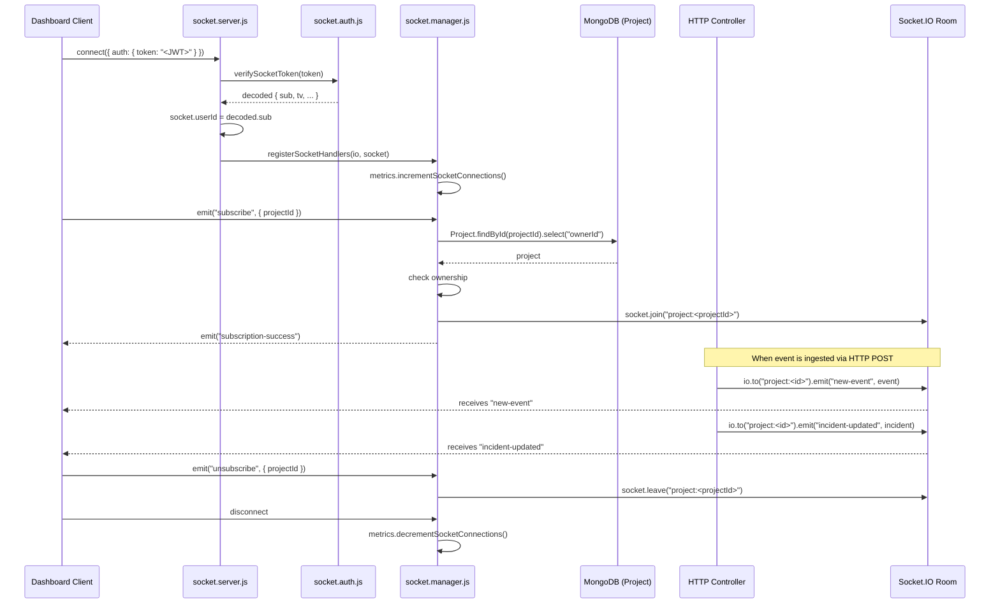
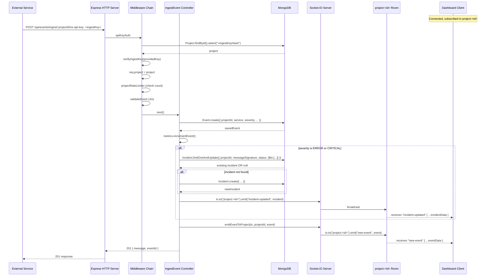

# APILogs Backend — Realtime System Complete Technical Reference

> **Audience:** Developer preparing for technical interviews.
> **Source of truth:** Actual `.js` source files in `backend/src/realtime/`.
> **All claims are verified against source code. Unverified items are explicitly labelled.**
> **Last updated:** 2026-09-15

---

## Table of Contents

1. [Realtime System Overview](#1-realtime-system-overview)
2. [Architecture Diagram](#2-architecture-diagram)
3. [File: socket.server.js](#3-file-socketserverjs)
4. [File: socket.auth.js](#4-file-socketauthjs)
5. [File: socket.manager.js](#5-file-socketmanagerjs)
6. [Complete Event Reference](#6-complete-event-reference)
7. [Room System](#7-room-system)
8. [How Controllers Interact with the Socket System](#8-how-controllers-interact-with-the-socket-system)
9. [Full Real-Time Flow: Event Ingestion → Dashboard Update](#9-full-real-time-flow-event-ingestion--dashboard-update)
10. [Metrics Tracking](#10-metrics-tracking)
11. [Security Implementation](#11-security-implementation)
12. [Known Bugs and Implementation Risks](#12-known-bugs-and-implementation-risks)
13. [Documentation Discrepancies Found](#13-documentation-discrepancies-found)
14. [Interview Preparation Notes](#14-interview-preparation-notes)
15. [Files Inspected](#15-files-inspected)

---

## 1. Realtime System Overview

The APILogs backend uses **Socket.IO** to push real-time updates to connected dashboard clients. Instead of the frontend polling for new events or incident updates, the backend pushes data to all subscribed clients the moment something changes.

### What is pushed in real-time

| Trigger | Event pushed | Who receives it |
|---|---|---|
| A new log event is ingested (any severity) | `"new-event"` | All dashboard clients subscribed to that project |
| An `ERROR`/`CRITICAL` event creates or updates an incident | `"incident-updated"` | All dashboard clients subscribed to that project |
| A user acknowledges or resolves an incident via HTTP | `"incident-updated"` | All dashboard clients subscribed to that project |

### Three-File Architecture

| File | Responsibility |
|---|---|
| `socket.server.js` | Creates and initializes the Socket.IO server, registers connection-level auth middleware, routes new connections to handlers |
| `socket.auth.js` | JWT verification function for WebSocket connections |
| `socket.manager.js` | Per-socket event handlers: `subscribe`, `unsubscribe`, `disconnect`. Also exports `emitEventToProject()` used by HTTP controllers |

---

## 2. Architecture Diagram



---

## 3. File: `socket.server.js`

**File:** `src/realtime/socket.server.js`
**Exports:** `{ initializeSocketServer, getIO }`
**Dependencies:** `socket.io`, `./socket.auth`, `./socket.manager`, `../../example.env`

### Purpose

This file owns the Socket.IO server singleton. It:
1. Creates the `Server` instance and attaches it to the Node.js HTTP server.
2. Registers a connection-level authentication middleware that runs for **every** new socket connection.
3. Routes authenticated connections to `registerSocketHandlers`.
4. Exports `getIO()` so HTTP controllers can access the socket server without receiving it as a parameter.

### Module-Level Variable

```js
let io = null;
```

`io` is a module-level variable. It starts as `null`. Once `initializeSocketServer()` is called, it holds the `Server` instance for the lifetime of the process. This is the **singleton pattern** — only one Socket.IO server exists per Node.js process.

---

### `initializeSocketServer(httpServer)`

**Called by:** `server.js` during startup, after `connectdb()` resolves.

```js
function initializeSocketServer(httpServer) {
    io = new Server(httpServer, {
        cors: {
            origin: "*",        // all origins accepted
            methods: ["GET", "POST"],
        }
    });
    // ... middleware and handlers
    return io;
}
```

**Parameters:**
- `httpServer` — the `http.Server` instance created by `http.createServer(app)` in `server.js`.

**Step-by-step:**

**Step 1 — Create Socket.IO Server:**
```js
io = new Server(httpServer, { cors: { origin: "*", methods: ["GET", "POST"] } });
```
- Binds to the same port as the HTTP server (no separate port).
- Socket.IO handles its own HTTP upgrade handshake to WebSocket internally.
- `CLIENT_URL` is imported from env but **not used here** — CORS is open to all origins (`"*"`).

**Step 2 — Register Authentication Middleware:**
```js
io.use(async (socket, next) => {
    try {
        const token = socket.handshake.auth?.token;
        if (!token) return next(new Error("Authentication token missing"));
        const user = await verifySocketToken(token);
        socket.userId = user.sub;
        next();
    } catch (error) {
        next(new Error("Authentication failed"));
    }
});
```

- `io.use()` registers middleware that runs for **every new connection**, before any event handlers.
- Token is expected at `socket.handshake.auth.token` — clients send this as:
  ```js
  const socket = io(SERVER_URL, { auth: { token: accessToken } });
  ```
- On success: `socket.userId` is set to the user's MongoDB `_id` (string from JWT `sub` claim).
- On failure: `next(new Error(...))` causes the connection to be rejected with an error. The client receives a `connect_error` event.

**Step 3 — Handle New Connections:**
```js
io.on("connection", (socket) => {
    console.log(`Socket connected: ${socket.id}, User: ${socket.userId}`);
    registerSocketHandlers(io, socket);
    socket.on("disconnect", () => {
        console.log(`Socket disconnected: ${socket.id}`);
    });
});
```

- The connection event fires only after the `io.use()` middleware chain succeeds.
- `registerSocketHandlers(io, socket)` is called immediately, setting up all per-socket event listeners.
- The `disconnect` handler here only logs — the metrics decrement is handled separately inside `registerSocketHandlers`.

**Returns:** The `io` Server instance.

---

### `getIO()`

```js
function getIO() {
    if (!io) {
        throw new Error("Socket.io not initialized");
    }
    return io;
}
```

**Called by:** `event.controller.js` and `incident.controller.js`.

This is a **getter for the singleton**. Controllers call `getIO()` to obtain the server instance without having it passed through as a parameter. If called before `initializeSocketServer()`, it throws. In practice, this is safe because controllers only run after the server is fully started.

**Usage in controllers:**
```js
const { getIO } = require("../realtime/socket.server");
// inside controller:
const io = getIO();
io.to(`project:${projectId}`).emit("incident-updated", incident);
```

---

## 4. File: `socket.auth.js`

**File:** `src/realtime/socket.auth.js`
**Exports:** `{ verifySocketToken }`
**Dependencies:** `jsonwebtoken`, `process.env` (directly)

### Purpose

A single async function that verifies a JWT access token for Socket.IO connections. Functionally similar to the `authRequired` HTTP middleware but designed for the WebSocket handshake instead of HTTP headers.

### `verifySocketToken(token)`

```js
const { JWT_ACCESS_SECRET } = process.env;   // reads directly from process.env

async function verifySocketToken(token) {
    try {
        if (!JWT_ACCESS_SECRET) throw new Error("JWT secret is not defined");
        if (!token) throw new Error("No token provided");
        const decoded = jwt.verify(token, JWT_ACCESS_SECRET);
        if (!decoded || !decoded.sub) throw new Error("Invalid token payload");
        return decoded;
    } catch (error) {
        throw new Error("Unauthorized socket connection");
    }
}
```

**Steps:**
1. Check `JWT_ACCESS_SECRET` is defined → throw if not.
2. Check `token` is truthy → throw if not.
3. `jwt.verify(token, JWT_ACCESS_SECRET)` — verifies:
   - Signature using the secret.
   - `exp` claim — rejects expired tokens.
4. Check `decoded.sub` exists → throw if not.
5. Return the full decoded payload (contains `sub`, `tv`, `iat`, `exp`).
6. Any error (including jwt.verify errors) is caught and re-thrown as the generic `"Unauthorized socket connection"` message — implementation details are never leaked to the client.

**Returns:** Decoded JWT payload object `{ sub, tv, iat, exp }`.

**Called by:** `socket.server.js` — `io.use()` middleware.

---

### ⚠️ Critical Bug: `process.env` vs Config Module

```js
// socket.auth.js — line 2
const { JWT_ACCESS_SECRET } = process.env;
```

Every other file in the project reads secrets through the centralized config:
```js
const env = require("../../example.env");
// env.JWT_ACCESS_SECRET
```

`example.env.js` calls `require("dotenv").config()` which loads `.env` into `process.env`. So `socket.auth.js` will work correctly **if** `example.env.js` has been `require()`d somewhere earlier in the module load chain (which it has, since `server.js` and `app.js` load it first).

However this is a fragility:
- If `socket.auth.js` is ever loaded in isolation (e.g., in a test that doesn't bootstrap the app), `JWT_ACCESS_SECRET` will be `undefined`.
- It bypasses the config module's validation checks (which throw on missing required vars in production).
- It creates an inconsistency that makes the codebase harder to reason about.

### Comparison: HTTP auth vs Socket auth

| Aspect | `authRequired` (HTTP) | `verifySocketToken` (WebSocket) |
|---|---|---|
| Token source | `Authorization: Bearer <token>` header | `socket.handshake.auth.token` |
| Secret source | `env.JWT_ACCESS_SECRET` (via config module) | `process.env.JWT_ACCESS_SECRET` (direct) |
| Checks `sub` | ✅ | ✅ |
| Checks `tv` | ✅ (stores on `req.user`) | ❌ (ignores `tv`) |
| DB lookup | ❌ | ❌ |
| Revocation-aware | Only for refresh tokens | No |
| Sets on request | `req.user = { id, tokenVersion }` | `socket.userId = decoded.sub` |

> **Note:** `verifySocketToken` does not extract or store `tokenVersion`. This means `logoutEverywhere` (which increments `tokenVersion`) does not immediately invalidate existing socket connections — they remain connected until the socket disconnects or the token expires.

---

## 5. File: `socket.manager.js`

**File:** `src/realtime/socket.manager.js`
**Exports:** `{ registerSocketHandlers, emitEventToProject }`
**Dependencies:** `mongoose`, `../models/Project`, `../utils/metrics`

### Purpose

Two responsibilities:
1. `registerSocketHandlers(io, socket)` — sets up all event listeners for a single socket connection.
2. `emitEventToProject(io, projectId, eventData)` — utility called by HTTP controllers to broadcast new events.

---

### `registerSocketHandlers(io, socket)`

**Called by:** `socket.server.js` inside `io.on("connection", ...)`.

**Parameters:**
- `io` — the Socket.IO Server instance.
- `socket` — the individual socket for this connection (pre-authenticated, `socket.userId` is set).

**Immediately on call:**
```js
metrics.incrementSocketConnections();
```
Increments the in-memory active connection counter before any events are registered.

Registers three event handlers on the socket:

---

#### Handler 1: `"subscribe"` event

**What the client sends:**
```js
socket.emit("subscribe", { projectId: "64abc..." });
```

**Full implementation:**
```js
socket.on("subscribe", async ({ projectId }) => {
    try {
        // 1. Validate projectId is provided
        if (!projectId) {
            return socket.emit("subscription-error", "Project ID is required");
        }

        // 2. Validate ObjectId format
        if (!mongoose.Types.ObjectId.isValid(projectId)) {
            return socket.emit("subscription-error", "Invalid project Id format");
        }

        // 3. Look up project — only need ownerId for auth check
        const project = await Project.findById(projectId).select("ownerId");

        // 4. Project not found
        if (!project) {
            return socket.emit("subscription-error", "Project not found");
        }

        // 5. Ownership check — user must own the project
        if (project.ownerId.toString() !== socket.userId.toString()) {
            try {
                await AuditLog.create({      // ← AuditLog NOT imported — ReferenceError
                    purpose: "SOCKET_UNAUTHORIZED",
                    projectId,
                    userId: socket.userId,
                    message: "Unauthorized socket subscription attempt"
                });
            } catch (e) {
                console.error("Audit log error:", e);
            }
            return socket.emit("subscription-error", "Unauthorized access to this project");
        }

        // 6. Join the project-specific room
        const roomName = `project:${projectId}`;
        socket.join(roomName);

        // 7. Confirm to client
        socket.emit("subscription-success", {
            projectId,
            message: "Subscribed successfully"
        });

    } catch (error) {
        if (typeof metrics.incrementSubscriptionError === "function") {
            metrics.incrementSubscriptionError();   // method does not exist in MetricsStore
        }
        console.error("Subscription error:", error);
        socket.emit("subscription-error", "Subscription failed");
    }
});
```

**Step-by-step breakdown:**

| Step | Action | On failure | Client receives |
|---|---|---|---|
| 1 | Check `projectId` truthy | emit error | `"subscription-error": "Project ID is required"` |
| 2 | `mongoose.Types.ObjectId.isValid(projectId)` | emit error | `"subscription-error": "Invalid project Id format"` |
| 3 | `Project.findById(projectId).select("ownerId")` | emit error | `"subscription-error": "Project not found"` |
| 4 | `project.ownerId.toString() === socket.userId.toString()` | AuditLog attempt + emit error | `"subscription-error": "Unauthorized access to this project"` |
| 5 | `socket.join("project:<projectId>")` | — | — |
| 6 | emit success | — | `"subscription-success": { projectId, message }` |

**Why `.select("ownerId")` only?**
The handler only needs `ownerId` for the auth check — no other fields are used. This minimizes data transfer from MongoDB.

**Why `toString()` on both sides?**
`project.ownerId` is a Mongoose `ObjectId` object. `socket.userId` is a plain string (from `decoded.sub` in the JWT). Direct comparison with `===` would always be `false`. `.toString()` normalizes both to string for comparison.

**A socket can subscribe to multiple projects.** `socket.join()` adds rooms — it doesn't remove existing ones. A socket can be in `"project:A"`, `"project:B"`, etc. simultaneously.

---

#### Handler 2: `"unsubscribe"` event

**What the client sends:**
```js
socket.emit("unsubscribe", { projectId: "64abc..." });
```

**Implementation:**
```js
socket.on("unsubscribe", ({ projectId }) => {
    if (!projectId) return;
    const roomName = `project:${projectId}`;
    socket.leave(roomName);
    console.log(`User ${socket.userId} left ${roomName}`);
});
```

- No ownership check — a socket can only leave rooms it has already joined. Calling `socket.leave()` on a room the socket isn't in is a no-op.
- No database query — pure Socket.IO room management.
- No confirmation event sent to client.

---

#### Handler 3: `"disconnect"` event

```js
socket.on("disconnect", () => {
    metrics.decrementSocketConnections();
});
```

- Decrements the active connection counter.
- There is also a `disconnect` handler in `socket.server.js` that logs the event. Both run — they're separate listeners.
- When a socket disconnects, Socket.IO automatically removes it from all rooms — no manual `socket.leave()` needed.

---

### `emitEventToProject(io, projectId, eventData)`

```js
function emitEventToProject(io, projectId, eventData) {
    const roomName = `project:${projectId}`;
    io.to(roomName).emit("new-event", eventData);
}
```

**Called by:** `event.controller.js → ingestEvent` (always, for every severity level).

**Parameters:**
- `io` — the Socket.IO Server instance (obtained via `getIO()`).
- `projectId` — string representation of the project's MongoDB `_id`.
- `eventData` — the plain event object (from `event.toObject()`).

**What it does:** Broadcasts the `"new-event"` socket event to every socket in the `"project:<projectId>"` room. If nobody is subscribed, this is a no-op with no error.

**Pattern note:** HTTP controllers call this function rather than calling `io.to(...).emit(...)` directly, which centralizes the room-name calculation and event-name strings.

---

## 6. Complete Event Reference

### Client → Server Events (client emits, server handles)

| Event Name | Payload | Handler | Description |
|---|---|---|---|
| `"subscribe"` | `{ projectId: string }` | `registerSocketHandlers` | Join a project room to receive real-time updates |
| `"unsubscribe"` | `{ projectId: string }` | `registerSocketHandlers` | Leave a project room |
| `"disconnect"` | _(none)_ | `registerSocketHandlers` | Auto-fired by socket.io on disconnect |

### Server → Client Events (server emits to client)

| Event Name | Emitted by | Payload | Condition |
|---|---|---|---|
| `"subscription-success"` | `socket.manager → subscribe handler` | `{ projectId, message }` | Room join succeeded |
| `"subscription-error"` | `socket.manager → subscribe handler` | `string` (error message) | Any subscribe failure |
| `"new-event"` | `socket.manager → emitEventToProject` | Full Event object | Every event ingested |
| `"incident-updated"` | `event.controller → ingestEvent` | Incident object | Severity is ERROR or CRITICAL |
| `"incident-updated"` | `incident.controller → updateIncidentStatus` | Updated Incident object | User changed incident status |

### Server → Room Broadcasts (server emits to all sockets in a room)

| Event Name | Room | Payload source |
|---|---|---|
| `"new-event"` | `"project:<eventProjectId>"` | `event.toObject()` |
| `"incident-updated"` | `"project:<projectId>"` | `incident.toObject()` |

---

## 7. Room System

### Room Naming

All project rooms follow the pattern:
```
"project:<projectId>"
```
Where `projectId` is the MongoDB `_id` string (24-char hex). Example: `"project:64abc123def456789012abcd"`.

### How Rooms Work in Socket.IO

- A **room** is a named channel that sockets can join and leave.
- `socket.join("project:X")` — adds this socket to room `"project:X"`.
- `socket.leave("project:X")` — removes this socket from room `"project:X"`.
- `io.to("project:X").emit("event", data)` — sends to all sockets currently in `"project:X"`.
- Sockets can be in multiple rooms simultaneously.
- Rooms are ephemeral — they exist as long as at least one socket is in them.
- Socket.IO maintains a room-to-socket mapping internally (in-memory per process).

### Room Membership Lifecycle

```
1. Client connects → authenticated → no rooms yet
2. Client emits "subscribe" { projectId: "A" }
       → server validates ownership
       → socket.join("project:A")
       → socket is now in room "project:A"
3. Client emits "subscribe" { projectId: "B" }
       → socket.join("project:B")
       → socket is now in rooms "project:A" AND "project:B"
4. Client emits "unsubscribe" { projectId: "A" }
       → socket.leave("project:A")
       → socket is now only in "project:B"
5. Client disconnects
       → Socket.IO auto-removes from all rooms
       → metrics.decrementSocketConnections()
```

### One Room Per Project

All events and incident updates for a project are broadcast to a single room. This means:
- If 5 users all have dashboards open for the same project, all 5 receive every `"new-event"` and `"incident-updated"` broadcast.
- The server does not need to track individual subscriptions — Socket.IO's room system handles fan-out.

---

## 8. How Controllers Interact with the Socket System

Two HTTP controllers emit to Socket.IO rooms.

### `event.controller.js → ingestEvent`

Called via `POST /api/events/ingest/:projectId`.

After saving an event to MongoDB:

```js
const io = getIO();

// 1. Incident handling (only for ERROR or CRITICAL)
if (["ERROR", "CRITICAL"].includes(severity)) {
    // findOneAndUpdate or create incident...
    io.to(`project:${projectId}`).emit(
        "incident-updated",
        incident.toObject ? incident.toObject() : incident
    );
}

// 2. Always emit the new event
emitEventToProject(
    io,
    project._id.toString(),
    event.toObject ? event.toObject() : event
);
```

**Note:** For the incident emit, `projectId` (the string from `req.params`) is used as the room name suffix. For the event emit, `project._id.toString()` is used. These are the same value — `projectId` from params is validated to be a valid ObjectId format.

**`.toObject()` call:** Mongoose documents have internal Mongoose-specific properties (like `$__`, `_doc`). `.toObject()` converts to a plain JS object that is safe to serialize to JSON. The `? incident.toObject() : incident` guard handles the case where `incident` might already be a plain object (e.g., from a `.lean()` query).

---

### `incident.controller.js → updateIncidentStatus`

Called via `PATCH /api/incidents/:incidentId/status`.

After saving the updated incident:

```js
try {
    const io = getIO();
    io.to(`project:${project._id}`).emit("incident-updated", incidentForEmit);
} catch (emitError) {
    console.error("Socket emit error:", emitError);
}
```

The Socket.IO emit is wrapped in its own try/catch, **separate from the main controller try/catch**. This means:
- If `getIO()` throws (socket server not initialized), the error is logged.
- The HTTP `200` response is sent regardless — the DB update succeeded.
- The client that made the HTTP request does not know the broadcast failed.

This is an intentional design choice: the real-time broadcast is a best-effort side effect, not required for the HTTP operation to be considered successful.

---

## 9. Full Real-Time Flow: Event Ingestion → Dashboard Update

This shows the complete path from an external service sending a log event to the dashboard updating in real-time.



---

## 10. Metrics Tracking

The realtime system interacts with `src/utils/metrics.js` — a singleton in-memory `MetricsStore` class.

### Connection Tracking

| Event | Metrics call | Counter |
|---|---|---|
| New socket connection established | `metrics.incrementSocketConnections()` | `activeSocketConnections++` |
| Socket disconnected | `metrics.decrementSocketConnections()` | `activeSocketConnections--` |

`decrementSocketConnections()` is guarded:
```js
decrementSocketConnections() {
    if (this.activeSocketConnections > 0) {
        this.activeSocketConnections--;
    }
}
```
Floor at 0 — never goes negative.

### Metrics Available

`metrics.getSnapshot()` (called by `system.controller → getMetrics`) returns:
```json
{
    "totalEventsIngested": 4821,
    "eventsLastMinute": 12,
    "failedApiKeyAttempts": 3,
    "rateLimitHits": 7,
    "activeSocketConnections": 12
}
```

`metrics.getActiveSocketConnections()` does not exist as a method. `system.controller → getHealth` uses:
```js
activeSocketConnections: typeof metrics.getActiveSocketConnections === "function"
    ? metrics.getActiveSocketConnections()
    : (metrics.activeSocketConnections ?? null)
```
The ternary falls through to `metrics.activeSocketConnections` (the property), which works correctly.

### Metrics Limitation

All metrics are **in-memory only**. On server restart, all counters reset to 0. Multi-process deployments (PM2 cluster, Kubernetes pods) each maintain their own counter — there is no aggregation across processes.

---

## 11. Security Implementation

### Authentication

Every socket connection must present a valid JWT access token during the handshake:

```js
const socket = io(SERVER_URL, {
    auth: { token: localStorage.getItem("accessToken") }
});
```

If no token or an invalid/expired token is provided, the connection is rejected before any event handlers are registered. The client receives `socket.on("connect_error", ...)`.

### Authorization on `"subscribe"`

Even after authentication, a connected socket cannot subscribe to arbitrary projects. The `"subscribe"` handler:
1. Queries the Project by ID.
2. Checks `project.ownerId === socket.userId`.
3. Rejects if not the owner.

This prevents a logged-in user from receiving real-time updates for projects they don't own.

### What Is NOT Protected

- **`"unsubscribe"` has no ownership check.** A socket can call `socket.leave("project:X")` for any room name without verification. This is harmless — leaving a room you were never in is a no-op in Socket.IO.
- **`logoutEverywhere` does not disconnect sockets.** Incrementing `tokenVersion` in the DB does not invalidate existing WebSocket connections — they remain connected until the socket disconnects or the access token's `exp` is reached. The socket middleware only runs at connection time.

### CORS Configuration

```js
io = new Server(httpServer, {
    cors: {
        origin: "*",          // all origins
        methods: ["GET", "POST"],
    }
});
```

`CLIENT_URL` is imported from env (`const { CLIENT_URL } = require("../../example.env")`) but is **not used** in the CORS config. This is a bug — the intent was likely to restrict WebSocket connections to the known frontend origin, but the implementation allows any origin.

---

## 12. Known Bugs and Implementation Risks

| # | File | Bug | Impact | Details |
|---|---|---|---|---|
| 1 | `socket.auth.js` | Reads `JWT_ACCESS_SECRET` from `process.env` directly instead of config module | Low-medium | Works if dotenv loads first; breaks in isolation; inconsistency risk |
| 2 | `socket.server.js` | CORS set to `"*"` despite `CLIENT_URL` being imported | Medium | Any origin can establish WebSocket connections |
| 3 | `socket.manager.js` | `AuditLog` is used but never imported | Medium | `SOCKET_UNAUTHORIZED` audit records are never written — ReferenceError silently caught |
| 4 | `socket.manager.js` | `metrics.incrementSubscriptionError()` called but method doesn't exist | Low | No-op (the `typeof` guard prevents a crash) |
| 5 | `socket.manager.js` | `logoutEverywhere` doesn't disconnect sockets | Low-medium | Logged-out users' sockets remain connected and receiving broadcasts |
| 6 | `socket.manager.js` | No reconnection auth re-check | Low | Token expiry while connected is not detected until next connect |
| 7 | `socket.server.js` | Duplicate `"disconnect"` listeners | Low | One in `io.on("connection")`, one in `registerSocketHandlers`. Both run. Only one decrements metrics — no double-decrement |
| 8 | Entire realtime system | In-memory room state not distributed | Medium | Multi-process deployments will not share room memberships — broadcasts won't reach clients on other processes |

---

## 13. Documentation Discrepancies Found

| # | Expected / Claimed | Actual Behavior |
|---|---|---|
| 1 | Socket CORS restricted to `CLIENT_URL` | `CLIENT_URL` imported but unused; CORS is `"*"` |
| 2 | `AuditLog` written on unauthorized subscribe | `AuditLog` not imported — never written |
| 3 | `logoutEverywhere` fully invalidates all sessions | Existing socket connections are unaffected |
| 4 | `socket.auth.js` uses centralized env config | Reads directly from `process.env` — bypasses config module |
| 5 | `metrics.incrementSubscriptionError()` exists | Method does not exist in `MetricsStore`; guarded by `typeof` check so no crash |
| 6 | Metrics accurately track real-time connections | Only accurate in single-process deployment; resets on restart |

---

## 14. Interview Preparation Notes

---

**Q: How does real-time communication work in this project?**

> "We use Socket.IO on top of the same HTTP server. When a dashboard user connects, they send their JWT access token in the Socket.IO handshake auth object. Our connection middleware verifies the token and sets `socket.userId`. The client then emits a `subscribe` event with a `projectId`. We verify ownership against MongoDB, then call `socket.join('project:<projectId>')` to put them in a project-specific room. When an event is ingested via HTTP, the controller calls `getIO()` to get the Socket.IO singleton, then broadcasts to that room. All subscribed clients receive `new-event` or `incident-updated` immediately."

---

**Q: How is the Socket.IO server shared between HTTP controllers and the WebSocket layer?**

> "We use the module singleton pattern. `socket.server.js` declares `let io = null` at module level. `initializeSocketServer()` sets it once at startup and returns it. `getIO()` returns the same instance. Since Node.js caches module exports, every `require('./socket.server')` gets the same object — so controllers calling `getIO()` always get the initialized server. If called before initialization, it throws."

---

**Q: What happens when an ERROR-severity event is ingested?**

> "The `ingestEvent` controller does two things beyond saving the event. First, it computes a `messageSignature` by lowercasing and trimming the event message. Then it does a `findOneAndUpdate` on the Incident collection looking for an existing OPEN or ACKNOWLEDGED incident with the same project and signature — atomically incrementing `eventCount` and updating `lastOccurredAt` if found, or creating a new incident if not. In both cases, it broadcasts `incident-updated` to the project's Socket.IO room. After that, it always broadcasts `new-event` regardless of severity."

---

**Q: How does a client subscribe to real-time updates?**

> "The client first connects Socket.IO with their JWT in the auth object. Once connected, they emit a `subscribe` event with the projectId they want to watch. The server checks that the project exists and that the authenticated user owns it. If all checks pass, `socket.join('project:<id>')` is called. From that point on, any `io.to('project:<id>').emit(...)` call reaches this client. The client can subscribe to multiple projects and unsubscribe individually."

---

**Q: What are the security gaps in the realtime system?**

> "Three main ones I'd call out: First, CORS on the Socket.IO server is set to `'*'` — the code imports `CLIENT_URL` from env but doesn't use it. Second, calling `logoutEverywhere` increments the token version in the DB, which invalidates JWT refresh but existing socket connections are not disconnected — they stay alive until timeout or disconnect. Third, the `AuditLog` import is missing in `socket.manager.js`, so unauthorized subscription attempts are logged to console only, never written to the audit trail. And `socket.auth.js` reads `JWT_ACCESS_SECRET` directly from `process.env` rather than the centralized config module — works in practice but is a fragility."

---

**Q: What is the scalability limitation of this Socket.IO setup?**

> "The room memberships and in-memory metrics are per-process only. If you run multiple Node.js processes (PM2 cluster mode, multiple Kubernetes pods), each process has its own Socket.IO server and its own room map. When an event is ingested and the controller calls `io.to('project:X').emit(...)`, that only broadcasts to sockets connected to that specific process. Clients connected to other processes don't receive the message. The standard fix is to add a Socket.IO adapter backed by Redis — Redis pub/sub propagates broadcasts across all processes."

---

## 15. Files Inspected

| File | Contents |
|---|---|
| `src/realtime/socket.server.js` | Socket.IO server creation, connection auth middleware, `initializeSocketServer`, `getIO` |
| `src/realtime/socket.auth.js` | `verifySocketToken` — JWT verification for WebSocket |
| `src/realtime/socket.manager.js` | `registerSocketHandlers` — subscribe/unsubscribe/disconnect, `emitEventToProject` |
| `src/controllers/event.controller.js` | `ingestEvent` — calls `getIO()`, `emitEventToProject`, incident broadcast |
| `src/controllers/incident.controller.js` | `updateIncidentStatus` — calls `getIO()`, incident broadcast |
| `src/utils/metrics.js` | `MetricsStore` — socket connection counter methods |
| `src/middleware/auth.js` | HTTP JWT auth middleware — compared to socket auth |
| `src/models/Project.js` | Ownership check in subscribe handler |
| `src/models/AuditLog.js` | Referenced but not imported in socket.manager.js |
| `backend/server.js` | `initializeSocketServer` call timing |
| `backend/app.js` | HTTP server setup, CORS config comparison |
| `../../example.env.js` | Config module — `CLIENT_URL`, `JWT_ACCESS_SECRET` source |
