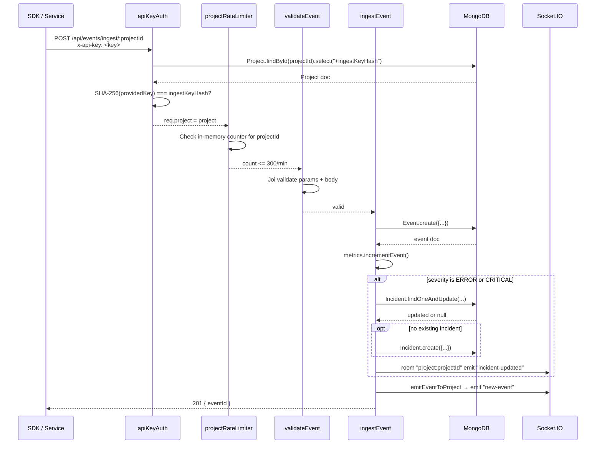
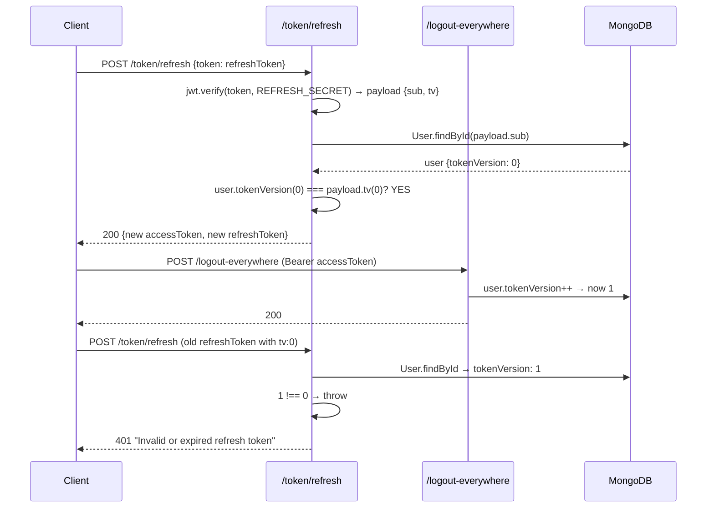

# APILogs Backend — Routes Documentation

> **Source of truth**: All facts below are verified from actual source code. No claims are invented.  
> **Purpose**: Interview-grade reference for every route in `backend/src/routes/`.

---

## Table of Contents

1. [Route Architecture Overview](#1-route-architecture-overview)
2. [Global Middleware Applied in app.js](#2-global-middleware-applied-in-appjs)
3. [Complete Endpoint Summary Table](#3-complete-endpoint-summary-table)
4. [Route & Middleware Map](#4-route--middleware-map)
5. [Auth Routes — `auth.Routes.js`](#5-auth-routes--authroutesjs)
6. [Project Routes — `project.Routes.js`](#6-project-routes--projectroutesjs)
7. [Event Routes — `event.Routes.js`](#7-event-routes--eventroutesjs)
8. [Incident Routes — `incident.Routes.js`](#8-incident-routes--incidentroutesjs)
9. [System Routes — `system.routes.js`](#9-system-routes--systemroutesjs)
10. [Middleware Deep-Dive](#10-middleware-deep-dive)
11. [Request Lifecycle Diagrams](#11-request-lifecycle-diagrams)
12. [Authentication & Authorization Flow](#12-authentication--authorization-flow)
13. [Real-Time Event & Incident Flow](#13-real-time-event--incident-flow)
14. [Error Handling Conventions](#14-error-handling-conventions)
15. [Security Implementation Notes](#15-security-implementation-notes)
16. [Performance & Pagination Notes](#16-performance--pagination-notes)
17. [Database & Model Dependency Map](#17-database--model-dependency-map)
18. [Documentation Discrepancies Found](#18-documentation-discrepancies-found)
19. [Known Bugs & Implementation Risks](#19-known-bugs--implementation-risks)
20. [Interview Preparation Notes](#20-interview-preparation-notes)

---

## 1. Route Architecture Overview

The application is built with **Express.js** and organized into five independent route modules, each mounted on a distinct base path in `app.js`.

```
app.js
 ├── /api/auth        → auth.Routes.js       (8 endpoints)
 ├── /api/project     → project.Routes.js    (3 endpoints)
 ├── /api/events      → event.Routes.js      (2 endpoints)
 ├── /api/incidents   → incident.Routes.js   (2 endpoints)
 └── /api/system      → system.routes.js     (2 endpoints)
```

**Key architectural decisions:**
- Route modules import their own middleware (auth, rate-limiters, validators).
- No route shares cross-router state; each module is self-contained.
- All validation uses **Joi** schemas defined in `src/validations/`.
- Two authentication mechanisms exist: **JWT Bearer** (`authRequired`) for dashboard users, and **API Key in `x-api-key` header** (`apiKeyAuth`) for SDK/service ingestion.
- `globalLimiter` is **commented out** in `app.js` — IP-level global rate limiting is **not active**.

---

## 2. Global Middleware Applied in app.js

These run on **every** request before any route handler:

| Middleware | Source | What it Does |
|---|---|---|
| `cors` | `npm:cors` | Allows requests only from `CLIENT_PRO_URL` env var. Allows credentials. |
| `helmet` | `npm:helmet` | Sets secure HTTP headers (CSP, X-Frame-Options, etc.) |
| `express.json` | Express built-in | Parses JSON body. **Limit: 10kb**. Requests with larger bodies are rejected. |
| `performanceTimer` | `middleware/performanceTimer.js` | Logs `[SLOW REQUEST]` to console if any route takes > 500ms. No rejection. |
| `globalLimiter` | `middleware/ratelimiter.js` | **DISABLED** (commented out). Would apply IP-based rate limiting globally. |

**CORS Note**: The `allowedHeaders` list in `app.js` includes `Authorization` but **not** `x-api-key`. This means API key ingestion from a browser may be blocked by CORS preflight. SDK ingestion from a server environment is unaffected.

---

## 3. Complete Endpoint Summary Table

| Method | Full Path | Auth | Rate Limit | Validation | Controller Function |
|---|---|---|---|---|---|
| POST | `/api/auth/register` | None | None | `validateRegister` (Joi) | `auth.register` |
| POST | `/api/auth/verify/resend` | None | `otpLimiter` (5/10min) | None | `auth.resendVerificationOtp` |
| POST | `/api/auth/verify/confirm` | None | `otpLimiter` (5/10min) | None | `auth.verifyEmail` |
| POST | `/api/auth/login` | None | None | `validateLogin` (Joi) | `auth.loginWithPassword` |
| POST | `/api/auth/login/otp/request` | None | `otpLimiter` (5/10min) | None | `auth.requestLoginOtp` |
| POST | `/api/auth/login/otp/verify` | None | `otpLimiter` (5/10min) | None | `auth.verifyLoginOtp` |
| POST | `/api/auth/token/refresh` | None | None | None | `auth.refreshToken` |
| POST | `/api/auth/logout-everywhere` | `authRequired` (JWT) | None | None | `auth.logoutEverywhere` |
| POST | `/api/project/create` | `authRequired` (JWT) | None | `ValidateProject` (Joi) | `project.createProject` |
| GET | `/api/project/list` | `authRequired` (JWT) | None | `ValidateProject` (Joi) ⚠️ | `project.listProject` |
| POST | `/api/project/:projectId/rotate-key` | `authRequired` (JWT) | None | None | `project.rotateIngestKey` |
| POST | `/api/events/ingest/:projectId` | `apiKeyAuth` (API Key) | `projectRateLimiter` (300/min) | `validateEvent` (Joi) | `event.ingestEvent` |
| GET | `/api/events/:projectId` | `authRequired` (JWT) | None | None | `event.getProjectEvents` |
| GET | `/api/incidents/:projectId` | `authRequired` (JWT) | None | None | `incident.getProjectIncidents` |
| PATCH | `/api/incidents/:incidentId/status` | `authRequired` (JWT) | None | None | `incident.updateIncidentStatus` |
| GET | `/api/system/health` | None | None | None | `system.getHealth` |
| GET | `/api/system/metrics` | None | None | None | `system.getMetrics` |

> ⚠️ `ValidateProject` is also on `GET /api/project/list` — it validates `req.body` but a GET request has no body. This is a bug (see §18).

---

## 4. Route & Middleware Map

```
Request
  │
  ├─ cors → helmet → express.json(10kb) → performanceTimer
  │
  ├─ /api/auth/*
  │    ├─ POST /register         → validateRegister → ctrl.register
  │    ├─ POST /verify/resend    → otpLimiter → ctrl.resendVerificationOtp
  │    ├─ POST /verify/confirm   → otpLimiter → ctrl.verifyEmail
  │    ├─ POST /login            → validateLogin → ctrl.loginWithPassword
  │    ├─ POST /login/otp/request → otpLimiter → ctrl.requestLoginOtp
  │    ├─ POST /login/otp/verify  → otpLimiter → ctrl.verifyLoginOtp
  │    ├─ POST /token/refresh    → ctrl.refreshToken
  │    └─ POST /logout-everywhere → authRequired → ctrl.logoutEverywhere
  │
  ├─ /api/project/*
  │    ├─ POST /create           → authRequired → ValidateProject → ctrl.createProject
  │    ├─ GET  /list             → authRequired → ValidateProject → ctrl.listProject
  │    └─ POST /:projectId/rotate-key → authRequired → ctrl.rotateIngestKey
  │
  ├─ /api/events/*
  │    ├─ POST /ingest/:projectId → apiKeyAuth → projectRateLimiter → validateEvent → ctrl.ingestEvent
  │    └─ GET  /:projectId       → authRequired → ctrl.getProjectEvents
  │
  ├─ /api/incidents/*
  │    ├─ GET  /:projectId       → authRequired → ctrl.getProjectIncidents
  │    └─ PATCH /:incidentId/status → authRequired → ctrl.updateIncidentStatus
  │
  └─ /api/system/*
       ├─ GET /health            → ctrl.getHealth
       └─ GET /metrics           → ctrl.getMetrics
```

---

## 5. Auth Routes — `auth.Routes.js`

**File**: `src/routes/auth.Routes.js`  
**Mounted at**: `/api/auth`  
**Imports**: `auth.Controller`, `middleware/auth (authRequired)`, `middleware/ratelimiter (otpLimiter)`, `validations/auth.Validation`

### 5.1 POST `/api/auth/register`

**Middleware chain**: `validateRegister` → `ctrl.register`

**Request Body**:
```json
{ "username": "Alice", "email": "alice@example.com", "password": "SecurePass1!" }
```

**Validation** (`validateRegister` via Joi `registerSchema`):
- `username`: string, alphanumeric, 3–100 chars, required
- `email`: valid email format (TLD not required), required
- `password`: 8–500 chars, must contain uppercase, lowercase, digit, and special char

**Controller Logic** (`auth.register`):
1. Check if a User document with the same email already exists → 400 if yes.
2. Create a new `User` document. `pre('save')` hook bcrypt-hashes the password.
3. Call `makeOtp()` → generates a cryptographically-secure 6-digit plain OTP, bcrypt-hashes it, computes `expiresAt` (default 300s / 5 min from `OTP_TTL_SECONDS`).
4. Create `OtpToken` doc: `{ user, purpose: "verify", codeHash: hash, expiresAt }`.
5. Call `sendOtpEmail(email, plain, "verify")` using SendGrid.
6. Return 201.

**Response** (201):
```json
{ "message": "Registered. Verification OTP sent to email." }
```

**Error cases**:
- 400 `{ "error": "Email already exists" }` — duplicate email.
- 400 `{ "errors": [...] }` — Joi validation failure.
- No catch block wraps the handler — unhandled promise rejections (DB failure, email failure) will crash or hang the request.

**Interview explanation**: "Register creates a User, hashes password via bcrypt pre-save hook, generates a cryptographically-secure OTP using Node crypto + bcrypt, persists the OTP hash to MongoDB with a TTL, and sends the plain OTP via SendGrid."

---

### 5.2 POST `/api/auth/verify/resend`

**Middleware chain**: `otpLimiter` (5 req/10min per IP) → `ctrl.resendVerificationOtp`

**Request Body**: `{ "email": "alice@example.com" }`

**Controller Logic**:
1. Find user by email → 404 if not found.
2. If `user.isVerified === true` → 400.
3. Mark all existing unconsumed `verify` OTPs for that user as `consumed: true` using `updateMany`.
4. Generate a new OTP, create new `OtpToken`, send email.
5. Return 200.

**Security note**: Rate limited at IP level (5/10min). An attacker can enumerate whether an email exists (returns 404 vs 400).

---

### 5.3 POST `/api/auth/verify/confirm`

**Middleware chain**: `otpLimiter` → `ctrl.verifyEmail`

**Request Body**: `{ "email": "alice@example.com", "otp": "123456" }`

**Controller Logic** (step by step):
1. Find User by email → 404 if not found.
2. Find the most recent unconsumed `verify` OTP for that user (`.sort({ createdAt: -1 })`).
3. If no token or `token.expiresAt < new Date()` → 400 `"OTP expired or not found"`.
4. If `token.attempts >= OTP_MAX_ATTEMPTS` (default 5) → 429 `"Max attempts exceeded"`.
5. `bcrypt.compare(otp, token.codeHash)` — if false: increment `token.attempts`, save, return 400.
6. If valid: set `token.consumed = true`, save. Set `user.isVerified = true`, save.
7. Call `signToken(user)` → return access + refresh tokens.

**Response** (200):
```json
{ "message": "Email verified", "accessToken": "...", "refreshToken": "..." }
```

**Important**: After verification, tokens are issued immediately — the user is logged in.

---

### 5.4 POST `/api/auth/login`

**Middleware chain**: `validateLogin` → `ctrl.loginWithPassword`

**Request Body**: `{ "email": "alice@example.com", "password": "SecurePass1!" }`

**Validation** (`validateLogin` via Joi `loginSchema`):
- `email`: valid email, required
- `password`: non-empty string, required (no complexity check on login)

**Controller Logic**:
1. Find User by email → 400 `"Invalid credentials"` (not 404 — avoids email enumeration).
2. `user.comparePassword(password)` → bcrypt.compare → 400 `"Invalid credentials"` if wrong.
3. Check `user.isVerified` → 403 `"Email not verified"` if false.
4. `signToken(user)` → return tokens.

**Token generation** (`signToken`):
```js
payload = { sub: user.id, tv: user.tokenVersion }
accessToken  = jwt.sign(payload, JWT_ACCESS_SECRET,  { expiresIn: JWT_ACCESS_EXPIRES_IN  })  // default "15m"
refreshToken = jwt.sign(payload, JWT_REFRESH_SECRET, { expiresIn: JWT_REFRESH_EXPIRES_IN }) // default "7d"
```

**Response** (200):
```json
{ "accessToken": "...", "refreshToken": "..." }
```

**Security note**: Generic `"Invalid credentials"` message for both wrong email and wrong password prevents user enumeration. Email verified check happens **after** password check — attacker can confirm email does not exist but cannot differentiate "wrong password" from "unverified".

---

### 5.5 POST `/api/auth/login/otp/request`

**Middleware chain**: `otpLimiter` → `ctrl.requestLoginOtp`

**Request Body**: `{ "email": "alice@example.com" }`

**Controller Logic**:
1. Find user → 404 if not found (⚠️ enumeration risk).
2. If not verified → 403.
3. Invalidate all existing unconsumed `login` OTPs with `updateMany`.
4. Generate new OTP, create `OtpToken` with `purpose: "login"`, send email.

**Response**: `{ "message": "Login OTP sent." }`

---

### 5.6 POST `/api/auth/login/otp/verify`

**Middleware chain**: `otpLimiter` → `ctrl.verifyLoginOtp`

**Request Body**: `{ "email": "alice@example.com", "otp": "123456" }`

**Controller Logic** (mirrors `verifyEmail`):
1. Find user → 404.
2. Find most recent unconsumed `login` OTP.
3. Check expiry → 400.
4. Check `attempts >= OTP_MAX_ATTEMPTS` → 429.
5. `bcrypt.compare` → increment attempts on failure → 400.
6. Mark consumed → issue tokens.

**Response** (200):
```json
{ "accessToken": "...", "refreshToken": "..." }
```

**Note**: Unlike `verifyEmail`, this does NOT set `user.isVerified`. It only issues tokens.

---

### 5.7 POST `/api/auth/token/refresh`

**Middleware chain**: None (no auth middleware — open endpoint).

**Token input** (two methods supported):
- Body: `{ "token": "<refreshToken>" }`
- Header: `Authorization: Bearer <refreshToken>`
- Body takes precedence.

**Controller Logic**:
1. Extract token from body or Authorization header.
2. If no token → 400.
3. `jwt.verify(token, JWT_REFRESH_SECRET)` — throws if expired/invalid.
4. Find user by `payload.sub`.
5. **Token version check**: If `user.tokenVersion !== payload.tv` → throw → 401. This invalidates all old refresh tokens issued before the last `logoutEverywhere`.
6. Call `signToken(user)` → return new access + refresh tokens.

**Response** (200):
```json
{ "accessToken": "...", "refreshToken": "..." }
```

**Error** (401): `{ "error": "Invalid or expired refresh token" }`

**Security design**: Token versioning (`tv` claim) allows server-side invalidation of all sessions by incrementing `tokenVersion`.

---

### 5.8 POST `/api/auth/logout-everywhere`

**Middleware chain**: `authRequired` → `ctrl.logoutEverywhere`

**Headers required**: `Authorization: Bearer <accessToken>`

**Controller Logic**:
1. `authRequired` verifies the JWT and sets `req.user = { id, tokenVersion }`.
2. Find user by `req.user.id` → 404 if not found.
3. Increment `user.tokenVersion` by 1, save.
4. Return 200.

**Effect**: All existing refresh tokens (which embed the old `tv` value) become invalid immediately. Any `refreshToken` call with an old token will fail the version check.

**Response**: `{ "message": "Logged out from all sessions" }`

**Limitation**: Access tokens already issued remain valid until their natural expiry (default 15 minutes).

---

## 6. Project Routes — `project.Routes.js`

**File**: `src/routes/project.Routes.js`  
**Mounted at**: `/api/project`  
**Imports**: `project.Controller`, `middleware/auth (authRequired)`, `validations/project.validation`

### 6.1 POST `/api/project/create`

**Middleware chain**: `authRequired` → `ValidateProject` → `ctrl.createProject`

**Request Body**:
```json
{ "projectName": "My Service", "description": "Optional description" }
```

**Validation** (`ValidateProject` via Joi `ProjectSchema`):
- `projectName`: string, 3–200 chars, required
- `description`: string, max 500 chars, optional, allows empty string

**Controller Logic**:
1. Extract `projectName`, `description` from body; `ownerId` from `req.user.id`.
2. Check for existing project with same `projectName` + `ownerId` → 409 if exists.
3. Create new `Project` document (not yet saved).
4. Call `project.generateIngestKey()`:
   - Generates 32 random bytes as hex string (64-char raw key).
   - SHA-256 hashes it → stores hash in `project.ingestKeyHash`.
   - Returns the plain 64-char key.
5. Save the project.
6. Return 200 with project details and the **plain API key** (only shown once).

**Response** (200):
```json
{
  "message": "Project Created Successfully",
  "project": { "_id": "...", "projectName": "...", "description": "...", "createdAt": "..." },
  "ingestKey": "<64-char-hex-key>",
  "note": "Store this Api key securely. It will not be shown again."
}
```

**Security**: `ingestKeyHash` has `select: false` in the schema — it is never returned in normal find queries unless explicitly selected with `.select("+ingestKeyHash")`.

**Hashing**: Uses **SHA-256** (`crypto.createHash("sha256")`), **not bcrypt**. This is appropriate because API keys have high entropy (256 bits), unlike passwords.

---

### 6.2 GET `/api/project/list`

**Middleware chain**: `authRequired` → `ValidateProject` → `ctrl.listProject`

**Controller Logic**:
1. Get `ownerId` from `req.user.id`.
2. `Project.find({ ownerId }).sort({ createdAt: -1 })` — returns all projects for this user, sorted newest first.
3. Return 200.

**Response** (200):
```json
{ "Projects": [ { "_id": "...", "projectName": "...", "description": "...", "ownerId": "...", "createdAt": "..." }, ... ] }
```

**Bug**: `ValidateProject` validates `req.body` — GET requests have no body. Validation always passes but is meaningless here. See §18.

**Note**: `ingestKeyHash` is excluded from results (schema `select: false`).

---

### 6.3 POST `/api/project/:projectId/rotate-key`

**Middleware chain**: `authRequired` → `ctrl.rotateIngestKey`

**Route Params**: `projectId` — MongoDB ObjectId string.

**Controller Logic**:
1. Check `projectId` present → 400 if missing (dead code since Express always provides route params).
2. `Project.findById(projectId).select("+ingestKeyHash ownerId")` — explicitly selects the hidden hash field.
3. Check project exists → 404.
4. Check `project.ownerId === req.user.id` (string comparison) → 403 if unauthorized.
5. Call `project.generateIngestKey()` → new plain key, new hash stored on document.
6. Save the project.
7. Try to create `AuditLog` with `purpose: "KEY_ROTATED"` — errors are caught and logged but **not propagated**.
8. Return 200 with new plain key.

**Response** (200):
```json
{
  "message": "API key rotated successfully",
  "ingestKey": "<new-64-char-hex-key>",
  "note": "Store this API key securely. It will not be shown again."
}
```

**Bug**: The controller uses `AuditLog` (line 98) but only imports `Audit` (`const Audit = require("../models/AuditLog")`). The variable `AuditLog` is undefined. The audit try/catch swallows the ReferenceError silently. See §18.

---

## 7. Event Routes — `event.Routes.js`

**File**: `src/routes/event.Routes.js`  
**Mounted at**: `/api/events`  
**Imports**: `event.controller`, `middleware/auth`, `middleware/apiKeyAuth`, `middleware/projectRateLimiter`, `validations/Event.validation`

### 7.1 POST `/api/events/ingest/:projectId`

**Middleware chain**: `apiKeyAuth` → `projectRateLimiter` → `validateEvent` → `ctrl.ingestEvent`

**Route Params**: `projectId`

**Headers required**: `x-api-key: <plain API key>`

**Request Body**:
```json
{
  "service": "payment-service",
  "severity": "ERROR",
  "message": "Payment gateway timeout",
  "environment": "production",
  "metadata": { "orderId": "abc123" },
  "eventTimestamp": "2026-09-16T06:00:00.000Z"
}
```

**Middleware 1 — `apiKeyAuth`**:
1. Read `x-api-key` header → 401 if missing.
2. Validate `projectId` is a valid ObjectId → 400.
3. `Project.findById(projectId).select("+ingestKeyHash")`.
4. `project.verifyIngestKey(providedKey)`:
   - SHA-256 hashes the provided key.
   - Compares against stored `ingestKeyHash`.
5. If invalid: create `AuditLog` (purpose `"API_KEY_FAILED"`), return 403.
6. If valid: set `req.project = project`, call `next()`.

**Middleware 2 — `projectRateLimiter`**:
- In-memory `Map` keyed by `projectId`.
- Window: 60 seconds, limit: 300 requests/min.
- Sliding window resets when `Date.now() - entry.windowStart >= 60000`.
- Exceeding limit → 429.

**Middleware 3 — `validateEvent`**:
- Validates both `req.params` (Joi `eventParamsSchema`) and `req.body` (Joi `eventBodySchema`).
- `projectId` must be 24-char hex.
- `service`: 2–100 chars, required.
- `severity`: one of `["INFO","WARN","ERROR","CRITICAL"]`, required.
- `message`: 1–2000 chars, required.
- `environment`: one of `["development","staging","production"]`, optional.
- `metadata`: optional object, unknown keys allowed.
- `eventTimestamp`: optional valid date.

**Controller Logic** (`ingestEvent`):
1. Get `req.project` (set by `apiKeyAuth`).
2. Extract `service, severity, message, metadata, environment, eventTimestamp` from body.
3. Re-validate presence of required fields (duplicate of Joi validation — defensive).
4. Parse `eventTimestamp` if provided → use `new Date()` if not.
5. `Event.create({...})` → save event to MongoDB.
6. `metrics.incrementEvent()` — increments in-memory counters.
7. `getIO()` — retrieve Socket.IO server instance.
8. **Incident handling** (only if severity is `"ERROR"` or `"CRITICAL"`):
   - Compute `messageSignature = message.trim().toLowerCase()`.
   - `Incident.findOneAndUpdate({ projectId, messageSignature, status: {$in:["OPEN","ACKNOWLEDGED"]} }, { $set:{lastOccurredAt}, $inc:{eventCount:1} }, { new: true })`.
   - If no existing incident found: create new `Incident` with `status:"OPEN"`, `eventCount:1`.
   - Emit `"incident-updated"` to Socket.IO room `project:${projectId}`.
9. `emitEventToProject(io, project._id.toString(), event.toObject())` → emits `"new-event"` to room.
10. Return 201.

**Response** (201):
```json
{ "message": "Event ingested successfully", "eventId": "..." }
```

**Critical Bug** (line 72): `incident` is declared with `const` inside the `if ([...].includes)` block but reassigned with `incident = await Incident.create(...)` in the `if (!incident)` block. This causes a `TypeError: Assignment to constant variable`. Events with no matching incident will throw; the outer catch returns 500. See §18.

---

### 7.2 GET `/api/events/:projectId`

**Middleware chain**: `authRequired` → `ctrl.getProjectEvents`

**Route Params**: `projectId`

**Query Params**:
- `limit` (optional): number of events to return. Default 50, max 200 (`Math.min(parseInt(limit)||50, 200)`).
- `before` (optional): ISO date string. Returns only events where `eventTimestamp < before` (cursor-based pagination).

**Controller Logic**:
1. Validate `projectId` is a valid ObjectId → 400.
2. Parse `limit` with max cap of 200.
3. `Project.findById(projectId)` → 404 if not found.
4. Check `project.ownerId === req.user.id` → 403 if not owner.
5. Build query: `{ projectId: objectId }`. Add `eventTimestamp: { $lt: beforeDate }` if `before` is provided.
6. `Event.find(query).sort({ eventTimestamp: -1 }).limit(limit).lean()`.
7. Return 200 with events array.

**Pagination pattern**: Cursor-based. Client sends `?before=<eventTimestamp of last item>` to get the next page. Uses the compound index `{ projectId: 1, eventTimestamp: -1 }`.

**Response** (200):
```json
{ "count": 50, "events": [ { "_id": "...", "service": "...", "severity": "...", "message": "...", "eventTimestamp": "...", ... } ] }
```

**Note**: `.lean()` returns plain JS objects for performance (no Mongoose overhead).

---

## 8. Incident Routes — `incident.Routes.js`

**File**: `src/routes/incident.Routes.js`  
**Mounted at**: `/api/incidents`  
**Imports**: `incident.controller`, `middleware/auth`

### 8.1 GET `/api/incidents/:projectId`

**Middleware chain**: `authRequired` → `ctrl.getProjectIncidents`

**Route Params**: `projectId`

**Controller Logic**:
1. Validate ObjectId → 400.
2. `Project.findById(projectId)` → 404.
3. Check `project.ownerId === userId` → 403.
4. `Incident.find({ projectId }).sort({ lastOccurredAt: -1 }).lean()`.
5. Return 200.

**Response** (200):
```json
{
  "incidents": [
    {
      "_id": "...",
      "projectId": "...",
      "service": "...",
      "severity": "ERROR",
      "messageSignature": "payment gateway timeout",
      "status": "OPEN",
      "firstOccurredAt": "...",
      "lastOccurredAt": "...",
      "eventCount": 5
    }
  ]
}
```

**Sorting**: By `lastOccurredAt` descending — most recently active incidents first.

---

### 8.2 PATCH `/api/incidents/:incidentId/status`

**Middleware chain**: `authRequired` → `ctrl.updateIncidentStatus`

**Route Params**: `incidentId` — the Incident document's `_id`.

**Request Body**: `{ "status": "ACKNOWLEDGED" }` or `{ "status": "RESOLVED" }`

**Controller Logic**:
1. Validate `incidentId` ObjectId → 400.
2. Validate `status` is one of `["ACKNOWLEDGED", "RESOLVED"]` → 400 if invalid. Note: **"OPEN" cannot be set via this endpoint**.
3. `Incident.findById(incidentId).populate("projectId")` — populates the `projectId` field with the full Project document.
4. Check incident exists → 404.
5. `project.ownerId === userId` → 403 if not owner.
6. `incident.status = status; await incident.save()`.
7. Get `io` from `getIO()`, emit `"incident-updated"` to room `project:${project._id}`. Socket errors are caught and logged but do not fail the HTTP response.
8. Return 200 with updated incident.

**WebSocket broadcast**: All clients subscribed to `project:<projectId>` receive the updated incident in real-time.

**Response** (200):
```json
{
  "message": "Incident updated successfully",
  "incident": { "_id": "...", "status": "RESOLVED", "projectId": { "_id": "...", "service": "..." }, ... }
}
```

---

## 9. System Routes — `system.routes.js`

**File**: `src/routes/system.routes.js`  
**Mounted at**: `/api/system`  
**No auth required** on either endpoint.

### 9.1 GET `/api/system/health`

**Controller Logic** (`system.getHealth`):
Assembles and returns a snapshot of server state using Node.js built-ins:

| Field | Source |
|---|---|
| `status` | Hardcoded `"OK"` |
| `uptimeSeconds` | `process.uptime()` |
| `memory` | `process.memoryUsage()` → formatted to MB strings |
| `cpuLoad` | `os.loadavg()` → 1min, 5min, 15min |
| `platform` | `os.platform()` |
| `arch` | `os.arch()` |
| `cpuCores` | `os.cpus().length` |
| `nodeVersion` | `process.version` |
| `mongo.connectionState` | `mongoose.connection.readyState` (0=disconnected, 1=connected) |
| `mongo.host` | `mongoose.connection.host` |
| `mongo.name` | `mongoose.connection.name` |
| `activeSocketConnections` | `metrics.activeSocketConnections` |
| `timestamp` | `new Date().toISOString()` |

**No authentication**. This endpoint leaks: server uptime, memory usage, CPU load, MongoDB host, and connection name to any anonymous user.

**Response** (200):
```json
{
  "status": "OK",
  "uptimeSeconds": 3600.5,
  "memory": { "rss": "65.23 MB", "heapTotal": "20.00 MB", "heapUsed": "15.44 MB", "external": "1.10 MB", "arrayBuffers": "0.05 MB" },
  "cpuLoad": { "1min": 0.1, "5min": 0.2, "15min": 0.15 },
  "platform": "linux",
  "arch": "x64",
  "cpuCores": 2,
  "nodeVersion": "v20.0.0",
  "mongo": { "connectionState": 1, "host": "...", "name": "apilogs" },
  "activeSocketConnections": 3,
  "timestamp": "2026-09-16T05:23:00.000Z"
}
```

---

### 9.2 GET `/api/system/metrics`

**Controller Logic** (`system.getMetrics`):
Calls `metrics.getSnapshot()` on the singleton `MetricsStore` instance.

**MetricsStore** (in-memory, resets on server restart):
- `totalEventsIngested`: incremented per `ingestEvent` call.
- `eventsLastMinute`: incremented per `ingestEvent`, reset to 0 every 60 seconds via `setInterval`.
- `failedApiKeyAttempts`: incremented in `apiKeyAuth` catch block.
- `rateLimitHits`: incremented in `projectRateLimiter` catch block.
- `activeSocketConnections`: incremented on `socket.on("connection")`, decremented on `disconnect`.

**Response** (200):
```json
{
  "totalEventsIngested": 1024,
  "eventsLastMinute": 12,
  "failedApiKeyAttempts": 3,
  "rateLimitHits": 1,
  "activeSocketConnections": 5
}
```

**Limitation**: All metrics are in-memory only — no persistence. Restarting the server resets all counters to zero.

---

## 10. Middleware Deep-Dive

### 10.1 `authRequired` (`middleware/auth.js`)

**Purpose**: Verifies JWT access token for protected dashboard routes.

**Algorithm**:
1. Read `Authorization` header.
2. Require `Bearer ` prefix → 401 if missing.
3. Extract and trim the token → 401 if empty.
4. Check `JWT_ACCESS_SECRET` is configured → 500 if not.
5. `jwt.verify(token, JWT_ACCESS_SECRET)` → catches expiry/invalid signature → 401.
6. Check payload has `sub` and `tv` fields → 401 if malformed.
7. Set `req.user = { id: payload.sub, tokenVersion: payload.tv }`.

**Note**: Does NOT check `tokenVersion` against the database. Token version is only checked during `refreshToken`. A compromised access token is valid until expiry (15 min default).

---

### 10.2 `apiKeyAuth` (`middleware/apiKeyAuth.js`)

**Purpose**: Authenticates SDK/service requests using an API key.

**Algorithm**:
1. Read `x-api-key` header → 401 if missing.
2. Validate `projectId` is a valid ObjectId → 400.
3. `Project.findById(projectId).select("+ingestKeyHash")` (extra DB query on every ingest).
4. `project.verifyIngestKey(providedKey)`: SHA-256 hashes the provided key, compares to stored hash (constant-time only if `===` is constant-time — it is NOT; this is a potential timing side-channel).
5. On invalid key: create `AuditLog`, return 403.
6. On exception: `metrics.incrementApiKeyFailure()`, return 500.
7. Set `req.project = project`, call `next()`.

---

### 10.3 `otpLimiter` (`middleware/ratelimiter.js`)

- Uses `express-rate-limit`.
- Window: 10 minutes.
- Max: 5 requests per IP per window.
- Applied to: `verify/resend`, `verify/confirm`, `login/otp/request`, `login/otp/verify`.
- Sends `standardHeaders: true` (RateLimit-* headers in response).

---

### 10.4 `projectRateLimiter` (`middleware/projectRateLimiter.js`)

- Custom in-memory rate limiter (does not use `express-rate-limit`).
- Keyed by `projectId`, not by IP.
- Window: 60 seconds. Limit: 300 requests/minute.
- Stored in a `Map<projectId, {count, windowStart}>` that never shrinks (memory leak for many projects).
- **Bug**: References `AuditLog` (not imported in the file) — silently fails.
- **Bug**: References `metrics` (imported as `mertics` — typo on line 1) in catch block → `metrics.incrementRateLimitHit()` would throw `ReferenceError`.

---

### 10.5 `performanceTimer` (`middleware/performanceTimer.js`)

- Listens on `res.finish` event.
- If total request time > 500ms → logs `[SLOW REQUEST]` to console.
- Does not reject or modify any request.

---

## 11. Request Lifecycle Diagrams

### 11.1 Event Ingestion Flow



### 11.2 OTP Email Verification Flow

```mermaid
sequenceDiagram
    participant C as Client
    participant R as /api/auth/register
    participant DB as MongoDB
    participant SG as SendGrid

    C->>R: POST /register {username, email, password}
    R->>DB: User.findOne({email})
    DB-->>R: null (not exists)
    R->>DB: new User({...}).save() → pre-save bcrypt hashes password
    R->>R: makeOtp() → crypto.randomBytes → bcrypt.hash
    R->>DB: OtpToken.create({user, purpose:"verify", codeHash, expiresAt})
    R->>SG: sendOtpEmail(email, plainOtp, "verify")
    R-->>C: 201 "Registered. Verification OTP sent."

    C->>C: User receives OTP in email
    C->>R: POST /verify/confirm {email, otp}
    R->>DB: User.findOne({email})
    R->>DB: OtpToken.findOne({user, purpose:"verify", consumed:false}).sort(-createdAt)
    R->>R: bcrypt.compare(otp, token.codeHash)
    R->>DB: token.consumed=true; user.isVerified=true; save
    R-->>C: 200 {accessToken, refreshToken}
```

### 11.3 Token Refresh & Version Invalidation



---

## 12. Authentication & Authorization Flow

### JWT Authentication (`authRequired`)
- Token: JWT signed with `JWT_ACCESS_SECRET`, payload `{ sub: userId, tv: tokenVersion }`, expires in 15min.
- Verified at middleware level; user data set on `req.user`.
- Does **not** re-query the database — no revocation check on access tokens.

### API Key Authentication (`apiKeyAuth`)
- Key: 32 random bytes (64-char hex) generated by `crypto.randomBytes`.
- Storage: SHA-256 hash stored in `Project.ingestKeyHash` (excluded from default selects).
- Verification: SHA-256 of provided key compared to stored hash.
- **Not bcrypt** — SHA-256 is used because API keys have high entropy (no dictionary attack risk).
- Every ingest request hits MongoDB to fetch the project and hash.

### Multi-Tenancy / Ownership Enforcement
All data endpoints verify ownership in the controller (not middleware):
- `getProjectEvents`: `project.ownerId.toString() !== userId?.toString()` → 403
- `getProjectIncidents`: `project.ownerId.toString() !== userId.toString()` → 403
- `updateIncidentStatus`: `project.ownerId.toString() !== userId.toString()` → 403 (via populated projectId)
- `rotateIngestKey`: `String(project.ownerId) !== String(userId)` → 403
- `createProject`: ownership is set automatically from `req.user.id`
- `listProject`: `Project.find({ ownerId })` — filters at query level

---

## 13. Real-Time Event & Incident Flow

### Socket.IO Setup (`realtime/socket.server.js`)
- Uses `new Server(httpServer, { cors: { origin: "*" } })`.
- **CORS is `"*"` for sockets** even though HTTP CORS is restricted — mismatch.
- Authentication middleware on every socket connection:
  - Reads `socket.handshake.auth.token`.
  - Calls `verifySocketToken(token)` in `socket.auth.js`.
  - `socket.auth.js` reads `JWT_ACCESS_SECRET` from `process.env` directly (not from `example.env.js`). In some environments this may be undefined if the config module isn't loaded first.
  - Sets `socket.userId = user.sub`.

### Room Subscription (`socket.manager.js` — `subscribe` event)
1. Client emits `subscribe` with `{ projectId }`.
2. Server validates ObjectId format.
3. `Project.findById(projectId).select("ownerId")` DB query.
4. If `project.ownerId !== socket.userId` → emit `subscription-error`, log `AuditLog` (fails due to missing import).
5. If authorized: `socket.join("project:" + projectId)`.
6. Client receives `subscription-success`.

### Event/Incident Broadcasts
- **New event**: `emitEventToProject(io, projectId, event)` → `io.to("project:"+projectId).emit("new-event", eventData)`.
- **Incident created/updated** (via ingestEvent): `io.to("project:"+projectId).emit("incident-updated", incident)`.
- **Incident status updated** (via updateIncidentStatus): same room, same event name.

---

## 14. Error Handling Conventions

| Scenario | Status | Response Shape |
|---|---|---|
| Joi validation failure | 400 | `{ "errors": ["msg1", "msg2"] }` |
| Business logic failure (duplicate, not found, etc.) | 400/404/409 | `{ "error": "message" }` or `{ "message": "..." }` |
| Unauthorized (no/invalid token) | 401 | `{ "error": "..." }` |
| Forbidden (valid token, wrong ownership) | 403 | `{ "message": "Unauthorized" }` |
| Rate limit exceeded | 429 | `{ "error": "..." }` or `{ "message": "..." }` |
| Unhandled server errors | 500 | `{ "message": "...", "error": "..." }` |

**Inconsistency**: Auth routes use `{ "error": "..." }` while event/incident/project routes use `{ "message": "..." }`. No unified error response format.

**Missing**: `auth.register`, `auth.resendVerificationOtp`, `auth.requestLoginOtp` have **no try/catch**. Any unhandled database or email failure becomes an unhandled promise rejection.

---

## 15. Security Implementation Notes

| Protection | Status | Details |
|---|---|---|
| Password hashing | ✅ Implemented | bcrypt via `pre('save')` hook, salt rounds from `SaltValue` env |
| OTP hashing | ✅ Implemented | bcrypt hash stored, plain OTP sent to email only |
| API key hashing | ✅ Implemented | SHA-256 (appropriate for high-entropy keys) |
| JWT access tokens | ✅ Implemented | HS256, 15min expiry default |
| JWT refresh tokens | ✅ Implemented | HS256, 7d expiry default |
| Token versioning (server-side revocation) | ✅ Implemented | `tokenVersion` on User, checked on refresh |
| OTP attempts limit | ✅ Implemented | `OTP_MAX_ATTEMPTS` (default 5) |
| OTP TTL | ✅ Implemented | MongoDB TTL index on `expiresAt` |
| Per-project rate limiting | ✅ Implemented (partial) | 300 req/min, in-memory, audit log broken |
| OTP rate limiting | ✅ Implemented | `express-rate-limit`, 5 req/10min per IP |
| Global rate limiting | ❌ Disabled | `globalLimiter` commented out in app.js |
| CORS restriction | ✅ HTTP | `CLIENT_PRO_URL` configured; Sockets use `"*"` |
| Helmet | ✅ Implemented | Default helmet configuration |
| Request body size limit | ✅ Implemented | 10kb JSON limit |
| Health/metrics auth | ❌ Not implemented | Both endpoints are public |
| Email enumeration (login) | ✅ Mitigated | Generic "Invalid credentials" for password login |
| Email enumeration (OTP flows) | ❌ Not mitigated | OTP request/resend return 404 for unknown email |
| Timing attack on API key | ❌ Potential | Uses `===` for string comparison (not constant-time) |
| express-mongo-sanitize | Not verified | Package present in node_modules but not found in app.js |

---

## 16. Performance & Pagination Notes

### Cursor-Based Pagination (GET /api/events/:projectId)
- Client provides `?before=<ISO date>` to get events older than that timestamp.
- Query: `{ projectId, eventTimestamp: { $lt: beforeDate } }`.
- Sorted by `eventTimestamp: -1`, limited by `limit` (max 200).
- Supported by compound index `{ projectId: 1, eventTimestamp: -1 }`.
- **No `nextCursor` field** in response — client must extract the `eventTimestamp` of the last item and pass it as `?before=`.

### MongoDB Indexes
| Collection | Index | Purpose |
|---|---|---|
| Event | `{ projectId: 1, eventTimestamp: -1 }` | Pagination queries |
| Event | `projectId, service, severity, environment, eventTimestamp` (single) | Filtering |
| Incident | `{ projectId: 1, messageSignature: 1, status: 1 }` | Grouping / dedup on ingest |
| Incident | `projectId, service, severity, messageSignature, status` (single) | Filtering |
| OtpToken | TTL index on `expiresAt` (expireAfterSeconds: 0) | Auto-delete expired OTPs |
| OtpToken | `user, purpose, expiresAt` (single) | OTP lookup |
| Project | `ownerId` (single) | listProject query |
| AuditLog | `{ projectId: 1, createAt: -1 }` | Note: typo `createAt` should be `createdAt` |
| AuditLog | `purpose, projectId, userId` (single) | Filtering |

### API Key Verification Cost
- Every `POST /api/events/ingest` makes a MongoDB query to fetch the project + ingestKeyHash.
- No caching — high-frequency ingest will cause proportional DB load.

---

## 17. Database & Model Dependency Map

```
Routes → Controllers → Models
─────────────────────────────────────────────
auth.Routes        → auth.Controller     → User, OtpToken
project.Routes     → project.Controller  → Project, AuditLog (broken ref)
event.Routes       → event.controller    → Event, Project, Incident
incident.Routes    → incident.controller → Incident, Project
system.routes      → system.controller   → (no models — uses metrics + mongoose state)
event.Routes (MW)  → apiKeyAuth          → Project, AuditLog
event.Routes (MW)  → projectRateLimiter  → (in-memory Map, AuditLog broken ref)
socket.manager     → socket server       → Project, AuditLog (broken ref)
```

---

## 18. Documentation Discrepancies Found

1. **`ValidateProject` on GET `/list`**: Joi validation runs on an empty body. Validation always passes (all fields are optional for GET). The middleware is non-functional but harmless on `list`.

2. **`AuditLog` variable mismatch in `project.Controller.js`**: Line 2 imports `const Audit = require("../models/AuditLog")`. Line 98 references `AuditLog.create(...)` — undefined variable. The `try/catch` silently swallows the `ReferenceError`. Audit logging for key rotation **never works**.

3. **Same bug in `socket.manager.js`**: References `AuditLog` without importing it. Unauthorized subscription audit log silently fails.

4. **Same pattern in `projectRateLimiter.js`**: References `AuditLog` (not imported). Also imports metrics as `mertics` (line 1 typo) but the catch block references `metrics` — `ReferenceError` in catch.

5. **`const incident` reassignment bug in `event.controller.js`** (line 58–80): `const incident = await Incident.findOneAndUpdate(...)` then `incident = await Incident.create(...)`. `const` cannot be reassigned. This is a syntax error that will throw at runtime for `ERROR`/`CRITICAL` events when no matching incident exists.

6. **`socket.auth.js` reads from `process.env` directly** instead of `example.env.js`. If the app loads env config lazily, `JWT_ACCESS_SECRET` may be `undefined` at socket auth time.

7. **Socket CORS is `"*"`** (open) while HTTP CORS restricts to `CLIENT_PRO_URL`. This inconsistency allows any origin to establish a WebSocket connection.

8. **`/api/system/health` and `/api/system/metrics` are unauthenticated** — they expose internal server details (memory, CPU, MongoDB host, connection state) to anonymous users.

9. **`x-api-key` not in CORS `allowedHeaders`**: Browser-based SDK clients sending `x-api-key` will fail CORS preflight. Server-side SDK clients are unaffected.

---

## 19. Known Bugs & Implementation Risks

| # | Location | Bug | Severity |
|---|---|---|---|
| 1 | `event.controller.js:72` | `const incident` reassigned → TypeError on new incident creation for ERROR/CRITICAL events | **Critical** |
| 2 | `project.Controller.js:98` | `AuditLog` undefined (imported as `Audit`) → ReferenceError swallowed | High |
| 3 | `socket.manager.js:31` | `AuditLog` undefined → unauthorized subscription not audited | High |
| 4 | `projectRateLimiter.js:38` | `AuditLog` undefined → rate limit breach not audited | Medium |
| 5 | `projectRateLimiter.js:1` | `const mertics` typo; `metrics` in catch → ReferenceError in catch block | Medium |
| 6 | `projectRateLimiter.js` | In-memory `Map` never evicted → memory grows unbounded with many projects | Medium |
| 7 | `socket.auth.js:2` | Reads `JWT_ACCESS_SECRET` from `process.env` not from `example.env.js` config | Medium |
| 8 | `auth.Controller.js:register` | No try/catch → DB/email failures cause unhandled promise rejections | Medium |
| 9 | `AuditLog.js:43` | Typo `createAt` in index definition — index on non-existent field | Low |
| 10 | `apiKeyAuth.js:31` | String comparison `===` for hash not constant-time (timing side-channel) | Low |
| 11 | `project.Routes.js:9` | `ValidateProject` on GET `/list` validates non-existent body | Low (harmless) |
| 12 | `AuditLog.js` | `ipAddress` is `required: true` but `rotateIngestKey` creates AuditLog without `ipAddress` | Low |

---

## 20. Interview Preparation Notes

### Likely Technical Questions & How to Answer

**Q: How does the refresh token rotation and session invalidation work?**  
A: "Access tokens embed a `tv` (tokenVersion) claim. When `logoutEverywhere` is called, the server increments `user.tokenVersion` in MongoDB. Any refresh token carrying the old `tv` value fails the version check in `refreshToken` and is rejected. Access tokens cannot be revoked directly — they remain valid until their 15-minute expiry."

**Q: How are API keys stored and verified?**  
A: "On creation, `crypto.randomBytes(32)` generates a 64-char hex key. We SHA-256 hash it and store only the hash in MongoDB with `select: false`. On verification, we SHA-256 the provided key and compare to the stored hash. SHA-256 is used instead of bcrypt because API keys have 256 bits of entropy — dictionary attacks are infeasible and bcrypt's cost is unnecessary."

**Q: How does incident grouping work?**  
A: "When an `ERROR` or `CRITICAL` event arrives, we compute `messageSignature = message.trim().toLowerCase()`. We then attempt `findOneAndUpdate` on Incident matching `{projectId, messageSignature, status: {$in: ['OPEN','ACKNOWLEDGED']}}`. If found, we increment `eventCount` and update `lastOccurredAt`. If not found, we create a new Incident. This ensures repeated identical errors group into one incident rather than creating noise."

**Q: How does cursor-based pagination work for events?**  
A: "The client sends `?before=<ISO timestamp>`. The query filters `eventTimestamp < before` and sorts descending. To get the next page, the client takes the `eventTimestamp` of the last returned event and passes it as the next `before` value. A compound index `{projectId:1, eventTimestamp:-1}` makes this efficient."

**Q: How does OTP security work?**  
A: "OTPs are generated using `crypto.randomBytes` (cryptographically secure), bcrypt-hashed before storage, and the plain OTP is emailed. On verification, `bcrypt.compare` is used. Attempts are tracked per token — after `OTP_MAX_ATTEMPTS` failures, the token is locked. A MongoDB TTL index auto-deletes expired OTP documents. Rate limiting (5/10min per IP) prevents brute force."

**Q: How does Socket.IO authentication work?**  
A: "The client sends its JWT access token in the handshake auth: `socket.handshake.auth.token`. Server-side middleware calls `verifySocketToken(token)`, which runs `jwt.verify`. If valid, `socket.userId` is set. After connecting, the client emits a `subscribe` event with a `projectId`. The server verifies the user owns that project via a DB query, then calls `socket.join('project:'+projectId)`. Events and incidents are broadcast via `io.to(room).emit(...)`."

**Q: What bugs exist in the codebase?**  
A: "The most critical is in `event.controller.js` — `incident` is declared with `const` but reassigned when creating a new incident for `ERROR`/`CRITICAL` events with no existing matching incident, causing a `TypeError`. This means the first occurrence of any error message fails with a 500. Additionally, `AuditLog` is referenced but not properly imported in three places (`project.Controller.js`, `socket.manager.js`, `projectRateLimiter.js`), silently breaking audit logging. The project rate limiter also has a typo `mertics` → `metrics` which would throw in the catch block."

**Q: What are the security gaps?**  
A: "Global rate limiting is commented out. The health and metrics endpoints are unauthenticated and leak server internals. OTP flows expose user existence via 404 responses (email enumeration). Socket CORS is open (`*`) while HTTP CORS is restricted. The `x-api-key` header is missing from CORS `allowedHeaders`, blocking browser-based SDK usage."
