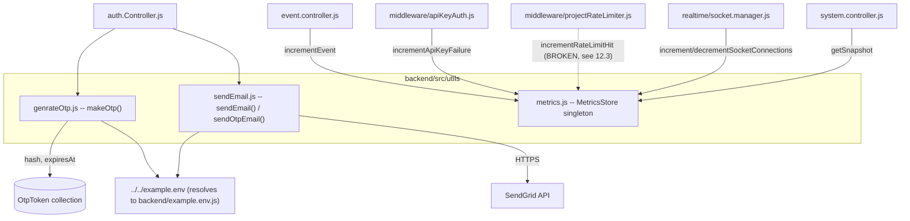
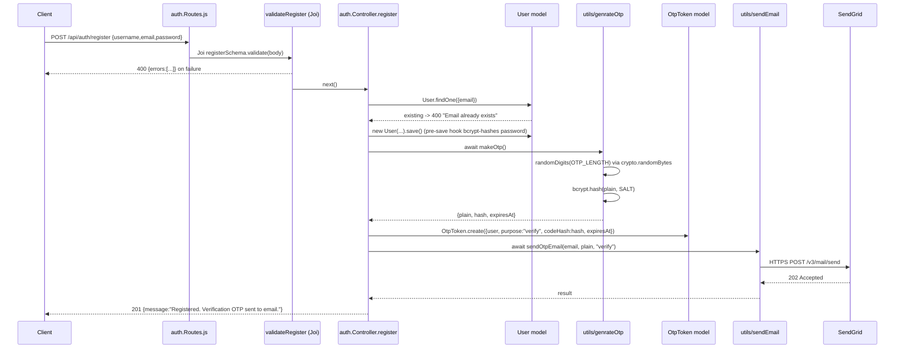

# APILogs Backend — Utils Complete Technical Reference

> Deep documentation of every file in `backend/src/utils/`, verified line-by-line against the
> actual source code, including every consumer, dependency, side effect, bug and risk.
>
> **Source of truth = the code.** Anything that could not be confirmed in code is explicitly
> labelled **Not verified from the available source code**.

---

## Table of Contents

1. [Utils Architecture Overview](#1-utils-architecture-overview)
2. [Dependency & Consumer Map](#2-dependency--consumer-map)
3. [Environment Variables Used by Utils](#3-environment-variables-used-by-utils)
4. [`genrateOtp.js` — OTP Generation](#4-genrateotpjs--otp-generation)
5. [`sendEmail.js` — Transactional Email](#5-sendemailjs--transactional-email)
6. [`metrics.js` — In-Process Metrics Store](#6-metricsjs--in-process-metrics-store)
7. [Full Request Lifecycles That Pass Through Utils](#7-full-request-lifecycles-that-pass-through-utils)
8. [Database & Model Relationships](#8-database--model-relationships)
9. [Error-Handling Conventions](#9-error-handling-conventions)
10. [Security Implementation Notes](#10-security-implementation-notes)
11. [Performance Notes](#11-performance-notes)
12. [Known Bugs, Race Conditions and Implementation Risks](#12-known-bugs-race-conditions-and-implementation-risks)
13. [Documentation Discrepancies](#13-documentation-discrepancies)
14. [Unverified Assumptions](#14-unverified-assumptions)
15. [Interview Preparation Notes](#15-interview-preparation-notes)
16. [Files Inspected](#16-files-inspected)

---

## 1. Utils Architecture Overview

`backend/src/utils/` contains **three** files. There is no `index.js`, no barrel export, and no
shared base module — each file is imported directly by path.

| File | Export shape | Kind | Stateful? |
|------|--------------|------|-----------|
| `genrateOtp.js` | `{ makeOtp }` | Factory: crypto + bcrypt | No |
| `sendEmail.js` | `{ sendEmail, sendOtpEmail }` | External I/O adapter (SendGrid) | Module-level SDK config |
| `metrics.js` | **a singleton instance** of `MetricsStore` | In-memory counter store | **Yes — process-local mutable state** |

Note the filename typo: the file is `genrateOtp.js` (not `generateOtp.js`). Every import must
spell it that way, and they all do.

### Architectural roles

```
genrateOtp.js  ->  produces the credential  (plain OTP + bcrypt hash + expiry)
sendEmail.js   ->  delivers the credential  (SendGrid HTTPS API)
metrics.js     ->  observes the system      (counters read back by /api/system/metrics)
```

The first two are used **only** by `auth.Controller.js` and always together: `makeOtp()` creates
the secret, `OtpToken.create()` persists the hash, and `sendOtpEmail()` mails the plaintext.
The third is a cross-cutting concern touched by the event controller, the system controller, two
middlewares and the socket manager.



---

## 2. Dependency & Consumer Map

### 2.1 What utils import

| File | Imports | Why |
|------|---------|-----|
| `genrateOtp.js` | `bcrypt` | `bcrypt.hash(plain, saltRounds)` — one-way hash of the OTP |
| | `crypto` (Node built-in) | `crypto.randomBytes(length)` — CSPRNG bytes for the digits |
| | `../../example.env` | `OTP_LENGTH`, `SALT`, `OTP_TTL_SECONDS` |
| `sendEmail.js` | `@sendgrid/mail` | `sgMail.setApiKey()`, `sgMail.send()` |
| | `../../example.env` | `SENDGRID_API_KEY`, `SMTP_FROM` |
| `metrics.js` | *(nothing)* | Zero dependencies — plain class + `setInterval` |

> **Module-resolution detail worth knowing:** `require("../../example.env")` from
> `backend/src/utils/` resolves to `backend/example.env` — which does **not** exist as an
> extensionless file. Node's resolution algorithm then appends `.js` and loads
> **`backend/example.env.js`**, a real CommonJS config module that calls `dotenv.config()` and
> exports a parsed config object. So `env` is *not* a raw `.env` file; it is the normalized
> config object defined in `backend/example.env.js`.

### 2.2 Who consumes utils (verified with a repo-wide grep)

| Consumer file | Line | Import statement | Functions used |
|---------------|------|------------------|----------------|
| `src/controllers/auth.Controller.js` | 5 | `const { makeOtp } = require("../utils/genrateOtp");` | `makeOtp()` x3 |
| `src/controllers/auth.Controller.js` | 6 | `const { sendOtpEmail } = require("../utils/sendEmail");` | `sendOtpEmail()` x3 |
| `src/controllers/event.controller.js` | 7 | `const metrics = require("../utils/metrics");` | `incrementEvent()` |
| `src/controllers/system.controller.js` | 3 | `const metrics = require("../utils/metrics");` | `getSnapshot()`, `activeSocketConnections` |
| `src/middleware/apiKeyAuth.js` | 4 | `const metrics = require("../utils/metrics");` | `incrementApiKeyFailure()` |
| `src/middleware/projectRateLimiter.js` | 1 | `const mertics = require("../utils/metrics");` — **typo** | `incrementRateLimitHit()` (never reachable, see 12.3) |
| `src/realtime/socket.manager.js` | 3 | `const metrics = require("../utils/metrics");` | `incrementSocketConnections()`, `decrementSocketConnections()` |

`sendEmail()` (the generic exported function) has **no caller anywhere in the backend** — it is
only reached indirectly through `sendOtpEmail()`.

---

## 3. Environment Variables Used by Utils

All values come from `backend/example.env.js`, which reads `process.env` after `dotenv.config()`.

| Config key | `.env` key | Parsed in `example.env.js` as | Consumed by | Fallback applied *inside utils* |
|------------|-----------|-------------------------------|-------------|---------------------------------|
| `OTP_LENGTH` | `OTP_LENGTH` | `parseInt(getEnv("OTP_LENGTH", 6), 10)` | `makeOtp()` | `Number(env.OTP_LENGTH) \|\| 6` |
| `SALT` | **`SaltValue`** | `parseInt(getEnv("SaltValue", 10), 10) \|\| 10` | `makeOtp()` | `Number(env.SALT) \|\| 10` |
| `OTP_TTL_SECONDS` | `OTP_TTL_SECONDS` | `parseInt(getEnv("OTP_TTL_SECONDS", 600), 10)` | `makeOtp()` | `Number(env.OTP_TTL_SECONDS) \|\| 300` |
| `SENDGRID_API_KEY` | `SENDGRID_API_KEY` | `getEnv("SENDGRID_API_KEY")` | `sendEmail.js` module init | none — **throws at require time** |
| `SMTP_FROM` | `SMTP_FROM` | `getEnv("SMTP_FROM")` | `sendEmail.js` module init + every send | none — **throws at require time** |

`metrics.js` reads **no** environment variables; its 60-second reset interval and all counter
semantics are hard-coded.

### 3.1 The double-default trap (`OTP_TTL_SECONDS`)

There are two independent defaults for OTP lifetime and they **disagree**:

* `example.env.js` line 59 — default **600 seconds** (10 minutes) when the variable is absent.
* `genrateOtp.js` line 26 — `|| 300`, i.e. **300 seconds** (5 minutes).

Because the config layer already substitutes `600`, the `|| 300` branch in `makeOtp()` can only
fire when the parsed value is `NaN` or `0` — e.g. `OTP_TTL_SECONDS=abc` or `OTP_TTL_SECONDS=0`.
The effective TTL is therefore:

| `.env` value | `env.OTP_TTL_SECONDS` | TTL actually used |
|--------------|----------------------|-------------------|
| absent | `600` | 600 s |
| `300` | `300` | 300 s |
| `0` | `0` | **300 s** (falsy, fallback fires) |
| `abc` | `NaN` | **300 s** (falsy, fallback fires) |

The same falsy-fallback pattern applies to `OTP_LENGTH` (`|| 6`) and `SALT` (`|| 10`).

### 3.2 Production guard

`example.env.js` lines 41-47 throw `Missing required environment variable: <KEY>` at startup —
but **only when `NODE_ENV === "production"`**. `OTP_LENGTH`, `OTP_TTL_SECONDS`,
`OTP_MAX_ATTEMPTS`, `SMTP_FROM`, `SENDGRID_API_KEY` and `SaltValue` are all in `REQUIRED_VARS`.
Outside production they are silently optional and the fallbacks above take over.

---

## 4. `genrateOtp.js` — OTP Generation

**Path:** `backend/src/utils/genrateOtp.js` (31 lines)
**Exports:** `{ makeOtp }` — `randomDigits` is module-private.

### 4.1 Purpose

Produce a **one-time passcode triple** used by both the email-verification flow and the
passwordless-login flow:

* the **plaintext** code (mailed to the user, never persisted),
* a **bcrypt hash** of that code (persisted in `OtpToken.codeHash`),
* an absolute **expiry timestamp** (persisted in `OtpToken.expiresAt`).

This split is the whole security design: a database dump never reveals a usable OTP.

### 4.2 Internal helper: `randomDigits(length)`

```js
function randomDigits(length) {
    length = Number(length);
    if (!Number.isInteger(length) || length < 1 || length > 12) {
        throw new Error("OTP length must be an integer between 1 and 12");
    }
    let result = "";
    while (result.length < length) {
        const buf = crypto.randomBytes(length);
        for (const byte of buf) {
            if (result.length >= length) break;
            if (byte < 250) result += String(byte % 10);
        }
    }
    return result.padStart(length, "0");
}
```

* **Input:** `length` — coerced with `Number()`, so the string `"6"` is accepted.
* **Output:** a `string` of exactly `length` decimal digits (e.g. `"048317"`). It is a string,
  not a number, so leading zeros survive.
* **Validation:** must be an integer in `[1, 12]`. `6.5`, `0`, `13`, `"abc"` (which becomes
  `NaN`) all throw `Error("OTP length must be an integer between 1 and 12")`. The error is
  **not** caught inside `makeOtp()` — see 9.1 for where it surfaces.
* **Randomness source:** `crypto.randomBytes()` — Node's CSPRNG. Not `Math.random()`. This is
  the correct choice for a security credential.

#### Why the `byte < 250` check exists (modulo-bias rejection sampling)

A byte is `0-255`, i.e. 256 possible values. `256 % 10 !== 0`, so a naive `byte % 10` would make
digits `0-5` appear 26 times out of 256 while `6-9` appear only 25 — a measurable bias. By
discarding bytes `250-255`, the accepted range is `0-249`, which is exactly `25 x 10`, so every
digit is equally likely. **This is textbook-correct unbiased sampling** and is a strong thing to
point at in an interview.

* **Loop behaviour:** each iteration requests `length` fresh bytes. Since about 2.3% of bytes are
  rejected, one iteration usually suffices for a 6-digit code; the `while` simply repeats until
  the buffer is full. The inner `break` prevents overshoot.
* **Dead code:** `result.padStart(length, "0")` can never pad, because the loop only exits when
  `result.length >= length` and the `break` caps it at exactly `length`. Harmless, but it is
  defensive code with no reachable effect.

### 4.3 `makeOtp()` — step by step

```js
async function makeOtp() {
    const otpLen = Number(env.OTP_LENGTH) || 6;
    const plain = randomDigits(otpLen);
    const saltRounds = Number(env.SALT) || 10;
    const hash = await bcrypt.hash(plain, saltRounds);
    const ttlSeconds = Number(env.OTP_TTL_SECONDS) || 300;
    const expiresAt = new Date(Date.now() + ttlSeconds * 1000);
    return { plain, hash, expiresAt };
}
```

| Step | Line | What happens |
|------|------|--------------|
| 1 | 22 | Resolve OTP length from config; falsy/`NaN` gives `6`. |
| 2 | 23 | Generate the plaintext digits via CSPRNG rejection sampling. Throws if length is outside [1,12]. |
| 3 | 24 | Resolve the bcrypt cost factor from `env.SALT` (which maps to the `.env` key `SaltValue`); falsy/`NaN` gives `10`. |
| 4 | 25 | `await bcrypt.hash(plain, saltRounds)` — bcrypt generates its own random salt internally and returns a 60-character `$2b$<cost>$<22-char salt><31-char digest>` string. **Async, CPU-bound**; bcrypt's Node binding runs it on the libuv thread pool, so it does not block the event loop. |
| 5 | 26 | Resolve TTL seconds; falsy/`NaN` gives `300`. |
| 6 | 27 | `expiresAt = new Date(Date.now() + ttlSeconds * 1000)` — an absolute UTC instant computed from the **server** clock. |
| 7 | 28 | Return `{ plain, hash, expiresAt }`. |

**Return value**

```js
{
  plain:     "048317",                                                        // string, never stored
  hash:      "$2b$10$FTXMe5ol4ynaRTFZt1Rh.uJ1/VzBQFZrA93SVe.UFijoLdI2aVau.",  // 60 chars
  expiresAt: 2026-09-16T12:05:00.000Z                                         // Date
}
```

The 60-character hash length matters: `OtpToken.codeHash` declares `minlength: 60` as a defensive
schema guard, and a bcrypt hash is exactly 60 characters, so the two line up. Anything shorter
(e.g. a truncated or non-bcrypt hash) would be rejected by Mongoose validation.

**Cost-factor note (verified empirically):** if `env.SALT` were ever `NaN`, `Number(NaN) || 10`
yields `10`, so `makeOtp()` always passes a valid number. Separately, `bcrypt@6` was tested in
this repo and falls back to **cost 10** even when handed `NaN` directly — which is relevant
because `src/models/Users.js` destructures the non-existent key `SaltValue` from the config
module (the config exports it as `SALT`), making its `bcrypt.genSalt(Number(undefined))` call
effectively cost-10. `genrateOtp.js` uses the **correct** key (`env.SALT`); `Users.js` does not.
See section 13.

### 4.4 How the OTP is consumed downstream (`OtpToken` + `auth.Controller.js`)

`makeOtp()` output is written straight into the `OtpToken` model (`src/models/OtpToken.js`):

| `OtpToken` field | Source | Notes |
|------------------|--------|-------|
| `user` | `user._id` | `ObjectId`, `ref: "User"`, indexed |
| `purpose` | `"verify"` or `"login"` | enum-constrained, indexed |
| `codeHash` | `makeOtp().hash` | `minlength: 60` |
| `expiresAt` | `makeOtp().expiresAt` | indexed **and** backed by a TTL index |
| `attempts` | schema default `0` | `min: 0`; incremented on each wrong guess |
| `consumed` | schema default `false` | flipped to `true` on success or on re-issue |

**Expiry is enforced twice:**

1. **Application check** — `auth.Controller.js` lines 52 and 103:
   `if (!token || token.expiresAt < new Date()) return 400 "OTP expired or not found"`.
2. **Storage cleanup** — `OtpTokenSchema.index({ expiresAt: 1 }, { expireAfterSeconds: 0 })`
   (line 47). MongoDB's TTL monitor sweeps expired documents, but only **about once every 60
   seconds**, so an expired token can physically linger. The application check is what actually
   guarantees correctness; the TTL index is housekeeping.

**Attempt limiting** — `if (token.attempts >= env.OTP_MAX_ATTEMPTS) return 429 "Max attempts exceeded"`.
`OTP_MAX_ATTEMPTS` defaults to `5` in `example.env.js`. On a wrong code, `token.attempts += 1`
then `token.save()`, and the response is `400 "Invalid OTP"`.

**Single-use consumption** — on a correct `bcrypt.compare`, `token.consumed = true` then
`token.save()`. All lookups filter on `consumed: false`, so a consumed code cannot be replayed.

**Re-issue invalidation** — `resendVerificationOtp` and `requestLoginOtp` both run
`OtpToken.updateMany({ user, purpose, consumed: false }, { consumed: true })` **before** minting
a new token, so only the newest code is ever live. `register` does **not** do this — it is the
first token for that user, so there is nothing to invalidate.

> The model also defines a static `OtpTokenSchema.statics.findValid(userId, purpose)` that
> combines `consumed: false` with `expiresAt: { $gt: new Date() }`. **It is never called** —
> `auth.Controller.js` hand-rolls the equivalent query plus a separate expiry comparison.

### 4.5 Interview explanation — `genrateOtp.js`

> "`makeOtp()` mints a one-time code. It pulls digits from `crypto.randomBytes` rather than
> `Math.random`, and it rejects bytes at or above 250 before taking `% 10` so all ten digits are
> equally likely — without that, 0-5 would be slightly more common because 256 isn't a multiple
> of 10. It then bcrypt-hashes the code with a configurable cost factor and computes an absolute
> expiry from a TTL. The caller stores only the hash and the expiry; the plaintext is emailed and
> immediately discarded. Verification is `bcrypt.compare` against the stored hash, gated by an
> attempt counter, a `consumed` flag and an expiry check, with a MongoDB TTL index sweeping old
> rows."

---

## 5. `sendEmail.js` — Transactional Email

**Path:** `backend/src/utils/sendEmail.js` (81 lines)
**Exports:** `{ sendEmail, sendOtpEmail }`

### 5.1 Purpose

Wrap the SendGrid v3 HTTPS API behind two functions: a generic `sendEmail()` and a
purpose-specific `sendOtpEmail()` that renders the OTP template. It is the only outbound-email
path in the backend.

> Although `nodemailer` and `@sendgrid/mail` are both in `backend/package.json`, **only
> `@sendgrid/mail` is used**. There is no SMTP/nodemailer transport anywhere in `src/`.

### 5.2 Module-level initialisation (fail-fast, lines 5-9)

```js
if (!env.SENDGRID_API_KEY || !env.SMTP_FROM) {
    throw new Error("SENDGRID_API_KEY and SMTP_FROM must be defined in environment/config");
}
sgMail.setApiKey(env.SENDGRID_API_KEY);
```

This runs **at `require()` time**, not per call. The consequence is a hard boot dependency:

```
server.js -> app.js -> src/routes/auth.Routes.js -> src/controllers/auth.Controller.js
          -> src/utils/sendEmail.js -> throw
```

A missing `SENDGRID_API_KEY` or `SMTP_FROM` therefore crashes the **entire process during module
loading**, before `startServer()`'s `try/catch` can do anything useful — the throw happens while
`require("./app")` is evaluated at the top of `server.js`. Health checks, metrics and every
unrelated route go down with it. That is a deliberate fail-fast trade-off, worth naming as such.

`sgMail.setApiKey()` mutates SDK-global state, so the key is configured once per process.

### 5.3 `sendEmail({ to, subject, text, html })`

**Input:** a single destructured object.
**Output:** `Promise<result>` — the first element of SendGrid's `[response, body]` tuple.

| Step | Line | Behaviour |
|------|------|-----------|
| 1 | 13 | `if (!to) throw new Error("Missing email recipient")` |
| 2 | 14 | `if (!subject) throw new Error("Missing email subject")` |
| 3 | 15 | `if (!text && !html) throw new Error("Missing email content")` — at least one body format required |
| 4 | 18-24 | `const [result] = await sgMail.send({ to, from: env.SMTP_FROM, subject, text, html })` |
| 5 | 25 | Return `result` (SendGrid response object: `statusCode`, `headers`, `body`) |
| 6 | 26-41 | On failure, log then **rethrow a generic error** |

Notes on the guards:

* They are truthiness checks, so `""`, `null`, `undefined` and `0` are all rejected — but a
  **malformed** address like `"not-an-email"` passes straight through to SendGrid. There is no
  format validation here. Upstream, `auth.Validation.js` does validate `email` with Joi for
  `/register` and `/login`, but **`/verify/resend` and `/login/otp/request` have no body
  validator at all** — for those, the address comes from an existing `User` document, which was
  itself validated at registration and lowercased/trimmed by the schema.
* `from` is always `env.SMTP_FROM`; callers cannot override the sender.
* The three guard errors are thrown **synchronously inside an `async` function**, so they surface
  as a rejected promise, not a synchronous throw.

**Error branch (lines 26-41).** Two logging shapes:

```js
if (err.response && err.response.body && err.response.body.errors) {
    console.error("Failed to send email", { to, subject, errors: err.response.body.errors });
} else {
    console.error("Failed to send email", { to, subject, err: err.message || err });
}
throw new Error("Failed to send email");
```

* SendGrid API errors (bad key, unverified sender, suppressed recipient) carry a structured
  `response.body.errors` array; those are logged in full.
* Everything else (DNS failure, socket timeout) falls to the generic branch.
* **The original error is then discarded** and replaced with a flat
  `Error("Failed to send email")`. Callers cannot distinguish "invalid API key" from "recipient
  bounced" — the detail exists only in the server log. This is good for not leaking provider
  internals to clients, bad for programmatic retry logic.
* The recipient address is written to logs. That is PII in plaintext logs — worth flagging.

### 5.4 `sendOtpEmail(to, code, purpose)`

**Input:** three positional arguments (note: *not* an options object, unlike `sendEmail`).
**Output:** `Promise<result>` — whatever `sendEmail()` returns.

| Step | Line | Behaviour |
|------|------|-----------|
| 1 | 45 | `if (!to) throw new Error("Recipient email address is required")` |
| 2 | 46 | `if (!code) throw new Error("OTP code is required")` |
| 3 | 47-49 | `purpose` must be exactly `"verify"` or `"login"`, else throws an error that **interpolates the received value**: `Purpose must be one of "verify" or "login", received "<purpose>"` |
| 4 | 51 | `const isVerification = purpose === "verify"` |
| 5 | 52 | Subject is `"Verify Your Email Address"` (verify) or `"Your Login Code"` (login) |
| 6 | 54-59 | Build the plaintext body via template literal |
| 7 | 61-71 | Build the HTML body — an inline-styled card with the code rendered at 34px / 8px letter-spacing |
| 8 | 73-78 | Delegate to `sendEmail({ to, subject, text, html })` |

**Enum coupling.** The allowed `purpose` values mirror `OtpTokenSchema.purpose`'s
`enum: ["login", "verify"]` exactly. The two lists are maintained independently — there is no
shared constant — so they can drift.

**Guard-order caveat:** `if (!code)` is a truthiness check. `makeOtp()` returns a **string**, so
a code of `"000000"` is truthy and passes. Had the code been a number, `0` would have been
wrongly rejected. The string return type from `randomDigits` is what makes this safe.

**Template injection surface.** `${code}` is interpolated into the HTML with no escaping. In the
current codebase this is **not** exploitable: the only caller path is
`makeOtp() -> randomDigits() -> digits only`. It would become a real HTML-injection issue if
`sendOtpEmail` were ever called with user-controlled input. Flag it as a latent risk, not a live
vulnerability.

### 5.5 Call sites in `auth.Controller.js`

| Controller function | Line | Call | Purpose |
|---------------------|------|------|---------|
| `register` | 28 | `await sendOtpEmail(user.email, plain, "verify")` | Post-signup email verification |
| `resendVerificationOtp` | 42 | `await sendOtpEmail(user.email, plain, "verify")` | Re-issue verification code |
| `requestLoginOtp` | 93 | `await sendOtpEmail(user.email, plain, "login")` | Passwordless login code |

All three `await` the send and **none of them wrap it in `try/catch`**. See 9.1 and 12.1 for
what that means for partial failures.

### 5.6 Interview explanation — `sendEmail.js`

> "It's a thin adapter over SendGrid's HTTPS API. The API key and the `from` address are
> validated once at module load — if either is missing the process refuses to start, which is a
> deliberate fail-fast. `sendEmail` validates recipient, subject and at-least-one-body, then
> sends. On failure it logs the structured SendGrid error array if there is one and rethrows a
> generic error so provider internals never reach the client. `sendOtpEmail` sits on top and owns
> the template: it validates the purpose against the same enum the `OtpToken` model uses, picks
> the subject, and renders matching text and HTML bodies."

---

## 6. `metrics.js` — In-Process Metrics Store

**Path:** `backend/src/utils/metrics.js` (51 lines)
**Export:** `module.exports = new MetricsStore();` — **an instance, not the class.**

Because Node caches modules by resolved path, every `require("../utils/metrics")` in the process
gets **the exact same object**. That is what makes the counters shared. It also means the class
itself is not exported and cannot be instantiated elsewhere (so it cannot be unit-tested in
isolation without `require` cache tricks).

### 6.1 Constructor and state

```js
constructor() {
  this.totalEventsIngested = 0;
  this.eventsLastMinute = 0;
  this.failedApiKeyAttempts = 0;
  this.rateLimitHits = 0;
  this.activeSocketConnections = 0;

  setInterval(() => { this.eventsLastMinute = 0; }, 60 * 1000);
}
```

| Field | Meaning | Reset when? |
|-------|---------|-------------|
| `totalEventsIngested` | Monotonic count of successfully created `Event` docs | Process restart only |
| `eventsLastMinute` | Events since the last 60s tick | Every 60s, hard reset to `0` |
| `failedApiKeyAttempts` | Intended: bad ingest keys. Actual: only unexpected exceptions in `apiKeyAuth` (12.2) | Process restart only |
| `rateLimitHits` | Intended: per-project 429s. Actual: **never increments** (12.3) | Process restart only |
| `activeSocketConnections` | Currently connected Socket.IO clients | Process restart only |

**The interval is a tumbling window, not a rolling one.** The comment says
`// Reset rolling minute counter`, but the implementation zeroes the counter on a fixed 60-second
boundary. Immediately after a tick, `eventsLastMinute` reads about 0 even if 500 events arrived
in the previous 59 seconds. A true rolling window would need a ring buffer of per-second buckets.

**The timer is never cleared and never `unref()`d.** It holds a libuv handle for the lifetime of
the process, which keeps the Node event loop alive — if every other handle closed, the process
would still not exit on its own. It also keeps the singleton permanently reachable, so the object
is never garbage-collected. For a long-running server this is harmless; for tests or a CLI it
would hang the process.

### 6.2 Methods

| Method | Body | Notes |
|--------|------|-------|
| `incrementEvent()` | `totalEventsIngested++; eventsLastMinute++;` | The only method that bumps two counters |
| `incrementApiKeyFailure()` | `failedApiKeyAttempts++` | |
| `incrementRateLimitHit()` | `rateLimitHits++` | |
| `incrementSocketConnections()` | `activeSocketConnections++` | |
| `decrementSocketConnections()` | `if (activeSocketConnections > 0) activeSocketConnections--` | **Floored at 0** — a double-disconnect cannot drive the gauge negative |
| `getSnapshot()` | Returns a new plain object with all five fields | Returns a **copy**, so callers cannot mutate internal state through it |

All are synchronous and non-blocking. `++` on a JS number is atomic with respect to the
single-threaded event loop, so there is no data race **within** a process.

### 6.3 Actual wiring — where each counter is (or is not) touched

| Counter | Call site in code | Fires in practice? |
|---------|-------------------|--------------------|
| `totalEventsIngested` / `eventsLastMinute` | `event.controller.js:51`, right after `Event.create()` succeeds | Yes |
| `activeSocketConnections` increment | `socket.manager.js:11`, top of `registerSocketHandlers()` | Yes — once per authenticated connection |
| `activeSocketConnections` decrement | `socket.manager.js:73`, inside `socket.on("disconnect")` | Yes |
| `failedApiKeyAttempts` | `apiKeyAuth.js:50` — **inside the outer `catch`** | Only on unexpected exceptions, **not** on the `403 Invalid API key` path |
| `rateLimitHits` | `projectRateLimiter.js:56` — inside the `catch`, using the mis-spelled binding | **Never** — throws `ReferenceError` |

Details for the last two are in 12.2 and 12.3. The headline: **two of the five counters do not
measure what their names claim.**

### 6.4 How metrics are read: `GET /api/system/metrics`

`src/routes/system.routes.js`:

```js
router.get("/health",  ctrl.getHealth);
router.get("/metrics", ctrl.getMetrics);
```

Mounted at `app.use("/api/system", systemRoutes)`, giving `GET /api/system/metrics`.
**There is no `authRequired`, no API-key check and no rate limiter on either route.** Both are
fully public.

`system.controller.js -> getMetrics`:

```js
if (!metrics || typeof metrics.getSnapshot !== "function") {
    throw new Error("Metrics module or getSnapshot method missing");
}
const snapshot = metrics.getSnapshot();
res.status(200).json(snapshot);
```

**200 response body:**

```json
{
  "totalEventsIngested": 1423,
  "eventsLastMinute": 17,
  "failedApiKeyAttempts": 0,
  "rateLimitHits": 0,
  "activeSocketConnections": 3
}
```

**500 response body:** `{ "message": "Metrics retrieval failed", "error": "<err.message>" }`.

`system.controller.js -> getHealth` also reaches into metrics, defensively:

```js
activeSocketConnections: typeof metrics.getActiveSocketConnections === "function"
    ? metrics.getActiveSocketConnections()
    : (metrics.activeSocketConnections ?? null),
```

`MetricsStore` has **no** `getActiveSocketConnections` method, so this **always** takes the
fallback branch and reads the public field directly. The `?? null` never fires either, because
the field is initialised to `0`. The guard is future-proofing for a method that does not exist.

Similarly, `socket.manager.js:54` guards `typeof metrics.incrementSubscriptionError === "function"`
before calling it — that method does not exist either, so subscription errors are **never
counted**; they are only `console.error`'d.

### 6.5 Limitations of this metrics design

1. **Process-local.** Behind a load balancer or `cluster`, each worker has its own counters and
   `/api/system/metrics` returns whichever worker answered.
2. **Volatile.** A restart or crash zeroes everything. No persistence, no scrape history.
3. **No labels/dimensions.** Counters are global — you cannot break `totalEventsIngested` down by
   project, service or severity.
4. **Not Prometheus-compatible.** Plain JSON, not the text exposition format; no `prom-client`.
5. **Counts writes, not outcomes.** `incrementEvent()` fires after `Event.create()` but **before**
   the incident/socket work, so an event that is persisted and then 500s (see 12.4) still
   increments the counter. `totalEventsIngested` therefore tracks *rows written*, which can
   exceed *requests that returned 201*.
6. **Unauthenticated exposure.** See 10.3.

### 6.6 Interview explanation — `metrics.js`

> "It's a singleton counter store — the module exports an instance, and Node's module cache means
> every importer shares the same object, so no wiring or DI is needed. Five counters: total
> events, events this minute, failed API-key attempts, rate-limit hits and active sockets. The
> per-minute counter is reset by a `setInterval`, which makes it a tumbling window rather than a
> true rolling one. The socket gauge is floored at zero so a duplicate disconnect can't make it
> negative, and `getSnapshot` returns a copy so callers can't mutate internal state. The honest
> caveats are that it's in-memory and per-process — it resets on restart and doesn't aggregate
> across instances — and that two of the counters are currently mis-wired into error branches, so
> they don't measure what their names suggest. Moving to `prom-client` with labelled counters and
> a `/metrics` scrape endpoint behind auth would be the production fix."

---

## 7. Full Request Lifecycles That Pass Through Utils

### 7.1 Registration and the verification email

`POST /api/auth/register` — `validateRegister` then `ctrl.register`



Route chain verified from `src/routes/auth.Routes.js:10-14`. Note there is **no rate limiter on
`/register`** — `otpLimiter` is applied to `/verify/resend`, `/verify/confirm`,
`/login/otp/request` and `/login/otp/verify` only.

### 7.2 Verification submit

`POST /api/auth/verify/confirm` — `otpLimiter` then `ctrl.verifyEmail`

```
1. User.findOne({email})                                    -> 404 if absent
2. OtpToken.findOne({user, purpose:"verify", consumed:false})
       .sort({createdAt:-1})                                -> newest live token
3. !token || token.expiresAt < new Date()                   -> 400 "OTP expired or not found"
4. token.attempts >= env.OTP_MAX_ATTEMPTS                   -> 429 "Max attempts exceeded"
5. bcrypt.compare(otp, token.codeHash)
     false -> token.attempts += 1; token.save(); 400 "Invalid OTP"
     true  -> token.consumed = true; token.save()
6. user.isVerified = true; user.save()
7. signToken(user) -> {accessToken, refreshToken}
8. 200 {message:"Email verified", accessToken, refreshToken}
```

`bcrypt.compare` is the mirror image of the `bcrypt.hash` performed inside `makeOtp()` — it
re-derives the hash using the salt embedded in the stored 60-character string and compares in
constant time.

`signToken(user)` (`auth.Controller.js:9-15`) signs `{ sub: user.id, tv: user.tokenVersion }`
with `JWT_ACCESS_SECRET` / `JWT_REFRESH_SECRET`. Incrementing `user.tokenVersion` (via
`logoutEverywhere`) invalidates every previously issued token, because `refreshToken` compares
`user.tokenVersion !== payload.tv`. Utils are not involved in JWT handling.

### 7.3 OTP login

`POST /api/auth/login/otp/request` — `otpLimiter` then `requestLoginOtp`:
`User.findOne` (404 if missing, 403 if `!user.isVerified`) ->
`OtpToken.updateMany({user, purpose:"login", consumed:false}, {consumed:true})` (invalidate
outstanding codes) -> `makeOtp()` -> `OtpToken.create({purpose:"login", ...})` ->
`sendOtpEmail(email, plain, "login")` -> `200 {message:"Login OTP sent."}`.

`POST /api/auth/login/otp/verify` — `otpLimiter` then `verifyLoginOtp`: identical to 7.2 but with
`purpose: "login"` and **without** setting `isVerified`; it returns
`200 {accessToken, refreshToken}`.

### 7.4 Event ingestion and `metrics.incrementEvent()`

`POST /api/events/ingest/:projectId`
Chain (verified, `src/routes/event.Routes.js:10`):
`apiKeyAuth` -> `projectRateLimiter` -> `validateEvent` -> `ctrl.ingestEvent`

```mermaid
sequenceDiagram
    participant C as Client (SDK / service)
    participant AK as apiKeyAuth
    participant RL as projectRateLimiter
    participant V as validateEvent (Joi)
    participant Ctl as ingestEvent
    participant DB as MongoDB
    participant M as utils/metrics
    participant IO as Socket.IO

    C->>AK: POST /api/events/ingest/:projectId (x-api-key header)
    AK->>DB: Project.findById(projectId).select("+ingestKeyHash")
    AK->>AK: project.verifyIngestKey(key) -> sha256(key) === ingestKeyHash
    AK-->>C: 401 / 400 / 403 on failure (403 writes an AuditLog row)
    AK->>RL: req.project = project; next()
    RL->>RL: in-memory Map counter, 300 req / 60s per projectId
    RL->>V: next()
    V->>Ctl: next()
    Ctl->>DB: Event.create({projectId, service, severity, message, metadata, environment, eventTimestamp})
    Ctl->>M: metrics.incrementEvent()  (totalEventsIngested++, eventsLastMinute++)
    Ctl->>DB: severity in {ERROR, CRITICAL} -> Incident.findOneAndUpdate(... $inc eventCount)
    Ctl->>IO: io.to("project:<id>").emit("incident-updated", incident)
    Ctl->>IO: emitEventToProject(io, projectId, event) -> emit("new-event", event)
    Ctl-->>C: 201 {message:"Event ingested successfully", eventId}
```

`metrics.incrementEvent()` sits at `event.controller.js:51`, immediately after `Event.create()`
and **before** the incident block. Any failure after that point still leaves the counter
incremented — see 12.4, which is not hypothetical: the incident-creation path currently throws on
every genuinely new incident.

### 7.5 Socket connection gauge

```
client connects with auth.token
  -> socket.server.js io.use(): verifySocketToken(token) -> socket.userId = decoded.sub
  -> io.on("connection") -> registerSocketHandlers(io, socket)
      -> metrics.incrementSocketConnections()            // activeSocketConnections++
      -> socket.on("subscribe")  : ownership-checked join of room project:<id>
      -> socket.on("unsubscribe"): leave room
      -> socket.on("disconnect") : metrics.decrementSocketConnections()
```

The increment happens for every socket that **passed authentication**, since
`registerSocketHandlers` is only invoked from the `connection` handler, which Socket.IO only
reaches after `io.use()` calls `next()` without an error. Rejected handshakes are not counted.

---

## 8. Database & Model Relationships

Utils touch the database only **indirectly** — none of the three files imports Mongoose.

| Util | Model reached | By whom | Fields written |
|------|---------------|---------|----------------|
| `genrateOtp.js` | `OtpToken` | `auth.Controller.js` passes `hash` to `codeHash`, `expiresAt` to `expiresAt` | `codeHash`, `expiresAt` |
| `sendEmail.js` | `User` (read only) | `auth.Controller.js` supplies `user.email` | none |
| `metrics.js` | *(none)* | — | none |

**Indexes that matter to the OTP flow** (`src/models/OtpToken.js`):

| Index | Declared | Supports |
|-------|----------|----------|
| `{ user: 1 }` | field-level `index: true` | `findOne({ user, purpose, consumed })` |
| `{ purpose: 1 }` | field-level `index: true` | same query |
| `{ expiresAt: 1 }` | field-level `index: true` | expiry filtering |
| `{ expiresAt: 1 }, { expireAfterSeconds: 0 }` | `OtpTokenSchema.index(...)` line 47 | TTL auto-deletion |

The verification query is
`OtpToken.findOne({ user, purpose, consumed: false }).sort({ createdAt: -1 })`. There is **no
compound index** on `{ user: 1, purpose: 1, consumed: 1, createdAt: -1 }`, so MongoDB uses one
single-field index and filters and sorts the remainder in memory. With a handful of tokens per
user that is irrelevant; a compound index would be the tidy fix.

**Indexes relevant to metrics-counted writes** (`src/models/Event.js`):
`{ projectId: 1, eventTimestamp: -1 }` compound (line 71) backs the paginated read path, plus
single-field indexes on `projectId`, `service`, `severity`, `environment`, `eventTimestamp`.
Every extra index is write amplification on the ingest path that `incrementEvent()` counts.

---

## 9. Error-Handling Conventions

### 9.1 Utils throw; callers mostly do not catch

All three util files signal failure by **throwing**. Neither `makeOtp()` nor `sendOtpEmail()` is
wrapped in a `try/catch` by `auth.Controller.js` — and **none of the auth controller functions has
a `try/catch` at all** (unlike `event.controller.js`, `project.Controller.js`,
`incident.controller.js` and `system.controller.js`, which all wrap their bodies).

Because the project runs **Express 5** (`express: ^5.2.1`), a rejected promise returned by an
`async` route handler is automatically forwarded to the error-handling middleware. But `app.js`
registers **no custom error handler**, so the rejection lands in Express's default handler:

* status **500**,
* an HTML body (not JSON) — in development it includes the stack trace, in production just
  `Internal Server Error`,
* the error is written to `stderr` by Express's default logger.

So a SendGrid outage produces an HTML 500 from an otherwise JSON API. Adding a terminal
`app.use((err, req, res, next) => res.status(500).json({...}))` handler would make this
consistent.

### 9.2 Error-shape inconsistency across the codebase

Utils themselves throw plain `Error` objects, but the HTTP layers they feed disagree on field
names:

| Layer | Field used |
|-------|-----------|
| `auth.Controller.js`, `auth.js` middleware, `ratelimiter.js` | `{ error: "..." }` |
| `event.controller.js`, `apiKeyAuth.js`, `projectRateLimiter.js`, `project.Controller.js`, `system.controller.js` | `{ message: "..." }` |
| Joi validators | `{ errors: [ ... ] }` |

A client must handle all three. Not a utils bug, but it is the surface the utils' failures
eventually reach.

### 9.3 Swallowed vs propagated

| Site | Behaviour |
|------|-----------|
| `sendEmail` catch | Logs detail, then **rethrows a generic error** (detail swallowed, failure propagated) |
| `apiKeyAuth` catch | Increments metric, returns 500 **with `error.message` in the body** (leaks internals) |
| `projectRateLimiter` catch | Attempts a metric increment, then itself throws (12.3) |
| `socket.manager` subscribe catch | Logs, emits `subscription-error` to the client; metric call is a guarded no-op |
| `system.controller` catches | Log, then 500 JSON with `error.message` |

---

## 10. Security Implementation Notes

### 10.1 Actually implemented (verified in code)

| Protection | Where | Detail |
|-----------|-------|--------|
| CSPRNG for OTPs | `genrateOtp.js:12` | `crypto.randomBytes`, not `Math.random` |
| Modulo-bias elimination | `genrateOtp.js:15` | Rejection sampling on `byte < 250` |
| OTPs stored hashed | `genrateOtp.js:25` + `OtpToken.codeHash` | bcrypt, configurable cost, per-hash random salt |
| Constant-time OTP compare | `auth.Controller.js:55,106` | `bcrypt.compare` |
| OTP expiry | `genrateOtp.js:27` + TTL index | Application check **and** MongoDB TTL sweep |
| OTP attempt limit | `auth.Controller.js:53,104` | `OTP_MAX_ATTEMPTS`, default 5, returns 429 |
| OTP single use | `auth.Controller.js:61,112` | `consumed` flag; all lookups filter `consumed:false` |
| Older OTPs invalidated on re-issue | `auth.Controller.js:38,90` | `updateMany({consumed:false},{consumed:true})` |
| IP rate limit on OTP endpoints | `ratelimiter.js:13-19` via `auth.Routes.js` | 5 requests / 10 min per IP |
| Provider errors not leaked to client | `sendEmail.js:40` | Generic `Error("Failed to send email")` |
| Fail-fast on missing mail config | `sendEmail.js:5-7` | Process refuses to boot |
| Socket gauge cannot go negative | `metrics.js:35` | Guarded decrement |
| `getSnapshot` returns a copy | `metrics.js:41-47` | Internal state not mutable by callers |

### 10.2 Not implemented (be precise about this in an interview)

* **No pepper / HMAC** on OTPs beyond bcrypt's own salt.
* **No global lockout** — the attempt counter is per-token, so a fresh `/login/otp/request`
  resets the budget. Only `otpLimiter` (5 per 10 min per IP) bounds this, and it is IP-scoped, so
  a distributed attacker or a rotating-proxy client bypasses it.
* **No per-account throttling** on `/register` at all (no limiter on that route).
* **No account-enumeration protection** — `/verify/resend` and `/login/otp/request` return
  `404 "User not found"` for unknown emails, which discloses whether an address is registered.
* **No email-format validation** on `/verify/resend` and `/login/otp/request` (no Joi validator on
  those routes).
* **No retry/queue/idempotency** around email delivery — one attempt, then throw.
* **No DKIM/SPF/bounce handling** in code (that would be SendGrid-side configuration).
* **No HTML escaping** of the interpolated OTP (currently safe only because the input is digits).
* **No authentication on the metrics endpoint** (next section).

### 10.3 Unauthenticated metrics exposure

`GET /api/system/metrics` and `GET /api/system/health` have **zero** middleware. `health`
additionally discloses `process.uptime()`, memory usage, CPU load, platform, arch, core count,
`process.version` (exact Node version — useful for CVE targeting) and the MongoDB
`connection.host` and `connection.name`. In a production deployment both routes should sit behind
`authRequired`, an internal-only network path, or at minimum the global rate limiter.

Note that `globalLimiter` **is commented out** in `app.js:29`, so there is currently no IP-level
limit on any route outside the four OTP endpoints.

### 10.4 API-key hashing — SHA-256 vs bcrypt

The project uses **two different hashing strategies on purpose**, and it is important not to
conflate them:

| Secret | Algorithm | Where | Why it is appropriate |
|--------|-----------|-------|----------------------|
| User password | **bcrypt** (`Users.js` pre-save hook) | `src/models/Users.js:48-50` | Low-entropy, human-chosen, needs a slow KDF |
| OTP code | **bcrypt** (`makeOtp`) | `src/utils/genrateOtp.js:25` | Only 6 digits (about 20 bits), needs a slow KDF |
| Project ingest API key | **SHA-256** (`crypto.createHash("sha256")`) | `src/models/Project.js:34-50` | 32 random bytes (256 bits), brute force infeasible regardless of hash speed, and ingest must verify on every single event |

So a CV claim of "SHA-256 API-key hashing" is **accurate for API keys** — `generateIngestKey()`
does `crypto.randomBytes(32).toString("hex")` then SHA-256 — and would be **inaccurate if
extended to passwords or OTPs**, which use bcrypt. Both choices are defensible: using bcrypt for
the ingest key would add roughly 100ms to every event write, and using SHA-256 for passwords
would be a genuine vulnerability.

One real weakness in the API-key path: `verifyIngestKey` compares with `===`
(`this.ingestKeyHash === hash`), a **non-constant-time** string comparison. Against a
network-facing attacker, timing-based extraction of a SHA-256 digest is impractical, but
`crypto.timingSafeEqual` would be the correct primitive. The OTP path does **not** have this
issue — `bcrypt.compare` is constant-time.

---

## 11. Performance Notes

| Concern | Reality |
|---------|---------|
| bcrypt cost in `makeOtp()` | Cost 10 is roughly 50-100ms of CPU per OTP on typical hardware. The `bcrypt` native binding runs on the **libuv thread pool** (default 4 threads), so it does not block the event loop, but sustained OTP volume will saturate that pool. This is on the registration/login path only, not the ingest path. |
| `crypto.randomBytes(length)` in `randomDigits` | **Synchronous** form — blocks the event loop while filling the entropy buffer. For 6 bytes this is microseconds and irrelevant. |
| SendGrid send | A real outbound HTTPS round-trip that the request `await`s. Registration latency is therefore bounded by SendGrid, typically 100-500ms. Moving this to a queue would be the obvious improvement. |
| `metrics` increments | O(1) integer increments, no allocation, no I/O. Negligible. |
| `setInterval` in `metrics` | One timer for the process lifetime. Negligible cost; see 6.1 for the handle-leak nuance. |
| `getSnapshot()` | Allocates one small object per call. Fine at human request rates. |

> **No benchmarks, load tests or measurement code exist in this repository.** Any throughput or
> latency number quoted on a CV about this project is **Not verified from the available source
> code**. The `performanceTimer` middleware (`src/middleware/performanceTimer.js`) only
> `console.warn`s requests slower than 500ms — it records nothing, aggregates nothing and does
> not feed `metrics.js`, so it cannot substantiate a performance claim either.

---

## 12. Known Bugs, Race Conditions and Implementation Risks

### 12.1 Partial failure in `register` — orphaned unverified account

`auth.Controller.register` runs, in order: `user.save()`, `OtpToken.create()`, `sendOtpEmail()`.
There is no transaction and no `try/catch`. If SendGrid fails on the third step:

* the `User` row **exists** with `isVerified: false`,
* the `OtpToken` row **exists** and is unusable (the user never saw the code),
* the client gets an HTML **500**, not the 201.

A retry of `/register` then hits `User.findOne({email})` and returns
`400 "Email already exists"` — the user is stuck. The recovery path is `/verify/resend`, which
works, but nothing tells the client that. Fixes: wrap the send in `try/catch` and still return 201
with a "check your email or request a resend" message, or move delivery to a background queue, or
use a MongoDB transaction.

### 12.2 `failedApiKeyAttempts` never counts actual bad keys

In `apiKeyAuth.js`, the invalid-key branch (lines 33-45) writes an `AuditLog` row and returns
`403` — it does **not** call `metrics.incrementApiKeyFailure()`. The only call (line 50) is in the
outer `catch`, which fires on unexpected exceptions such as a non-string `x-api-key` header making
`crypto.update()` throw. So the counter reports *crashes*, not *failures*, and will read `0` under
an actual key-guessing attack. Moving the increment into the `!isValid` branch is a one-line fix.

### 12.3 `projectRateLimiter` — three compounding bugs

```js
const mertics = require("../utils/metrics");   // line 1: typo'd binding
...
await AuditLog.create({ ... });                // line 38: AuditLog is NEVER imported
} catch (error) { console.error("Audit log error:", e); }   // line 45: `e` is undefined
...
} catch (error) { metrics.incrementRateLimitHit(); }        // line 56: `metrics` is undefined
```

Chain of failure when a project actually exceeds 300 requests/minute:

1. `AuditLog.create(...)` throws `ReferenceError: AuditLog is not defined`.
2. The inner `catch` tries to log `e`, producing **another** `ReferenceError` (the caught binding
   is named `error`), so the inner catch does not contain the failure.
3. That escapes to the outer `catch`, which calls `metrics.incrementRateLimitHit()` — the binding
   is `mertics`, so a **third** `ReferenceError` is thrown from inside the catch block itself.
4. Nothing catches that; Express 5 forwards it, producing **HTTP 500**, not the intended **429**.

Net effect: `rateLimitHits` is **permanently 0**, the rate-limit audit row is never written, and a
throttled client sees a 500 instead of a 429 (so it will not back off correctly). The limiter
*does* still block the request — it just reports it as a server error.

Additional design limitations of this limiter, independent of the bugs: the `projectCounters`
`Map` is per-process (useless behind multiple instances) and **never evicts entries**, so it grows
unboundedly with the number of distinct project IDs seen — a slow memory leak. The window is
fixed, not sliding, so up to 600 requests can land in a 2-second span straddling a boundary.

### 12.4 `ingestEvent` — `const` reassignment breaks new-incident creation

`event.controller.js:58` declares `const incident = await Incident.findOneAndUpdate(...)`, and
line 72 does `incident = await Incident.create({...})`. Assigning to a `const` throws
`TypeError: Assignment to constant variable.` **every time no matching open incident exists** —
i.e. on the *first* ERROR/CRITICAL event for any new `messageSignature`.

Why this matters to utils: `metrics.incrementEvent()` at line 51 has **already run**, and
`Event.create()` has already committed, when the TypeError is thrown at line 72. The controller's
`catch` returns `500 {"message":"Internal server error"}`, and neither socket emit happens. So:

* `totalEventsIngested` counts an event whose request returned 500,
* the incident is never created,
* the dashboard receives no `new-event` and no `incident-updated`.

Changing `const` to `let` fixes it. This is the single most impactful bug touching the metrics
numbers.

### 12.5 Incident upsert race

Even once 12.4 is fixed, `findOneAndUpdate` followed by a conditional `create` is
**check-then-act**. Two concurrent ERROR events with the same `messageSignature` can both miss and
both create an incident. There is no unique index on
`{ projectId, messageSignature, status }` — the declared compound index (`Incident.js:52-56`) is
non-unique — so duplicates are possible. The correct fix is a single
`findOneAndUpdate(..., { upsert: true, new: true, setOnInsert: {...} })` backed by a unique partial
index.

### 12.6 `makeOtp` throws if `OTP_LENGTH` is out of range

`OTP_LENGTH=20` in `.env` makes `randomDigits(20)` throw
`"OTP length must be an integer between 1 and 12"` at the first registration attempt, not at boot.
The config layer does not range-check it. A startup assertion in `example.env.js` would surface
this at deploy time instead of at first user signup.

### 12.7 Clock dependence of `expiresAt`

`expiresAt` is computed from the **application server's** `Date.now()`, while the MongoDB TTL
monitor uses the **database server's** clock. Significant clock skew between them makes tokens
disappear early or linger late. The application-level `expiresAt < new Date()` check keeps
correctness on the app server's clock, so this is an operational nit rather than a security hole.

### 12.8 `metrics` timer keeps the process alive

`setInterval` in the `MetricsStore` constructor is never stored, never cleared and never
`unref()`d. Importing `metrics.js` in a test runner will prevent the process from exiting on its
own. `const t = setInterval(...); t.unref();` would fix it.

---

## 13. Documentation Discrepancies

`backend/src/utils/utils.md` did not previously exist (the file was empty), so there is no prior
utils documentation to contradict. The discrepancies below are between **other project
documentation / common claims** and **the verified source**.

| # | Claim | Verified reality |
|---|-------|------------------|
| 1 | Root `README.MD` lists "**@sendgrid/mail, Nodemailer**" for email delivery | `nodemailer` is in `package.json` but **imported nowhere in `src/`**. Only `@sendgrid/mail` is used. |
| 2 | Root `README.MD`: "JWT-based stateless sessions with **bcrypt hashing**" | True for passwords and OTPs. **Not** true for API keys, which use SHA-256 (`Project.js`). Three different secrets, two different algorithms — see 10.4. |
| 3 | Root `README.MD`: "Express Rate Limiting, Helmet, and **XSS protection**" | `helmet()` is applied (`app.js:25`). `express-rate-limit` is applied **only** to the four OTP routes — `globalLimiter` is **commented out** (`app.js:29`). `xss-clean`, `express-mongo-sanitize` and `hpp` are in `package.json` but **never required** anywhere in `src/` or `app.js`. |
| 4 | Root `README.MD` env sample shows `MONGODB_URI` and `JWT_SECRET` | The code reads `MONGO_URI`, `JWT_ACCESS_SECRET` and `JWT_REFRESH_SECRET` (`example.env.js:52-55`). The sample would not boot the app. |
| 5 | `metrics.js` comment: `// Reset rolling minute counter` | It is a **tumbling** window — a hard reset every 60s, not a rolling 60-second window (6.1). |
| 6 | Counter name `failedApiKeyAttempts` | Counts unexpected exceptions in `apiKeyAuth`, **not** rejected API keys (12.2). |
| 7 | Counter name `rateLimitHits` | **Always 0** — the only increment path throws a `ReferenceError` (12.3). |
| 8 | `system.controller.js` calls `metrics.getActiveSocketConnections()` | That method **does not exist** on `MetricsStore`; the ternary always takes the field-access fallback (6.4). |
| 9 | `socket.manager.js` calls `metrics.incrementSubscriptionError()` | Also **does not exist**; guarded, so it is a permanent no-op (6.4). |
| 10 | `OtpTokenSchema.statics.findValid` suggests a canonical lookup helper | **Never called.** `auth.Controller.js` duplicates the logic inline (4.4). |
| 11 | `example.env.js` default `OTP_TTL_SECONDS = 600` | `genrateOtp.js` independently defaults to **300**. Two different "defaults" for the same setting (3.1). |
| 12 | `src/models/Users.js` imports `{ SaltValue }` from `../../example.env` | The config module exports the key as **`SALT`**, not `SaltValue`, so the destructured value is `undefined`. Verified empirically: `bcrypt@6` falls back to cost 10, so passwords *are* still hashed — but the configured cost is silently ignored. `genrateOtp.js` uses `env.SALT` correctly. |
| 13 | `AuditLogSchema.index({ projectId: 1, createAt: -1 })` | Typo — the timestamp field is `createdAt`. The index is built on a non-existent field and helps no query. |
| 14 | `AuditLog` enum includes `"RATE_LIMIT_EXCEEDED"` | `projectRateLimiter.js` writes `purpose: "API_KEY_FAILED"` for a rate-limit event instead (and the write fails anyway — 12.3). The `RATE_LIMIT_EXCEEDED` value is never used. |
| 15 | `socket.auth.js` reads `const { JWT_ACCESS_SECRET } = process.env` | Every other module reads through `example.env.js`. This works only because `dotenv.config()` has already populated `process.env` as a side effect of an earlier require — a fragile coupling. |

---

## 14. Unverified Assumptions

The following are **Not verified from the available source code**:

1. **Any performance figure** — events/second, p95 latency, concurrent socket capacity. There are
   no benchmarks, no load-test scripts and no measurement code in the repository.
2. **Any test result** — `backend/package.json`'s `test` script is
   `echo "Error: no test specified" && exit 1`. There is no test directory, no test runner and no
   test file anywhere in the backend.
3. **Actual SendGrid deliverability** — no code proves domain authentication, SPF/DKIM setup,
   suppression handling or bounce processing. `sendEmail` only confirms that the API call did not
   reject.
4. **The real values of `OTP_LENGTH`, `OTP_TTL_SECONDS`, `OTP_MAX_ATTEMPTS` and `SaltValue` in
   deployment** — `backend/.env` is gitignored. This document reports the fallbacks and parsing
   rules, not the deployed values.
5. **Whether the app runs single-process or clustered** — this determines whether the metrics
   numbers and the `projectRateLimiter` `Map` are globally meaningful. No PM2/cluster/Docker
   config is present in the repo.
6. **Production log destination / retention** — `console.error` output (which includes recipient
   email addresses) goes to stdout/stderr; where it lands is deployment configuration, not code.
7. **Uptime/monitoring consumers of `/api/system/metrics`** — no scraper config, no dashboard
   definition and no alerting rules exist in the repository.

---

## 15. Interview Preparation Notes

### Q1. "Walk me through how your OTP system works."

> `makeOtp()` generates the code with `crypto.randomBytes` and rejection sampling, bcrypt-hashes
> it, and computes an absolute expiry. The controller stores only
> `{ codeHash, expiresAt, purpose, user }` in an `OtpToken` document and emails the plaintext via
> SendGrid. Verification loads the newest unconsumed token for that user and purpose, checks
> expiry, checks the attempt counter against `OTP_MAX_ATTEMPTS`, then `bcrypt.compare`s. A wrong
> code increments `attempts`; a correct code sets `consumed = true`. Re-issuing invalidates
> outstanding codes with an `updateMany`, and a MongoDB TTL index on `expiresAt` sweeps old rows.

### Q2. "Why `crypto.randomBytes` instead of `Math.random()`?"

> `Math.random()` is a fast non-cryptographic PRNG — its internal state is recoverable from enough
> outputs, so an attacker who observes some codes could predict others. `randomBytes` is backed by
> the OS CSPRNG. For a credential, that distinction is the whole point.

### Q3. "What's the `byte < 250` check for?"

> Modulo bias. A byte is 0-255; `256 % 10 = 6`, so with a naive `byte % 10` the digits 0-5 would
> each occur 26/256 of the time and 6-9 only 25/256. Discarding 250-255 leaves exactly 250 values,
> 25 per digit, so the distribution is uniform. It's rejection sampling, and it costs about a 2.3%
> retry rate.

### Q4. "Why bcrypt for OTPs but SHA-256 for API keys?"

> It's about entropy. A 6-digit OTP has about 20 bits — if the hash were fast, a leaked database
> would let you brute-force it instantly, so you need a deliberately slow KDF. An ingest key is 32
> random bytes, 256 bits; no amount of hash speed makes that brute-forceable, and the key is
> verified on *every* ingested event, so a 100ms bcrypt would cap throughput at roughly 10
> events/sec per core. Passwords get bcrypt for the same reason OTPs do. I'd add
> `crypto.timingSafeEqual` to the API-key comparison, which currently uses `===`.

### Q5. "How would you scale the OTP system?"

> Three things. Move email delivery off the request path into a queue so registration latency
> isn't bounded by SendGrid and delivery can retry. Add a compound index on
> `{ user, purpose, consumed, createdAt }` so the newest-token lookup is a pure index scan. And
> add account-scoped throttling — right now the attempt counter is per-token, so requesting a
> fresh OTP resets the budget, and the only other bound is an IP-based limiter that a distributed
> attacker sidesteps.

### Q6. "Explain your metrics module."

> It's a singleton — the module exports `new MetricsStore()`, and Node's module cache makes every
> importer share one object. Five counters, incremented from the ingest controller, the API-key
> middleware, the rate limiter and the socket manager, and read back by
> `GET /api/system/metrics`. I'd be upfront about the limits: it's in-memory and per-process, so
> it resets on restart and doesn't aggregate across instances; the per-minute counter is a
> tumbling window, not a rolling one; and two counters are currently wired into `catch` blocks
> rather than the real failure branches, so they under-report. The production version is
> `prom-client` with labelled counters and histograms behind an authenticated scrape endpoint.

### Q7. "What happens if SendGrid is down during registration?"

> Today: the user row and the OTP row are already committed, the `await sendOtpEmail` rejects, and
> because the auth controller has no `try/catch` Express 5's default handler returns an HTML 500.
> The account exists but is unverified, and retrying `/register` returns "Email already exists".
> The recovery path is `/verify/resend`, but nothing tells the client that. I'd either wrap the
> send and return 201 with a "resend if it doesn't arrive" message, or enqueue delivery so it
> retries on its own.

### Q8. "Why does `sendEmail.js` throw at import time?"

> Fail-fast. If the API key or sender address is missing, every OTP flow is broken anyway, and I'd
> rather find that out at deploy time than at the first user signup. The trade-off is blast
> radius: because the auth controller is required from `app.js`, that throw takes down health
> checks and unrelated routes too. A lazier alternative is to validate at first send and mark the
> service degraded, keeping the rest of the API up.

### Q9. "What's the biggest weakness in this code?"

> The ingest path has a `const` reassignment in `event.controller.js` that throws every time a
> genuinely new incident should be created, so the first ERROR for any new message signature
> returns 500 and never broadcasts — while the metrics counter has already been incremented.
> Right behind it, the per-project rate limiter references an unimported `AuditLog` and a
> mis-spelled `metrics` binding, so exceeding the limit produces a 500 instead of a 429 and the
> `rateLimitHits` counter is permanently zero. Both are small diffs; both are the kind of thing a
> single integration test would have caught, and the repo has no tests.

### Q10. "How is multi-tenancy enforced, and do utils participate?"

> Utils don't — they're tenant-agnostic. Isolation is enforced at two layers: `apiKeyAuth`
> resolves `:projectId` and SHA-256-verifies the `x-api-key` header against
> `project.ingestKeyHash` before setting `req.project`, and the read paths (`getProjectEvents`,
> `getProjectIncidents`, `rotateIngestKey`) compare `project.ownerId` against `req.user.id` from
> the JWT. Sockets do the same check in the `"subscribe"` handler before joining `project:<id>`.
> The `metrics` counters are deliberately global and unlabelled, which is exactly why they can be
> served on an unauthenticated endpoint — though I'd still put that endpoint behind auth.

---

## 16. Files Inspected

**Documented directory**

* `backend/src/utils/genrateOtp.js`
* `backend/src/utils/metrics.js`
* `backend/src/utils/sendEmail.js`

**Direct dependencies**

* `backend/example.env.js` (the module `require("../../example.env")` actually resolves to)
* `backend/package.json`
* `backend/.env` (key **names** only; values not read)

**Consumers**

* `backend/src/controllers/auth.Controller.js`
* `backend/src/controllers/event.controller.js`
* `backend/src/controllers/system.controller.js`
* `backend/src/middleware/apiKeyAuth.js`
* `backend/src/middleware/projectRateLimiter.js`
* `backend/src/realtime/socket.manager.js`

**Context needed to verify behaviour**

* `backend/app.js`, `backend/server.js`
* `backend/src/controllers/project.Controller.js`
* `backend/src/middleware/auth.js`, `ratelimiter.js`, `performanceTimer.js`
* `backend/src/models/Users.js`, `OtpToken.js`, `Project.js`, `Event.js`, `Incident.js`, `AuditLog.js`
* `backend/src/realtime/socket.server.js`, `socket.auth.js`
* `backend/src/routes/auth.Routes.js`, `event.Routes.js`, `project.Routes.js`, `incident.Routes.js`, `system.routes.js`
* `backend/src/validations/auth.Validation.js`
* `README.MD` (root — for CV/claim cross-checking)

**Empirical verification performed**

* `bcrypt@6` cost-factor fallback with `NaN` rounds — confirmed to default to cost 10, and to
  produce a 60-character `$2b$` hash (relevant to `OtpToken.codeHash`'s `minlength: 60`).
