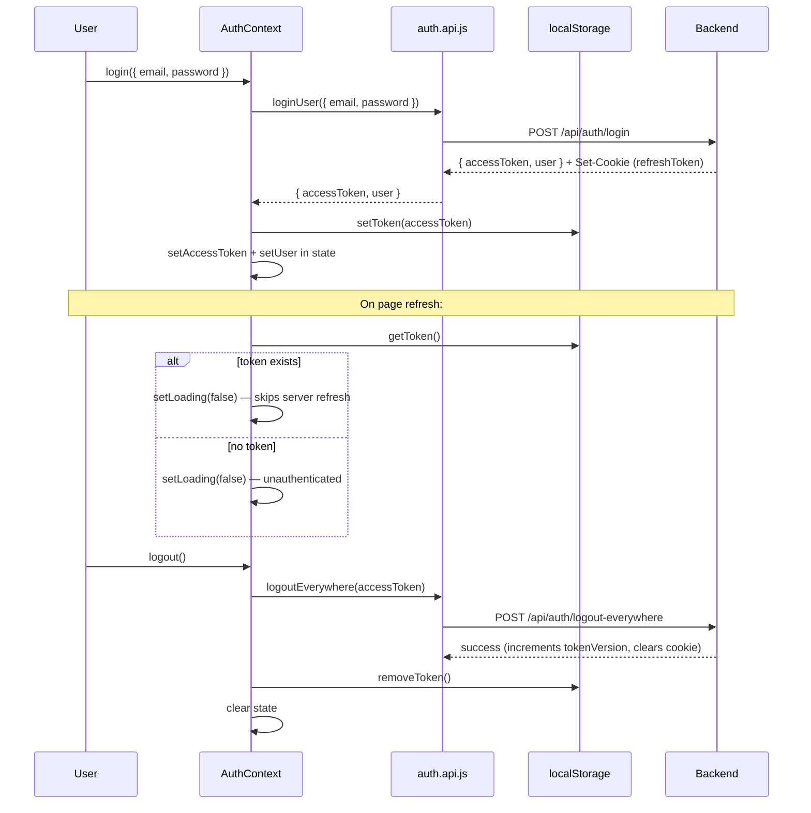

# APILogs Frontend — API Layer Documentation

> **Source of truth:** All claims verified from source code in `frontend/src/api/` and its dependencies. No behavior is assumed or invented.

---

## Table of Contents

1. [Architecture Overview](#1-architecture-overview)
2. [File Index](#2-file-index)
3. [api.js — Shared Axios Instance](#3-apijs--shared-axios-instance)
4. [auth.api.js — Authentication API](#4-authapiJS--authentication-api)
5. [Project.api.js — Project API](#5-projectapijs--project-api)
6. [event.api.js — Event API](#6-eventapijs--event-api)
7. [incident.api.js — Incident API](#7-incidentapijs--incident-api)
8. [Token Utility — src/utils/token.js](#8-token-utility--srcutilstokenjs)
9. [Request Interceptors — How Auth Headers Are Attached](#9-request-interceptors--how-auth-headers-are-attached)
10. [Complete API Function Reference Table](#10-complete-api-function-reference-table)
11. [API ↔ Backend Route Verification](#11-api--backend-route-verification)
12. [Error Handling Model](#12-error-handling-model)
13. [Consumer Context: How API Functions Are Used](#13-consumer-context-how-api-functions-are-used)
14. [Authentication Flow — Token Lifecycle](#14-authentication-flow--token-lifecycle)
15. [Security Notes](#15-security-notes)
16. [Documentation Discrepancies and Bugs](#16-documentation-discrepancies-and-bugs)
17. [Unverified Assumptions](#17-unverified-assumptions)
18. [Interview Preparation Notes](#18-interview-preparation-notes)

---

## 1. Architecture Overview

The `frontend/src/api/` folder is the **HTTP client layer** of the frontend. It contains thin wrapper functions around Axios that map 1:1 to backend REST endpoints. Every component, context, or hook that needs to talk to the backend must go through these functions.

```
React Component / Context / Hook
         │
         ▼
  API function (e.g. loginUser)
         │  (imports)
         ▼
  Shared Axios instance (api.js)
         │  withCredentials: true + VITE_Backend_URL base
         │  + request interceptor (token injection)
         ▼
  Backend REST API  (Express, verified from backend/src/routes/)
         │
         ▼
  res.data returned to caller
```

Design principles visible in the code:
- **Single Axios instance** — all API files import the same `api` object from `api.js`.
- **No response interceptors** — errors are not globally caught. Callers handle `try/catch`.
- **`withCredentials: true`** — HTTP-only cookies are sent with every request (refresh token delivery).
- **Access token in `localStorage`** — retrieved by `getToken()` and injected per-request via interceptors.

---

## 2. File Index

| File | Exports | Backend prefix |
|---|---|---|
| `api.js` | `api` (Axios instance, default) | — |
| `auth.api.js` | 7 named exports + `api` re-export | `/api/auth` |
| `Project.api.js` | 3 named exports + `api` re-export | `/api/project` |
| `event.api.js` | 2 named exports + `api` re-export | `/api/events` |
| `incident.api.js` | 2 named exports | `/api/incidents` |

---

## 3. `api.js` — Shared Axios Instance

**File:** `frontend/src/api/api.js`

```js
import axios from "axios";

const api = axios.create({
    baseURL: `${import.meta.env.VITE_Backend_URL}/api`,
    withCredentials: true,
    headers: {
        'Content-Type': 'application/json'
    }
});

export default api;
```

### Configuration

| Option | Value | Effect |
|---|---|---|
| `baseURL` | `${VITE_Backend_URL}/api` | All relative URLs are resolved against this base |
| `withCredentials` | `true` | Sends cookies (including HTTP-only refresh token cookie) with cross-origin requests |
| `Content-Type` | `'application/json'` | All requests declare JSON as the content type |

### Environment Variable: `VITE_Backend_URL`

Read from Vite's env system (`import.meta.env.VITE_Backend_URL`). Must be set in `.env` or `.env.local`:
```
VITE_Backend_URL=https://your-backend-host.com
```

If this variable is missing or undefined, `baseURL` becomes `"undefined/api"` and all requests will fail. There is no runtime validation or fallback.

### What this instance does NOT have

- No request interceptors (added by individual API files).
- No response interceptors (error handling is caller's responsibility).
- No timeout configuration.
- No retry logic.

### Re-exports

`auth.api.js`, `Project.api.js`, and `event.api.js` all re-export `api` as a default export. This is redundant since `api` is already the default export of `api.js`, but it allows consumers to import the pre-configured instance from any of these files if needed.

---

## 4. `auth.api.js` — Authentication API

**File:** `frontend/src/api/auth.api.js`  
**Imports:** `api` from `./api`  
**No interceptors added** — auth requests do not need an Authorization header except for `logoutEverywhere`.

### Exported Functions

---

#### `registerUser(data)`

```js
export const registerUser = async (data) => {
    const res = await api.post("/auth/register", data);
    console.log(res.data);
    return res.data;
}
```

- **HTTP:** `POST /api/auth/register`
- **Body:** `data` — expected shape `{ username, email, password }` (enforced by Joi on backend)
- **Returns:** `res.data` — backend response body
- **Side effect:** `console.log(res.data)` — debug log left in production code
- **Auth:** None — public endpoint
- **Backend validation:** Joi `registerSchema` runs before the controller

---

#### `verifyEmailOtp(data)`

```js
export const verifyEmailOtp = async (data) => {
    const res = await api.post("/auth/verify/confirm", data);
    return res.data;
};
```

- **HTTP:** `POST /api/auth/verify/confirm`
- **Body:** `data` — expected shape `{ email, otp }` (actual fields confirmed from backend controller)
- **Returns:** `res.data`
- **Auth:** None — rate-limited by `otpLimiter` (5 req / 10 min per IP) on backend

---

#### `loginUser(data)`

```js
export const loginUser = async (data) => {
    const res = await api.post("/auth/login", data);
    return res.data;
}
```

- **HTTP:** `POST /api/auth/login`
- **Body:** `data` — expected shape `{ email, password }`
- **Returns:** `res.data` — expected to include `{ accessToken, user, ... }`
- **Auth:** None — public endpoint, Joi `loginSchema` validation on backend
- **Consumer:** `AuthContext.login()` calls this and stores `data.accessToken` in `localStorage` and state

---

#### `requestLoginOtp(data)`

```js
export const requestLoginOtp = async (data) => {
    const res = await api.post("/auth/login/otp/request", data);
    return res.data;
}
```

- **HTTP:** `POST /api/auth/login/otp/request`
- **Body:** `data` — expected shape `{ email }`
- **Returns:** `res.data`
- **Auth:** None — rate-limited by `otpLimiter` on backend

---

#### `verifyLoginOtp(data)`

```js
export const verifyLoginOtp = async (data) => {
    const res = await api.post("/auth/login/otp/verify", data);
    return res.data;
};
```

- **HTTP:** `POST /api/auth/login/otp/verify`
- **Body:** `data` — expected shape `{ email, otp }`
- **Returns:** `res.data` — expected to include `{ accessToken, user, ... }` on success
- **Auth:** None — rate-limited by `otpLimiter` on backend

---

#### `refreshToken()`

```js
export const refreshToken = async () => {
    const res = await api.post("/auth/token/refresh");
    return res.data;
};
```

- **HTTP:** `POST /api/auth/token/refresh`
- **Body:** None — the refresh token is sent automatically via the HTTP-only cookie (because `withCredentials: true`)
- **Returns:** `res.data` — expected to include a new `{ accessToken }`
- **Auth:** Cookie-based (no `Authorization` header needed)
- **Note:** `AuthContext` does NOT call `refreshToken()` on page load. The commented-out code says: *"We are not persisting a refresh token yet, so skip server refresh to avoid 'Missing token'"*. Token refresh is technically available but not actively used.

---

#### `logoutEverywhere(token)`

```js
export const logoutEverywhere = async (token) => {
    const res = await api.post(
        "/auth/logout-everywhere",
        {},
        {
            headers: {
                Authorization: `Bearer ${token}`,
            },
        }
    );
    return res.data;
}
```

- **HTTP:** `POST /api/auth/logout-everywhere`
- **Body:** `{}` — empty body
- **Custom header:** `Authorization: Bearer <token>` — the access token is passed explicitly as a parameter, then set as a per-request header override
- **Why explicit token?** All other protected endpoints use the interceptor from `Project.api.js` or `event.api.js`. This function is in `auth.api.js` where no interceptor is registered, so the token must be passed manually.
- **Consumer:** `AuthContext.logout()` passes `accessToken` from its state
- **Backend:** `authRequired` middleware validates this token before incrementing `tokenVersion` and clearing the refresh token cookie

---

#### `resendVerifyOtp(data)`

```js
export const resendVerifyOtp = async (data) => {
    const res = await api.post("/auth/verify/resend", data);
    return res.data;
}
```

- **HTTP:** `POST /api/auth/verify/resend`
- **Body:** `data` — expected shape `{ email }`
- **Returns:** `res.data`
- **Auth:** None — rate-limited by `otpLimiter` on backend

---

## 5. `Project.api.js` — Project API

**File:** `frontend/src/api/Project.api.js`  
**Imports:** `api` from `./api`, `getToken` from `../utils/token`

### Request Interceptor (Registered Here)

```js
api.interceptors.request.use((req) => {
    const token = getToken();
    if (token) {
        req.headers.Authorization = `Bearer ${token}`;
    }
    return req;
});
```

This interceptor is registered on the **shared `api` instance** — meaning it applies globally to ALL subsequent requests made through any file that has imported `api` after this file runs. This is a critical architectural detail explained further in [Section 9](#9-request-interceptors--how-auth-headers-are-attached).

---

#### `createProjectApi(data)`

```js
export const createProjectApi = async (data) => {
    const res = await api.post("/project/create", data);
    return res.data;
}
```

- **HTTP:** `POST /api/project/create`
- **Body:** `data` — expected shape `{ projectName, description? }` (Joi `ProjectSchema` on backend)
- **Returns:** `res.data`
- **Auth:** `authRequired` middleware on backend (JWT access token); token injected by interceptor

---

#### `listOfProjectApi()`

```js
export const listOfProjectApi = async () => {
    const res = await api.get("/project/list");
    return res.data;
}
```

- **HTTP:** `GET /api/project/list`
- **Returns:** `res.data` — expected list of the user's projects
- **Auth:** `authRequired` + `ValidateProject` (Joi) on backend
- **Known backend bug:** `ValidateProject` middleware (Joi) is applied to this GET route; since GET requests have no body, `projectName` (required) will always fail → **this endpoint may return HTTP 400 in production**. See [Section 16](#16-documentation-discrepancies-and-bugs).

---

#### `projectrotatekey()`

```js
export const projectrotatekey = async () => {
    const res = await api.post("/project/:projectId/rotate-key");
    return res.data;
}
```

- **HTTP:** `POST /api/project/:projectId/rotate-key`
- **Known bug:** The `:projectId` route parameter is a literal string `":projectId"` — it is never substituted with an actual project ID. The function accepts no arguments, so there is no way to pass a project ID at call time.
- **Effect:** This function will always make a request to literally `/api/project/:projectId/rotate-key`, which will return a 404 from Express.
- **Auth:** `authRequired` on backend

---

## 6. `event.api.js` — Event API

**File:** `frontend/src/api/event.api.js`  
**Imports:** `api` from `./api`, `getToken` from `../utils/token`

### Request Interceptor (Registered Here)

```js
api.interceptors.request.use((req) => {
    const token = getToken();
    if (token) {
        req.headers.Authorization = `Bearer ${token}`;
    }
    return req;
});
```

Identical interceptor to the one in `Project.api.js`. Since both register on the same `api` instance, **two identical interceptors** will be stacked. Every request will run `getToken()` and `Authorization` injection twice. The second run overwrites the first. The end result is functionally correct but redundant.

---

#### `ingestEvent(projectId, data)`

```js
export const ingestEvent = async (projectId, data) => {
    const res = await api.post(`/events/ingest/${projectId}`, data);
    return res.data;
}
```

- **HTTP:** `POST /api/events/ingest/:projectId`
- **URL param:** `projectId` — injected correctly via template literal
- **Body:** `data` — expected shape `{ service, severity, message, metadata?, environment?, eventTimestamp? }` (Joi `eventBodySchema` on backend)
- **Auth:** `apiKeyAuth` middleware on backend — expects `x-api-key` header, **NOT** the JWT `Authorization` header
- **Conflict:** The interceptor injects an `Authorization: Bearer <token>` header but the backend ignores it for this endpoint (uses `x-api-key` instead). The JWT header will be sent but silently ignored by the backend `apiKeyAuth` middleware. The `x-api-key` header is not set anywhere in this function.
- **Practical consequence:** This function cannot successfully authenticate with the backend's `apiKeyAuth` middleware as written. A frontend UI calling `ingestEvent()` would receive `401 Unauthorized`. The event ingest endpoint is designed for server-to-server use (direct API key calls), not browser calls.

---

#### `getProjectEvents(projectId, params = {})`

```js
export const getProjectEvents = async (projectId, params = {}) => {
    const res = await api.get(`/events/${projectId}`, {
        params,
    });
    return res.data;
}
```

- **HTTP:** `GET /api/events/:projectId`
- **URL param:** `projectId` — injected correctly
- **Query params:** `params` object — forwarded as query string. Backend accepts pagination cursor params (e.g., `{ cursor, limit, severity, service }`)
- **Returns:** `res.data` — expected paginated events list
- **Auth:** `authRequired` on backend (JWT), injected by interceptor

---

## 7. `incident.api.js` — Incident API

**File:** `frontend/src/api/incident.api.js`  
**Imports:** `api` from `./api` only  
**No interceptor registered** — relies on interceptors already registered by `Project.api.js` or `event.api.js` if those modules have been loaded. If neither has been imported in the same session, requests will have no `Authorization` header.

---

#### `getProjectIncidents(projectId)`

```js
export const getProjectIncidents = async (projectId) => {
    const res = await api.get(`/incidents/${projectId}`);
    return res.data;
};
```

- **HTTP:** `GET /api/incidents/:projectId`
- **URL param:** `projectId`
- **Returns:** `res.data` — expected list of incidents for the project
- **Auth:** JWT via interceptor (registered by `Project.api.js` or `event.api.js`, not this file)

---

#### `updateIncidentStatus(incidentId, status)`

```js
export const updateIncidentStatus = async (incidentId, status) => {
    const res = await api.patch(`/incidents/${incidentId}/status`, { status });
    return res.data;
};
```

- **HTTP:** `PATCH /api/incidents/:incidentId/status`
- **URL param:** `incidentId`
- **Body:** `{ status }` — the new status string (e.g., `"resolved"`, `"open"`)
- **Returns:** `res.data`
- **Auth:** JWT via interceptor (registered by another module)

---

## 8. Token Utility — `src/utils/token.js`

**File:** `frontend/src/utils/token.js`  
**Imported by:** `Project.api.js`, `event.api.js`, `AuthContext.jsx`

```js
const TOKEN_KEY = "token";

export const setToken = (token) => {
    if (!token) return;
    localStorage.setItem(TOKEN_KEY, token);
};

export const getToken = () => {
    return localStorage.getItem(TOKEN_KEY);
};

export const removeToken = () => {
    localStorage.removeItem(TOKEN_KEY);
};

export const isLoggedIn = () => {
    return !!getToken();
};
```

### Storage Strategy

The JWT access token is stored in **`localStorage`** under the key `"token"`.

| Function | Operation | Key Used |
|---|---|---|
| `setToken(token)` | `localStorage.setItem` | `"token"` |
| `getToken()` | `localStorage.getItem` | `"token"` |
| `removeToken()` | `localStorage.removeItem` | `"token"` |
| `isLoggedIn()` | Checks if `getToken()` is truthy | — |

### Security Note

Storing the JWT access token in `localStorage` exposes it to JavaScript running on the page. Any XSS vulnerability could allow an attacker to steal the token. HTTP-only cookies (which cannot be read by JS) would be safer, but the current design uses `localStorage` for the access token. The refresh token, however, is delivered as an HTTP-only cookie by the backend (using `withCredentials: true`).

---

## 9. Request Interceptors — How Auth Headers Are Attached

### The Problem

`auth.api.js` does not register any interceptor. `incident.api.js` does not register any interceptor either. `Project.api.js` and `event.api.js` **each** register an identical interceptor on the shared `api` instance.

### How Axios Interceptors Work

Axios interceptors on an instance are **additive**. Each call to `api.interceptors.request.use(fn)` adds a new function to the interceptors stack. They are executed in registration order for each request.

### The Duplicate Interceptor Problem

If both `Project.api.js` and `event.api.js` are imported in the same app bundle (which they are — both are used in the dashboard), the interceptor is registered **twice** on the same `api` instance:

```
Request flow with both files imported:
1. Interceptor from Project.api.js: req.headers.Authorization = `Bearer ${token}`
2. Interceptor from event.api.js:   req.headers.Authorization = `Bearer ${token}`  (redundant)
```

The result is functionally identical to a single interceptor — but `getToken()` is called twice per request and the header is written twice. This is a design defect (not a bug that causes incorrect behavior, but unnecessary waste).

### The Load-Order Dependency

`incident.api.js` has no interceptor. Its requests will only have an `Authorization` header if `Project.api.js` or `event.api.js` has already been loaded and their module-level interceptor registration has run. In a typical React app where all these modules are bundled together, this is always the case. But it is fragile — if `incident.api.js` is used in isolation (e.g., tests), requests will have no auth header.

### Auth Header Summary Per Function

| Function | Auth Header Source |
|---|---|
| `registerUser` | None — public |
| `verifyEmailOtp` | None — public |
| `loginUser` | None — public |
| `requestLoginOtp` | None — public |
| `verifyLoginOtp` | None — public |
| `refreshToken` | Cookie (`withCredentials: true`) |
| `logoutEverywhere` | Explicit `Authorization` header passed as parameter |
| `createProjectApi` | Interceptor (from `Project.api.js`) |
| `listOfProjectApi` | Interceptor (from `Project.api.js`) |
| `projectrotatekey` | Interceptor (from `Project.api.js`) + URL bug |
| `ingestEvent` | Interceptor injects Bearer token, but backend needs `x-api-key` |
| `getProjectEvents` | Interceptor (from `event.api.js`) |
| `getProjectIncidents` | Interceptor from another module (load-order dependency) |
| `updateIncidentStatus` | Interceptor from another module (load-order dependency) |

---

## 10. Complete API Function Reference Table

| Function | File | Method | Path | Auth | Body / Params |
|---|---|---|---|---|---|
| `registerUser(data)` | auth.api.js | POST | `/api/auth/register` | None | `{ username, email, password }` |
| `verifyEmailOtp(data)` | auth.api.js | POST | `/api/auth/verify/confirm` | None | `{ email, otp }` |
| `loginUser(data)` | auth.api.js | POST | `/api/auth/login` | None | `{ email, password }` |
| `requestLoginOtp(data)` | auth.api.js | POST | `/api/auth/login/otp/request` | None | `{ email }` |
| `verifyLoginOtp(data)` | auth.api.js | POST | `/api/auth/login/otp/verify` | None | `{ email, otp }` |
| `refreshToken()` | auth.api.js | POST | `/api/auth/token/refresh` | Cookie | None |
| `logoutEverywhere(token)` | auth.api.js | POST | `/api/auth/logout-everywhere` | Bearer (manual) | `{}` |
| `resendVerifyOtp(data)` | auth.api.js | POST | `/api/auth/verify/resend` | None | `{ email }` |
| `createProjectApi(data)` | Project.api.js | POST | `/api/project/create` | Bearer (interceptor) | `{ projectName, description? }` |
| `listOfProjectApi()` | Project.api.js | GET | `/api/project/list` | Bearer (interceptor) | None |
| `projectrotatekey()` | Project.api.js | POST | `/api/project/:projectId/rotate-key` ⚠️ | Bearer (interceptor) | None |
| `ingestEvent(projectId, data)` | event.api.js | POST | `/api/events/ingest/:projectId` | Sends Bearer ⚠️ needs x-api-key | Event body |
| `getProjectEvents(projectId, params)` | event.api.js | GET | `/api/events/:projectId` | Bearer (interceptor) | Query params |
| `getProjectIncidents(projectId)` | incident.api.js | GET | `/api/incidents/:projectId` | Bearer (load-order) | None |
| `updateIncidentStatus(incidentId, status)` | incident.api.js | PATCH | `/api/incidents/:incidentId/status` | Bearer (load-order) | `{ status }` |

---

## 11. API ↔ Backend Route Verification

Cross-referencing frontend API functions against `backend/src/routes/`:

| Frontend Function | Frontend Path | Backend Route | Match? |
|---|---|---|---|
| `registerUser` | `/auth/register` | `POST /auth/register` | ✅ |
| `verifyEmailOtp` | `/auth/verify/confirm` | `POST /auth/verify/confirm` | ✅ |
| `loginUser` | `/auth/login` | `POST /auth/login` | ✅ |
| `requestLoginOtp` | `/auth/login/otp/request` | `POST /auth/login/otp/request` | ✅ |
| `verifyLoginOtp` | `/auth/login/otp/verify` | `POST /auth/login/otp/verify` | ✅ |
| `refreshToken` | `/auth/token/refresh` | `POST /auth/token/refresh` | ✅ |
| `logoutEverywhere` | `/auth/logout-everywhere` | `POST /auth/logout-everywhere` | ✅ |
| `resendVerifyOtp` | `/auth/verify/resend` | `POST /auth/verify/resend` | ✅ |
| `createProjectApi` | `/project/create` | `POST /project/create` | ✅ |
| `listOfProjectApi` | `/project/list` | `GET /project/list` | ✅ (backend has bug) |
| `projectrotatekey` | `/project/:projectId/rotate-key` | `POST /project/:projectId/rotate-key` | ❌ path literal, not interpolated |
| `ingestEvent` | `/events/ingest/:projectId` | `POST /events/ingest/:projectId` | ✅ path, ❌ auth method |
| `getProjectEvents` | `/events/:projectId` | `GET /events/:projectId` | ✅ |
| `getProjectIncidents` | `/incidents/:projectId` | `GET /incidents/:projectId` | ✅ |
| `updateIncidentStatus` | `/incidents/:incidentId/status` | `PATCH /incidents/:incidentId/status` | ✅ |

---

## 12. Error Handling Model

None of the API functions in this folder contain `try/catch` blocks. Error handling is entirely delegated to the caller.

When an Axios request fails (non-2xx HTTP status), Axios throws an error with the shape:

```js
err.response.status     // HTTP status code (e.g., 400, 401, 500)
err.response.data       // Backend response body (e.g., { errors: [...] } or { error: "..." })
err.message             // Axios error message
```

**Callers must wrap API calls in `try/catch`.** The `AuthContext` does this for `logoutEverywhere` (uses `finally` to ensure local cleanup even if the API call fails), but not consistently across all functions.

There are no response interceptors — no global 401 handler, no automatic token refresh on expiry. If an access token expires, the next API call will simply receive a 401 response, and the caller must handle it.

---

## 13. Consumer Context: How API Functions Are Used

### `AuthContext.jsx`

The primary consumer of `auth.api.js`. Wraps API calls in actions:

| Context Action | API Function Called | What it does with the result |
|---|---|---|
| `login(payload)` | `loginUser(payload)` | Stores `data.accessToken` in `localStorage` and React state |
| `register(payload)` | `registerUser(payload)` | Returns raw response to caller |
| `verifyEmail(payload)` | `verifyEmailOtp(payload)` | Returns raw response to caller |
| `logout()` | `logoutEverywhere(accessToken)` | Calls server, then clears localStorage and state in `finally` |
| `loginwithTokens(data)` | *(no API call)* | Stores tokens directly — used after OTP login flow |

### `Project.Context.jsx`, `EventContext.jsx`, `RealTimeContext.jsx`

Consume project, event, and incident API functions respectively. The exact usage was not read in depth, but these contexts are the intended consumers of `Project.api.js`, `event.api.js`, and `incident.api.js`.

---

## 14. Authentication Flow — Token Lifecycle



**Important gap:** On page refresh, `AuthContext` reads the token from `localStorage` and restores state without calling `refreshToken()`. The comment in the code explains: *"We are not persisting a refresh token yet, so skip server refresh."* This means the refresh token cookie mechanism is implemented on the backend but not actively used by the frontend on session restore.

---

## 15. Security Notes

### What is Done Correctly

| Practice | Location |
|---|---|
| `withCredentials: true` | `api.js` — refresh token cookie is sent automatically |
| JWT passed as Bearer token | Interceptors in `Project.api.js`, `event.api.js` |
| Token cleared on logout | `AuthContext.logout()` → `removeToken()` |
| `logout()` uses `finally` | Ensures local cleanup even if server call fails |

### Security Gaps

| Gap | Location | Detail |
|---|---|---|
| Access token in `localStorage` | `token.js` | Vulnerable to XSS — HTTP-only cookie would be safer |
| `console.log(res.data)` in `registerUser` | `auth.api.js` line 5 | May log sensitive user data in production browser console |
| No global 401 handler | `api.js` | Expired tokens cause uncaught errors in callers |
| No token refresh on expiry | `AuthContext` | Frontend does not automatically refresh the access token when it expires — user is silently stuck with a 401 |
| `ingestEvent` sends wrong auth | `event.api.js` | Sends Bearer JWT; backend requires `x-api-key` |
| Duplicate interceptors | `Project.api.js` + `event.api.js` | Design defect — not a security gap, but fragile |
| `incident.api.js` auth load-order dependency | `incident.api.js` | Auth header only present if another module loaded first |

---

## 16. Documentation Discrepancies and Bugs

| # | File | Issue |
|---|---|---|
| B1 | `Project.api.js` line 24 | `projectrotatekey()` hardcodes the literal string `"/project/:projectId/rotate-key"` — `:projectId` is never replaced. The function takes no parameter, making it impossible to call the correct endpoint. Will always return 404. |
| B2 | `event.api.js` line 12–15 | `ingestEvent()` is a frontend function calling an endpoint that requires `x-api-key` header for API key auth. The interceptor sends `Authorization: Bearer <token>` instead. The endpoint will return 401. This function cannot work in a browser context as designed. |
| B3 | `auth.api.js` line 5 | `console.log(res.data)` left in `registerUser()`. Logs server responses (including user data) to the browser console in production. |
| B4 | `Project.api.js` + `event.api.js` | Both files register an identical interceptor on the shared `api` instance. The interceptor runs twice per request. |
| B5 | `incident.api.js` | Relies on interceptors registered by other files being loaded first. No self-contained auth setup. |
| B6 | `AuthContext.jsx` line 28 | `refreshToken()` is imported from `auth.api.js` but the function is available, yet it's intentionally not called. The token refresh mechanism is implemented but never invoked. |
| B7 | Backend cross-ref | `listOfProjectApi()` calls `GET /api/project/list` which has `ValidateProject` Joi middleware on the backend (a backend bug). The frontend will receive HTTP 400 for every call to this endpoint. |

---

## 17. Unverified Assumptions

| Assumption | Reason |
|---|---|
| `VITE_Backend_URL` env var is defined | No `.env` file was read. If undefined, all requests fail. |
| Refresh token is stored as HTTP-only cookie | Backend sets it — confirmed in backend docs. Frontend side relies on `withCredentials: true`. |
| `Project.Context.jsx`, `EventContext.jsx` handle errors | Not read in depth — assumed they wrap API calls in `try/catch`. |
| Both `Project.api.js` and `event.api.js` are always imported together | Bundle import order was not traced through all pages. |
| `incident.api.js` always has auth headers | Depends on load order — not formally verified. |

---

## 18. Interview Preparation Notes

### Q: What is `api.js` and why does it exist as a separate file?

It creates a **shared Axios instance** with the common configuration that all API calls share: `baseURL`, `withCredentials: true`, and the JSON `Content-Type` header. Having a single instance means all files share the same configuration, and interceptors registered on the instance affect all files that import it. Without this, each file would need to configure its own Axios instance.

### Q: How does the frontend attach JWT tokens to requests?

Via **request interceptors** registered in `Project.api.js` and `event.api.js`. They call `getToken()` (reads from `localStorage`) and set `req.headers.Authorization = 'Bearer <token>'` before each request. `auth.api.js` has no interceptor — public auth endpoints don't need it, and `logoutEverywhere` passes the token explicitly as a parameter.

### Q: What is `withCredentials: true` for?

It tells the browser to include cookies in cross-origin requests. The backend sets the refresh token as an **HTTP-only cookie** (which JavaScript cannot read). With `withCredentials: true`, the browser automatically sends this cookie with each request, allowing the `/auth/token/refresh` endpoint to read it without the frontend ever having direct access to the refresh token value.

### Q: What bugs would you point out in this API layer?

Three critical bugs:
1. `projectrotatekey()` — the URL param `:projectId` is never interpolated; it's a literal string. Always 404.
2. `ingestEvent()` — sends a JWT Bearer token but the backend requires an `x-api-key` header. Always 401 from the browser.
3. `listOfProjectApi()` — the backend route has `ValidateProject` Joi middleware applied to a GET route (no body), so it always returns 400.

### Q: Why are there duplicate interceptors and what is the impact?

`Project.api.js` and `event.api.js` both call `api.interceptors.request.use()` with the same function on the same shared `api` instance. Because Axios interceptors are additive, both are registered. Each request runs the token injection function twice. The second run overwrites the first with the same value — functionally harmless but wasteful and fragile.

### Q: Is the access token storage secure?

**No.** It's stored in `localStorage`, which is accessible to any JavaScript on the page. An XSS vulnerability would allow token theft. A more secure approach is storing the access token in memory (React state) and the refresh token in an HTTP-only cookie (which the backend already does). The frontend partially implements this — the refresh token IS in an HTTP-only cookie — but the access token leak via `localStorage` remains.

### Q: Does the app handle token expiry?

**No.** There is no response interceptor to catch 401 errors and automatically call `refreshToken()`. When the access token expires, API calls will simply fail with 401, and the caller must handle this. `AuthContext` doesn't call `refreshToken()` on page load — the code explicitly skips it with a comment saying the refresh mechanism isn't wired up yet.

---

*Last updated: 2026-09-16. All documentation is based on direct source code inspection of `frontend/src/api/` and its immediate dependencies. No behavior is assumed or invented.*
