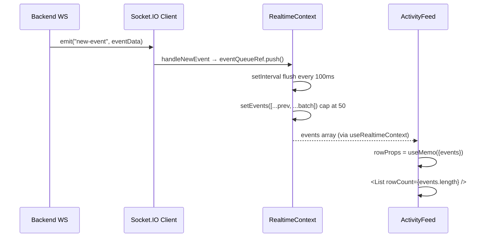
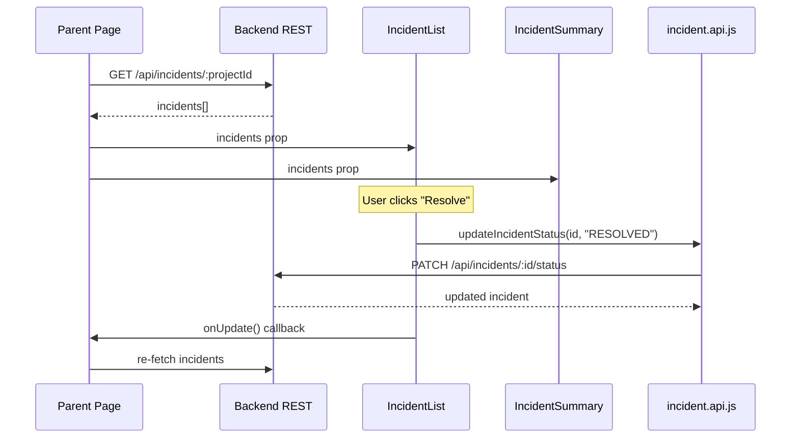

# APILogs Frontend — Components Documentation

> **Source of truth:** All claims verified directly from source code in `frontend/src/components/` and immediate dependencies. No behavior is assumed or invented.

---

## Table of Contents

1. [Architecture Overview](#1-architecture-overview)
2. [File Index](#2-file-index)
3. [ActivityFeed.jsx](#3-activityfeedjsx)
   - 3.1 [Purpose](#31-purpose)
   - 3.2 [Imports and Dependencies](#32-imports-and-dependencies)
   - 3.3 [Constants](#33-constants)
   - 3.4 [Row — Memoized Sub-Component](#34-row--memoized-sub-component)
   - 3.5 [ActivityFeed — Main Component](#35-activityfeed--main-component)
   - 3.6 [Commented-Out Pagination Logic](#36-commented-out-pagination-logic)
   - 3.7 [Props Interface](#37-props-interface)
   - 3.8 [Render Output](#38-render-output)
4. [Incidents/IncidentList.jsx](#4-incidentsincidentlistjsx)
   - 4.1 [Purpose](#41-purpose)
   - 4.2 [Imports and Dependencies](#42-imports-and-dependencies)
   - 4.3 [Helper Functions](#43-helper-functions)
   - 4.4 [IncidentList — Main Component](#44-incidentlist--main-component)
   - 4.5 [Props Interface](#45-props-interface)
   - 4.6 [Render Logic and Status Colors](#46-render-logic-and-status-colors)
5. [Incidents/IncidentSummary.jsx](#5-incidentsincidentsummaryjsx)
   - 5.1 [Purpose](#51-purpose)
   - 5.2 [Imports and Dependencies](#52-imports-and-dependencies)
   - 5.3 [Computed Summary Logic](#53-computed-summary-logic)
   - 5.4 [Props Interface](#54-props-interface)
   - 5.5 [Render Output](#55-render-output)
6. [Data Flow: How Components Receive Data](#6-data-flow-how-components-receive-data)
7. [RealTimeContext Dependency — Key Facts](#7-realtimecontext-dependency--key-facts)
8. [Performance Notes](#8-performance-notes)
9. [Documentation Discrepancies and Bugs](#9-documentation-discrepancies-and-bugs)
10. [Unverified Assumptions](#10-unverified-assumptions)
11. [Interview Preparation Notes](#11-interview-preparation-notes)

---

## 1. Architecture Overview

The `frontend/src/components/` folder contains **reusable, presentational React components** organized by feature area. There are currently 3 components:

```
components/
├── ActivityFeed.jsx          ← Live event stream (virtualised list)
└── Incidents/
    ├── IncidentList.jsx      ← Incident cards with status-change actions
    └── IncidentSummary.jsx   ← Aggregated stats panel (open/critical/error count)
```

**Design pattern:**
- `ActivityFeed` is a smart component — it pulls data from `RealtimeContext` directly via a hook (`useRealtimeContext`).
- `IncidentList` and `IncidentSummary` are semi-dumb components — they receive data via props and call one API function directly.
- All three are exported as default exports.

**Data flow overview:**
```
Backend WebSocket ──► RealtimeContext ──► ActivityFeed
                                    └──► (incidents state)

Backend REST API  ──► Parent Page ──► IncidentList (props)
                               └──► IncidentSummary (props)
```

---

## 2. File Index

| File | Type | Data Source | API Calls |
|---|---|---|---|
| `ActivityFeed.jsx` | Smart component | `useRealtimeContext()` | None directly |
| `Incidents/IncidentList.jsx` | Semi-dumb component | Props (`incidents`) | `updateIncidentStatus` |
| `Incidents/IncidentSummary.jsx` | Pure presentational | Props (`incidents`) | None |

---

## 3. `ActivityFeed.jsx`

### 3.1 Purpose

Renders a **virtualized, live-updating list** of API log events for a given project. Events arrive in real-time via WebSocket (Socket.IO) and are stored in `RealtimeContext`. The component displays them in a fixed-height scrollable container using a virtual list renderer to efficiently handle large numbers of events without rendering all DOM nodes at once.

### 3.2 Imports and Dependencies

| Import | Source | Purpose |
|---|---|---|
| `React`, `useRef`, `useMemo` | `react` | Core React hooks |
| `List`, `useListRef` | `react-window` | Virtualised list rendering |
| `useRealtimeContext` | `../context/RealTimeContext` | Access to live `events` array |
| `useRealtime` | `../hooks/useRealtime` | Imported but **not used** in the current active code |

> **Note:** `useRealtime` is imported at line 4 but never called inside the component. The line that would call it (`const { loadOlderEvents } = useRealtime(projectId)`) is commented out. This is a dead import.

> **Note:** `react-window` is used here, but the actual package import is `{ List, useListRef }` from `"react-window"`. Standard `react-window` does not export `useListRef` — this suggests the project may use a fork or custom build of `react-window`. Verify the installed package version.

### 3.3 Constants

| Constant | Value | Purpose |
|---|---|---|
| `SEVERITY_COLORS` | Object map | CSS classes per severity level for badge styling |
| `ROW_HEIGHT` | `110` | Fixed pixel height for each virtualised row |

#### `SEVERITY_COLORS` map

| Severity | CSS Classes |
|---|---|
| `INFO` | `bg-blue-100 text-blue-700` |
| `WARN` | `bg-yellow-100 text-yellow-800` |
| `ERROR` | `bg-red-100 text-red-700` |
| `DEBUG` | `bg-purple-100 text-purple-700` |
| `CRITICAL` | `bg-red-200 text-red-900` |
| *(any other)* | `bg-gray-100 text-gray-700` (fallback) |

> **Discrepancy:** The backend's event severity enum is `["INFO", "WARN", "ERROR", "CRITICAL"]`. `"DEBUG"` is in `SEVERITY_COLORS` but is **not a valid backend severity**. It will never be rendered unless the severity validation is bypassed.

### 3.4 `Row` — Memoized Sub-Component

```jsx
const Row = React.memo(({ index, style, ariaAttributes, events }) => { ... });
```

A memoized component rendered for each item in the virtual list. `React.memo` ensures it only re-renders when its own props change.

**Props:**

| Prop | Type | Source |
|---|---|---|
| `index` | number | Row index in the virtual list |
| `style` | object | Positioning style injected by the virtualiser |
| `ariaAttributes` | object | Accessibility attributes injected by the virtualiser |
| `events` | array | The full events array (passed via `rowProps`) |

**Internal memoization:**

- `formattedDate` — memoized with `useMemo` on `event.createdAt`. Calls `new Date(event.createdAt).toLocaleString()`. Uses the user's browser locale for formatting.
- `severityClass` — memoized with `useMemo` on `event.severity`. Looks up `SEVERITY_COLORS[event.severity]` with fallback to gray.

**Rendered fields per event:**

| Field | Location in UI | Notes |
|---|---|---|
| `severity` | Badge (top-left) | Colored by `SEVERITY_COLORS` |
| `createdAt` | Timestamp (top-right) | Formatted via `toLocaleString()` |
| `message` | Body text | Always rendered |
| `service` | Footer line | Only rendered if truthy |
| `environment` | Footer line | Only rendered if truthy |

> **Note:** `event.metadata` is **not displayed** in the UI. Events with metadata receive no visual indication of additional data.

### 3.5 `ActivityFeed` — Main Component

```jsx
const ActivityFeed = ({ projectId }) => { ... };
```

**Props:** `projectId` (string) — passed in but used **only by the commented-out hooks and effects**. The current active code does not use `projectId` in any live logic.

**Execution flow (active code only):**

1. `useRealtimeContext()` — pulls `events` array from `RealtimeContext`.
2. `useListRef()` — creates a ref for the virtualised list (used only in commented-out scroll-to-bottom logic).
3. `containerRef = useRef(null)` — ref for the scroll container (used only in commented-out `onScroll` handler).
4. `rowProps = useMemo(() => ({ events }), [events])` — memoizes the props object passed to each `Row` to keep the reference stable and avoid unnecessary re-renders.

**Render paths:**

```
if (!events || events.length === 0)
  → <div> "No events yet." </div>

else
  → <div> header "Live Activity" + <List virtualised /> </div>
```

**Virtual list configuration:**

```jsx
<List
  listRef={listRef}
  rowComponent={Row}
  rowCount={events.length}
  rowHeight={ROW_HEIGHT}   // 110px per row
  rowProps={rowProps}       // { events } passed to each Row
  style={{ height: "70vh" }}
/>
```

The container div also has `className="h-[70vh] overflow-y-auto"` — the height is set both by Tailwind class and by the `style` prop on `<List>`.

### 3.6 Commented-Out Pagination Logic

A substantial block of code (~80 lines) is commented out. This implemented:
- Scroll-to-bottom auto-tracking (`isAtBottom` state)
- "Load older events" on scroll-to-top via `loadOlderEvents()` from `useRealtime`
- 2-second artificial delay before loading the second and subsequent batches of 50 older events
- Scroll position preservation after prepending older events via `requestAnimationFrame`
- Reset of all pagination state when `projectId` changes
- Auto-scroll to latest event when user is at bottom and new events arrive

**Why it's commented out:** The code is complete and appears functional but is disabled, likely because the integration with the backend pagination API or the virtual list scroll behavior needed further testing. The `useRealtime` import remains at the top even though the hook call is commented out.

### 3.7 Props Interface

| Prop | Type | Required | Used Actively |
|---|---|---|---|
| `projectId` | string | Expected | ❌ Only in commented-out code |

### 3.8 Render Output

```
┌─────────────────────────────────────┐
│ ⚡ Live Activity                     │
├─────────────────────────────────────┤
│ ┌──────────────────────────────┐    │
│ │ [ERROR] badge   timestamp    │    │
│ │ message text                 │    │  ← Row (110px)
│ │ Service: api-gateway         │    │
│ │ Env: production              │    │
│ └──────────────────────────────┘    │
│ ┌──────────────────────────────┐    │
│ │ [INFO] badge    timestamp    │    │  ← Row (110px)
│ │ ...                          │    │
│ └──────────────────────────────┘    │
│         (70vh scrollable)           │
└─────────────────────────────────────┘
```

---

## 4. `Incidents/IncidentList.jsx`

### 4.1 Purpose

Renders a **list of incident cards** with inline status-change controls. Each incident can be acknowledged (if OPEN) or resolved (if not already RESOLVED). Status changes call the backend `PATCH` endpoint directly from this component.

### 4.2 Imports and Dependencies

| Import | Source | Purpose |
|---|---|---|
| `React` | `react` | JSX rendering |
| `updateIncidentStatus` | `../../api/incident.api` | PATCH to backend to change incident status |

### 4.3 Helper Functions

#### `showError(msg)`

```js
const showError = (msg) => {
    alert(msg || "Something went wrong updating incident status");
};
```

Uses the browser's native `alert()` dialog for error feedback. This is a blocking, non-dismissible modal — considered poor UX for production applications. No toast or inline error display is implemented.

### 4.4 `IncidentList` — Main Component

```jsx
const IncidentList = ({ incidents, onUpdate }) => { ... };
```

#### `handleStatusChange(id, status)` — async inner function

Steps in execution order:
1. Calls `await updateIncidentStatus(id, status)` → sends `PATCH /api/incidents/:incidentId/status` with body `{ status }`.
2. On success: calls `onUpdate()` — a callback prop to trigger a re-fetch in the parent.
3. On error (catch):
   - If `err.response.status === 404` → `showError("Incident not found or invalid update...")`.
   - Otherwise → `showError(err.message)`.

> **Note:** `showError` uses `alert()`. The component catches 404 specifically but treats all other errors generically. No 401, 403, or 500 handling distinction.

#### Render paths

```
if (!incidents || incidents.length === 0)
  → <div className="incident-list-empty"> "No incidents found." </div>

else
  → <div className="incident-list-container">
      <h3>Incidents</h3>
      {incidents.map(incident => <div key={incident._id}> ... </div>)}
    </div>
```

### 4.5 Props Interface

| Prop | Type | Required | Purpose |
|---|---|---|---|
| `incidents` | array | Yes | Array of incident objects from the backend |
| `onUpdate` | function | Yes | Callback called after a successful status change (usually triggers re-fetch) |

**Expected shape of each incident object:**

| Field | Type | Notes |
|---|---|---|
| `_id` | string | Used as React `key` and passed to `updateIncidentStatus` |
| `severity` | string | Displayed — also accessed as `incident.servity` (typo fallback, see [Section 9](#9-documentation-discrepancies-and-bugs)) |
| `status` | string | `"OPEN"`, `"ACKNOWLEDGED"`, or `"RESOLVED"` |
| `service` | string | Displayed |
| `eventCount` | number | Displayed |
| `firstOccurredAt` | date string | Formatted via `new Date().toLocaleString()` |
| `lastOccurredAt` | date string | Optional — only rendered if truthy |

### 4.6 Render Logic and Status Colors

**Status color mapping (inline styles):**

| Status | Color |
|---|---|
| `"OPEN"` | `#f28b25` (orange) |
| `"ACKNOWLEDGED"` | `#2986cc` (blue) |
| *(anything else, i.e. "RESOLVED")* | `#29a632` (green) |

**Action buttons logic:**

```
if (incident.status !== "RESOLVED"):
  if (incident.status === "OPEN"):
    → Show "Acknowledge" button → handleStatusChange(id, "ACKNOWLEDGED")
  → Always show "Resolve" button → handleStatusChange(id, "RESOLVED")

if (incident.status === "RESOLVED"):
  → No action buttons shown
```

> **Design note:** An ACKNOWLEDGED incident can be directly resolved without going back to OPEN. The "Acknowledge" button only appears when status is OPEN, but "Resolve" appears for both OPEN and ACKNOWLEDGED.

---

## 5. `Incidents/IncidentSummary.jsx`

### 5.1 Purpose

A **pure statistics panel** showing a 3-card summary of incident health: total open incidents, count of CRITICAL open incidents, and count of ERROR open incidents. Entirely presentational — makes no API calls and has no state of its own.

### 5.2 Imports and Dependencies

| Import | Source | Purpose |
|---|---|---|
| `React`, `useMemo` | `react` | JSX and memoization |

No API or context imports. Fully driven by props.

### 5.3 Computed Summary Logic

```js
const summary = useMemo(() => {
    const open = incidents.filter(i => i.status === "OPEN");
    const critical = open.filter(i => i.severity === "CRITICAL").length;
    const error = open.filter(i => i.severity === "ERROR").length;
    return { totalOpen: open.length, critical, error };
}, [incidents]);
```

**What is computed:**
- `open` — incidents with `status === "OPEN"` only. ACKNOWLEDGED and RESOLVED are excluded.
- `critical` — count of OPEN incidents with `severity === "CRITICAL"`.
- `error` — count of OPEN incidents with `severity === "ERROR"`.
- `totalOpen` — total count of OPEN incidents (includes CRITICAL, ERROR, WARN, INFO).

**Memoization:** `useMemo` with `[incidents]` dependency. Recomputes only when the `incidents` array reference changes.

> **Note:** WARN and INFO open incidents are counted in `totalOpen` but have no dedicated stat card. The summary shows only 3 stats.

### 5.4 Props Interface

| Prop | Type | Required | Purpose |
|---|---|---|---|
| `incidents` | array | Yes | Full array of incidents (all statuses) — filtered internally |

### 5.5 Render Output

A 3-column responsive grid of stat cards:

```
┌─────────────────────────────────────────────────────┐
│  Incident Summary                                    │
│ ┌────────────┐  ┌────────────┐  ┌────────────┐      │
│ │  🔵 icon   │  │  🔴 icon   │  │  🟡 icon   │      │
│ │    12      │  │     3      │  │     5      │      │
│ │Open        │  │Critical    │  │Errors      │      │
│ │Incidents   │  │            │  │            │      │
│ └────────────┘  └────────────┘  └────────────┘      │
└─────────────────────────────────────────────────────┘
```

**Card configuration array (`stats`):**

| Index | Label | Value | Color | Background |
|---|---|---|---|---|
| 0 | Open Incidents | `summary.totalOpen` | `text-blue-600` | `bg-blue-100` |
| 1 | Critical | `summary.critical` | `text-red-600` | `bg-red-100` |
| 2 | Errors | `summary.error` | `text-yellow-600` | `bg-yellow-100` |

Each card renders: icon, numeric value (large bold), label text. Cards have hover state (`hover:bg-gray-50`).

---

## 6. Data Flow: How Components Receive Data





---

## 7. RealTimeContext Dependency — Key Facts

`ActivityFeed` depends entirely on `RealtimeContext` for its data. Key behaviors of the context that affect the component:

| Behavior | Detail |
|---|---|
| `MAX_EVENTS = 50` | The context caps the events array at 50. ActivityFeed will never show more than 50 live events at once. |
| `FLUSH_INTERVAL = 100ms` | Events from WebSocket are batched and flushed into state every 100ms, not on every individual event. This prevents rapid re-renders during high-throughput ingestion. |
| Event ordering | Events are appended to the array — newest events are at the end. The virtual list renders them in that order (index 0 = oldest visible). |
| Incident updates | `"incident-updated"` Socket.IO events go into the `incidents` array in context. `ActivityFeed` does not use incidents. |
| Token dependency | The WebSocket connection only opens when a `token` is provided to `RealtimeProvider`. No token → no events. |

---

## 8. Performance Notes

### `ActivityFeed`

- **Virtualised rendering:** Only the visible rows are rendered in the DOM. With `ROW_HEIGHT = 110px`, a `70vh` container at 1080p can show ~6–7 rows at a time. All other rows are dynamically mounted/unmounted as the user scrolls.
- **`React.memo` on Row:** Each row only re-renders when its specific `event` object's relevant fields change (memoized by `events[index]` reference).
- **`rowProps` memoization:** The `rowProps = useMemo(() => ({ events }), [events])` pattern passes a stable object reference to the List, preventing all rows from re-rendering when unrelated state changes.
- **Event batching:** The 100ms flush interval in `RealtimeContext` prevents the component from re-rendering on every single WebSocket message.
- **Cap of 50 events:** The events array never exceeds `MAX_EVENTS = 50`, bounding memory usage and render time.

### `IncidentSummary`

- **`useMemo` for derived stats:** Prevents recalculating open/critical/error counts on every render. Only recalculates when `incidents` reference changes.

### `IncidentList`

- No memoization. Recalculates on every render. For typical incident counts (usually < 100), this is not a concern.

---

## 9. Documentation Discrepancies and Bugs

| # | File | Issue |
|---|---|---|
| B1 | `IncidentList.jsx` line 53 | `incident.severity \|\| incident.servity` — there is a typo fallback `servity` (missing an 'e'). This suggests the backend may have returned `servity` at some point (a backend typo). The component defensively handles both spellings. |
| B2 | `ActivityFeed.jsx` line 4 | `useRealtime` is imported but never called. Dead import. |
| B3 | `ActivityFeed.jsx` line 10 | `DEBUG` is in `SEVERITY_COLORS` but `"DEBUG"` is not a valid backend severity enum value. It can never appear in real data. |
| B4 | `ActivityFeed.jsx` line 75 | `projectId` prop is accepted but not used in any active code path. All logic using `projectId` is commented out. |
| B5 | `ActivityFeed.jsx` | `useListRef` imported from `react-window` — standard `react-window` does not export this hook. The project may use a modified version. This could break with a clean `react-window` install. |
| B6 | `IncidentList.jsx` line 6 | `showError` uses `window.alert()` — a blocking, UX-poor pattern for production error feedback. Should use a toast or inline error message. |
| B7 | `ActivityFeed.jsx` line 80 | Entire pagination / scroll-to-bottom / load-older-events logic is commented out. The feature is implemented but disabled — the feed shows only live events and has no way to scroll back for history. |

---

## 10. Unverified Assumptions

| Assumption | Reason |
|---|---|
| `react-window` fork vs. official | `useListRef` is not in the official `react-window` API. The actual installed package was not confirmed. |
| `onUpdate` callback behavior | `IncidentList` calls `onUpdate()` after a successful status change. The parent's implementation (re-fetch, state update, etc.) was not traced. |
| `incidents` includes all statuses | `IncidentSummary` filters for `"OPEN"` internally — assuming the parent passes all incidents unfiltered. |
| Real-time incident updates in `IncidentList`/`IncidentSummary` | Whether these components re-render when `"incident-updated"` Socket events arrive depends on whether the parent subscribes to `RealtimeContext.incidents`. Not traced. |

---

## 11. Interview Preparation Notes

### Q: What is `ActivityFeed` and how does it handle performance with many events?

`ActivityFeed` is a real-time event viewer that uses `react-window` for virtualised rendering — only the visible rows are in the DOM at any time, regardless of how many events are in the array. It also limits the live event array to 50 items (enforced by `RealtimeContext`), batches WebSocket messages every 100ms before triggering a React state update, and wraps the row renderer in `React.memo` with memoized props to prevent unnecessary re-renders.

### Q: How does `ActivityFeed` get its data?

It calls `useRealtimeContext()` which reads from `RealtimeContext`. The context holds a Socket.IO connection that listens for `"new-event"` messages broadcast by the backend when events are ingested. Events are accumulated in a queue and flushed into React state on a 100ms interval. `ActivityFeed` reads the `events` array from this context.

### Q: How does incident status update work in `IncidentList`?

When the user clicks "Acknowledge" or "Resolve", `handleStatusChange(id, status)` is called. It calls `updateIncidentStatus(id, status)` which sends `PATCH /api/incidents/:incidentId/status` with `{ status }` in the body. On success, it calls `onUpdate()` — a callback from the parent that triggers a re-fetch. On 404, it shows a specific error message; on other errors, it shows the generic error message. Error display uses the browser's `alert()` dialog.

### Q: What does `IncidentSummary` compute and how?

It takes the full `incidents` array and computes three derived values inside a `useMemo`:
1. Filters for `status === "OPEN"` incidents.
2. Of those, counts ones where `severity === "CRITICAL"`.
3. Of those, counts ones where `severity === "ERROR"`.
It then renders these as 3 stat cards. WARN and INFO incidents are included in `totalOpen` but have no dedicated card.

### Q: What is the `DEBUG` severity in `SEVERITY_COLORS` and is it used?

`DEBUG` is defined in the `SEVERITY_COLORS` map with purple styling, but the backend's event severity enum only allows `INFO | WARN | ERROR | CRITICAL`. `DEBUG` can never appear in real data and will never be rendered. It is likely a leftover from an older design or future-proofing that was never backed by a backend change.

### Q: Why is so much code commented out in `ActivityFeed`?

The full scroll-based pagination feature — loading older events on scroll-to-top, auto-scroll-to-bottom on new events, and a "Jump to Latest" button — was implemented but is fully disabled. The infrastructure that supports it (`useRealtime` hook, `prependEvents` in context, `loadOlderEvents` function) is still in place. The feature just hasn't been activated, likely because scroll behavior in a virtualised list requires careful testing.

---

*Last updated: 2026-09-16. All documentation is based on direct source code inspection of `frontend/src/components/` and immediate dependencies. No behavior is assumed or invented.*
