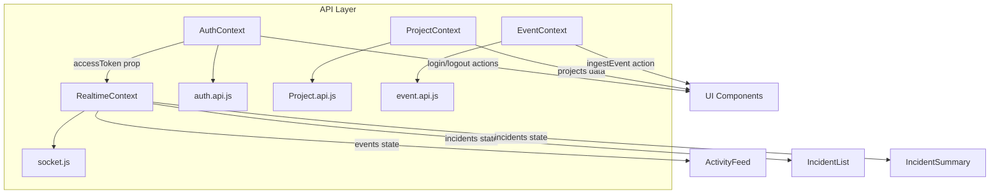
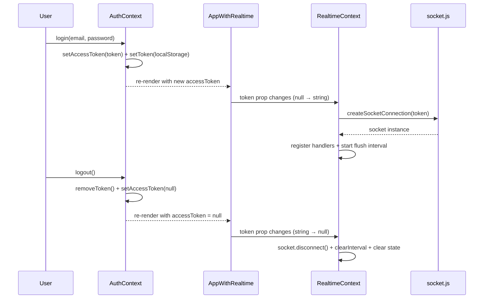
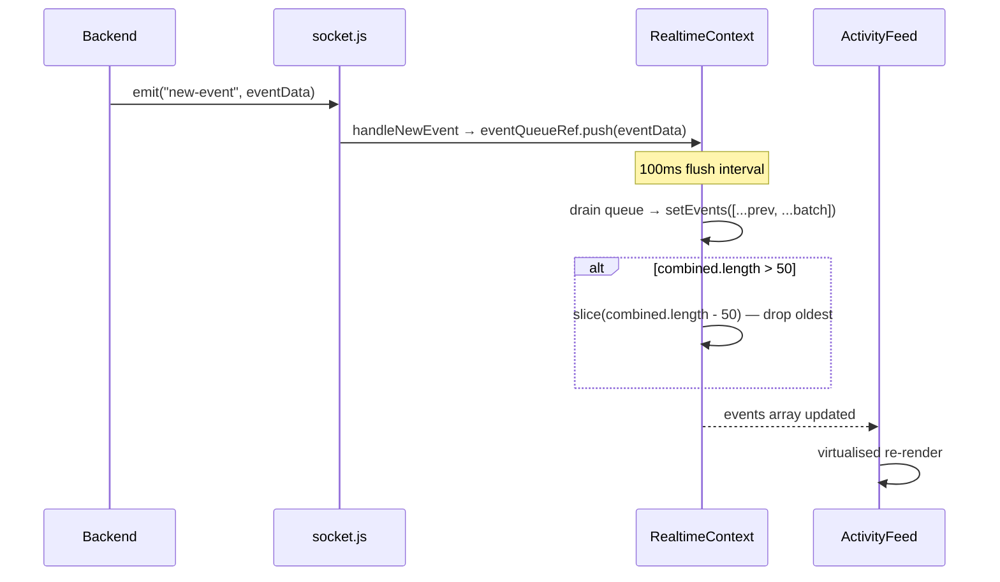

# APILogs Frontend — Context Layer Documentation

> **Source of truth:** All claims verified directly from source code in `frontend/src/context/` and immediate dependencies (`App.jsx`, `services/socket.js`, `api/` files, `utils/token.js`). No behavior is assumed or invented.

---

## Table of Contents

1. [Architecture Overview](#1-architecture-overview)
2. [Provider Composition — App.jsx](#2-provider-composition--appjsx)
3. [AuthContext.jsx](#3-authcontextjsx)
4. [Project.Context.jsx](#4-projectcontextjsx)
5. [EventContext.jsx](#5-eventcontextjsx)
6. [RealTimeContext.jsx](#6-realtimecontextjsx)
7. [Dependency: services/socket.js](#7-dependency-servicessocketjs)
8. [Context Value Reference Table](#8-context-value-reference-table)
9. [Inter-Context Dependencies](#9-inter-context-dependencies)
10. [State Lifecycle Diagrams](#10-state-lifecycle-diagrams)
11. [Error Handling Model Per Context](#11-error-handling-model-per-context)
12. [Security Notes](#12-security-notes)
13. [Documentation Discrepancies and Bugs](#13-documentation-discrepancies-and-bugs)
14. [Unverified Assumptions](#14-unverified-assumptions)
15. [Interview Preparation Notes](#15-interview-preparation-notes)

---

## 1. Architecture Overview

The `frontend/src/context/` folder implements React's Context API for **global application state**. Each context owns a specific domain:

| Context | Domain | Persisted? |
|---|---|---|
| `AuthContext` | User authentication, session, tokens | `localStorage` (access token) |
| `ProjectContext` | User's projects list | React state only |
| `EventContext` | Event ingestion action + loading/error state | React state only |
| `RealtimeContext` | WebSocket connection, live events, live incidents | React state + Socket.IO |

All four contexts are **provided at the app root** in `App.jsx`. They are available to every component in the tree.

**Pattern:** Each context file exports:
- A `Context` object (`createContext`)
- A `Provider` component (wraps children, holds state and actions)
- A custom hook `use<Name>()` that reads the context and throws if used outside the provider

---

## 2. Provider Composition — `App.jsx`

```jsx
const App = () => (
  <BrowserRouter>
    <AuthProvider>
      <ProjectProvider>
        <EventProvider>
          <AppWithRealtime />   {/* reads accessToken from AuthContext */}
        </EventProvider>
      </ProjectProvider>
    </AuthProvider>
  </BrowserRouter>
);

const AppWithRealtime = () => {
  const { accessToken } = useAuth();
  return (
    <RealtimeProvider token={accessToken}>
      <AppRoutes />
    </RealtimeProvider>
  );
};
```

### Provider order (outermost to innermost)

```
BrowserRouter
  └─ AuthProvider          (owns session state)
       └─ ProjectProvider  (owns projects list)
            └─ EventProvider (owns ingestion state)
                 └─ AppWithRealtime
                      └─ RealtimeProvider (receives token from AuthContext)
                           └─ AppRoutes
```

### Critical dependency: `AppWithRealtime`

`RealtimeProvider` is not placed directly in the provider tree — it is wrapped in `AppWithRealtime`, a component that calls `useAuth()` to read `accessToken`, then passes it as the `token` prop to `RealtimeProvider`. This is the **bridge** between `AuthContext` and `RealtimeContext`:
- When the user logs in → `accessToken` is set → `RealtimeProvider` receives a non-null `token` → Socket.IO connects.
- When the user logs out → `accessToken` is cleared → `RealtimeProvider` receives `null/undefined` → Socket.IO disconnects.

> **Note:** `console.log("AppWithRealtime accessToken:", accessToken)` is left in production code.

---

## 3. `AuthContext.jsx`

### 3.1 Purpose

Manages user authentication state: session restoration on page load, login, registration, email verification, and logout.

### 3.2 Imports

| Import | Source | Purpose |
|---|---|---|
| `React`, `createContext`, `useContext`, `useEffect`, `useState` | `react` | Context and hooks |
| `loginUser`, `registerUser`, `verifyEmailOtp`, `logoutEverywhere` | `../api/auth.api` | API calls |
| `setToken`, `getToken`, `removeToken` | `../utils/token` | `localStorage` access |

### 3.3 State

| State | Initial Value | Purpose |
|---|---|---|
| `user` | `null` | Authenticated user object (set after login) |
| `accessToken` | `getToken()` | JWT access token read from `localStorage` on mount |
| `loading` | `true` | Blocks child rendering until session check completes |

### 3.4 Session Restoration (`useEffect`)

```js
useEffect(() => {
    const initAuth = async () => {
        if (!accessToken) { setLoading(false); return; }
        // Token exists in localStorage — skip server refresh, just mark as loaded
        setLoading(false);
    };
    initAuth();
}, []);
```

Runs once on mount. Two paths:
- **No token in localStorage** → immediately sets `loading = false`. User is unauthenticated.
- **Token exists** → sets `loading = false` without calling the server. The token is assumed valid.

> **Important:** `refreshToken()` is **never called** here. The comment says: *"We are not persisting a refresh token yet, so skip server refresh."* This means if a user's access token has expired but a valid refresh token cookie exists, the frontend does not attempt to renew it. The user will silently receive 401 errors on protected calls.

Until `loading` is `false`, `{!loading && children}` prevents the app from rendering, blocking the UI during the session check.

### 3.5 Exported Actions

#### `login(payload)`

```js
const login = async (payload) => {
    const data = await loginUser(payload);  // POST /api/auth/login
    setAccessToken(data.accessToken);
    setToken(data.accessToken);             // write to localStorage
    setUser(data.user);
    return data;
};
```

1. Calls `loginUser` → receives `{ accessToken, user, ... }`.
2. Stores `accessToken` in React state AND `localStorage`.
3. Stores `user` in React state.
4. Returns `data` to the caller.
5. Errors propagate — not caught here, caller must handle.

#### `register(payload)`

```js
const register = async (payload) => {
    return await registerUser(payload);    // POST /api/auth/register
};
```

Pure pass-through. No state changes. Returns raw response. Errors propagate.

#### `verifyEmail(payload)`

```js
const verifyEmail = async (payload) => {
    return await verifyEmailOtp(payload); // POST /api/auth/verify/confirm
};
```

Pure pass-through. No state changes. Returns raw response. Errors propagate.

#### `logout()`

```js
const logout = async () => {
    try {
        if (accessToken) {
            await logoutEverywhere(accessToken); // POST /api/auth/logout-everywhere
        }
    } finally {
        removeToken();          // clear localStorage
        setAccessToken(null);   // clear React state
        setUser(null);
    }
};
```

Uses `finally` to guarantee local cleanup even if the server call fails. The access token is explicitly passed to `logoutEverywhere()` (the auth.api function does not use an interceptor).

#### `loginwithTokens(data)`

```js
const loginwithTokens = (data) => {
    setAccessToken(data.accessToken);
    setToken(data.accessToken);
    setUser(data.user || null);
};
```

Non-async. Sets state and `localStorage` directly from a data object — used after OTP login flow where the token is already available in the component without a new `login()` call.

### 3.6 Context Value Exposed

| Key | Type | Description |
|---|---|---|
| `user` | object \| null | Authenticated user data (from login response) |
| `accessToken` | string \| null | Current JWT access token |
| `loading` | boolean | Session restoration in progress |
| `isAuthenticated` | boolean | `!!accessToken` — true if token exists |
| `login` | function | Login with email/password |
| `register` | function | Register new user |
| `verifyEmail` | function | Verify email OTP |
| `logout` | function | Logout (server + local cleanup) |
| `loginwithTokens` | function | Set tokens directly (used after OTP login) |

### 3.7 Custom Hook

```js
export const useAuth = () => useContext(AuthContext);
```

**No guard** — returns `null` if used outside `AuthProvider` (because `createContext(null)` was used). Unlike other contexts, it doesn't throw — callers must handle the `null` case.

### 3.8 Interview Explanation

> "AuthContext is the session manager. It reads the access token from localStorage on startup and skips server-side token refresh. Login stores the token both in React state and localStorage. Logout uses a `finally` block to guarantee the local session is cleared even if the server isn't reachable. `isAuthenticated` is derived from the token's existence — `!!accessToken`."

---

## 4. `Project.Context.jsx`

### 4.1 Purpose

Manages the list of the authenticated user's projects. Provides fetch and create actions that interact with the backend API.

### 4.2 Imports

| Import | Source | Purpose |
|---|---|---|
| `React`, `useContext`, `createContext`, `useState` | `react` | Context and hooks |
| `createProjectApi`, `listOfProjectApi`, `projectrotatekey` | `../api/Project.api` | Project API calls |

> **Note:** `projectrotatekey` is imported but **never used** in any exported action. Dead import.

### 4.3 State

| State | Initial Value | Purpose |
|---|---|---|
| `projects` | `[]` | Array of the user's project objects |
| `loading` | `false` | True while `fetchProjects` is running |
| `error` | `null` | Last error message string |

### 4.4 Exported Actions

#### `fetchProjects()`

```js
const fetchProjects = async () => {
    setLoading(true); setError(null);
    const res = await listOfProjectApi();    // GET /api/project/list
    setProjects(res.Projects || res || []);  // handle two possible response shapes
    // ...
};
```

Steps:
1. Sets `loading = true`, clears `error`.
2. Calls `listOfProjectApi()` → `GET /api/project/list`.
3. Response normalization: `res.Projects || res || []` — handles both `{ Projects: [...] }` and a bare array.
4. On error: logs to console, sets `error = err.message`, sets `projects = []`.
5. `finally`: sets `loading = false`.

> **Known backend bug:** `GET /api/project/list` has `ValidateProject` Joi middleware applied — this endpoint always returns 400 because GET requests have no body. `fetchProjects()` will always throw in production.

#### `createProject(data)`

```js
const createProject = async (data) => {
    setError(null);
    const res = await createProjectApi(data);   // POST /api/project/create
    const newProject = res.project || res;
    setProjects((prev) => [newProject, ...prev]); // prepend to list
    return { success: true, data: newProject };
    // on error:
    setError(err.message || "Failed to create project");
    return { success: false, error: err.message };
};
```

Steps:
1. Clears `error`.
2. Calls `createProjectApi(data)` → `POST /api/project/create`.
3. Response normalization: `res.project || res` — handles `{ project: {...} }` or a bare object.
4. Prepends the new project to the existing `projects` array.
5. Returns `{ success: true, data: newProject }` on success.
6. On error: sets `error`, returns `{ success: false, error: err.message }`.
7. **Errors are caught** — `createProject` never throws. Callers must check the `success` flag.

> **No `setLoading` in `createProject`** — unlike `fetchProjects`, there is no loading state management for project creation. The `loading` state in context will remain `false` during a create call.

### 4.5 Context Value Exposed

| Key | Type | Description |
|---|---|---|
| `projects` | array | List of user's project objects |
| `loading` | boolean | True while fetching projects |
| `error` | string \| null | Last error message |
| `fetchProjects` | function | Load/refresh projects from backend |
| `createProject` | function | Create a new project and prepend to list |

> **Note:** `projectrotatekey` is imported but not exposed in the context value. API key rotation functionality is not accessible via context.

### 4.6 Custom Hook

```js
export const useProject = () => {
    const context = useContext(ProjectContext);
    if (!context) throw new Error('useProject must be used within a ProjectProvider');
    return context;
};
```

Throws if used outside `ProjectProvider`.

### 4.7 Interview Explanation

> "ProjectContext owns the projects list. It provides `fetchProjects` which calls the list API and normalises two possible response shapes, and `createProject` which posts to the backend and optimistically prepends the result to the local list. Errors are returned as objects rather than thrown, so callers check a `success` flag instead of using try/catch."

---

## 5. `EventContext.jsx`

### 5.1 Purpose

Manages the event ingestion action with shared loading/error/success feedback state. Unlike other contexts, it does not maintain a list of events — that is `RealtimeContext`'s responsibility. `EventContext` purely handles the network action and its transient UI state.

### 5.2 Imports

| Import | Source | Purpose |
|---|---|---|
| `React`, `createContext`, `useContext`, `useState` | `react` | Context and hooks |
| `ingestEvent as ingestEventApi` | `../api/event.api` | Event ingestion API call |

### 5.3 State

| State | Initial Value | Purpose |
|---|---|---|
| `loading` | `false` | True while `ingestEvent` is in-flight |
| `error` | `null` | Error message string |
| `success` | `null` | Success message string |

### 5.4 Exported Actions

#### `ingestEvent(projectId, data)`

```js
const ingestEvent = async (projectId, data) => {
    setLoading(true); setError(null); setSuccess(null);
    const response = await ingestEventApi(projectId, data);
    setSuccess("Event ingested successfully");
    return response;
    // on error:
    const message =
        err.response?.data?.message ||
        (Array.isArray(err.response?.data?.error) ? err.response.data.error[0] : undefined) ||
        "Failed to ingest event";
    setError(message);
    throw err;   // re-throws! caller must catch
};
```

Steps:
1. Sets `loading = true`, clears `error` and `success`.
2. Calls `ingestEventApi(projectId, data)` → `POST /api/events/ingest/:projectId`.
3. On success: sets `success = "Event ingested successfully"`, returns the response.
4. On error: extracts message from three possible response shapes (in priority order):
   - `err.response.data.message` (string)
   - `err.response.data.error[0]` (first item of an errors array)
   - `"Failed to ingest event"` (fallback)
5. Sets `error = message`.
6. **Re-throws the error** — unlike `createProject`, this does NOT swallow the error. Callers must catch.
7. `finally`: sets `loading = false`.

> **Known API bug:** `ingestEvent` in `event.api.js` sends a Bearer JWT header but the backend endpoint requires `x-api-key`. This action will always fail with 401 in production from the browser.

### 5.5 Context Value Exposed

| Key | Type | Description |
|---|---|---|
| `ingestEvent` | function | Ingest an event (throws on error) |
| `loading` | boolean | True while ingestion is in flight |
| `error` | string \| null | Last error message |
| `success` | string \| null | Success message |
| `setError` | function | Manually clear/set error (e.g., `setError(null)`) |
| `setSuccess` | function | Manually clear/set success |

`setError` and `setSuccess` are exposed directly so consumers can dismiss messages without triggering a new API call.

### 5.6 Custom Hook

```js
export const useEvent = () => {
    const context = useContext(EventContext);
    if (context === undefined) throw new Error("useEvent must be used within an EventProvider");
    return context;
};
```

Uses `=== undefined` check (since `createContext()` was called with no default, the initial value is `undefined`). Throws if used outside the provider.

### 5.7 Interview Explanation

> "EventContext wraps the event ingestion API call with shared loading, error, and success state so any component in the tree can trigger an ingest and display feedback without managing its own state. It re-throws errors after setting the error state, so callers can decide how to handle it further. The `setError` and `setSuccess` setters are exposed so the UI can dismiss messages."

---

## 6. `RealTimeContext.jsx`

### 6.1 Purpose

The most complex context. Manages the **Socket.IO WebSocket connection** and maintains the live stream of events and incident updates. It is the real-time backbone of the dashboard.

### 6.2 Imports

| Import | Source | Purpose |
|---|---|---|
| `React`, `createContext`, `useContext`, `useEffect`, `useRef`, `useState`, `useCallback` | `react` | Context and hooks |
| `createSocketConnection` | `../services/socket` | Creates and returns a configured Socket.IO instance |

### 6.3 Constants

| Constant | Value | Purpose |
|---|---|---|
| `MAX_EVENTS` | `50` | Maximum number of events to keep in state |
| `FLUSH_INTERVAL` | `100` | Milliseconds between event queue flushes |

### 6.4 Props

| Prop | Type | Required | Purpose |
|---|---|---|---|
| `children` | ReactNode | Yes | Child components |
| `token` | string \| null | Yes | JWT access token for Socket.IO authentication |

### 6.5 State and Refs

| Name | Type | Purpose |
|---|---|---|
| `events` (state) | array | Capped live event list (max 50) — drives `ActivityFeed` |
| `incidents` (state) | array | Live incident list — drives incident components |
| `socketRef` (ref) | `Socket \| null` | The active Socket.IO socket instance |
| `eventQueueRef` (ref) | array | Buffer for incoming events before flush |
| `flushIntervalRef` (ref) | `IntervalID \| null` | Reference to the batching interval |

### 6.6 Core Effect — WebSocket Lifecycle (`useEffect` on `[token]`)

This is the central effect. It runs whenever `token` changes.

**When `token` is falsy (null/undefined):**
```js
if (!token) {
    socketRef.current?.disconnect();
    socketRef.current = null;
    eventQueueRef.current = [];
    setEvents([]);
    setIncidents([]);
    return;
}
```
Disconnects any existing socket and clears all state. This handles logout.

**When `token` is truthy:**

1. `createSocketConnection(token)` → creates a new Socket.IO client (see [Section 7](#7-dependency-servicessocketjs)).
2. Registers `"new-event"` handler:
   ```js
   socket.on("new-event", (eventData) => {
       eventQueueRef.current.push(eventData); // buffer, don't setState yet
   });
   ```
   Events go into a queue — NOT directly into React state. This prevents one `setState` call per WebSocket message.

3. Registers `"incident-updated"` handler:
   ```js
   socket.on("incident-updated", (incidentData) => {
       setIncidents((prev) => {
           const filtered = prev.filter(i => i._id !== incidentData._id);
           return [incidentData, ...filtered];
       });
   });
   ```
   Incident updates go **directly into state** (no queue). The updated incident is placed at the front, replacing any existing version with the same `_id`.

4. Starts the flush interval:
   ```js
   setInterval(() => {
       if (eventQueueRef.current.length === 0) return;
       const batch = eventQueueRef.current;
       eventQueueRef.current = [];           // reset queue atomically
       setEvents((prev) => {
           const combined = [...prev, ...batch];
           if (combined.length > MAX_EVENTS) {
               return combined.slice(combined.length - MAX_EVENTS); // keep newest 50
           }
           return combined;
       });
   }, FLUSH_INTERVAL);
   ```
   Every 100ms: if the queue has events, drain it into state. If the combined array exceeds 50, trim the oldest events from the front (`slice(combined.length - MAX_EVENTS)` keeps the last 50).

**Cleanup function (returned from `useEffect`):**
```js
return () => {
    socket.off("new-event", handleNewEvent);
    socket.off("incident-updated", handleIncidentUpdate);
    socket.disconnect();
    socketRef.current = null;
    clearInterval(flushIntervalRef.current);
    flushIntervalRef.current = null;
    eventQueueRef.current = [];
};
```
Removes event listeners, disconnects the socket, clears the interval, and empties the queue. Runs when `token` changes or component unmounts.

### 6.7 Exported Actions (all `useCallback`)

#### `initializeEvents(initialEvents)`

```js
setEvents(initialEvents || []);
```
Replaces the events array entirely. Called by `useRealtime` hook after fetching historical events from the REST API.

#### `initializeIncidents(initialIncidents)`

```js
setIncidents(initialIncidents || []);
```
Replaces the incidents array entirely. Called when loading initial project incidents.

#### `prependEvents(olderEvents)`

```js
setEvents((prev) => {
    const existingIds = new Set(prev.map(e => e._id));
    const filtered = olderEvents.filter(e => !existingIds.has(e._id));
    const combined = [...filtered, ...prev];
    if (combined.length > MAX_EVENTS) return combined.slice(0, MAX_EVENTS);
    return combined;
});
```
Prepends older events (loaded via scroll-up pagination) to the front of the array, **deduplicating by `_id`**. When combined length exceeds 50, the **newest events from the end are dropped** (`slice(0, MAX_EVENTS)` keeps only the first/oldest 50). This is the inverse of the live-event trimming.

#### `subscribeToProject(projectId)`

```js
if (socketRef.current && projectId) {
    setEvents([]);
    eventQueueRef.current = [];
    socketRef.current.emit("subscribe", { projectId });
}
```
Clears the current events and queue, then emits `"subscribe"` to the backend socket server. The backend socket manager joins the socket to room `project:<projectId>`.

#### `unsubscribeFromProject(projectId)`

```js
socketRef.current.emit("unsubscribe", { projectId });
```
Emits `"unsubscribe"` to leave the Socket.IO room. Does not clear events.

#### `clearEvents()`

```js
setEvents([]);
eventQueueRef.current = [];
```
Clears both state and queue.

### 6.8 Context Value Exposed

| Key | Type | Description |
|---|---|---|
| `events` | array | Current live event array (max 50) |
| `incidents` | array | Current live incident array |
| `subscribeToProject` | function | Subscribe to a project's real-time room |
| `unsubscribeFromProject` | function | Unsubscribe from a project room |
| `clearEvents` | function | Empty the events array |
| `initializeEvents` | function | Replace events with a new array |
| `initializeIncidents` | function | Replace incidents with a new array |
| `prependEvents` | function | Add older events to the front, deduplicated |

### 6.9 Custom Hook

```js
export const useRealtimeContext = () => {
    const context = useContext(RealtimeContext);
    if (!context) throw new Error("useRealtimeContext must be used inside RealtimeProvider");
    return context;
};
```

Throws if used outside the provider.

### 6.10 Interview Explanation

> "RealtimeContext manages the WebSocket lifecycle. It creates a Socket.IO connection when the user is authenticated and destroys it on logout by watching the `token` prop. Incoming events are batched in a queue and flushed into React state every 100ms to prevent re-renders on every single WebSocket message. The events array is capped at 50 to bound memory usage. Incident updates bypass the queue and go directly into state because they're infrequent and contain the full updated document."

---

## 7. Dependency: `services/socket.js`

**Used by:** `RealTimeContext` via `createSocketConnection(token)`.

```js
export const createSocketConnection = (token) => {
    if (!token) throw new Error("Socket connection require authentication token");

    const socket = io(import.meta.env.VITE_Backend_URL, {
        transports: ["websocket"],  // WebSocket only, no HTTP long-polling fallback
        auth: { token: token },     // sent in socket.handshake.auth.token on backend
        reconnection: true,
        reconnectionAttempts: 5,
        reconnectionDelay: 2000,
    });

    socket.on("connect", () => console.log("Socket connected:", socket.id));
    socket.on("disconnect", (reason) => console.log("Socket disconnected:", reason));
    socket.on("connect_error", (err) => console.error("Socket connection error:", err.message));

    return socket;
};
```

| Config | Value | Effect |
|---|---|---|
| `transports: ["websocket"]` | WebSocket only | Skips HTTP polling fallback — faster but fails on networks that block WebSocket |
| `auth: { token }` | JWT access token | Backend reads from `socket.handshake.auth.token` for authentication |
| `reconnection: true` | Auto-reconnect enabled | Socket will attempt to reconnect on disconnect |
| `reconnectionAttempts: 5` | Max 5 retries | After 5 failed attempts, gives up |
| `reconnectionDelay: 2000` | 2 seconds between retries | Total max reconnect window: ~10 seconds |

---

## 8. Context Value Reference Table

| Context | Hook | Throws if outside? | Key values |
|---|---|---|---|
| `AuthContext` | `useAuth()` | No (returns null) | `user`, `accessToken`, `isAuthenticated`, `loading`, `login`, `logout`, `register`, etc. |
| `ProjectContext` | `useProject()` | Yes | `projects`, `loading`, `error`, `fetchProjects`, `createProject` |
| `EventContext` | `useEvent()` | Yes | `ingestEvent`, `loading`, `error`, `success`, `setError`, `setSuccess` |
| `RealtimeContext` | `useRealtimeContext()` | Yes | `events`, `incidents`, `subscribeToProject`, `unsubscribeFromProject`, `clearEvents`, `initializeEvents`, `initializeIncidents`, `prependEvents` |

---

## 9. Inter-Context Dependencies



- `RealtimeContext` depends on `AuthContext` indirectly (via `AppWithRealtime` which reads `accessToken`).
- `ProjectContext`, `EventContext`, and `RealtimeContext` are siblings — they do not read from each other.
- `RealtimeContext` is the only context that manages WebSocket state; all others are REST-based.

---

## 10. State Lifecycle Diagrams

### Authentication + Realtime Connection



### Live Event Flow



---

## 11. Error Handling Model Per Context

| Context | How errors are handled | Caller must catch? |
|---|---|---|
| `AuthContext.login` | Not caught — propagates | ✅ Yes |
| `AuthContext.register` | Not caught — propagates | ✅ Yes |
| `AuthContext.verifyEmail` | Not caught — propagates | ✅ Yes |
| `AuthContext.logout` | Server call in try, cleanup in `finally` | ❌ No |
| `ProjectContext.fetchProjects` | Caught — sets `error` state, swallows | ❌ No |
| `ProjectContext.createProject` | Caught — sets `error`, returns `{success:false}` | ❌ No |
| `EventContext.ingestEvent` | Caught — sets `error`, then re-throws | ✅ Yes |
| `RealtimeContext` | No try/catch — Socket.IO errors logged to console | ❌ (async events) |

---

## 12. Security Notes

| Topic | Detail |
|---|---|
| **Token storage** | `AuthContext` stores the JWT access token in `localStorage` via `setToken()`. Vulnerable to XSS. |
| **Token in socket** | `createSocketConnection(token)` passes the JWT in `socket.handshake.auth.token`. This is sent during the WebSocket handshake (before the connection upgrades), not in subsequent messages. |
| **Logout cleanup** | `AuthContext.logout()` uses `finally` to guarantee `removeToken()` runs even if the server call fails. However, it does not clear `user` from state in the error path before `finally` runs — `finally` handles it. |
| **RealtimeContext token guard** | When `token` is null/falsy, the socket is disconnected and all live data is cleared. This prevents stale data after logout. |
| **No token refresh** | Expired tokens are not automatically refreshed. This means the socket connection will fail on reconnect after token expiry. |

---

## 13. Documentation Discrepancies and Bugs

| # | File | Issue |
|---|---|---|
| B1 | `AuthContext.jsx` line 12 + `App.jsx` line 12 | `console.log` statements left in production code. `AuthContext` logs `initAuth` calls; `App.jsx` logs `accessToken` on every render of `AppWithRealtime`. |
| B2 | `AuthContext.jsx` lines 19–33 | `refreshToken()` is never called. Token refresh is implemented in `auth.api.js` but not wired into session restoration. Expired tokens cause silent 401 failures. |
| B3 | `Project.Context.jsx` line 2 | `projectrotatekey` is imported from `Project.api.js` but never used. Dead import. |
| B4 | `Project.Context.jsx` line 28 | `createProject` has no `setLoading(true)` or `setLoading(false)` — the `loading` state remains `false` during project creation. No loading indicator is possible for creation. |
| B5 | `Project.Context.jsx` line 17 | `res.Projects || res || []` — the response normalisation checks both `res.Projects` (capital P) and bare array. The actual backend response key must be verified to know which path is taken in production. |
| B6 | `EventContext.jsx` (entire) | `ingestEvent` calls `event.api.js:ingestEvent` which sends a Bearer JWT to an endpoint that requires `x-api-key`. This context action cannot succeed in the browser. |
| B7 | `RealTimeContext.jsx` line 27 | `console.log("connection token", token)` logs the JWT to the browser console on every connection — a security-visible credential log. |
| B8 | `AuthContext.jsx` line 80 | The comment at line 72 documents a previous bug (`!accessToken` instead of `!!accessToken`). The fix is applied, but the now-stale bug documentation comment remains. |

---

## 14. Unverified Assumptions

| Assumption | Reason |
|---|---|
| Backend response shape for projects | `res.Projects` vs bare array — actual backend response key was not re-read from this context. The project API was documented separately. |
| `user` object shape | `AuthContext` stores `data.user` from login, but the fields on that object (id, email, username) were not verified from this file alone. |
| `incidents` array populated by whom | `initializeIncidents` is exported but not called here. A parent component or hook must call it. Not confirmed which. |
| WebSocket reconnection after token expiry | After 5 reconnection attempts fail, Socket.IO stops. There is no app-level handler to detect this and prompt re-login. |

---

## 15. Interview Preparation Notes

### Q: How are all four contexts wired together in the app?

`App.jsx` wraps the whole tree in `AuthProvider → ProjectProvider → EventProvider` then renders `AppWithRealtime`, which reads `accessToken` from `AuthContext` and passes it as the `token` prop to `RealtimeProvider`. This makes `RealtimeContext` react to auth state changes — connecting the socket on login and disconnecting on logout.

### Q: Why is `RealtimeContext` not placed directly in the provider tree?

Because `RealtimeProvider` needs the `accessToken` from `AuthContext`. A component cannot consume a context that is its own ancestor. `AppWithRealtime` is a bridge component that reads from `AuthContext` and passes the token as a prop to `RealtimeProvider`.

### Q: How does the 100ms event queue in `RealtimeContext` work?

Incoming `"new-event"` WebSocket messages push data into a ref-based queue (`eventQueueRef`) rather than calling `setState` directly. A `setInterval` running every 100ms drains the queue and calls `setEvents` once with the entire batch. This coalesces rapid bursts of events into a single React re-render, preventing performance issues during high-throughput ingestion.

### Q: Why is the events array capped at 50 and how is the cap enforced?

`MAX_EVENTS = 50` prevents unbounded memory growth in the browser. When a flush batch would push the total over 50, the combined array is sliced: `combined.slice(combined.length - MAX_EVENTS)` keeps only the newest 50 events. For `prependEvents` (loading older events), the opposite is done: `combined.slice(0, MAX_EVENTS)` keeps the oldest 50 and drops the newest.

### Q: What happens to the WebSocket when the user logs out?

`AuthContext.logout()` sets `accessToken` to `null` in state and removes it from `localStorage`. `AppWithRealtime` re-renders and passes `null` as the `token` prop to `RealtimeProvider`. The `useEffect` in `RealtimeContext` fires because `token` changed, detects the falsy token, calls `socket.disconnect()`, clears the interval, and sets `events` and `incidents` to empty arrays.

### Q: What is the difference in error handling between `createProject` and `ingestEvent`?

`createProject` swallows errors — it catches them, sets the error state, and returns `{ success: false, error: "..." }`. Callers don't use try/catch; they check the return value. `ingestEvent` propagates errors — it catches them, sets the error state, then re-throws with `throw err`. Callers must use try/catch. This difference means components using `ingestEvent` need to handle the error themselves even though the context already records it.

---

*Last updated: 2026-09-16. All documentation is based on direct source code inspection of `frontend/src/context/` and immediate dependencies. No behavior is assumed or invented.*
