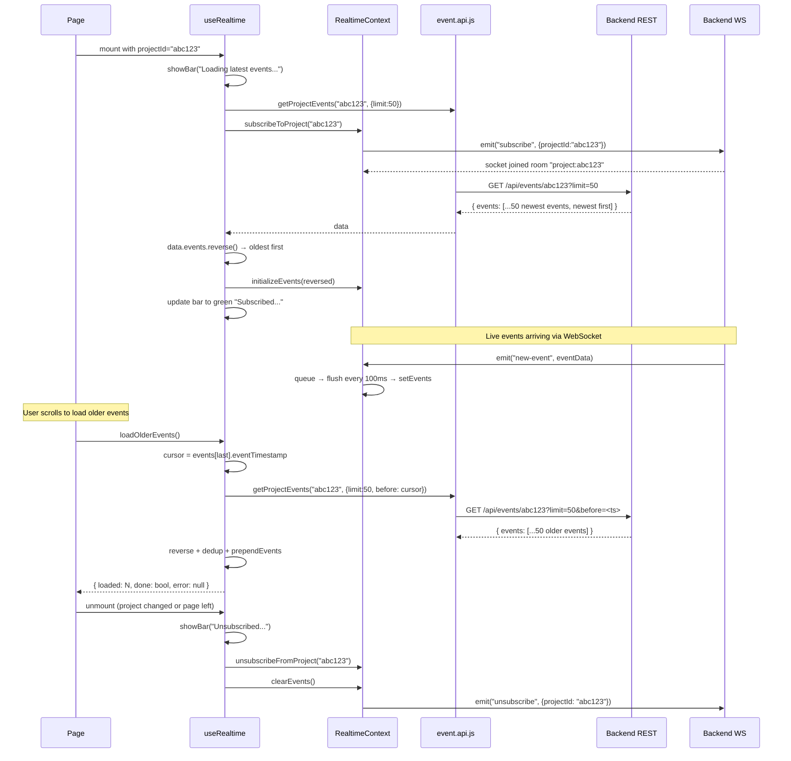

# APILogs Frontend — Custom Hooks Documentation

> **Source of truth:** All claims verified directly from source code in `frontend/src/hooks/` and immediate dependencies (`context/RealTimeContext.jsx`, `api/event.api.js`). No behavior is assumed or invented.

---

## Table of Contents

1. [Architecture Overview](#1-architecture-overview)
2. [File Index](#2-file-index)
3. [useRealtime.jsx](#3-userealtimejsx)
   - 3.1 [Purpose](#31-purpose)
   - 3.2 [Imports and Dependencies](#32-imports-and-dependencies)
   - 3.3 [Parameters](#33-parameters)
   - 3.4 [Internal Function: `loadOlderEvents`](#34-internal-function-loadolderevents)
   - 3.5 [Core Effect: Project Subscription Lifecycle](#35-core-effect-project-subscription-lifecycle)
   - 3.6 [Helper: `showBar`](#36-helper-showbar)
   - 3.7 [Return Value](#37-return-value)
   - 3.8 [Dependency Arrays Explained](#38-dependency-arrays-explained)
4. [Complete Execution Flow](#4-complete-execution-flow)
5. [UI Notification System](#5-ui-notification-system)
6. [How `useRealtime` Fits Into the Larger System](#6-how-userealtime-fits-into-the-larger-system)
7. [Race Condition and Edge Case Analysis](#7-race-condition-and-edge-case-analysis)
8. [Documentation Discrepancies and Bugs](#8-documentation-discrepancies-and-bugs)
9. [Unverified Assumptions](#9-unverified-assumptions)
10. [Interview Preparation Notes](#10-interview-preparation-notes)

---

## 1. Architecture Overview

The `frontend/src/hooks/` folder contains custom React hooks — reusable stateful logic that can be shared across components. Currently there is exactly **one custom hook**:

```
hooks/
├── useRealtime.jsx   ← Project subscription + event history + pagination
└── hooks.md          ← This file
```

`useRealtime` is the **orchestration hook** for real-time project data. It bridges two concerns:
1. **REST history load** — Fetching initial events from the backend REST API when a project is selected.
2. **WebSocket subscription** — Subscribing the Socket.IO room for live updates via `RealtimeContext`.

It is consumed by pages/components that display a live event feed for a specific project.

---

## 2. File Index

| File | Default Export | Purpose |
|---|---|---|
| `useRealtime.jsx` | `useRealtime(projectId)` | Manages per-project subscription, history loading, and older event pagination |

---

## 3. `useRealtime.jsx`

### 3.1 Purpose

`useRealtime` encapsulates the complete lifecycle of viewing a project's event stream:

- On mount (or `projectId` change): load the 50 most recent events from REST, initialize them in context, then emit a WebSocket `"subscribe"` event.
- While mounted: live events arrive via WebSocket → `RealtimeContext` handles buffering → `ActivityFeed` renders them.
- On demand: caller can invoke `loadOlderEvents()` to paginate backwards in time.
- On unmount (or `projectId` change): emit WebSocket `"unsubscribe"`, clear events.

### 3.2 Imports and Dependencies

| Import | Source | Purpose |
|---|---|---|
| `useEffect`, `useCallback` | `react` | Effect lifecycle and memoized callback |
| `useRealtimeContext` | `../context/RealTimeContext` | Socket actions and event state |
| `getProjectEvents` | `../api/event.api` | `GET /api/events/:projectId` REST call |

### 3.3 Parameters

| Parameter | Type | Required | Description |
|---|---|---|---|
| `projectId` | string | Conditionally | The MongoDB ObjectId of the selected project. If falsy, the effect shows a warning notification and exits. |

### 3.4 Internal Function: `loadOlderEvents`

```js
const loadOlderEvents = useCallback(async () => {
    if (!projectId || !events.length) {
        return { loaded: 0, done: true, error: null };
    }

    const oldest = events[events.length - 1];  // last element = oldest in the array
    const before = oldest?.eventTimestamp;

    if (!before) {
        return { loaded: 0, done: true, error: null };
    }

    try {
        const data = await getProjectEvents(projectId, { limit: 50, before });
        const existingIds = new Set(events.map(e => e._id));
        const toPrepend = data.events
            .reverse()                              // oldest first
            .filter(e => !existingIds.has(e._id));  // dedup

        prependEvents(toPrepend);

        return {
            loaded: toPrepend.length,
            done: toPrepend.length === 0 || data.events.length < 50,
            error: null
        };
    } catch (err) {
        console.error("Failed to load older events:", err);
        return { loaded: 0, done: false, error: err };
    }
}, [projectId, events, prependEvents]);
```

#### Purpose

Loads the next batch of 50 events that occurred **before** the oldest currently displayed event. This implements **cursor-based backward pagination** using `eventTimestamp` as the cursor.

#### Step-by-step execution

1. **Guard clauses:** Returns early if no `projectId` or `events` array is empty.
2. **Cursor extraction:** `events[events.length - 1]` is the oldest event in the array (since the array is in newest-last order). Its `eventTimestamp` is used as the `before` cursor.
3. **API call:** `getProjectEvents(projectId, { limit: 50, before })` → `GET /api/events/:projectId?limit=50&before=<timestamp>`. The backend returns events older than `before`, newest first.
4. **Deduplication:** Builds a `Set` of `_id` values from the current events, filters the returned events to exclude any already present.
5. **Reverse:** `data.events.reverse()` — the backend returns newest-first; reversing gives oldest-first before prepending, so the chronological order in the array is preserved.
6. **Prepend:** `prependEvents(toPrepend)` in `RealtimeContext` adds the older events to the front of the array, capped at `MAX_EVENTS = 50`.
7. **Returns:** `{ loaded, done, error }` where:
   - `loaded`: number of new unique events added.
   - `done: true` if nothing was loaded (no more history) or if the batch was smaller than 50 (last page).
   - `done: false` if there may be more events.

#### `useCallback` dependencies: `[projectId, events, prependEvents]`

`events` is in the dependency array — this means `loadOlderEvents` is re-created every time the events array changes. Since `events` changes frequently (every flush, every new live event), this is potentially expensive. The function reference would be invalidated constantly, which matters if the parent memoizes or passes it to a child. See [Section 8](#8-documentation-discrepancies-and-bugs).

### 3.5 Core Effect: Project Subscription Lifecycle

```js
useEffect(() => {
    let isMounted = true;

    // --- Guard: no project ---
    if (!projectId) { /* show warning bar, return */ }

    // --- Feedback bar ---
    const clearBar = showBar("Loading latest events...", "...", 2000);

    // --- Load history + subscribe ---
    const loadHistoryAndSubscribe = async () => {
        try {
            clearEvents();
            const data = await getProjectEvents(projectId, { limit: 50 });
            if (!isMounted) return;      // ← stale closure guard
            const reversed = data.events.reverse();
            initializeEvents(reversed);
            setTimeout(() => {
                clearBar.textContent = `Subscribed to project ${projectId} (Live updates enabled)`;
                clearBar.className = "... bg-green-100 ...";
            }, 600);
        } catch (err) {
            showBar("Failed to load events.", "... bg-red-100 ...", 2500);
            console.error("Failed to load history:", err);
        }
    };

    loadHistoryAndSubscribe();
    subscribeToProject(projectId); // emit "subscribe" to WebSocket

    // --- Cleanup ---
    return () => {
        showBar(`Unsubscribed from project ${projectId}`, "... bg-gray-100 ...", 1500);
        isMounted = false;
        unsubscribeFromProject(projectId);
        clearEvents();
    };
}, [projectId, subscribeToProject, unsubscribeFromProject, clearEvents, initializeEvents]);
```

#### Execution order in detail

**When `projectId` is falsy:**
1. Creates a yellow warning bar DOM element, appends to `document.body`.
2. Removes it after 2500ms via `setTimeout`.
3. Returns early — no subscription, no API call.

**When `projectId` is truthy:**
1. Creates `isMounted = true` flag (stale-closure guard).
2. Shows blue "Loading latest events..." bar (auto-removes after 2000ms).
3. Calls `loadHistoryAndSubscribe()` (async, does not await).
4. **Immediately** calls `subscribeToProject(projectId)` — does **not** wait for the history load.

**Inside `loadHistoryAndSubscribe()`:**
1. `clearEvents()` — empties current events and queue in context.
2. `getProjectEvents(projectId, { limit: 50 })` → `GET /api/events/:projectId?limit=50` — fetches the 50 most recent events.
3. `if (!isMounted) return` — if the component unmounted before the API call returned, discards the result to prevent a state update on an unmounted component.
4. `data.events.reverse()` — backend returns newest-first; reversing makes the array oldest-first (index 0 = oldest, last = newest) to match `ActivityFeed`'s rendering order.
5. `initializeEvents(reversed)` — sets context events to this array.
6. After 600ms: updates the bar to green "Subscribed..." confirmation.

**On error during history load:**
- Shows red "Failed to load events." bar for 2500ms.
- Logs to console. Does not re-throw.
- Subscription is still active (WebSocket `"subscribe"` was already emitted).

**Cleanup (runs on unmount or `projectId` change):**
1. Shows gray "Unsubscribed from project..." bar for 1500ms.
2. Sets `isMounted = false`.
3. `unsubscribeFromProject(projectId)` — emits `"unsubscribe"` to Socket.IO.
4. `clearEvents()` — empties context events.

#### Order of operations: subscribe vs. load history

Note that `subscribeToProject` is called **after** `loadHistoryAndSubscribe` is invoked but **before** it completes (because `loadHistoryAndSubscribe()` is async and not awaited). This means:

```
t=0     loadHistoryAndSubscribe() invoked (starts REST call)
t=0     subscribeToProject(projectId) called (WebSocket subscribed immediately)
t=~Xms  REST response arrives → initializeEvents(reversed)
```

Between `t=0` and `t=Xms`, live WebSocket events can already arrive. The `RealtimeContext` event queue may start filling while `initializeEvents` hasn't been called yet. When `initializeEvents` replaces the events array, any queued events pending a flush will be **appended after** the history. So the ordering is: `[history events] + [any live events queued during load]`. This is the correct behavior.

### 3.6 Helper: `showBar`

```js
const showBar = (text, className, duration = 2000) => {
    const bar = document.createElement("div");
    bar.className = className;
    bar.textContent = text;
    document.body.appendChild(bar);
    setTimeout(() => { bar.remove(); }, duration);
    return bar;
};
```

**Technique:** Direct DOM manipulation inside a React component/hook. Creates a div, appends it to `document.body`, and schedules its removal. This bypasses React's virtual DOM entirely.

| Parameter | Type | Purpose |
|---|---|---|
| `text` | string | The notification text content |
| `className` | string | Tailwind CSS classes for positioning and color |
| `duration` | number | Milliseconds before auto-removal (default: 2000) |

**Returns:** the created DOM element (used by `loadHistoryAndSubscribe` to mutate the bar's content after 600ms).

**Notification styles used:**

| State | Background | Text Color | Duration |
|---|---|---|---|
| No project selected | `bg-yellow-100 border-yellow-300` | `text-yellow-900` | 2500ms |
| Loading history | `bg-blue-100 border-blue-300` | `text-blue-700` | 2000ms |
| Subscribed (success) | `bg-green-100 border-green-300` | `text-green-600` | *(bar mutated in-place)* |
| Load error | `bg-red-100 border-red-300` | `text-red-700` | 2500ms |
| Unsubscribed | `bg-gray-100 border-gray-300` | `text-gray-600` | 1500ms |

All bars share positioning: `fixed top-4 left-1/2 -translate-x-1/2 ... shadow z-50`.

### 3.7 Return Value

```js
return { loadOlderEvents };
```

The hook returns a single function. All other state (events, incidents) is accessible directly through `useRealtimeContext()` — the hook does not re-expose them.

| Returned | Type | Purpose |
|---|---|---|
| `loadOlderEvents` | async function | Load the next batch of 50 older events |

**`loadOlderEvents` return object:**

| Field | Type | Meaning |
|---|---|---|
| `loaded` | number | Count of new unique events prepended |
| `done` | boolean | `true` if no more history to load |
| `error` | Error \| null | Error instance if the API call failed, else `null` |

### 3.8 Dependency Arrays Explained

#### `loadOlderEvents` — `useCallback([projectId, events, prependEvents])`

`events` is included because the function reads `events[events.length - 1]` (the oldest event) to derive the cursor. Without it, `loadOlderEvents` would always read the initial empty array via closure. However, `events` changes on every new event arrival (every 100ms flush), causing `loadOlderEvents` to be re-created frequently. This is acceptable as long as the parent doesn't include it in a list render's `key` or `memo`.

#### Main `useEffect` — `[projectId, subscribeToProject, unsubscribeFromProject, clearEvents, initializeEvents]`

- `projectId` — triggers the full reset when a new project is selected.
- The context functions are `useCallback`-wrapped with empty `[]` deps in `RealtimeContext`, so they have stable references. They are included in the dependency array as required by the exhaustive-deps ESLint rule but won't cause re-fires in practice.

---

## 4. Complete Execution Flow



---

## 5. UI Notification System

`useRealtime` renders status notifications using direct DOM manipulation rather than React state or a toast library. This is an intentional design choice to avoid re-rendering the entire hook/component tree for transient messages.

**How it works:**
1. `document.createElement("div")` — creates the element outside React's virtual DOM.
2. `document.body.appendChild(bar)` — inserts it directly into the page body.
3. `setTimeout(() => bar.remove(), duration)` — self-destructs after the specified duration.
4. All bars are **absolutely positioned** at the top-center of the viewport via Tailwind's `fixed top-4 left-1/2 -translate-x-1/2`.

**Potential issues:**
- Multiple bars can stack if they appear before the previous one auto-removes (e.g., rapid project switching).
- No accessible ARIA roles (`role="alert"`) — screen readers may not announce the notifications.
- Bars are not removed synchronously on cleanup — a bar showing "Loading latest events..." may remain visible for its full 2000ms even if the project changes before that.
- The "Loading" bar reference `clearBar` is mutated to show "Subscribed" after 600ms. If cleanup runs before 600ms, the `setTimeout` still fires and mutates the already-removed element (no error — `clearBar` is not in the DOM, but `clearBar.textContent` can still be set on a detached node).

---

## 6. How `useRealtime` Fits Into the Larger System

```
Page/Component
    │
    ├── useRealtime(projectId)        ← this hook
    │      │
    │      ├── useRealtimeContext()   ← reads events, actions from context
    │      │      └── RealTimeContext ← socket connection, event state
    │      │
    │      └── getProjectEvents()     ← REST API for history + pagination
    │             └── event.api.js   ← GET /api/events/:projectId
    │
    └── useRealtimeContext()          ← separately in ActivityFeed
           └── events[]              ← rendered by ActivityFeed
```

`useRealtime` is the **coordinator**: it sets up the subscription and loads history. `ActivityFeed` independently reads `events` from `RealtimeContext` to render them. They don't depend on each other directly.

**Current usage status:** As documented in `components/components.md`, `useRealtime` is **imported but not called** in `ActivityFeed.jsx`. The hook call `const { loadOlderEvents } = useRealtime(projectId)` is commented out. The hook is fully implemented but its consumer hasn't activated it.

---

## 7. Race Condition and Edge Case Analysis

### Race Condition 1: Unmount before history load completes

**Scenario:** User selects a project, then immediately switches to another (or navigates away) before the `GET /api/events/:projectId` response arrives.

**Protection:** `isMounted` flag.
```js
let isMounted = true;
// ... cleanup:
isMounted = false;
// ... in loadHistoryAndSubscribe:
if (!isMounted) return;
```
If cleanup runs before the REST response arrives, `isMounted` is `false` and `initializeEvents` is not called. **This is correctly handled.**

### Race Condition 2: Rapid project switching

**Scenario:** User switches from project A → B → C rapidly.

**Each `projectId` change fires the cleanup for the previous effect AND starts a new effect.** The cleanup correctly calls `unsubscribeFromProject` and `clearEvents`. However:
- Multiple `getProjectEvents` calls may be in-flight simultaneously.
- The `isMounted` flag belongs to each effect's closure separately, so stale responses from earlier projects are discarded.
- The `showBar` DOM elements are not cleaned up on rapid switches — multiple bars may appear simultaneously.

### Race Condition 3: `loadOlderEvents` called during a flush

**Scenario:** Live events arrive (incrementing `events`), changing the cursor while `loadOlderEvents` is in-flight.

Since `loadOlderEvents` captures `events` from its closure at call time, the cursor is fixed at the moment of invocation. The deduplication step (`existingIds` set) prevents duplicates even if new live events arrived and changed the array before `prependEvents` is called.

### Edge Case: Empty `data.events` from backend

If the backend returns `{ events: [] }`:
- `data.events.reverse()` → `[]`
- `toPrepend = []` after filter
- `prependEvents([])` → no-op
- Returns `{ loaded: 0, done: true, error: null }`

**Correctly terminates pagination.**

### Edge Case: `eventTimestamp` missing on oldest event

If `oldest.eventTimestamp` is `null` or `undefined`:
```js
const before = oldest?.eventTimestamp;
if (!before) return { loaded: 0, done: true, error: null };
```
**Correctly handled** — returns `done: true`.

---

## 8. Documentation Discrepancies and Bugs

| # | Issue | Detail |
|---|---|---|
| B1 | `loadOlderEvents` dep: `events` | `events` in the `useCallback` dependency array causes the function to be re-created on every event flush (every 100ms). If `loadOlderEvents` is passed to a memoized child or stored in a ref, this frequently invalidates it. A more stable approach would use a ref for `events` inside the callback. |
| B2 | `useRealtime` imported but not called in `ActivityFeed` | The hook is functional but its primary consumer has commented out the call. The feature (load older events + auto-scroll) is disabled. |
| B3 | DOM manipulation for notifications | `showBar` uses direct DOM imperatives. Bars don't have ARIA roles, can stack on rapid project switching, and are not cleaned up on unmount. |
| B4 | `subscribeToProject` races `loadHistoryAndSubscribe` | `subscribeToProject` is called synchronously after `loadHistoryAndSubscribe()` is invoked (not awaited). Live events can arrive and be queued before `initializeEvents` replaces the array. This is mostly harmless but means the initial REST response may be immediately followed by a flush that appends WebSocket events — correct behavior, but the ordering is implicit. |
| B5 | `clearBar` mutation after cleanup | The "Subscribed" bar mutation runs in a 600ms `setTimeout`. If the hook cleans up before 600ms, the timeout still fires and mutates the detached DOM node. No visible error, but a stale closure lint warning may apply. |
| B6 | `console.error` on load failure | `loadHistoryAndSubscribe` logs errors but does not propagate them. The caller (the page) has no way to know the historical load failed except by observing that `events` remains empty. |

---

## 9. Unverified Assumptions

| Assumption | Reason |
|---|---|
| `data.events` is always an array | The hook calls `data.events.reverse()` without checking if `data.events` exists. If the backend returns a different shape, this throws. |
| Backend `before` param is an ISO date string | `eventTimestamp` is a JS `Date` (stored in MongoDB). When serialized to JSON, it becomes an ISO string. The backend must accept ISO strings as the `before` cursor. |
| `prependEvents` handles empty array | Called with `[]` when no new events — context `prependEvents` does nothing for an empty array, but this was verified from context source. |
| Which page/component actually mounts `useRealtime` | Not traced in this documentation pass. The hook is not used by `ActivityFeed` (commented out). The actual consumer must be identified in `pages/`. |

---

## 10. Interview Preparation Notes

### Q: What does `useRealtime` do and why is it a custom hook?

It encapsulates the full lifecycle of subscribing to a project's event stream: loading historical events from REST on mount, joining the WebSocket room, and providing a `loadOlderEvents` function for pagination. It's a custom hook because this logic involves `useEffect` and `useCallback`, reads from context, and calls an API function — all things that belong in a hook, not a component. By extracting it, any component that needs live project data can mount `useRealtime(projectId)` and get the same behavior without duplicating the subscription logic.

### Q: How does cursor-based pagination work in `loadOlderEvents`?

The oldest event currently in the `events` array (`events[events.length - 1]`) serves as the cursor. Its `eventTimestamp` is sent as a `before` query parameter to `GET /api/events/:projectId?limit=50&before=<timestamp>`. The backend returns events older than that timestamp. The response is reversed (backend sends newest-first, we want oldest-first for prepend), deduplicated against current IDs, and prepended via `prependEvents` in `RealtimeContext`. `done: true` is returned when no events are returned or when fewer than 50 come back.

### Q: How does `isMounted` prevent memory leaks?

`let isMounted = true` is set inside the effect closure. The cleanup function sets `isMounted = false`. The async `loadHistoryAndSubscribe` function checks `if (!isMounted) return` after the `await` resolves. If the component unmounted (or `projectId` changed) before the API responded, the check prevents calling `initializeEvents` on the stale response, which would update context state after cleanup has run.

### Q: Why does `subscribeToProject` get called before `loadHistoryAndSubscribe` completes?

`loadHistoryAndSubscribe()` is called without `await` — it runs in the background. `subscribeToProject` is called immediately after. This means the WebSocket room is joined before the REST history arrives. This is intentional: it avoids a window where the room is joined but events that arrive during the history load are missed. The `RealtimeContext` event queue captures any live events that arrive during the load, and they are appended after `initializeEvents` sets the history.

### Q: What notification UX pattern is used and what are its tradeoffs?

`showBar` renders notifications via direct DOM manipulation (`document.createElement` + `document.body.appendChild`), bypassing React entirely. This avoids re-rendering the hook consumer but means: no React lifecycle management, no ARIA accessibility attributes, no deduplication of overlapping bars, and potential memory leaks if the element holds event listeners (it doesn't). A React-based toast library would be safer and more accessible in a production app.

### Q: Why is `events` in the `useCallback` dependency array of `loadOlderEvents`?

The function reads `events[events.length - 1]` to find the oldest event for the cursor. Without `events` in the dependency array, the closure would capture the initial empty array and always read `undefined` for the cursor. The tradeoff is that `loadOlderEvents`'s reference is invalidated on every event flush (every 100ms). If it were passed as a prop to a memoized child, it would trigger re-renders frequently. A `useRef` that mirrors `events` would avoid this while keeping the cursor accurate.

---

*Last updated: 2026-09-16. All documentation is based on direct source code inspection of `frontend/src/hooks/useRealtime.jsx` and its dependencies. No behavior is assumed or invented.*
