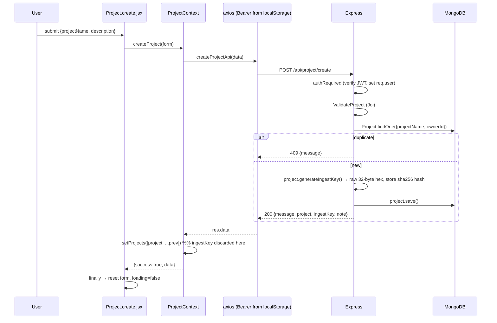
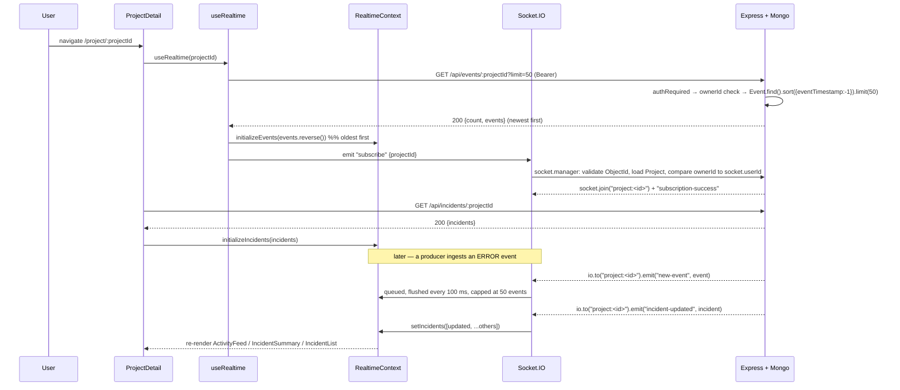
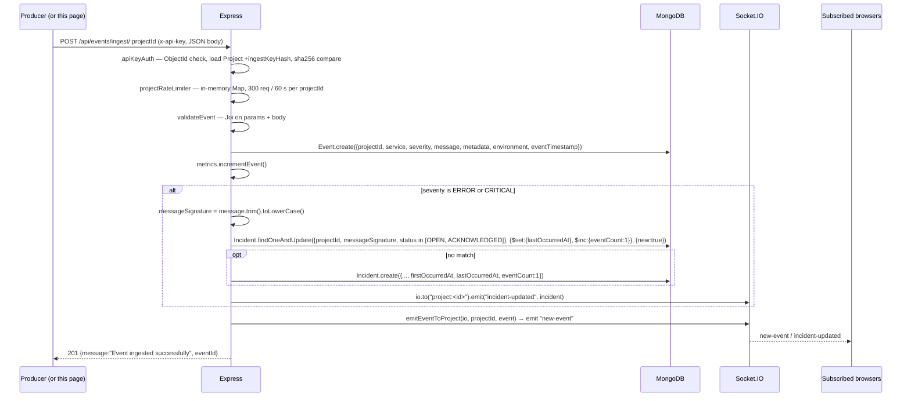
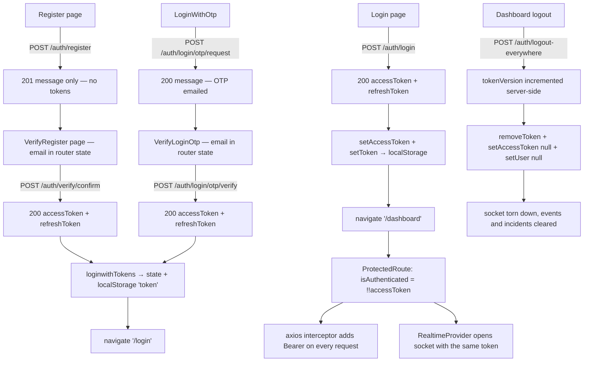

# APILogs Frontend — Pages Documentation

> **Source of truth:** every claim below was verified by reading the actual source in
> `frontend/src/pages/` and every file it depends on (routes, contexts, api layer, hooks,
> socket service, token utils) **plus** the backend routes, middleware, controllers, models
> and validators that these pages actually talk to. Nothing is assumed. Where code and
> intent disagree, the **actual** behaviour is documented and the mismatch is listed in
> [§21 Documentation Discrepancies and Bugs](#21-documentation-discrepancies-and-bugs).

---

## Table of Contents

1. [Architecture Overview](#1-architecture-overview)
2. [File Index](#2-file-index)
3. [Route and Middleware Map](#3-route-and-middleware-map)
4. [Endpoint Summary Table](#4-endpoint-summary-table)
5. [Landing.jsx](#5-landingjsx)
6. [Dashboard.jsx](#6-dashboardjsx)
7. [auth/Register.jsx](#7-authregisterjsx)
8. [auth/VerifyRegister.jsx](#8-authverifyregisterjsx)
9. [auth/Login.jsx](#9-authloginjsx)
10. [auth/LoginWithOtp.jsx](#10-authloginwithotpjsx)
11. [auth/VerifyLoginOtp.jsx](#11-authverifyloginotpjsx)
12. [project/Project.create.jsx](#12-projectprojectcreatejsx)
13. [project/Project.list.jsx](#13-projectprojectlistjsx)
14. [project/ProjectDetail.jsx](#14-projectprojectdetailjsx)
15. [Event/Event.ingest.jsx](#15-eventeventingestjsx)
16. [Authentication and Authorization Flow](#16-authentication-and-authorization-flow)
17. [Real-Time Event and Incident Flow](#17-real-time-event-and-incident-flow)
18. [Error Handling Conventions](#18-error-handling-conventions)
19. [Security Implementation Notes](#19-security-implementation-notes)
20. [Performance and Pagination Notes](#20-performance-and-pagination-notes)
21. [Documentation Discrepancies and Bugs](#21-documentation-discrepancies-and-bugs)
22. [Unverified Assumptions](#22-unverified-assumptions)
23. [Interview Preparation Notes](#23-interview-preparation-notes)

---

## 1. Architecture Overview

`frontend/src/pages/` holds every **route-level component** of the APILogs SPA. A page is the
component React Router mounts for a URL; it owns local form state, calls into a context (or,
in a few cases, straight into the api layer), and composes the reusable components from
`frontend/src/components/`.

```
pages/
├── Landing.jsx                 ← "/"                             public marketing page
├── Dashboard.jsx               ← "/dashboard"                    protected hub
├── auth/
│   ├── Login.jsx               ← "/login"                        password login
│   ├── Register.jsx            ← "/register"                     account creation
│   ├── VerifyRegister.jsx      ← "/verify-email"                 email OTP confirmation
│   ├── LoginWithOtp.jsx        ← "/login/otp"                    request login OTP
│   └── VerifyLoginOtp.jsx      ← "/login/otp/verify"             confirm login OTP
├── project/
│   ├── Project.create.jsx      ← "/create"                       create a project
│   ├── Project.list.jsx        ← "/list"                         list owned projects
│   └── ProjectDetail.jsx       ← "/project/:projectId"           live feed + incidents
└── Event/
    └── Event.ingest.jsx        ← "/projects/:projectId/ingest"   manual event sender
```

**Layering used by every page**

```
Page component
   ↓ context hook            AuthContext / ProjectContext / EventContext / RealtimeContext
Context provider
   ↓ api module function     api/auth.api.js, api/Project.api.js, api/event.api.js, api/incident.api.js
axios singleton (api/api.js) baseURL = VITE_Backend_URL + "/api", withCredentials: true
   ↓ HTTP
Express backend
```

Some pages skip a context deliberately:

| Page | Context used | Called directly from the api layer |
|---|---|---|
| `LoginWithOtp.jsx` | none | `requestLoginOtp()` |
| `VerifyRegister.jsx` | AuthContext (`verifyEmail`, `loginwithTokens`) | `resendVerifyOtp()` |
| `VerifyLoginOtp.jsx` | AuthContext (`loginwithTokens` only) | `verifyLoginOtp()` |
| `ProjectDetail.jsx` | RealtimeContext | `getProjectIncidents()` |

**Provider nesting** (`src/App.jsx`, verified):

```jsx
<BrowserRouter>
  <AuthProvider>              // accessToken + user + loading
    <ProjectProvider>         // projects[]
      <EventProvider>         // ingest loading / error / success
        <AppWithRealtime>     // reads accessToken via useAuth()
          <RealtimeProvider token={accessToken}>   // socket, events[], incidents[]
            <AppRoutes />
```

Because `AuthProvider` renders `{!loading && children}`, **no route renders** until `loading`
becomes `false`, which its `useEffect` does synchronously on first mount.

**Shared page conventions** — every form page follows the same five-part shape:

1. `useState` holding a form object (or a single scalar).
2. `error` (string | null) and `loading` (boolean) state.
3. `handleChange` spreading previous state, keyed off `e.target.name`.
4. `async handleSubmit` that calls `e.preventDefault()`, clears `error`, sets `loading`,
   awaits the action, navigates on success, and clears `loading` in `finally`.
5. A conditional error banner rendered above the `<form>`.

---

## 2. File Index

| File | Lines | Default export | Route | Protected | Local state | Outgoing calls |
|---|---|---|---|---|---|---|
| `Landing.jsx` | 708 | `Landing` | `/` | No | `menuOpen`, nested `slide` | none |
| `Dashboard.jsx` | 130 | `Dashboard` | `/dashboard` | Yes | none | `logout()` |
| `auth/Login.jsx` | 278 | `Login` | `/login` | No | `form`, `error`, `loading`, `showPassword` | `login()` |
| `auth/Register.jsx` | 290 | `Register` | `/register` | No | `form`, `error`, `loading`, `showPassword` | `register()` |
| `auth/VerifyRegister.jsx` | 282 | `VerifyEmail` | `/verify-email` | No | `otp`, `error`, `loading`, `resendLoading` | `verifyEmail()`, `resendVerifyOtp()` |
| `auth/LoginWithOtp.jsx` | 168 | `LoginWithOtp` | `/login/otp` | No | `email`, `error`, `loading` | `requestLoginOtp()` |
| `auth/VerifyLoginOtp.jsx` | 239 | `VerifyLoginOtp` | `/login/otp/verify` | No | `otp`, `error`, `loading` | `verifyLoginOtp()` |
| `project/Project.create.jsx` | 110 | `ProjectCreate` | `/create` | Yes | `form`, `loading`, `error` | `createProject()` |
| `project/Project.list.jsx` | 86 | `ProjectList` | `/list` | Yes | none (all from context) | `fetchProjects()` |
| `project/ProjectDetail.jsx` | 117 | `ProjectDetail` | `/project/:projectId` | Yes | `loadingIncidents`, `error` | `getProjectIncidents()`, `useRealtime()` |
| `Event/Event.ingest.jsx` | 201 | `ProjectIngest` | `/projects/:projectId/ingest` | Yes | `formData` | `ingestEvent()` |

`VerifyRegister.jsx` declares its component as `const VerifyEmail` — filename and component
name differ, and `AppRoutes.jsx` imports it as `VerifyEmail`.

---

## 3. Route and Middleware Map

### 3.1 Frontend routing (`src/routes/AppRoutes.jsx`)

```jsx
<Routes>
  {/* Public */}
  <Route path="/"                  element={<Landing />} />
  <Route path="/login"             element={<Login />} />
  <Route path="/login/otp"         element={<LoginWithOtp />} />
  <Route path="/login/otp/verify"  element={<VerifyLoginOtp />} />
  <Route path="/register"          element={<Register />} />
  <Route path="/verify-email"      element={<VerifyEmail />} />

  {/* Protected */}
  <Route path="/dashboard"                  element={<ProtectedRoute><Dashboard /></ProtectedRoute>} />
  <Route path="/create"                     element={<ProtectedRoute><ProjectCreate /></ProtectedRoute>} />
  <Route path="/list"                       element={<ProtectedRoute><ProjectList /></ProtectedRoute>} />
  <Route path="/projects/:projectId/ingest" element={<ProtectedRoute><ProjectIngest /></ProtectedRoute>} />
  <Route path="/project/:projectId"         element={<ProtectedRoute><ProjectDetail /></ProtectedRoute>} />
</Routes>
```

There is **no catch-all `*` route** — an unknown URL renders nothing (blank page).

Route params in use: `:projectId` on `/project/:projectId` (read by `ProjectDetail` through
`useParams()`) and on `/projects/:projectId/ingest` (read by `ProjectIngest`). No page reads
query-string parameters. Two pages read **router location state** instead: `VerifyRegister`
and `VerifyLoginOtp` both read `location.state?.email`.

### 3.2 The client-side guard (`src/routes/ProtectedRoute.jsx`)

```jsx
const { isAuthenticated, loading } = useAuth();
if (loading)          return <p>Loading...</p>;
if (!isAuthenticated) return <Navigate to="/login" replace />;
return children;
```

What it actually validates: **only that `accessToken` is truthy in React state**.
`AuthContext` computes `isAuthenticated: !!accessToken` and seeds `accessToken` from
`localStorage` through `getToken()`. The guard never decodes the JWT, never checks `exp`, and
never asks the server. An expired or hand-written token still passes the guard; the request
that follows is what fails, with `401` from the backend. This is a UX gate, not a security
boundary — the real boundary is `authRequired` on the server.

The `loading` branch can only be seen for one render: `AuthProvider` also gates its own
children on `!loading`, so by the time a route mounts, `loading` is already `false`.

### 3.3 Backend middleware chains actually hit by these pages

| Backend route | Middleware chain (verified in `backend/src/routes/*.js`) |
|---|---|
| `POST /api/auth/register` | `validateRegister` → `ctrl.register` |
| `POST /api/auth/verify/resend` | `otpLimiter` → `ctrl.resendVerificationOtp` |
| `POST /api/auth/verify/confirm` | `otpLimiter` → `ctrl.verifyEmail` |
| `POST /api/auth/login` | `validateLogin` → `ctrl.loginWithPassword` |
| `POST /api/auth/login/otp/request` | `otpLimiter` → `ctrl.requestLoginOtp` |
| `POST /api/auth/login/otp/verify` | `otpLimiter` → `ctrl.verifyLoginOtp` |
| `POST /api/auth/token/refresh` | `ctrl.refreshToken` (no middleware) |
| `POST /api/auth/logout-everywhere` | `authRequired` → `ctrl.logoutEverywhere` |
| `POST /api/project/create` | `authRequired` → `ValidateProject` → `ctrl.createProject` |
| `GET /api/project/list` | `authRequired` → **`ValidateProject`** → `ctrl.listProject` |
| `POST /api/project/:projectId/rotate-key` | `authRequired` → `ctrl.rotateIngestKey` |
| `POST /api/events/ingest/:projectId` | **`apiKeyAuth`** → `projectRateLimiter` → `validateEvent` → `ctrl.ingestEvent` |
| `GET /api/events/:projectId` | `authRequired` → `ctrl.getProjectEvents` |
| `GET /api/incidents/:projectId` | `authRequired` → `ctrl.getProjectIncidents` |
| `PATCH /api/incidents/:incidentId/status` | `authRequired` → `ctrl.updateIncidentStatus` |

Two of those rows are the source of real page-level failures and are analysed in §21:
`ValidateProject` running on a `GET` that carries no body, and `apiKeyAuth` (an `x-api-key`
header) guarding the ingest endpoint that the frontend calls with a Bearer JWT.

`authRequired` (`backend/src/middleware/auth.js`) requires `Authorization: Bearer <token>`,
verifies it with `JWT_ACCESS_SECRET`, requires both `sub` and `tv` claims, and sets
`req.user = { id: payload.sub, tokenVersion: payload.tv }`. It returns `401` for a missing
prefix, a missing token, a failed `jwt.verify`, or a malformed payload, and `500` if the
secret is not configured. Note that it **reads `tv` but never compares it** to the user's
current `tokenVersion` in the database, so a token issued before "logout everywhere" still
passes this middleware.

### 3.4 How the Authorization header is attached

`api/api.js` creates one shared axios instance with **no** auth header. Two modules then
register a request interceptor on that same shared instance:

```js
// api/event.api.js  AND  api/Project.api.js — identical bodies
api.interceptors.request.use((req) => {
  const token = getToken();                       // localStorage.getItem("token")
  if (token) req.headers.Authorization = `Bearer ${token}`;
  return req;
});
```

Because both files mutate the **same** singleton, importing either one arms the header for
*every* request in the app — including `incident.api.js` calls, which register no interceptor
of their own. `ProjectDetail` imports `incident.api.js` and `useRealtime`, and `useRealtime`
imports `event.api.js`, so incident calls are authorised in practice — but as a side effect
of module import order, not by design. `auth.api.js` registers no interceptor; `logoutEverywhere`
passes the token explicitly as a per-request header.

`api/Project.api.js` carries a comment saying the token key is `"accessToken"`; the actual
key in `utils/token.js` is `"token"`. The comment is wrong, the code is right.

---

## 4. Endpoint Summary Table

Every network call any page can trigger, traced page → context/api → HTTP → controller.

| Page | Trigger | Frontend fn | Method + path | Auth sent | Backend controller | Success body |
|---|---|---|---|---|---|---|
| `Register` | submit | `register()` → `registerUser()` | `POST /api/auth/register` | none | `auth.register` | `201 {message}` |
| `VerifyRegister` | submit | `verifyEmail()` → `verifyEmailOtp()` | `POST /api/auth/verify/confirm` | none | `auth.verifyEmail` | `200 {message, accessToken, refreshToken}` |
| `VerifyRegister` | resend | `resendVerifyOtp()` | `POST /api/auth/verify/resend` | none | `auth.resendVerificationOtp` | `200 {message}` |
| `Login` | submit | `login()` → `loginUser()` | `POST /api/auth/login` | none | `auth.loginWithPassword` | `200 {accessToken, refreshToken}` |
| `LoginWithOtp` | submit | `requestLoginOtp()` | `POST /api/auth/login/otp/request` | none | `auth.requestLoginOtp` | `200 {message}` |
| `VerifyLoginOtp` | submit | `verifyLoginOtp()` | `POST /api/auth/login/otp/verify` | none | `auth.verifyLoginOtp` | `200 {accessToken, refreshToken}` |
| `Dashboard` | logout icon | `logout()` → `logoutEverywhere(token)` | `POST /api/auth/logout-everywhere` | explicit Bearer arg | `auth.logoutEverywhere` | `200 {message}` |
| `Project.create` | submit | `createProject()` → `createProjectApi()` | `POST /api/project/create` | interceptor Bearer | `project.createProject` | `200 {message, project, ingestKey, note}` |
| `Project.list` | mount | `fetchProjects()` → `listOfProjectApi()` | `GET /api/project/list` | interceptor Bearer | `project.listProject` | `200 {Projects: [...]}` |
| `ProjectDetail` | mount / refresh | `getProjectIncidents()` | `GET /api/incidents/:projectId` | interceptor Bearer | `incident.getProjectIncidents` | `200 {incidents: [...]}` |
| `ProjectDetail` → `IncidentList` | Acknowledge / Resolve | `updateIncidentStatus()` | `PATCH /api/incidents/:incidentId/status` | interceptor Bearer | `incident.updateIncidentStatus` | `200 {message, incident}` |
| `ProjectDetail` → `useRealtime` | mount, `loadOlderEvents` | `getProjectEvents()` | `GET /api/events/:projectId?limit=&before=` | interceptor Bearer | `event.getProjectEvents` | `200 {count, events}` |
| `Event.ingest` | submit | `ingestEvent()` (context) → `ingestEvent()` (api) | `POST /api/events/ingest/:projectId` | interceptor Bearer — **backend requires `x-api-key`** | `event.ingestEvent` | `201 {message, eventId}` |
| never called by a page | — | `projectrotatekey()` | `POST /api/project/:projectId/rotate-key` | interceptor Bearer | `project.rotateIngestKey` | `200 {message, ingestKey, note}` |
| never called by a page | — | `refreshToken()` | `POST /api/auth/token/refresh` | none | `auth.refreshToken` | `200 {accessToken, refreshToken}` |

---

## 5. Landing.jsx

### 5.1 Purpose

The unauthenticated marketing page mounted at `/`. It performs **no network calls and no
auth checks** — it is pure presentation plus two pieces of local UI state. Its only functional
role is funnelling visitors into `/login` and `/register`.

### 5.2 Dependencies

| Import | Used for |
|---|---|
| `React, { useState }` | `menuOpen` state; also `React.useState` / `React.useRef` inside a nested IIFE |
| `Stepper, { Step }` from `../react-components/Stepper` | the three-step "How it works" walkthrough |
| `StaggeredMenu` from `../react-components/StaggeredMenu` | animated mobile menu overlay |
| `Link` from `react-router-dom` | client-side navigation to `/login` and `/register` |

Module-level constants: `menuItems` (four entries — Features, How it Works, Docs as
`type: 'anchor'`, Login as `type: 'route'`) and `socialItems` (one Documentation entry with
`link: '#'`).

### 5.3 State and handlers

- `menuOpen` (boolean, default `false`) — toggled by the hamburger button; when `true` a
  fixed full-viewport overlay renders `StaggeredMenu` with `renderItem` branching on
  `item.type`: `anchor` renders an `<a href>`, `route` renders a `<Link to>`; anything else
  renders `null`. Every item's `onClick` calls `setMenuOpen(false)`.
- Inside the `#features` section, an **IIFE embedded in JSX** declares a local `features`
  array (four cards with `num`, `title`, `desc`, `accent`) and then calls `React.useState(0)`
  for `slide` and two `React.useRef(0)` for touch tracking. `handleTouchStart` /
  `handleTouchMove` / `handleTouchEnd` implement a 50-pixel swipe threshold that moves
  `slide` forward or back within array bounds. Dots and prev/next buttons call
  `setSlide(idx)`, `setSlide(s => Math.max(s - 1, 0))` and
  `setSlide(s => Math.min(s + 1, features.length - 1))`.

**Implementation risk:** those hooks are called inside an IIFE in the render tree, not inside
a component. They work today only because the IIFE is invoked unconditionally on every render
of `Landing`, so hook order stays stable — but it violates the Rules of Hooks, will be flagged
by `eslint-plugin-react-hooks`, and breaks the moment the IIFE is wrapped in a condition or
moved. Extracting it into a real `FeatureCarousel` component is the fix.

### 5.4 Sections rendered

| Section | Anchor id | Notes |
|---|---|---|
| Navbar | — | brand "Apilogs", desktop links, `Link to="/register"` CTA, hamburger under `md` |
| Hero | — | full-height black hero with two CTAs (`/register`, `/login`) |
| Features | `#features` | swipeable four-card carousel (the IIFE described above) |
| How it works | `#how-it-works` | `Stepper` with three `Step` children; `onStepChange` and `onFinalStepCompleted` are both no-op arrow functions |
| Value section | — | static copy |
| Final CTA | — | `Link` to `/register` and `/login` |
| Footer | — | four `<a href="#">` placeholders (GitHub, Documentation, Contact, License) |

### 5.5 Error handling, side effects, return value

None — no async work, no effects, no subscriptions. The component returns a single JSX tree
and never unmounts anything that needs cleanup.

### 5.6 Interview explanation

"Landing is a purely presentational route. The interesting part is the feature carousel: it
keeps slide index in state and implements swipe with touch refs and a 50 px threshold. I'd
call out that the carousel's hooks live in an inline IIFE rather than a component — it works
because the IIFE runs unconditionally, but it violates the Rules of Hooks, so the right fix
is extracting a `FeatureCarousel` component."

---

## 6. Dashboard.jsx

### 6.1 Purpose

The authenticated hub at `/dashboard`. It shows the current user chip, offers navigation into
project creation and the project list, and owns the **logout** action.

### 6.2 Dependencies

| Import | Used for |
|---|---|
| `useNavigate` | imperative navigation to `/`, `/create`, `/list`, `/login` |
| `useAuth` from `../context/AuthContext` | reads `user`, calls `logout()` |

### 6.3 Exported behaviour, step by step

`handleLogout` (async):

1. `try { await logout(); }` — `AuthContext.logout()` calls `logoutEverywhere(accessToken)`
   only if `accessToken` is truthy, then in its own `finally` calls `removeToken()`,
   `setAccessToken(null)` and `setUser(null)`.
2. `finally { navigate("/login", { replace: true }); }` — navigation happens whether the
   server call succeeded or threw. `replace: true` removes `/dashboard` from history so the
   browser Back button cannot return to it.

The error from a failed logout is never surfaced to the user; local state is cleared either
way, which is the safe direction for a logout.

### 6.4 Rendered output

- Header: brand block (`onClick` → `/`), a user chip rendered only `{user && ...}` showing
  `(user.username || user.email || 'U').charAt(0)` as an avatar letter and
  `user.username || user.email` as the label, and the logout icon button.
- Main: "Create Project" button (`/create`), two large cards — "Project List" (`/list`) and
  "Start New Monitor" (`/create`) — and a static help note with a placeholder `href="#"`
  documentation link.

### 6.5 Known gap

The user chip is effectively **dead code today**. `POST /api/auth/login` responds with
`{ accessToken, refreshToken }` and no `user` object, so `AuthContext.login` runs
`setUser(data.user)` with `undefined`; `loginwithTokens` uses `data.user || null`. Either way
`user` stays null and the chip never renders. See §21.

### 6.6 Return value / side effects

Returns JSX. Side effects: one `POST /api/auth/logout-everywhere`, `localStorage` removal of
the `token` key, and — because `accessToken` becomes `null` — `RealtimeProvider`'s effect
tears down the socket and clears `events` and `incidents`.

### 6.7 Interview explanation

"Dashboard is the post-login hub. The one piece of logic is logout: I await the server call
so the backend can bump `tokenVersion`, but I clear local state and navigate in `finally`, so
a network failure can't strand the user in a half-logged-in state. `replace: true` keeps the
protected page out of the history stack."

---

## 7. auth/Register.jsx

### 7.1 Purpose

Collects `username`, `email`, `password`, creates the account, and hands the email to the OTP
verification page through router state.

### 7.2 Dependencies

`useNavigate`, `Link` (react-router-dom); `useAuth` → `register`.

### 7.3 State

| State | Initial | Purpose |
|---|---|---|
| `form` | `{ username: "", email: "", password: "" }` | controlled inputs |
| `error` | `null` | server/validation message |
| `loading` | `false` | disables the submit button, swaps its label |
| `showPassword` | `false` | toggles `type` between `text` and `password` |

### 7.4 handleSubmit, in execution order

1. `e.preventDefault()`.
2. `setError(null)`, `setLoading(true)`.
3. `await register(form)` → `AuthContext.register` → `registerUser(payload)` →
   `POST /api/auth/register`. No token is stored here — registration does **not** log you in.
4. On success: `navigate("/verify-email", { state: { email: form.email } })`. The email
   travels in router state, not in the URL and not in storage.
5. On failure: `setError(err?.response?.data?.error || "Registration failed")` and
   `console.log(err)` (the only page that logs the raw error object).
6. `finally { setLoading(false); }`.

### 7.5 Validation actually in force

**Client side:** `required` on all three inputs plus `type="email"` — browser-native only.
There is no length or complexity check in the page.

**Server side** (`validateRegister`, Joi, `abortEarly: false`):

| Field | Rule |
|---|---|
| `username` | alphanumeric, trimmed, 3–100 chars, required |
| `email` | valid email, TLD check disabled (`tlds: { allow: false }`), required |
| `password` | 8–500 chars, must match `^(?=.*[a-z])(?=.*[A-Z])(?=.*\d)(?=.*[!@#$%^&*()_+\-=\[\]{};':"\\|,.<>\/?]).+$`, required |

The password `string.max` message says "at most 50 characters" while the rule is `max(500)` —
a backend message bug the user would see verbatim if it ever fired.

**Error-shape mismatch:** Joi failures respond `400 { errors: [ ... ] }` (plural, array). The
page reads `err.response.data.error` (singular), which is `undefined`, so the user sees the
generic `"Registration failed"` instead of the specific rule that failed. The duplicate-email
branch in the controller responds `400 { error: "Email already exists" }` (singular) and
**does** display correctly.

### 7.6 Backend lifecycle for a successful registration

```
Client → POST /api/auth/register {username,email,password}
      → validateRegister (Joi)
      → auth.register:
          User.findOne({email})            // 400 {error:"Email already exists"} if found
          new User(...).save()             // password hashed by the User model pre-save hook
          makeOtp()                        // 6-digit (OTP_LENGTH) crypto-random, bcrypt-hashed, TTL OTP_TTL_SECONDS (default 300s)
          OtpToken.create({user, purpose:"verify", codeHash, expiresAt})
          sendOtpEmail(email, plain, "verify")
      → 201 {message: "Registered. Verification OTP sent to email."}
Client → navigate("/verify-email", { state: { email } })
```

### 7.7 Return values and side effects

Returns JSX. Side effects: one POST; a navigation carrying router state; an email sent by the
backend. No tokens, no storage writes.

### 7.8 Interview explanation

"Register is a controlled form that posts to `/auth/register` and then routes to the OTP
screen, passing the email through router state so it never lands in the URL or localStorage.
Registration deliberately doesn't log the user in — the account stays `isVerified: false`
until the emailed OTP is confirmed. One thing I'd fix: the backend returns Joi failures under
`errors`, but the page reads `error`, so validation messages fall back to a generic string."

---

## 8. auth/VerifyRegister.jsx

### 8.1 Purpose

Confirms the emailed registration OTP and can resend it. Mounted at `/verify-email`; exports
`VerifyEmail`.

### 8.2 Dependencies

`useLocation`, `useNavigate`, `Link`; `useAuth` → `verifyEmail`, `loginwithTokens`;
`resendVerifyOtp` from `../../api/auth.api`.

### 8.3 Internal helper: `maskEmail(email)`

Module-level pure function, defined above the component.

- **Input:** an email string (or falsy).
- **Output:** a masked string for display only.
- **Logic:** returns `""` for falsy input; splits on `@` and returns `"***@***"` if either
  half is missing. For the local part: length ≤ 2 → first char + `*` repeated `len-1`;
  otherwise first char + `*` repeated `len-2` + last char. The domain name (before the first
  dot) is masked the same way, and the remaining dot-segments are re-joined untouched.
- **Example:** `johndoe@gmail.com` → `j*****e@g***l.com`.
- **Edge case:** a single-character local part yields `local[0] + "*".repeat(0)` — fine. An
  empty local part (`"@x.com"`) makes `local` falsy, so the `"***@***"` branch catches it.

### 8.4 Guard clause

If `location.state?.email` is undefined — a direct visit or a page refresh, since router
state does not survive a reload — the component returns an **"Invalid Session"** card with a
`Link to="/register"`. The form is never rendered in that case.

### 8.5 handleVerify, in execution order

1. `e.preventDefault()`, `setError(null)`, `setLoading(true)`.
2. `const data = await verifyEmail({ email, otp })` → `verifyEmailOtp` →
   `POST /api/auth/verify/confirm`.
3. `loginwithTokens(data)` — stores `data.accessToken` in state **and** `localStorage`, sets
   `user` to `data.user || null` (the endpoint sends no `user`, so `null`).
4. `navigate("/login")`.
5. Catch: `setError(err?.response?.data?.error || "Verification failed")`.
6. `finally { setLoading(false); }`.

**Behavioural oddity:** the response carries working tokens and step 3 persists them, yet
step 4 sends the user to the login page to authenticate again. Since `/login` is public, the
now-authenticated user simply sees the login form. Navigating to `/dashboard` would match the
tokens that were just stored.

### 8.6 handleResend

`setError(null)` → `setResendLoading(true)` → `await resendVerifyOtp({ email })` →
catch sets `err?.response?.data?.error || "Resend failed"` → `finally` clears
`resendLoading`. **No success feedback is rendered** — on success the button label simply
returns from "Resending..." to "Resend OTP". There is also no client-side cooldown; the only
throttle is the server's `otpLimiter` (5 requests per IP per 10 minutes), whose `429` body is
`{ error: "Too many OTP requests from this IP, please try again later." }` and *does* display
correctly because it uses the singular `error` key.

### 8.7 Backend lifecycle for OTP confirmation

```
POST /api/auth/verify/confirm {email, otp}
  → otpLimiter (5 / 10 min / IP)
  → auth.verifyEmail:
      User.findOne({email})                                    404 {error:"User not found"}
      OtpToken.findOne({user, purpose:"verify", consumed:false})
              .sort({createdAt:-1})                            // newest unconsumed token
      !token || expiresAt < now                                400 {error:"OTP expired or not found"}
      token.attempts >= OTP_MAX_ATTEMPTS                       429 {error:"Max attempts exceeded"}
      bcrypt.compare(otp, token.codeHash)
        false → token.attempts += 1; save()                    400 {error:"Invalid OTP"}
        true  → token.consumed = true; save()
                user.isVerified = true; save()
                signToken(user)  // {sub: user.id, tv: user.tokenVersion}
  → 200 {message:"Email verified", accessToken, refreshToken}
```

The OTP is never stored in plaintext — `makeOtp()` bcrypt-hashes it with `SALT` rounds
(default 10) before `OtpToken.create`, and verification is a `bcrypt.compare`. Attempts are
counted per token document, and a wrong guess increments `attempts` but leaves the token
usable until `OTP_MAX_ATTEMPTS` is reached.

### 8.8 Input field details

`type="text"`, `inputMode="numeric"`, `autoComplete="one-time-code"` (enables iOS/Android SMS
autofill), `required`, centered monospace styling. **No `maxLength`** here — unlike
`VerifyLoginOtp`, which caps at 8.

### 8.9 Interview explanation

"This page confirms the email OTP. The email arrives via router state, so I guard for its
absence and show an Invalid Session card instead of crashing on a refresh. Verification is
the moment `isVerified` flips and the server issues tokens; OTPs are bcrypt-hashed with a TTL
and a per-token attempt counter, so replay and brute force are both bounded. I'd change one
thing: the page stores the returned tokens and then still navigates to `/login`."

---

## 9. auth/Login.jsx

### 9.1 Purpose

Email + password authentication. On success it persists the access token and enters the
dashboard.

### 9.2 Dependencies

`useNavigate`, `Link`; `useAuth` → `login`.

### 9.3 State

`form` (`{ email: "", password: "" }`), `error`, `loading`, `showPassword`.

### 9.4 handleSubmit, in execution order

1. `e.preventDefault()`, `setError(null)`, `setLoading(true)`.
2. `await login(form)` — `AuthContext.login`:
   - `const data = await loginUser(payload)` → `POST /api/auth/login`;
   - `setAccessToken(data.accessToken)` (React state, drives `isAuthenticated` and the socket);
   - `setToken(data.accessToken)` → `localStorage.setItem("token", ...)`;
   - `setUser(data.user)` → `undefined`, because the endpoint returns no `user`;
   - returns `data`.
3. `navigate("/dashboard")` — **not** `replace`, so Back returns to `/login`.
4. Catch: `setError(err?.response?.data?.error || "Login failed")`.
5. `finally { setLoading(false); }`.

### 9.5 Backend lifecycle

```
Client → POST /api/auth/login {email, password}
      → validateLogin (Joi: email format + password present)
      → auth.loginWithPassword:
          User.findOne({email}).select("+password")   // 400 {error:"Invalid credentials"}
          user.comparePassword(password)              // 400 {error:"Invalid credentials"}
          !user.isVerified                            // 403 {error:"Email not verified"}
          signToken(user) → {sub, tv}
      → 200 {accessToken, refreshToken}
Client → setAccessToken + localStorage("token") → navigate("/dashboard")
      → RealtimeProvider effect sees a new token → opens the Socket.IO connection
```

A wrong email and a wrong password return the identical `400 "Invalid credentials"` — correct
practice, it prevents user enumeration. The unverified-email branch is a distinct `403`.

### 9.6 What happens to the refresh token

Nothing. `data.refreshToken` is received and **discarded** — never stored, never sent.
`AuthContext`'s init effect documents this in a comment ("We are not persisting a refresh
token yet, so skip server refresh to avoid 'Missing token'") and returns early. The
`refreshToken()` helper in `api/auth.api.js` exists but no page calls it. Consequence: when
the access token expires, the user is not refreshed — they keep passing `ProtectedRoute`
(which only checks truthiness) while every API call returns `401`.

### 9.7 UI details

Password visibility toggle with `aria-label` that flips between "Show password" / "Hide
password", `autoComplete="email"` and `autoComplete="current-password"`, an inline
`Link to="/login/otp"` labelled "Login with OTP?", and a `Link to="/register"` footer. Both
`onFocus` and `onBlur` set `borderColor` to `#fff`, so the focus handler is a no-op.

### 9.8 Interview explanation

"Login posts credentials, and the context stores the access token in both React state and
localStorage — state so `isAuthenticated` and the socket react immediately, localStorage so a
refresh survives. Two things I'd flag: the refresh token is returned but dropped, so there's
no silent renewal; and localStorage is XSS-readable — the stronger design is an httpOnly
refresh cookie with the access token held in memory only."

---

## 10. auth/LoginWithOtp.jsx

### 10.1 Purpose

Step one of passwordless login: take an email and ask the server to send a login OTP.

### 10.2 Dependencies

`useNavigate`, `Link`; `requestLoginOtp` **imported directly** from `../../api/auth.api` —
this page uses no context at all. It is the smallest full page in the folder.

### 10.3 handleSubmit, in execution order

1. `e.preventDefault()`, `setError(null)`, `setLoading(true)`.
2. `await requestLoginOtp({ email })` → `POST /api/auth/login/otp/request`.
3. `navigate("/login/otp/verify", { state: { email } })`.
4. Catch: `setError(err?.response?.data?.error || "Failed to send OTP")`.
5. `finally { setLoading(false); }`.

### 10.4 Backend lifecycle

```
POST /api/auth/login/otp/request {email}
  → otpLimiter (5 / 10 min / IP)
  → auth.requestLoginOtp:
      User.findOne({email})        404 {error:"User not found"}
      !user.isVerified             403 {error:"Email not verified"}
      makeOtp(); OtpToken.create({user, purpose:"login", codeHash, expiresAt})
      sendOtpEmail(email, plain, "login")
  → 200 {message:"Login OTP sent."}
```

**Security note:** this endpoint distinguishes "User not found" (404) from success, so it
**leaks account existence** — the opposite of the password-login endpoint's careful uniform
error. A production hardening would return the same 200 regardless.

### 10.5 State, validation, side effects

State: `email`, `error`, `loading`. Validation is browser-native only (`required`,
`type="email"`); this route has **no Joi validator** on the server either, so the controller
receives whatever is posted. Side effects: one POST, one navigation with router state, an
email sent by the backend. No tokens are involved at this step.

### 10.6 Interview explanation

"This is the request half of passwordless login — it posts the email, the server stores a
bcrypt-hashed OTP with a TTL and mails the plaintext, then I route to the verify screen with
the email in router state. It's the one page that talks to the api layer directly rather than
through a context, because there's nothing to keep in global state. I'd flag that the
endpoint returns 404 for unknown emails, which leaks whether an account exists."

---

## 11. auth/VerifyLoginOtp.jsx

### 11.1 Purpose

Step two of passwordless login: submit the OTP, receive tokens, enter the dashboard.

### 11.2 Dependencies

`useNavigate`, `useLocation`, `Link`; `verifyLoginOtp` from `../../api/auth.api`; `useAuth` →
`loginwithTokens` only.

### 11.3 Guard clause

Same pattern as `VerifyRegister`: no `location.state?.email` → an "Invalid Session" card with
`Link to="/login"`, and the form is never rendered. A page refresh loses router state and
therefore lands here.

### 11.4 handleVerify, in execution order

1. `e.preventDefault()`, `setError(null)`, `setLoading(true)`.
2. `const data = await verifyLoginOtp({ email, otp })` → `POST /api/auth/login/otp/verify`.
3. `loginwithTokens(data)` → `setAccessToken(data.accessToken)`, `setToken(...)` to
   localStorage, `setUser(data.user || null)` → `null`.
4. `navigate("/dashboard")` — this page routes correctly, unlike `VerifyRegister`.
5. Catch: `setError(err?.response?.data?.error || "OTP verification failed")`.
6. `finally { setLoading(false); }`.

### 11.5 Backend lifecycle

```
POST /api/auth/login/otp/verify {email, otp}
  → otpLimiter
  → auth.verifyLoginOtp:
      User.findOne({email})                                 404 {error:"User not found"}
      OtpToken.findOne({user, purpose:"login", consumed:false}).sort({createdAt:-1})
      !token || expired                                     400 {error:"OTP expired or not found"}
      attempts >= OTP_MAX_ATTEMPTS                          429 {error:"Max attempts exceeded"}
      bcrypt.compare → false: attempts += 1; save()         400 {error:"Invalid OTP"}
                    → true : consumed = true; save(); signToken(user)
  → 200 {accessToken, refreshToken}
```

The `purpose` discriminator (`"login"` vs `"verify"`) is what stops a registration OTP being
replayed as a login OTP; `consumed` and `expiresAt` bound replay in time.

### 11.6 Input details and difference from VerifyRegister

`maxLength={8}` (the OTP is 6 digits by default, so 8 is slack), `type="text"`, centered
monospace, `required`. Unlike `VerifyRegister` this page shows the **raw email** rather than a
masked one, and it offers **no resend button** — the only way back to a new OTP is the
"Cancel & Return to Login" link, which lands on `/login`, not on `/login/otp`.

### 11.7 Interview explanation

"Verify-login-OTP finishes the passwordless flow: bcrypt-compare against the stored hash,
check `expiresAt` and the attempt counter, mark the token consumed, and sign a new access and
refresh pair. On the client I only need `loginwithTokens`, so I skip the rest of the auth
context. The `purpose` field on the OTP document is what stops a verification code being
reused as a login code."

---

## 12. project/Project.create.jsx

### 12.1 Purpose

Creates a monitoring project. This is the **only place in the whole app where an ingest API
key is ever produced** — and the page currently throws it away (§12.6).

### 12.2 Dependencies

`useProject` from `../../context/Project.Context` → `createProject`. No router hooks — the
page does not navigate after success.

### 12.3 State

`form` (`{ projectName: "", description: "" }`), `loading`, `error`.

### 12.4 handleSubmit, in execution order

1. `e.preventDefault()`, `setError(null)`, `setLoading(true)`.
2. `await createProject(form)` → `ProjectContext.createProject`:
   - `const res = await createProjectApi(data)` → `POST /api/project/create`;
   - `const newProject = res.project || res`;
   - `setProjects(prev => [newProject, ...prev])` — optimistic prepend so `/list` is fresh;
   - returns `{ success: true, data: newProject }`;
   - **on error it catches internally**, `console.error`s, `setError(err.message)` on the
     *context's* error state, and returns `{ success: false, error }` — it does **not**
     rethrow.
3. The page's `catch` block therefore never runs, so the page's own `error` state stays
   `null` and the red banner never appears.
4. `finally` sets `loading` false **and unconditionally resets the form** — so a failed
   create looks identical to a successful one: the fields simply empty out.

### 12.5 Validation

**Client:** `required` on `projectName` only; `description` is a free 3-row textarea.

**Server** (`ValidateProject`, Joi): `projectName` trimmed, 3–200 chars, required;
`description` optional, `allow("")`, trimmed, max 500. Failures → `400 { errors: [...] }`.
The controller also rejects a duplicate name for the same owner with
`409 { message: "Project with this name already exists" }`.

Note the page reads `err?.response?.data?.error` (singular) while this controller uses
`message` and the validator uses `errors` — a third key. Even if the catch ran, the specific
reason would not be shown.

### 12.6 What the backend returns, and what is lost

```json
{
  "message": "Project Created Successfully",
  "project": { "_id": "...", "projectName": "...", "description": "...", "createdAt": "..." },
  "ingestKey": "<64 hex chars — shown exactly once>",
  "note": "Store this Api key securely. It will not be shown again."
}
```

`ProjectContext.createProject` keeps only `res.project`. **`ingestKey` and `note` are
dropped**, and the page renders neither. The server stores only
`sha256(rawKey)` in `Project.ingestKeyHash` (`select: false`), so the plaintext key is
unrecoverable afterwards. The only recovery path is `POST /api/project/:projectId/rotate-key`,
which no page calls — and `api/Project.api.js` exposes it as
`api.post("/project/:projectId/rotate-key")` with the literal string `:projectId`, which would
404 even if something called it. Net effect: **a user of the current UI can never obtain a
usable ingest key.**

### 12.7 Request lifecycle



### 12.8 Interview explanation

"Create-project posts the name and description; the server generates a 32-byte random key,
returns the plaintext once, and persists only its SHA-256 hash with `select: false`. The bug
I'd call out first is that the context drops `ingestKey` from the response and the page never
displays it — so the one-time secret is lost and, since the rotate-key helper has a literal
`:projectId` in its path, there's no way to get a working key from the UI. Second, the context
swallows errors instead of rethrowing, so the page's catch is dead code and a failed create
silently just clears the form."

---

## 13. project/Project.list.jsx

### 13.1 Purpose

Lists every project owned by the logged-in user and routes to each project's detail page.

### 13.2 Dependencies

`useNavigate`; `useProject` → `projects`, `fetchProjects`, `loading`, `error`. The page holds
**no local state** — all four values come from `ProjectContext`.

### 13.3 Effect

```jsx
useEffect(() => { fetchProjects(); }, []);   // eslint-disable-next-line
```

Runs once on mount with an empty dependency array (`fetchProjects` is intentionally omitted;
it is not memoised with `useCallback`, so including it would loop). Under React 18
`StrictMode` — which `main.jsx` does enable — this effect runs **twice** in development,
firing two identical GETs. Harmless but visible in the network tab.

### 13.4 Render branches, in order

1. `loading` → full-screen spinner, "Loading Projects...".
2. `error` → full-screen red panel with the message string.
3. `projectList.length === 0` → empty-state card, "No projects found."
4. otherwise → one clickable card per project.

`const projectList = Array.isArray(projects) ? projects : []` is a defensive normalisation,
needed because `ProjectContext.fetchProjects` does `setProjects(res.Projects || res || [])` —
if the response shape ever changed, `res` (an object) could land in state.

### 13.5 Card contents

`key={p._id}`, `onClick={() => navigate(`/project/${p._id}`)}`, `tabIndex={0}`,
`role="button"`, `aria-label={`View project ${p.projectName}`}`. Displays `p.projectName` and
`p.description`, falling back to an italic "No description provided".

**Accessibility gap:** `role="button"` and `tabIndex={0}` are present but there is no
`onKeyDown` handler, so Enter/Space do not activate the card — keyboard users can focus it
but not open it.

### 13.6 Data path and the shape contract

```
Project.list mount
  → fetchProjects()
  → listOfProjectApi()                 GET /api/project/list  (Bearer via interceptor)
  → authRequired → ValidateProject → project.listProject
  → Project.find({ ownerId: req.user.id }).sort({ createdAt: -1 })
  → 200 { Projects: [...] }            // capital "P" — matched by res.Projects in the context
  → setProjects(res.Projects)
```

Multi-tenancy is enforced **server-side**: the query filters on `ownerId` taken from the
verified JWT (`req.user.id`), never from client input, and `Project.ownerId` is indexed. The
frontend cannot widen that filter.

### 13.7 The blocking bug on this route

`GET /api/project/list` runs `ValidateProject` **before** the controller. That validator runs
`ProjectSchema.validate(req.body)`, and a GET carries no body — `express.json()` leaves
`req.body` as `{}`. Joi then fails `projectName` (`any.required`) and the middleware responds
`400 { errors: ["Project name is required"] }`; `listProject` never executes.

`fetchProjects`'s catch sets `error` to `err.message`, which for an axios error is the generic
`"Request failed with status code 400"` — so the page shows that string instead of a useful
one. Removing `ValidateProject` from the `GET /list` route is the fix. *(Traced from source;
not confirmed by running the server.)*

### 13.8 Interview explanation

"The list page is deliberately thin — it fires `fetchProjects` on mount and renders one of
four states: loading, error, empty, or cards. Ownership is enforced on the server by querying
`ownerId` from the JWT, so a client can't ask for someone else's projects. The bug here is on
the route: `ValidateProject` is mounted on the GET as well as the POST, and since a GET has no
body, Joi rejects it with 400 before the controller runs."

---

## 14. project/ProjectDetail.jsx

### 14.1 Purpose

The application's real centrepiece: a live event feed plus incident summary and incident list
for one project. It wires together the realtime socket, the historical events API, and the
incidents API.

### 14.2 Dependencies

| Import | Used for |
|---|---|
| `useParams` | reads `projectId` from `/project/:projectId` |
| `useRealtime(projectId)` (hook) | loads event history, subscribes to the socket room, returns `loadOlderEvents` |
| `ActivityFeed` | renders the virtualised event list |
| `IncidentSummary` | open / critical / error counters |
| `IncidentList` | incident cards with Acknowledge and Resolve buttons |
| `getProjectIncidents` | `GET /api/incidents/:projectId` |
| `useRealtimeContext` | reads `incidents`, calls `initializeIncidents` |

### 14.3 State

`loadingIncidents` (starts `true`), `error` (string | null). Events and incidents themselves
live in `RealtimeContext`, not here.

### 14.4 Effect: initial incident load

```jsx
useEffect(() => {
  let cancelled = false;
  const fetchInitialIncidents = async () => {
    setLoadingIncidents(true); setError(null);
    try {
      const data = await getProjectIncidents(projectId);
      if (!cancelled) initializeIncidents(data.incidents || []);
    } catch (err) {
      if (!cancelled) { setError("Failed to fetch incidents."); initializeIncidents([]); }
    } finally {
      if (!cancelled) setLoadingIncidents(false);
    }
  };
  if (projectId) fetchInitialIncidents();
  return () => { cancelled = true; };
}, [projectId, initializeIncidents]);
```

The `cancelled` flag is a correct **race guard**: if the user navigates away while the request
is in flight, the late response cannot call `setState` on an unmounted component.
`initializeIncidents` is safe in the dependency array because `RealtimeContext` wraps it in
`useCallback(..., [])`, giving it a stable identity for the provider's lifetime.

The error branch deliberately calls `initializeIncidents([])` so stale incidents from a
previously viewed project cannot bleed into this one — `incidents` is provider-global, not
per-project.

### 14.5 `refreshIncidents`

Passed to `IncidentList` as `onUpdate`. Re-fetches `getProjectIncidents(projectId)` and calls
`initializeIncidents(data.incidents || [])`. On failure it only `console.error`s — the UI
shows nothing, so a failed refresh leaves stale cards on screen. It is **not** wrapped in
`useCallback`, so `IncidentList` receives a new function identity on every render (harmless
today because `IncidentList` is not memoised).

### 14.6 What `useRealtime(projectId)` does on mount

Verified in `hooks/useRealtime.jsx`:

1. If `projectId` is falsy: injects a temporary yellow warning bar into `document.body`
   ("No project selected for realtime updates."), auto-removed after 2500 ms, and returns.
2. Otherwise shows a blue "Loading latest events..." bar, then runs
   `loadHistoryAndSubscribe()`:
   - `clearEvents()`;
   - `await getProjectEvents(projectId, { limit: 50 })`;
   - if still mounted, `data.events.reverse()` → **ascending (oldest first)** and
     `initializeEvents(reversed)`;
   - after 600 ms, mutates the bar into a green "Subscribed to project … (Live updates
     enabled)".
   - On failure: a red "Failed to load events." bar plus `console.error`.
3. Synchronously calls `subscribeToProject(projectId)`, which clears `events` and the queue
   and emits `socket.emit("subscribe", { projectId })`.
4. Cleanup on unmount or `projectId` change: grey "Unsubscribed…" bar, `isMounted = false`,
   `unsubscribeFromProject(projectId)`, `clearEvents()`.

These status bars are raw `document.createElement` DOM writes appended to `document.body` —
they bypass React entirely and are not cleaned up on unmount (each has its own `setTimeout`).

**Ordering note:** `loadHistoryAndSubscribe()` is started before `subscribeToProject`, but it
awaits immediately, so `subscribeToProject`'s `setEvents([])` runs first and the history
resolves after. Any live event that arrives in the window between subscribing and the history
resolving is discarded by `initializeEvents`, which replaces the array rather than merging.

### 14.7 Layout

Header band, then a two-column flex layout: left column = `ActivityFeed` (passed `projectId`
and `loadOlderEvents`); right aside = `IncidentSummary` and `IncidentList`, each wrapped in
the same three-way `loadingIncidents ? … : error ? … : …` branch.

`ActivityFeed` accepts only `{ projectId }` and **ignores** `loadOlderEvents` — its scroll
pagination is commented out (see §20).

### 14.8 Full request lifecycle



### 14.9 Authorization on this page

Three independent checks, all server-side:

1. `GET /api/events/:projectId` — `authRequired`, then `project.ownerId !== req.user.id` →
   `403 { message: "You are not authorized to view events for this project" }`.
2. `GET /api/incidents/:projectId` — `authRequired`, then ownership → `403 { message: "Unauthorized" }`.
3. `socket.emit("subscribe")` — `socket.manager.registerSocketHandlers` validates the
   ObjectId, loads the project, compares `project.ownerId` to `socket.userId` (taken from the
   JWT verified in the Socket.IO handshake middleware), and on mismatch emits
   `subscription-error` and attempts an `AuditLog` write. **The frontend never listens for
   `subscription-error` or `subscription-success`**, so an unauthorised or failed subscription
   is silent — the feed simply stays empty while the green "Live updates enabled" bar still
   appears, because that bar is driven by a `setTimeout`, not by the server's acknowledgement.

### 14.10 Incident status updates (via `IncidentList`)

`IncidentList.handleStatusChange(id, status)` → `updateIncidentStatus(id, status)` →
`PATCH /api/incidents/:incidentId/status` with `{ status }`. The server accepts only
`"ACKNOWLEDGED"` or `"RESOLVED"` (`400 { message: "Invalid status value" }` otherwise),
verifies ownership through `incident.projectId` populated to the project, saves, emits
`incident-updated` to `project:<id>`, and responds `200 { message, incident }`. The component
then calls `onUpdate()` → `refreshIncidents()`. So the list updates twice: once by socket
broadcast and once by the refetch. Failures surface through `alert()` — a 404 gets a specific
message, anything else shows `err?.message`.

### 14.11 Interview explanation

"ProjectDetail is where the realtime architecture shows up. On mount I do two things in
parallel: fetch the last 50 events over HTTP for history, and join a Socket.IO room scoped to
the project — `project:<projectId>` — after the server re-checks ownership on the socket, not
just on the REST call. Live events are queued in a ref and flushed to state every 100 ms with
a 50-event cap, so a burst of ingests can't cause a render per event. The incident fetch uses
a `cancelled` flag so a late response after navigation can't set state on an unmounted
component."

---

## 15. Event/Event.ingest.jsx

### 15.1 Purpose

A manual "send a test event to this project" form at `/projects/:projectId/ingest`. Useful for
demos and troubleshooting the pipeline without a real producer service.

### 15.2 Dependencies

`useParams` → `projectId`; `useEvent` from `../../context/EventContext` → `ingestEvent`,
`loading`, `error`, `success`, `setError`, `setSuccess`.

Note the page consumes the context's `error` and `success` **and** its setters, so it can
clear both before each submit and write a client-side validation error into the same banner
the server errors use.

### 15.3 State

```js
const [formData, setFormData] = useState({
  service: "", severity: "INFO", message: "", environment: "production", metadata: ""
});
```

Defaults: `severity` = `"INFO"`, `environment` = `"production"`, `metadata` = empty string.

### 15.4 handleSubmit, in execution order

1. `e.preventDefault()`.
2. `setError(null)`, `setSuccess(null)` — clears the context banners.
3. Metadata parsing: if `formData.metadata` is non-empty, `JSON.parse` it inside a nested
   `try`. On a parse failure → `setError("Invalid JSON in metadata field.")` and **`return`**
   — no request is sent. If empty, `parsedMetadata` stays `{}`.
4. `await ingestEvent(projectId, { service, severity, message, environment, metadata: parsedMetadata })`.
5. On success, resets `formData` to its initial values. Because the reset is inside `try`
   after the await (not in a `finally`), a failed ingest **keeps the user's input** — the
   opposite of `Project.create`, and the better behaviour.
6. Catch: `console.log(err)` only. The user-visible message comes from `EventContext`, which
   already set it before rethrowing.

`EventContext.ingestEvent` does: `setLoading(true)`, clear error/success, call the api, set
`"Event ingested successfully"` on success, and on failure build a message from
`err.response?.data?.message` → first element of `err.response?.data?.error` if it is an array
→ `"Failed to ingest event"`, then **rethrow**. `finally` clears `loading`.

### 15.5 Form fields and the enums behind them

| Field | Control | Options / rules | Server rule (`Event.validation.js`) |
|---|---|---|---|
| `service` | text, `required` | free text | string, trimmed, 2–100, required |
| `severity` | select | `INFO`, `WARN`, `ERROR`, `CRITICAL` | must be one of those four, required |
| `message` | textarea, `required` | free text | string, trimmed, 1–2000, required |
| `environment` | select | `development`, `staging`, `production` | must be one of those three, **optional** |
| `metadata` | textarea | must parse as JSON | object, optional, `unknown(true)` |

The select options match the server enums exactly, so the dropdowns cannot produce an invalid
value. `eventTimestamp` is accepted by the server (optional date) but the form never sends it,
so the controller defaults it to `new Date()`.

The severity select offers no `DEBUG`, but `ActivityFeed`'s `SEVERITY_COLORS` map includes a
`DEBUG` entry — the feed is ready for a severity this form cannot produce.

### 15.6 The blocking bug on this page

`POST /api/events/ingest/:projectId` is guarded by **`apiKeyAuth`**, not `authRequired`:

```js
const providedKey = req.headers["x-api-key"];
if (!providedKey) return res.status(401).json({ message: "API key missing" });
...
const project = await Project.findById(projectId).select("+ingestKeyHash");
const isValid = project.verifyIngestKey(providedKey);   // sha256(provided) === stored hash
if (!isValid) { AuditLog.create({purpose:"API_KEY_FAILED", ...}); return res.status(403)... }
```

`api/event.api.js` sends only `Authorization: Bearer <jwt>` and never sets `x-api-key`, so
every submit from this page returns **`401 { message: "API key missing" }`**. `EventContext`
reads `err.response.data.message`, so the user does see "API key missing" in the red banner —
the error handling works; the request itself cannot succeed.

This compounds the `Project.create` gap in §12.6: even if the page were changed to send
`x-api-key`, the UI has no way to obtain the plaintext key to put in it. Making this page work
end-to-end requires (a) surfacing `ingestKey` at creation time or fixing rotate-key, and (b)
sending that key as `x-api-key` here. *(Traced from source; not confirmed by running the app.)*

### 15.7 Full ingest lifecycle (as the backend implements it, with a valid API key)



Incident grouping is by `messageSignature` — the message lowercased and trimmed — scoped to
the project and to non-resolved statuses, so repeated identical errors increment one
incident's `eventCount` instead of creating duplicates. A `RESOLVED` incident is not matched,
so a recurrence opens a fresh incident.

**Backend defect worth knowing** (it affects what this page would see): inside
`ingestEvent`, the fallback branch assigns `incident = await Incident.create(...)` to a
variable declared with `const` in the enclosing `findOneAndUpdate` statement — assigning to a
`const` throws `TypeError: Assignment to constant variable`, which the outer `catch` converts
into `500 { message: "Internal server error" }`. In other words, the *first* ERROR/CRITICAL
event for a new signature is written to `Event` but the response is a 500 and no
`incident-updated` or `new-event` is emitted for it. *(Read from source; not executed.)*

### 15.8 Interview explanation

"The ingest page posts a structured event — service, severity, message, environment and free
JSON metadata that I parse client-side before sending so a malformed payload never leaves the
browser. On the server, ingestion is authenticated by API key rather than JWT, because real
producers are services, not logged-in users: the key is 32 random bytes, only its SHA-256 hash
is stored with `select: false`, and it's verified by hashing the supplied key and comparing.
ERROR and CRITICAL events additionally upsert an incident grouped by a normalised message
signature, then broadcast to the project's socket room. The gap in the current UI is that this
page authenticates with the user's JWT instead of the project's API key, so it gets a 401."

---

## 16. Authentication and Authorization Flow

### 16.1 Token lifecycle as the pages implement it



### 16.2 Where the token lives

| Location | Written by | Read by |
|---|---|---|
| React state (`AuthContext.accessToken`) | `login`, `loginwithTokens`, `logout` | `ProtectedRoute`, `App.jsx` → `RealtimeProvider`, `logout` |
| `localStorage["token"]` | `setToken()` in `utils/token.js` | `getToken()` in the axios interceptors; seeds `useState(getToken())` on reload |

`utils/token.js` exports `setToken` (no-op on falsy input), `getToken`, `removeToken` and
`isLoggedIn` (`!!getToken()`). `isLoggedIn` is exported but no page imports it.

### 16.3 Session restore on reload

`AuthProvider`'s mount effect reads: if there is no `accessToken`, stop loading and return;
otherwise **also** just stop loading. It deliberately does not call the refresh endpoint,
because no refresh token is persisted. So after a reload:

- `accessToken` is restored from localStorage → `ProtectedRoute` passes;
- `user` is `null` → the Dashboard user chip does not render;
- if the token has expired, every API call returns 401 with no automatic recovery, and
  nothing redirects the user back to `/login`. There is **no axios response interceptor** for
  401 anywhere in the codebase.

### 16.4 Token versioning

`signToken` embeds `tv: user.tokenVersion`. `logoutEverywhere` increments the user's
`tokenVersion` server-side, which is designed to invalidate every previously issued token.
However `authRequired` extracts `payload.tv` into `req.user.tokenVersion` and **never compares
it against the database**, so old tokens continue to pass. The versioning mechanism is
implemented at issue time but not enforced at verification time. *(Verified by reading
`backend/src/middleware/auth.js`.)*

### 16.5 Socket authentication

`services/socket.js` builds the connection with `auth: { token }`, `transports: ["websocket"]`,
`reconnection: true`, `reconnectionAttempts: 5`, `reconnectionDelay: 2000`. It throws
synchronously if no token is supplied. The backend's `io.use` handshake middleware pulls
`socket.handshake.auth.token`, verifies it via `verifySocketToken` (`jwt.verify` against
`JWT_ACCESS_SECRET` from `process.env`), requires a `sub` claim, and stores `socket.userId`.
Failures reject the connection with `Error("Authentication failed")`, which the client logs in
its `connect_error` handler. Room-level authorization is separate and re-checked per
`subscribe` (§14.9).

Note the split source of configuration: the Express middleware reads the secret from the
`example.env` module, while `socket.auth.js` reads `process.env.JWT_ACCESS_SECRET` directly.
If only one of the two is populated, HTTP auth and socket auth disagree.

---

## 17. Real-Time Event and Incident Flow

### 17.1 RealtimeContext internals (what the pages depend on)

| Constant / ref | Value | Role |
|---|---|---|
| `MAX_EVENTS` | `50` | hard cap on the in-memory event array |
| `FLUSH_INTERVAL` | `100` ms | batching interval for incoming events |
| `eventQueueRef` | ref array | incoming `new-event` payloads land here, not in state |
| `flushIntervalRef` | ref | the `setInterval` handle, cleared on teardown |
| `socketRef` | ref | the live Socket.IO client |

The provider's single effect keys on `token`:

- **No token** → disconnect any socket, null the ref, empty the queue, `setEvents([])`,
  `setIncidents([])`. This is what makes logout clear the feed.
- **Token present** → `createSocketConnection(token)`, register `new-event` (push to queue)
  and `incident-updated` (dedupe by `_id`, put the updated incident first), and start the
  100 ms flush interval that moves the queue into state, slicing to the **last** `MAX_EVENTS`.
- **Cleanup** → `socket.off` both handlers, `socket.disconnect()`, `clearInterval`, empty the
  queue.

Exposed API: `events`, `incidents`, `subscribeToProject`, `unsubscribeFromProject`,
`clearEvents`, `initializeEvents`, `initializeIncidents`, `prependEvents` — the last four all
wrapped in `useCallback` with empty deps, which is what lets `ProjectDetail` and `useRealtime`
list them as effect dependencies safely.

### 17.2 Event ordering contract

1. Server returns history **newest-first** (`.sort({ eventTimestamp: -1 })`).
2. `useRealtime` calls `.reverse()` → **oldest-first**, then `initializeEvents`.
3. Live events are **appended** to the end by the flush, keeping newest last.
4. Overflow trims from the front (`slice(combined.length - MAX_EVENTS)`), dropping the oldest.
5. `ActivityFeed` renders index 0 at the top, so the newest event is at the bottom of the list.

`prependEvents` (for older pages) dedupes by `_id`, prepends, and on overflow keeps the
**first** `MAX_EVENTS` — the opposite trim direction from the live path, which is correct for
backfill.

### 17.3 Incident broadcast handling

`incident-updated` arrives with the full incident document. The handler filters out any entry
with the same `_id` and unshifts the new one, so the most recently changed incident is always
first. `incidents` is **provider-global, not per-project** — the only thing keeping another
project's incidents out is the server-side room scoping plus `ProjectDetail` calling
`initializeIncidents` on mount.

### 17.4 Unhandled socket events

The server can emit `subscription-success` and `subscription-error`; the client registers
handlers for neither. Consequences: a rejected subscription is invisible, and the green
"Live updates enabled" banner is time-based rather than acknowledgement-based, so it appears
even when the subscription failed.

---

## 18. Error Handling Conventions

### 18.1 The three response shapes the backend produces

| Shape | Produced by | Example |
|---|---|---|
| `{ error: "..." }` | every `auth.Controller` branch, `otpLimiter`, `authRequired` | `{ error: "Invalid credentials" }` |
| `{ errors: ["...", "..."] }` | every Joi middleware (`validateRegister`, `validateLogin`, `ValidateProject`, `validateEvent`) | `{ errors: ["Project name is required"] }` |
| `{ message: "..." }` | `project`, `event`, `incident` controllers and `apiKeyAuth` | `{ message: "API key missing" }` |

### 18.2 What each page reads

| Page / layer | Reads | Matches |
|---|---|---|
| `Login`, `Register`, `VerifyRegister`, `LoginWithOtp`, `VerifyLoginOtp` | `err.response.data.error` | auth controller ✅, Joi validators ❌ |
| `Project.create` | `err.response.data.error` | project controller uses `message` ❌ (and the catch is unreachable anyway) |
| `ProjectContext.fetchProjects` | `err.message` (axios generic) | shows "Request failed with status code 400" ❌ |
| `EventContext.ingestEvent` | `data.message` → `data.error[0]` → fallback | `message` ✅; the Joi key is `errors`, not `error` ❌ |
| `ProjectDetail` | fixed string `"Failed to fetch incidents."` | always ✅ (ignores the body) |
| `IncidentList` | `alert()`; 404 special-cased, else `err?.message` | partial |

**Rule of thumb for a fix:** one shared `extractApiError(err)` helper that checks
`data.error`, then `data.errors?.[0]`, then `data.message`, then `err.message`, used by every
page, would make all validation failures visible without touching the backend.

### 18.3 Loading-state conventions

Every submit handler sets `loading` true before the await and clears it in `finally`, so the
button never stays stuck after a rejection. Buttons are `disabled={loading}` and swap their
label ("Sign in" → "Signing in...", "Register" → "Creating account...", "Send OTP" → "Sending
OTP...", "Verify Email" → "Verifying...", "Send Event" → "Sending..."). `Project.create` is
the only page that also resets the form in `finally` — which is why a failure there is
indistinguishable from a success.

### 18.4 Errors that are swallowed

| Location | Swallowed how | Effect |
|---|---|---|
| `ProjectContext.createProject` | catches, logs, returns `{success:false}` — never rethrows | the page's red banner is unreachable |
| `ProjectDetail.refreshIncidents` | `console.error` only | stale incident cards remain, silently |
| `Event.ingest.handleSubmit` catch | `console.log` only | acceptable — the context already set the banner |
| `Dashboard.handleLogout` | no catch; `finally` navigates | intentional, fails safe |
| `useRealtime` history load | red DOM bar + `console.error` | visible for 2.5 s, then gone |

---

## 19. Security Implementation Notes

### 19.1 Implemented and verified

- **Password hashing** — handled by the `User` model; `loginWithPassword` compares via the
  model's `comparePassword`, and passwords are `select: false`.
- **OTP hashing** — `makeOtp()` generates digits from `crypto.randomBytes` with modulo-bias
  rejection (bytes ≥ 250 discarded), then **bcrypt**-hashes them; only the hash is stored.
  TTL comes from `OTP_TTL_SECONDS` (default 300 s) and verification is `bcrypt.compare`.
- **OTP attempt limiting** — per-token `attempts` counter checked against `OTP_MAX_ATTEMPTS`,
  returning `429` once exceeded; wrong guesses increment and persist.
- **OTP single use** — `consumed: true` on success; resend marks previous unconsumed tokens
  consumed before issuing a new one.
- **OTP purpose separation** — `"verify"` vs `"login"` prevents cross-flow replay.
- **IP rate limiting on OTP routes** — `otpLimiter`, 5 requests per 10 minutes, on all four
  OTP endpoints plus `verify/confirm`.
- **Per-project ingest rate limiting** — `projectRateLimiter`, 300 requests per 60 s, in an
  in-memory `Map` keyed by `projectId`.
- **API-key hashing** — `crypto.randomBytes(32).toString("hex")` for the key,
  **SHA-256** (unsalted, `crypto.createHash("sha256")`) for the stored `ingestKeyHash`, which
  is `select: false`. Verification re-hashes the presented key and compares strings.
- **Ownership enforcement** — every project-scoped read compares `project.ownerId` to the JWT
  subject, on REST *and* on socket subscribe.
- **Uniform credential errors** on password login (no user enumeration).
- **Helmet + CORS allowlist** — `app.use(helmet())` and CORS restricted to `CLIENT_PRO_URL`
  with `credentials: true` for HTTP. (Socket.IO CORS is separately set to `origin: "*"`.)
- **Body size cap** — `express.json({ limit: "10kb" })`.
- **Audit logging** — `AuditLog` entries for failed API keys, key rotation, and unauthorised
  socket subscriptions, each wrapped in its own try/catch so a logging failure never breaks
  the request.

### 19.2 Weaknesses visible from these pages

| Weakness | Evidence | Impact |
|---|---|---|
| Access token in `localStorage` | `utils/token.js` | readable by any XSS; an httpOnly cookie or in-memory token would be stronger |
| Refresh token discarded | `AuthContext` init comment + no caller of `refreshToken()` | no silent renewal; sessions die at access-token expiry with no redirect |
| `tokenVersion` never verified | `authRequired` reads `tv` but never compares to the DB | "logout everywhere" does not actually invalidate outstanding tokens |
| No 401 response interceptor | no `interceptors.response` anywhere | expired sessions produce silent failures instead of a redirect to `/login` |
| Client guard is truthiness-only | `ProtectedRoute` | cosmetic only; the server is the real gate, so this is a UX issue, not a breach |
| Account enumeration on OTP request | `requestLoginOtp` → `404 "User not found"` | reveals whether an email is registered |
| Unsalted SHA-256 for API keys | `Project.generateIngestKey` / `verifyIngestKey` | acceptable for a 256-bit random key (not brute-forceable, no rainbow-table risk), but the comparison is a plain `===`, so it is not constant-time; `crypto.timingSafeEqual` would be the hardened form |
| Socket.IO CORS `origin: "*"` | `socket.server.js` | any origin may attempt a handshake; the JWT check is the only barrier |
| `console.log` of the token | `App.jsx` logs `accessToken`; `socket.server.js` logs the token and decoded payload | secrets in browser and server logs |

### 19.3 Explicitly *not* implemented

- No CSRF tokens (the app is Bearer-header based, so CSRF is largely not applicable, but
  `withCredentials: true` is set on axios even though no cookie auth exists).
- No client-side sanitisation of event `message` or `metadata`; React's JSX escaping is what
  prevents injection when `ActivityFeed` renders them as text.
- No password-strength meter or confirm-password field on `Register` — complexity is enforced
  server-side only.
- No account lockout on repeated password failures (only OTP attempts are counted).

---

## 20. Performance and Pagination Notes

### 20.1 List virtualisation

`ActivityFeed` renders through `react-window`'s `List` with `rowHeight = 110` and a fixed
`70vh` viewport, so only the visible rows are mounted. `Row` is `React.memo`-wrapped and
memoises both its formatted date and its severity class. `rowProps` is memoised on `events`,
which keeps the reference stable between unrelated renders.

### 20.2 Event batching

Live events never call `setState` directly. They accumulate in `eventQueueRef` and are
flushed once every `FLUSH_INTERVAL` (100 ms), so a burst of 200 ingests causes at most ~10
renders per second instead of 200. The array is capped at `MAX_EVENTS` (50), which bounds
memory regardless of traffic.

### 20.3 Cursor pagination — implemented server-side, wired but disabled client-side

The backend supports timestamp-cursor pagination:

```js
const limit  = Math.min(parseInt(req.query.limit) || 50, 200);   // default 50, hard cap 200
const before = req.query.before;                                  // ISO date string
if (before) {
  const beforeDate = new Date(before);
  if (isNaN(beforeDate.getTime())) return res.status(400).json({ message: "Invalid 'before' parameter; must be a valid date." });
  query.eventTimestamp = { $lt: beforeDate };
}
const events = await Event.find(query).sort({ eventTimestamp: -1 }).limit(limit).lean();
```

This is keyset pagination, not offset pagination: it asks for "the next `limit` events older
than this timestamp", so cost does not grow with depth the way `skip` does, and it cannot skip
or duplicate rows when new events arrive mid-scroll. `.lean()` returns plain objects instead
of Mongoose documents, which is cheaper for read-only payloads.

Client side, `useRealtime` exposes `loadOlderEvents`, and `ProjectDetail` passes it to
`ActivityFeed` — but `ActivityFeed` accepts only `{ projectId }`, and its entire scroll
handler, "loading older" indicator, "Jump to Latest" button and auto-scroll effect are
**commented out**. So the prop is dead and **no page can currently load page 2**.

### 20.4 A cursor bug waiting behind that dead code

```js
const oldest = events[events.length - 1];    // comment says "FIX: Use the last element as the oldest event"
const before = oldest?.eventTimestamp;
```

After `useRealtime` reverses the history, `events` is ordered **oldest → newest**, so
`events[events.length - 1]` is the **newest** event, not the oldest. Passing that as `before`
would re-request the same 50 events; `prependEvents` and the local `_id` filter would discard
them all, `loaded` would be `0`, and `done` would be `true` — pagination would report "no more
events" on the first attempt. The correct cursor is `events[0].eventTimestamp`. This is latent
today only because the scroll handler that would call it is commented out.

### 20.5 Other performance-relevant details

- `Project.list`'s mount effect fires twice under React 18 StrictMode in development.
- `refreshIncidents` is not memoised, so `IncidentList` gets a fresh `onUpdate` identity every
  render — harmless only because `IncidentList` is not `React.memo`-wrapped.
- An incident status change triggers **two** updates: the socket broadcast and the explicit
  refetch. Correct but redundant; trusting the broadcast alone would halve the work.
- The status bars injected by `useRealtime` are direct `document.body` DOM mutations with
  their own timers; they are not removed on unmount, so a fast navigation can leave a bar on
  screen for up to its timeout.

### 20.6 Indexes behind these queries

All verified by reading `backend/src/models/`.

| Query from a page | Index that serves it |
|---|---|
| `Project.find({ ownerId }).sort({ createdAt: -1 })` (`/list`) | `ownerId` declared `index: true` on `ProjectSchema`; the `createdAt` sort is in memory |
| `Event.find({ projectId, eventTimestamp: {$lt} }).sort({ eventTimestamp: -1 })` | ✅ compound `EventSchema.index({ projectId: 1, eventTimestamp: -1 })` — an exact prefix+sort match, so the cursor query is index-covered for both filtering and ordering |
| `Incident.findOneAndUpdate({ projectId, messageSignature, status })` | ✅ compound `IncidentSchema.index({ projectId: 1, messageSignature: 1, status: 1 })` — exactly the grouping lookup |
| `Incident.find({ projectId }).sort({ lastOccurredAt: -1 })` | ⚠️ only the single-field `projectId` index; `lastOccurredAt` is **not** indexed, so this sort happens in memory. A `{ projectId: 1, lastOccurredAt: -1 }` compound index would serve the incident list page directly |

`EventSchema` additionally declares single-field indexes on `service`, `severity`,
`environment` and `eventTimestamp`; `IncidentSchema` on `projectId`, `service`, `severity`,
`messageSignature` and `status`. Several of those are redundant with the compound indexes for
the queries these pages actually issue.

---

## 21. Documentation Discrepancies and Bugs

Ordered by user impact. Every item was traced in source; none were confirmed by executing the
application.

### 21.1 Blocking — a page cannot do its job

| # | Page | Problem | Evidence |
|---|---|---|---|
| 1 | `Event.ingest.jsx` | Sends `Authorization: Bearer <jwt>`, but the route is guarded by `apiKeyAuth`, which requires an `x-api-key` header → every submit returns `401 {message:"API key missing"}` | `event.Routes.js` line 10 vs `api/event.api.js` interceptor |
| 2 | `Project.list.jsx` | `GET /api/project/list` runs `ValidateProject` on a request with no body; Joi fails `projectName` required → `400 {errors:["Project name is required"]}` before the controller runs | `project.Routes.js` line 8, `project.validation.js` |
| 3 | `Project.create.jsx` | The one-time `ingestKey` in the response is discarded by `ProjectContext` and never rendered → users can never obtain a usable API key | `Project.Context.jsx` keeps only `res.project` |
| 4 | `api/Project.api.js` | `projectrotatekey()` posts to the literal path `"/project/:projectId/rotate-key"` — `:projectId` is not interpolated, and no page calls it anyway → the only key-recovery path is unusable | `Project.api.js` lines 23–26 |

### 21.2 Functional — works, but not as intended

| # | Location | Problem |
|---|---|---|
| 5 | `Dashboard.jsx` | The user chip never renders: `/auth/login` and the OTP verify endpoints return no `user`, so `AuthContext.user` is always `null`/`undefined` |
| 6 | `VerifyRegister.jsx` | Stores the returned tokens via `loginwithTokens(data)` and then navigates to `/login`, asking the user to authenticate again; `/dashboard` would match the stored tokens |
| 7 | `Project.create.jsx` | The page's `catch`/error banner is unreachable because `ProjectContext.createProject` swallows errors; the `finally` clears the form on failure too, so a failed create looks like a success |
| 8 | `useRealtime.jsx` | `loadOlderEvents` uses `events[events.length - 1]` as the cursor, but the array is oldest-first after `.reverse()` — the cursor points at the newest event (§20.4) |
| 9 | `ActivityFeed.jsx` | Accepts only `{ projectId }`; the `loadOlderEvents` prop `ProjectDetail` passes is ignored and all scroll-pagination code is commented out |
| 10 | `ActivityFeed.jsx` | Imports `useRealtime` but never calls it — dead import |
| 11 | All auth pages | Read `err.response.data.error`, but Joi failures return `errors` (array) → validation messages degrade to generic fallbacks |
| 12 | `Project.list.jsx` | Cards have `role="button"` and `tabIndex={0}` but no `onKeyDown`, so Enter/Space do not activate them |
| 13 | `RealtimeContext` | No handler for `subscription-error` / `subscription-success`; a rejected subscription is silent while the green "Live updates enabled" bar still shows (it is `setTimeout`-driven) |
| 14 | `VerifyRegister.jsx` | Resend gives no success feedback and has no client-side cooldown; the only throttle is the server's IP limiter |
| 15 | `Landing.jsx` | Carousel hooks (`React.useState`, `React.useRef`) are called inside a JSX IIFE rather than a component — works today, violates the Rules of Hooks |
| 16 | `AppRoutes.jsx` | No `*` catch-all route → unknown URLs render a blank page |
| 17 | `api/Project.api.js` | Comment claims the storage key is `"accessToken"`; `utils/token.js` uses `"token"` |
| 18 | `api/event.api.js`, `api/Project.api.js` | Both register interceptors on the shared axios singleton; `incident.api.js` relies on that side effect for its auth header |

### 21.3 Backend defects these pages would surface

| # | Location | Problem |
|---|---|---|
| 19 | `event.controller.ingestEvent` | `incident` is declared `const` by `findOneAndUpdate` and reassigned in the "no existing incident" branch → `TypeError: Assignment to constant variable` → `500` for the first ERROR/CRITICAL event of a new signature (the `Event` row is still written) |
| 20 | `project.Controller.rotateIngestKey` | References `AuditLog` but the file imports it as `Audit` → `ReferenceError`, caught by the inner try/catch and only logged (rotation itself still succeeds) |
| 21 | `socket.manager.js` | References `AuditLog` without importing it in the unauthorised-subscribe branch → `ReferenceError`, caught locally |
| 22 | `projectRateLimiter.js` | References `AuditLog` (not imported) and, in its catch, `console.error("...", e)` where the bound variable is `error`; also imports metrics as `mertics` while calling `metrics.incrementRateLimitHit()` |
| 23 | `auth.Validation.js` | Password `string.max` message says "at most 50 characters" while the rule is `max(500)` |
| 24 | `authRequired` | Reads `payload.tv` but never compares it to the stored `tokenVersion` → "logout everywhere" does not invalidate existing tokens |
| 25 | `requestLoginOtp` | Returns `404 "User not found"` → account enumeration |

### 21.4 CV / claim checks requested by the task

- **API-key hashing algorithm:** the project uses **SHA-256** (`crypto.createHash("sha256")`,
  unsalted) over a 32-byte random hex key, in `Project.generateIngestKey` /
  `verifyIngestKey`. If a CV claims SHA-256 for API keys, **that matches the code**. What a
  CV should *not* claim is that the comparison is constant-time — it is a plain `===` string
  comparison. Note also that **OTPs** use bcrypt, not SHA-256; the two mechanisms are
  different and should not be described interchangeably.
- **Performance figures:** there is no benchmark, load test, or measurement code anywhere in
  `frontend/` or `backend/`. The only quantitative facts in the code are configuration
  constants: `MAX_EVENTS = 50`, `FLUSH_INTERVAL = 100 ms`, `ROW_HEIGHT = 110`,
  event page size 50 with a 200 cap, `projectRateLimiter` 300 req/60 s, `otpLimiter`
  5 req/10 min. Any throughput or latency number is **not supported by this repository**.

---

## 22. Unverified Assumptions

Everything in this section is **not verified from the available source code** and should be
checked before being repeated:

1. **Runtime behaviour.** No part of this document was produced by running the app, the test
   suite, or the server. All findings — including the 401/400 failures in §21.1 — are derived
   by reading source.
2. **`VITE_Backend_URL`.** No `.env` file exists in `frontend/`. If the variable is unset,
   `api/api.js` builds `baseURL = "undefined/api"` and every request fails. The intended value
   is presumably the backend origin, but that is an assumption.
3. **`User` model internals.** Password hashing rounds, the pre-save hook, `comparePassword`,
   and the `tokenVersion` default were inferred from controller usage, not read directly.
   (The `tokenVersion` *increment* in `logoutEverywhere` was read and is confirmed.)
4. **Email delivery.** `sendOtpEmail` is called by the auth controller; the transport,
   provider, and failure behaviour in `backend/src/utils/sendEmail.js` were not inspected.
5. **`example.env` values.** `JWT_ACCESS_EXPIRES_IN`, `JWT_REFRESH_EXPIRES_IN`,
   `OTP_MAX_ATTEMPTS`, `OTP_LENGTH`, `OTP_TTL_SECONDS`, `SALT`, `CLIENT_URL` and
   `CLIENT_PRO_URL` are referenced by name; their configured values were not read, so the
   defaults quoted here come from the `|| fallback` expressions in the code.
6. **`react-window` version semantics.** `ActivityFeed` imports `{ List, useListRef }` and
   passes `rowComponent` / `rowCount` / `rowProps`, which is a newer API than the classic
   `FixedSizeList`. The exact version and its prop contract were not verified against
   `package.json`.
7. **`Stepper` / `StaggeredMenu` internals.** Used by `Landing.jsx`; their implementations in
   `react-components/` were not audited.
8. **Whether these pages are currently deployed or in active use.** Several dead code paths
   (commented pagination, unused rotate-key helper) suggest work in progress.

---

## 23. Interview Preparation Notes

### 23.1 Questions you should expect, with the concepts each one is testing

**Q: Walk me through what happens when a user logs in.**
Password posted to `/api/auth/login` → Joi validates shape → `User.findOne` with `+password`
→ `comparePassword` → `isVerified` check → `signToken` builds `{sub, tv}` and signs an access
and a refresh token → the page stores the access token in React state *and* localStorage →
`isAuthenticated` flips → `ProtectedRoute` lets `/dashboard` render → the axios interceptor
starts attaching `Bearer` → `RealtimeProvider` sees a new token and opens the socket.
*Concepts: JWT claims, uniform credential errors, state vs storage, derived auth flags.*

**Q: Why store the token in both React state and localStorage?**
State drives reactivity (`isAuthenticated`, the socket effect); localStorage survives a
reload, and `useState(getToken())` seeds state from it. Then volunteer the trade-off:
localStorage is XSS-readable, and the stronger design is an httpOnly refresh cookie with an
in-memory access token.

**Q: Is `ProtectedRoute` a security control?**
No — it checks `!!accessToken` only. It never decodes the JWT or checks expiry. It is UX; the
real control is `authRequired` plus the per-resource `ownerId` comparison on the server.

**Q: How does the real-time feed avoid re-rendering on every event?**
Incoming events are pushed to a ref-held queue, never to state. A 100 ms interval flushes the
queue in one `setState`, and the array is capped at 50 with the oldest trimmed. Combine that
with `react-window` virtualisation and `React.memo` rows, and render cost stays flat no matter
how fast events arrive.

**Q: How is multi-tenancy enforced?**
Every project-scoped query filters by `ownerId` taken from the verified JWT, never from client
input — on `/project/list`, `/events/:projectId`, `/incidents/:projectId`, the incident status
update (via the populated project), and, crucially, on the socket `subscribe` handler, which
compares `project.ownerId` to `socket.userId` before joining `project:<id>`. Without that last
check, a user could join another tenant's broadcast room.

**Q: Explain the pagination.**
Keyset (cursor) pagination on `eventTimestamp`: the client sends `before=<ISO timestamp>` and
the server queries `eventTimestamp: { $lt: before }`, sorted descending, limited to 50 (capped
at 200). Unlike `skip`/`offset`, cost doesn't grow with depth and rows can't be skipped or
duplicated when new events land mid-scroll. Then be honest: the UI's scroll trigger is
commented out, and the cursor helper picks the wrong end of the array (§20.4).

**Q: How does incident grouping work?**
On an ERROR or CRITICAL event, the server normalises the message to
`message.trim().toLowerCase()` as a `messageSignature` and runs `findOneAndUpdate` scoped to
`{projectId, messageSignature, status ∈ [OPEN, ACKNOWLEDGED]}` with `$inc: {eventCount: 1}`
and `$set: {lastOccurredAt}`. No match → create a new incident. So repeated identical errors
collapse into one incident with a count, and a recurrence after RESOLVED opens a fresh one.

**Q: How are API keys handled?**
32 random bytes as hex, returned to the user exactly once, stored only as an unsalted SHA-256
hash in a `select: false` field. Verification re-hashes the presented key and compares. SHA-256
without a salt is fine here because the key is 256 bits of entropy — the reasons to salt
(dictionary and rainbow-table attacks on low-entropy secrets) don't apply — but the comparison
should use `crypto.timingSafeEqual`.

**Q: What would you fix first in this frontend?**
Have a short, ranked answer ready: (1) send `x-api-key` from the ingest page and surface
`ingestKey` on project creation, since together they make the core ingest flow unusable;
(2) remove `ValidateProject` from the `GET /list` route; (3) a single `extractApiError` helper
plus an axios 401 response interceptor that clears the token and redirects; (4) rethrow from
`ProjectContext.createProject` so the page's error state works; (5) persist the refresh token
and implement silent renewal, and enforce `tokenVersion` in `authRequired` so "logout
everywhere" actually means something.

### 23.2 Concepts to be able to define cold

React Router route params vs router state · `useEffect` cleanup and the `cancelled`/`isMounted`
race guard · `useCallback` identity stability and why effect dependencies need it · controlled
inputs · context provider composition and re-render scope · React 18 StrictMode double-invoke
· list virtualisation · batching with refs vs state · Socket.IO handshake auth vs room
authorization · rooms as a multi-tenant broadcast primitive · keyset vs offset pagination ·
bcrypt vs SHA-256 and when each is appropriate · JWT access/refresh split and token versioning
· rate limiting by IP vs by tenant · optimistic UI updates.

### 23.3 The honest framing to use

This codebase is a working, well-structured prototype with a genuinely interesting real-time
architecture — and it has a handful of integration bugs at the seams between frontend and
backend (API-key vs JWT on ingest, a validator on a GET route, a dropped one-time secret).
Presenting both halves — the design you got right *and* the specific defects you found, with
the fix for each — reads as far stronger engineering than claiming everything works.
