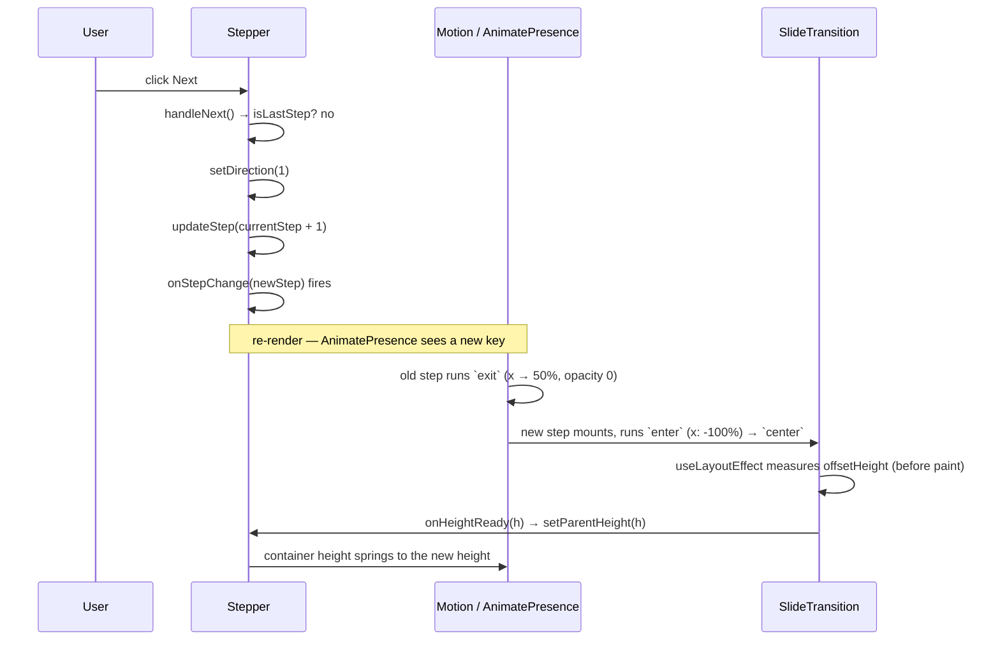

# APILogs Frontend — `react-components/` Documentation

> **Source of truth:** every claim below was verified by reading the actual source in
> `frontend/src/react-components/` plus everything needed to understand its real behaviour —
> the only consumer (`frontend/src/pages/Landing.jsx`), `package.json`, the installed
> `node_modules/gsap` plugin files, `eslint.config.js`, `index.css`, and the `public/` and
> `src/assets/` directories. Nothing is assumed. Where a component's contract and its caller
> disagree, the **actual** behaviour is documented and the mismatch is listed in
> [§15 Documentation Discrepancies and Bugs](#15-documentation-discrepancies-and-bugs).

---

## Table of Contents

1. [Architecture Overview](#1-architecture-overview)
2. [File Index](#2-file-index)
3. [Library and Dependency Map](#3-library-and-dependency-map)
4. [Usage Map — Who Renders What](#4-usage-map--who-renders-what)
5. [Stepper.jsx](#5-stepperjsx)
6. [StaggeredMenu.jsx](#6-staggeredmenujsx)
7. [SplitText.jsx](#7-splittextjsx)
8. [DotGrid.jsx](#8-dotgridjsx)
9. [Animation Lifecycle Diagrams](#9-animation-lifecycle-diagrams)
10. [Complete Props API Reference](#10-complete-props-api-reference)
11. [Error Handling Conventions](#11-error-handling-conventions)
12. [Performance Notes](#12-performance-notes)
13. [Accessibility Notes](#13-accessibility-notes)
14. [Security Notes](#14-security-notes)
15. [Documentation Discrepancies and Bugs](#15-documentation-discrepancies-and-bugs)
16. [Unverified Assumptions](#16-unverified-assumptions)
17. [Interview Preparation Notes](#17-interview-preparation-notes)

---

## 1. Architecture Overview

`frontend/src/react-components/` holds four **third-party-style presentational components**
— the animation/visual-effect layer of the app. They are categorically different from
`frontend/src/components/`:

| | `src/components/` | `src/react-components/` |
|---|---|---|
| Purpose | application UI (feed, incidents) | visual effects and motion primitives |
| Data | reads contexts, calls APIs | **none — zero network, zero context** |
| Coupling | tied to APILogs domain models | fully generic and reusable |
| Origin | written for this project | drop-in components (ReactBits-style library code) |

```
react-components/
├── Stepper.jsx          ← multi-step wizard with slide transitions  (Motion/Framer)
├── StaggeredMenu.jsx    ← full-screen animated nav overlay          (GSAP timelines)
├── SplitText.jsx        ← per-character scroll-reveal text          (GSAP + ScrollTrigger + SplitText)
└── DotGrid.jsx          ← interactive canvas dot field              (GSAP InertiaPlugin + Canvas 2D)
```

**Defining characteristic:** not one of these four components imports anything from
`src/api/`, `src/context/`, `src/hooks/`, `src/services/` or `src/utils/`. They receive
everything through props and communicate outward only through optional callbacks
(`onStepChange`, `onFinalStepCompleted`, `onMenuOpen`, `onMenuClose`,
`onLetterAnimationComplete`). That makes them safe to lift into any project — and it means a
bug here can only ever be visual, never a data-integrity problem.

**Two animation engines coexist.** `Stepper` uses `motion/react` (Motion, the successor to
Framer Motion — declarative, React-state-driven). The other three use **GSAP** (imperative,
ref-driven, animating outside React's render cycle). Both are production dependencies:
`motion@^12.36.0` and `gsap@^3.14.2` (installed: 3.15.0).

**Important architectural fact: half of this folder is dead code.** Only `Stepper` and
`StaggeredMenu` are imported anywhere. `SplitText.jsx` and `DotGrid.jsx` have **zero
importers** in the entire `src/` tree (verified by a recursive grep). They ship in the bundle
only if a bundler fails to tree-shake them — and because both call
`gsap.registerPlugin(...)` at *module scope*, importing them would have a side effect even if
the component itself were never rendered.

---

## 2. File Index

| File | Lines | Exports | Engine | Imported by | Renders |
|---|---|---|---|---|---|
| `Stepper.jsx` | 262 | `Stepper` (default), **`Step`** (named) | `motion/react` | `pages/Landing.jsx` | DOM + Motion elements |
| `StaggeredMenu.jsx` | 548 | `StaggeredMenu` (named **and** default) | `gsap` | `pages/Landing.jsx` | DOM + an inline `<style>` block |
| `SplitText.jsx` | 169 | `SplitText` (default) | `gsap` + `ScrollTrigger` + `SplitText` plugin + `@gsap/react` | **nothing** | a single configurable tag |
| `DotGrid.jsx` | 266 | `DotGrid` (default) | `gsap` + `InertiaPlugin` | **nothing** | `<canvas>` |

Internal (non-exported) helpers defined inside these files:

| Helper | File | Kind |
|---|---|---|
| `StepContentWrapper` | `Stepper.jsx` | component — animates container height |
| `SlideTransition` | `Stepper.jsx` | component — the horizontal slide |
| `stepVariants` | `Stepper.jsx` | Motion variants object |
| `StepIndicator` | `Stepper.jsx` | component — the numbered circle |
| `StepConnector` | `Stepper.jsx` | component — the fill-in line |
| `CheckIcon` | `Stepper.jsx` | component — SVG with animated `pathLength` |
| `throttle` | `DotGrid.jsx` | pure function — `performance.now()`-based |
| `hexToRgb` | `DotGrid.jsx` | pure function — hex string → `{r,g,b}` |

---

## 3. Library and Dependency Map

Verified against `frontend/package.json` and `node_modules/`.

| Import | Package | Installed version | Used by | Role |
|---|---|---|---|---|
| `motion/react` → `motion`, `AnimatePresence` | `motion` | 12.43.0 | `Stepper` | declarative enter/exit animation, spring height |
| `gsap` | `gsap` | 3.15.0 | `StaggeredMenu`, `SplitText`, `DotGrid` | timelines, tweens, `gsap.context`, `gsap.set/to/fromTo` |
| `gsap/ScrollTrigger` | bundled with gsap | ✅ `node_modules/gsap/ScrollTrigger.js` present | `SplitText` | fires the reveal when the element scrolls into view |
| `gsap/SplitText` | bundled with gsap | ✅ `node_modules/gsap/SplitText.js` present | `SplitText` | splits text into char/word/line spans |
| `gsap/InertiaPlugin` | bundled with gsap | ✅ `node_modules/gsap/InertiaPlugin.js` present | `DotGrid` | momentum-based dot displacement |
| `@gsap/react` → `useGSAP` | `@gsap/react` | ^2.1.2 | `SplitText` | React-aware GSAP scope + automatic cleanup |
| `react` | `react` | 19.2.0 | all four | hooks |

All three GSAP plugins are present in the installed package — `SplitText` and `InertiaPlugin`
were historically Club GreenSock-only, so their presence here is worth confirming rather than
assuming (it is confirmed: the `.js` files exist under `node_modules/gsap/`).

**Plugin registration happens at module scope**, not inside the components:

```js
// SplitText.jsx line 7
gsap.registerPlugin(ScrollTrigger, GSAPSplitText, useGSAP);
// DotGrid.jsx line 6
gsap.registerPlugin(InertiaPlugin);
```

So merely `import`ing either module mutates the global GSAP registry. That is the standard
GSAP pattern, but it is a side effect to be aware of.

`DotGrid.jsx` also begins with `'use client';` — a **Next.js App Router** directive. This
project is Vite + React Router, where the directive is inert. It is a fossil of the
component's origin, not a signal about how it runs here.

---

## 4. Usage Map — Who Renders What

```
pages/Landing.jsx
├── import Stepper, { Step } from '../react-components/Stepper'
│   └── rendered in the "#how-it-works" section with three <Step> children
└── import StaggeredMenu from '../react-components/StaggeredMenu'
    └── rendered only while `menuOpen === true`, inside a fixed full-screen div

(nothing)
├── SplitText.jsx   ← no importers anywhere in src/
└── DotGrid.jsx     ← no importers anywhere in src/
```

Verified with `grep -rn "react-components|SplitText|DotGrid|StaggeredMenu|Stepper" src --include=*.jsx`:
the only hits outside this folder are `Landing.jsx` lines 2, 3, 71, 448 and 541.

### 4.1 What `Landing.jsx` actually passes

```jsx
// Landing.jsx line 71
<StaggeredMenu
  position="right"  items={menuItems}  socialItems={socialItems}
  displaySocials  displayItemNumbering={true}
  menuButtonColor="#ffffff"  openMenuButtonColor="#fff"  changeMenuColorOnOpen={true}
  colors={['#B19EEF', '#5227FF']}  accentColor="#5227FF"
  open={menuOpen}                        // ⚠ not a supported prop
  onMenuOpen={() => setMenuOpen(true)}
  onMenuClose={() => setMenuOpen(false)}
  renderItem={(item, idx) => { ... }}    // ⚠ not a supported prop — silently ignored
/>

// Landing.jsx line 448
<Stepper
  initialStep={1}  onStepChange={() => {}}  onFinalStepCompleted={() => {}}
  backButtonText={<>…Previous</>}  nextButtonText={<>Next…</>}
  stepIndicatorClassName="hidden"        // ⚠ not a supported prop
  className="mt-12"                      // ⚠ not destructured → lands in ...rest
  stepHeaderClassName="…"                // ⚠ not supported
  stepContentClassName="text-center"     // ⚠ not supported
  stepActiveShadow                       // ⚠ not supported, boolean → DOM warning
>
```

Five of the props `Landing` passes to `Stepper` and two of the props it passes to
`StaggeredMenu` are **not part of those components' APIs**. The consequences are concrete and
are detailed in §5.8 and §6.9 — this is the single most important finding in this folder.

---

## 5. Stepper.jsx

### 5.1 Purpose

A generic multi-step wizard: it takes N children, shows one at a time, animates horizontal
slide transitions between them, animates the container's height to fit the active step, and
renders a clickable numbered progress indicator with connectors. It owns the entire step
state internally — callers only observe via callbacks.

### 5.2 Dependencies and exactly how each is used

| Import | Used for |
|---|---|
| `useState` | `currentStep`, `direction`, and `parentHeight` in `StepContentWrapper` |
| `Children` | `Children.toArray(children)` — normalises children into a flat, keyed array so `totalSteps` is reliable even with fragments, conditionals or `null` children |
| `useRef` | `containerRef` in `SlideTransition`, for measuring rendered height |
| `useLayoutEffect` | measures `offsetHeight` **before paint**, so the height animation never shows a flash at the wrong size |
| `motion` (`motion/react`) | `motion.div` for the height container, the slide, the indicator and its inner circle; `motion.path` for the check mark |
| `AnimatePresence` | keeps the outgoing step mounted long enough to run its `exit` variant |

### 5.3 Internal state

| State | Initial | Meaning |
|---|---|---|
| `currentStep` | `initialStep` (default `1`) | **1-indexed** active step |
| `direction` | `0` | `1` = moving forward, `-1` = backward; drives the slide variants |
| `parentHeight` (in `StepContentWrapper`) | `0` | measured height of the active step's content |

Derived, recomputed each render:

```js
const stepsArray  = Children.toArray(children);
const totalSteps  = stepsArray.length;
const isCompleted = currentStep > totalSteps;   // one past the end = "done" state
const isLastStep  = currentStep === totalSteps;
```

The "completed" state is modelled as `currentStep === totalSteps + 1` — a sentinel rather
than a separate boolean. That is why `handleComplete` calls `updateStep(totalSteps + 1)`.

### 5.4 Internal helper functions — inputs, outputs, purpose

**`updateStep(newStep)`** — the single funnel through which every step change flows.
Input: the target step number. Output: none. It calls `setCurrentStep(newStep)`, then fires
**exactly one** callback: `onFinalStepCompleted()` if `newStep > totalSteps`, otherwise
`onStepChange(newStep)`. Because every path (back, next, complete, indicator click) goes
through it, the callback contract can never be bypassed.

**`handleBack()`** — guarded by `if (currentStep > 1)`; sets `direction = -1` then
`updateStep(currentStep - 1)`. Cannot go below step 1.

**`handleNext()`** — guarded by `if (!isLastStep)`; sets `direction = 1` then
`updateStep(currentStep + 1)`.

**`handleComplete()`** — sets `direction = 1` and `updateStep(totalSteps + 1)`, which flips
`isCompleted` and therefore fires `onFinalStepCompleted`.

**`StepContentWrapper({ isCompleted, currentStep, direction, children, className })`** —
a `motion.div` with `overflow: hidden` whose `height` animates to `isCompleted ? 0 : parentHeight`
using a spring (`type: 'spring', duration: 0.4`). It wraps an `AnimatePresence`
(`initial={false}`, `mode="sync"`, `custom={direction}`) so entering and exiting steps
animate simultaneously rather than sequentially. On completion the height collapses to 0 —
that is the "wizard finished" visual.

**`SlideTransition({ children, direction, onHeightReady })`** — absolutely positioned
(`position: absolute; left: 0; right: 0; top: 0`) so the outgoing and incoming steps can
overlap without affecting layout. Its `useLayoutEffect` reports
`containerRef.current.offsetHeight` upward via `onHeightReady`, which is what gives
`StepContentWrapper` a height to animate to. Keyed by `currentStep` in the parent, so React
unmounts/remounts it per step, which is what triggers the enter/exit variants.

**`stepVariants`** — the slide choreography, with `direction` passed as Motion's `custom`:

| Variant | Value | Effect |
|---|---|---|
| `enter` | `x: dir >= 0 ? '-100%' : '100%'`, `opacity: 0` | new step starts offscreen on the side you came from |
| `center` | `x: '0%'`, `opacity: 1` | resting position |
| `exit` | `x: dir >= 0 ? '50%' : '-50%'`, `opacity: 0` | old step drifts out only halfway — a softer parallax than a full slide |

**`StepIndicator({ step, currentStep, onClickStep, disableStepIndicators })`** — derives a
three-way status:

```js
const status = currentStep === step ? 'active' : currentStep < step ? 'inactive' : 'complete';
```

Click handling: `if (step !== currentStep && !disableStepIndicators) onClickStep(step)` —
clicking the *current* step is a no-op, and `disableStepIndicators` makes indicators inert.
Variant colours: `inactive` `#222`/`#a3a3a3`, `active` `#5227FF`, `complete` `#5227FF` with a
`CheckIcon`. Note the `active` variant sets `color: '#5227FF'` identical to its
`backgroundColor`, which is why the active state renders a separate dark `#060010` dot rather
than relying on text colour.

**`StepConnector({ isComplete })`** — a 2 px track (`bg-neutral-600`) with an inner
`motion.div` animating `width` from `0` to `100%` and background to `#5227FF` over 0.4 s.
Rendered between indicators only (`isNotLastStep`).

**`CheckIcon(props)`** — an SVG whose `motion.path` animates `pathLength` from 0 to 1 with a
0.1 s delay, drawing the tick stroke on rather than fading it in.

### 5.5 `Step` — the named export

```jsx
export function Step({ children }) {
  return <div className="px-8">{children}</div>;
}
```

A deliberately trivial wrapper providing horizontal padding. It is a **marker component**:
`Stepper` never inspects child types, so `Step` carries no logic — any element works as a
child, `Step` just standardises spacing. Consumers import it alongside the default export
(`import Stepper, { Step } from '...'`), which is exactly what `Landing.jsx` does.

### 5.6 Render flow, in execution order

1. `Children.toArray(children)` → `stepsArray`, `totalSteps`.
2. Outer `div` — fixed layout classes, then `{...rest}` spread (see §5.8 — `rest` can
   **overwrite** `className`).
3. Card `div` — `max-w-md`, `rounded-4xl`, `shadow-xl`, an inline `border: 1px solid #222`,
   plus `stepCircleContainerClassName`.
4. Indicator row — `stepsArray.map` emitting, per index, either `renderStepIndicator({step, currentStep, onStepClick})`
   if that render-prop was supplied, or the built-in `StepIndicator`; followed by a
   `StepConnector` for every index except the last. Keyed by `stepNumber` inside a
   `React.Fragment`.
5. `StepContentWrapper` rendering only `stepsArray[currentStep - 1]` — the 1-indexed lookup.
6. Footer, rendered only `{!isCompleted && ...}`: the Back button appears only when
   `currentStep !== 1` (so the row uses `justify-end` on step 1 and `justify-between`
   after), and the primary button switches between `handleNext`/`nextButtonText` and
   `handleComplete`/the hardcoded string `'Complete'`.

### 5.7 Return value

A single JSX tree. No imperative handle, no `forwardRef`, no context. The only outward
communication is `onStepChange(newStep)` and `onFinalStepCompleted()`.

### 5.8 Integration defects with `Landing.jsx`

`Stepper` destructures a fixed prop list and collects everything else into `...rest`, which is
spread onto the outermost `div`. `Landing` passes five props that are not in that list:

| Prop from Landing | Supported? | Actual effect |
|---|---|---|
| `stepIndicatorClassName="hidden"` | ❌ | Lands in `...rest` → becomes a DOM attribute. **The indicators are never hidden**, so Landing's own hand-rolled 1/2/3 circles render *in addition to* Stepper's built-in indicator row — two sets of step numbers. The correct prop for hiding them is `stepContainerClassName`, or `renderStepIndicator` returning `null`. |
| `className="mt-12"` | ❌ (not destructured) | `{...rest}` is spread **after** the literal `className`, so it **replaces** `"flex min-h-full flex-1 flex-col items-center justify-center p-4 sm:aspect-[4/3] md:aspect-[2/1]"` entirely. The Stepper's whole outer flex layout is lost and replaced with a top margin. |
| `stepHeaderClassName` | ❌ | unknown DOM attribute |
| `stepContentClassName="text-center"` | ❌ | unknown DOM attribute; the intended prop is `contentClassName` |
| `stepActiveShadow` (boolean `true`) | ❌ | React warns: received `true` for a non-boolean attribute |

Everything Landing passes that **is** supported (`initialStep`, `onStepChange`,
`onFinalStepCompleted`, `backButtonText`, `nextButtonText`) works as documented.

### 5.9 Interview explanation

"Stepper is a controlled-internally wizard. Two design decisions are worth calling out. First,
`Children.toArray` instead of `React.Children.count` — it flattens fragments and drops
`null`s, so the step count is trustworthy no matter how the caller composes children. Second,
height: each step is absolutely positioned so the outgoing and incoming steps can overlap, and
a `useLayoutEffect` measures the active step's `offsetHeight` *before paint* and feeds it to a
spring-animated container height. That's what makes the card grow and shrink smoothly instead
of snapping. The completed state is modelled as `currentStep === totalSteps + 1`, which
collapses the height to zero and hides the footer in one condition."

---

## 6. StaggeredMenu.jsx

### 6.1 Purpose

A full-screen navigation overlay with a staggered, layered reveal: coloured "pre-layers"
slide in one after another, the white panel follows, then the menu items rise and rotate into
place, their counter numbers fade in, and the socials block animates last. The hamburger
toggle morphs into an X while its label text scrolls through a Menu/Close cycle.

It is by far the most complex file in the folder (548 lines), and the only one that ships its
own CSS.

### 6.2 Dependencies

| Import | Used for |
|---|---|
| `useState` | `open` (drives `aria-expanded`, `data-open`, and the panel's `aria-hidden`) and `textLines` (the Menu/Close roll sequence) |
| `useRef` | 15 refs — DOM handles, animation handles, and the `openRef`/`busyRef` mirrors |
| `useCallback` | memoises `buildOpenTimeline`, `playOpen`, `playClose`, `animateIcon`, `animateColor`, `animateText`, `toggleMenu`, `closeMenu` |
| `useLayoutEffect` | the initial `gsap.context` that positions everything offscreen **before first paint** |
| `React.useEffect` | toggle-button colour sync, and the click-away listener |
| `gsap` | `gsap.context`, `gsap.set`, `gsap.to`, `gsap.fromTo`, `gsap.timeline`, `gsap.getProperty` |

### 6.3 The ref inventory — why so many

| Ref | Kind | Purpose |
|---|---|---|
| `openRef` | state mirror | the **synchronous** open flag. `useState`'s `open` is async, so `toggleMenu` reads and writes `openRef.current` to avoid double-toggling on rapid clicks |
| `busyRef` | guard | set `true` on open, cleared in the timeline's `onComplete` / close tween's `onComplete`; `playOpen` returns early while busy |
| `panelRef`, `preLayersRef`, `preLayerElsRef` | DOM | the sliding panel, the pre-layer container, and the cached array of `.sm-prelayer` elements |
| `plusHRef`, `plusVRef`, `iconRef` | DOM | the two bars of the plus/X icon and their wrapper |
| `textInnerRef`, `textWrapRef` | DOM | the scrolling label column and its clipping window |
| `openTlRef`, `closeTweenRef`, `spinTweenRef`, `textCycleAnimRef`, `colorTweenRef` | animation handles | every animation is stored so it can be `.kill()`ed before a new one starts — this is what prevents conflicting tweens when the user spams the toggle |
| `toggleBtnRef` | DOM | the button whose `color` is tweened |
| `itemEntranceTweenRef` | animation handle | killed in both open and close paths (assigned nowhere else — see §15) |

### 6.4 Initial setup — `useLayoutEffect`

```js
const ctx = gsap.context(() => {
  if (!panel || !plusH || !plusV || !icon || !textInner) return;   // defensive bail
  preLayers = Array.from(preContainer.querySelectorAll('.sm-prelayer'));
  const offscreen = position === 'left' ? -100 : 100;
  gsap.set([panel, ...preLayers], { xPercent: offscreen });
  gsap.set(plusH, { transformOrigin: '50% 50%', rotate: 0 });
  gsap.set(plusV, { transformOrigin: '50% 50%', rotate: 90 });   // the two bars form a "+"
  gsap.set(icon, { rotate: 0, transformOrigin: '50% 50%' });
  gsap.set(textInner, { yPercent: 0 });
  if (toggleBtnRef.current) gsap.set(toggleBtnRef.current, { color: menuButtonColor });
});
return () => ctx.revert();
```

Three things matter here:

1. **`useLayoutEffect`, not `useEffect`** — the panel must be pushed offscreen before the
   browser paints, otherwise it would flash on screen for one frame on mount.
2. **`gsap.context` + `ctx.revert()`** — the canonical React/GSAP cleanup. Every tween and
   inline style created inside the context is reverted on unmount, so nothing leaks.
3. **Direction awareness** — `offscreen` is `-100` for `position: 'left'` and `+100`
   otherwise, so the same code drives both slide directions.

Dependencies `[menuButtonColor, position]`: changing either re-runs the whole setup.

### 6.5 `buildOpenTimeline()` — the choreography, step by step

Returns a **paused** GSAP timeline, built fresh on every open.

1. Kill any existing open timeline, close tween, and item-entrance tween.
2. Query the live DOM for the animation targets: `.sm-panel-itemLabel`,
   `.sm-panel-list[data-numbering] .sm-panel-item`, `.sm-socials-title`, `.sm-socials-link`.
3. Read the **current** positions with `gsap.getProperty(el, 'xPercent')` for every layer and
   the panel. This is the key to interruptibility: reopening mid-close animates from wherever
   the elements actually are, not from a hardcoded start.
4. Reset the inner elements to their pre-animation state: labels `yPercent: 140, rotate: 10`;
   numbers `--sm-num-opacity: 0`; socials title `opacity: 0`; social links `y: 25, opacity: 0`.
5. Build the timeline:

| Target | Tween | Position on the timeline |
|---|---|---|
| each pre-layer | `xPercent → 0`, 0.5 s, `power4.out` | `i * 0.07` — this is the stagger the component is named for |
| panel | `xPercent → 0`, 0.65 s, `power4.out` | `panelInsertTime = (layers-1)*0.07 + 0.08` |
| item labels | `yPercent → 0, rotate → 0`, 1 s, `power4.out`, stagger `0.1` | `panelInsertTime + 0.65 * 0.15` — starts while the panel is still sliding, which is what makes it feel fast |
| numbers | `--sm-num-opacity → 1`, 0.6 s, stagger `0.08` | `itemsStart + 0.1` |
| socials title | `opacity → 1`, 0.5 s | `panelInsertTime + 0.65 * 0.4` |
| social links | `y → 0, opacity → 1`, 0.55 s, stagger `0.08` | `socialsStart + 0.04`, with `onComplete: () => gsap.set(socialLinks, { clearProps: 'opacity' })` |

That final `clearProps: 'opacity'` is a real technique worth understanding: GSAP leaves
`opacity: 1` as an inline style, which would beat the stylesheet's
`.sm-socials-list:hover .sm-socials-link:not(:hover) { opacity: 0.35 }` rule. Clearing the
inline value hands control back to CSS so the hover-dim effect works afterwards.

Note `useCallback(..., [])` — an empty dependency array is safe because the function reads
everything from refs and from the live DOM, never from props or state.

**Animating a CSS custom property** (`--sm-num-opacity`) is how the counter numbers fade:
the numbers are generated by a CSS `counter()` in a `::after` pseudo-element, which JavaScript
cannot target directly, so the component tweens a custom property that the pseudo-element
reads.

### 6.6 `playOpen()` / `playClose()`

`playOpen` — returns immediately if `busyRef.current`; otherwise sets busy, builds the
timeline, attaches `onComplete` to clear busy, and `tl.play(0)` from the start.

`playClose` — kills the open timeline and nulls it, kills the item-entrance tween, then a
single `gsap.to([...layers, panel], { xPercent: offscreen, duration: 0.32, ease: 'power3.in', overwrite: 'auto' })`.
Closing is deliberately **one fast tween with no stagger** (0.32 s vs ~1.3 s to open) — a
standard motion-design asymmetry: entrances are expressive, exits get out of the way. Its
`onComplete` re-primes every inner element to its pre-open state and clears `busyRef`, so the
next open starts clean.

`overwrite: 'auto'` tells GSAP to kill conflicting tweens on the same properties of the same
targets — the second line of defence behind the explicit `.kill()` calls.

### 6.7 `animateIcon` / `animateColor` / `animateText`

**`animateIcon(opening)`** — kills `spinTweenRef` then builds a timeline. Opening: `h → 45°`,
`v → -45°` over 0.5 s (`power4.out`) — the `+` becomes an `×`. Closing: `h → 0°`, `v → 90°`
over 0.35 s (`power3.inOut`), plus a 0.001 s tween resetting the wrapper's rotation, which is
a GSAP idiom for forcing a value without a visible transition.

**`animateColor(opening)`** — if `changeMenuColorOnOpen`, tweens the button's `color` to
`openMenuButtonColor` or `menuButtonColor` with `delay: 0.18` (so the colour changes after the
panel has begun covering the background) over 0.3 s; otherwise `gsap.set`s it back to
`menuButtonColor` instantly. A separate `React.useEffect` re-syncs the colour whenever
`changeMenuColorOnOpen`, `menuButtonColor` or `openMenuButtonColor` change, reading
`openRef.current` to pick the right target.

**`animateText(opening)`** — the slot-machine label. It builds a sequence starting at the
current label, alternating Menu/Close for `cycles = 3`, appending the target label if the
alternation didn't land on it, and then appending the target **again**:

```js
const seq = [currentLabel];            // e.g. ['Menu']
for (let i = 0; i < 3; i++) seq.push(alternate());   // ['Menu','Close','Menu','Close']
if (last !== targetLabel) seq.push(targetLabel);
seq.push(targetLabel);                 // ['Menu','Close','Menu','Close','Close']
```

It then `setTextLines(seq)` (so React renders one `<span>` per entry in a vertical column),
resets `yPercent: 0`, and tweens the column to `yPercent: -((lineCount-1)/lineCount)*100` over
`0.5 + lineCount * 0.07` seconds. The wrapper has `height: 1em; overflow: hidden`, so only one
line is visible and the column scrolls past like a reel. The duplicated final label is what
makes the reel land on and hold the target word.

### 6.8 `toggleMenu` / `closeMenu` and click-away

```js
const toggleMenu = useCallback(() => {
  const target = !openRef.current;
  openRef.current = target;          // synchronous — immune to React batching
  setOpen(target);                   // async — for rendering/ARIA only
  if (target) { onMenuOpen?.(); playOpen(); } else { onMenuClose?.(); playClose(); }
  animateIcon(target); animateColor(target); animateText(target);
}, [...]);
```

`closeMenu` is the same minus the toggle, guarded by `if (openRef.current)` so it is
idempotent.

Click-away is a `mousedown` listener on `document`, registered only while
`closeOnClickAway && open`, that calls `closeMenu()` when the event target is outside both the
panel and the toggle button. It is correctly removed in the effect's cleanup.
`mousedown` rather than `click` means the menu closes on press, before any click on the
underlying page resolves.

### 6.9 Integration defects with `Landing.jsx`

**Defect 1 — `renderItem` is ignored.** `Landing` passes a `renderItem` render-prop that
returns a react-router `<Link>` for `type: 'route'` items and an `<a>` for anchors, each
calling `setMenuOpen(false)` on click. `StaggeredMenu` **does not accept or use `renderItem`
at all** — it always renders its own markup:

```jsx
<a className="sm-panel-item" href={it.link} aria-label={it.ariaLabel} data-index={idx + 1}>
```

Consequences: the "Login" entry becomes a plain `<a href="/login">`, which triggers a **full
page reload** instead of client-side navigation (losing all React state, including the auth
context's in-memory token — though `localStorage` would restore it); and no item closes the
menu on click, because the `onClick` handlers live in the ignored `renderItem`.

**Defect 2 — `open` is ignored.** `StaggeredMenu` is **uncontrolled**: it owns `open` in its
own `useState`, initialised to `false`, and exposes no way to set it from outside. `Landing`
passes `open={menuOpen}`, which does nothing. Because `Landing` mounts the component only
*after* the user taps its own hamburger, the user sees the overlay appear with the panel still
**closed**, and must press the component's own "Menu" toggle a second time to reveal it.

**Defect 3 — broken logo.** `logoUrl` defaults to
`'/src/assets/logos/reactbits-gh-white.svg'`. `Landing` does not override it, and
**`frontend/src/assets/` does not exist** (verified; `public/` contains only
`hero-dashboard.png` and `icons/error.gif`). The `` therefore 404s and renders as a
broken image in the menu header.

**Defect 4 — corrupted CSS.** The inline `<style>` block contains a stray import statement
pasted into the middle of a declaration:

```css
.sm-scope .staggered-menu-panel { poimport StaggeredMenu from '../../../ts-default/Components/StaggeredMenu/StaggeredMenu';
sition: absolute; top: 0; right: 0; width: clamp(260px, 38vw, 420px); ... }
```

The word `position` has been split by an accidental paste. CSS error recovery discards
everything up to the first `;` (the bogus `poimport …` declaration) and then discards
`sition: absolute` as an unknown property, so **the rule loses its `position: absolute`**.
The remaining declarations (`top`, `right`, `width: clamp(...)`, `height`, `background`,
`padding`, `overflow-y`, `z-index`) still apply. The panel survives visually only because its
JSX `className` independently carries Tailwind's `absolute top-0 right-0 h-full`. This is a
latent trap: anyone who trims the Tailwind classes will find the panel collapses.

### 6.10 Interview explanation

"StaggeredMenu is imperative animation done properly in React. Three ideas carry it. First,
`gsap.context` inside `useLayoutEffect` — the panel is positioned offscreen before first
paint, and `ctx.revert()` cleans up every tween and inline style on unmount. Second, state
mirroring: React state is asynchronous, so the open flag also lives in a ref, and every
animation handle is stored in a ref so it can be killed before a new one starts — that's what
makes rapid toggling safe. Third, the open timeline reads current positions with
`gsap.getProperty` instead of assuming a start value, so reopening mid-close animates from
wherever things actually are. The detail I like is `clearProps: 'opacity'` after the socials
fade in — it removes GSAP's inline style so the CSS hover-dim rule can take over again."

---

## 7. SplitText.jsx

> **Status: unused.** No file in `src/` imports this component. Documented because it exists
> and because its GSAP patterns are the most interview-relevant in the folder.

### 7.1 Purpose

Reveals text one character (or word, or line) at a time when the element scrolls into view,
using GSAP's SplitText plugin to shatter the text node into spans and ScrollTrigger to fire
the animation once.

### 7.2 Dependencies

`gsap`, `gsap/ScrollTrigger`, `gsap/SplitText` (imported aliased as `GSAPSplitText` to avoid
colliding with the component's own name), and `useGSAP` from `@gsap/react`. All four are
registered at module scope: `gsap.registerPlugin(ScrollTrigger, GSAPSplitText, useGSAP)`.

### 7.3 Refs and state

| Name | Purpose |
|---|---|
| `ref` | the text element; also the `scope` for `useGSAP` |
| `animationCompletedRef` | latch — once `true`, the animation never rebuilds, so prop changes can't replay a finished reveal |
| `onCompleteRef` | holds the latest `onLetterAnimationComplete` so the tween's `onComplete` always calls the current callback without the callback being a dependency |
| `fontsLoaded` (state) | gates the whole animation until webfonts are ready |

### 7.4 The font-loading gate

```js
useEffect(() => {
  if (document.fonts.status === 'loaded') setFontsLoaded(true);
  else document.fonts.ready.then(() => setFontsLoaded(true));
}, []);
```

This is not cosmetic. SplitText measures and wraps text; if it runs while a fallback font is
still active, every character is measured at the wrong width and the split boxes are visibly
wrong once the real font swaps in. Waiting on `document.fonts.ready` eliminates that class of
bug. `fontsLoaded` is in the `useGSAP` dependency list, so the animation builds the moment
fonts settle.

### 7.5 The callback-ref pattern

```js
useEffect(() => { onCompleteRef.current = onLetterAnimationComplete; }, [onLetterAnimationComplete]);
...
onComplete: () => { animationCompletedRef.current = true; onCompleteRef.current?.(); }
```

Keeping the callback in a ref means a caller passing an inline arrow function (a new identity
every render) does **not** force the expensive split-and-tween to rebuild. This is the
standard fix for "my animation restarts on every parent render".

### 7.6 ScrollTrigger start-position computation

```js
const startPct    = (1 - threshold) * 100;                                  // threshold 0.1 → 90
const marginMatch = /^(-?\d+(?:\.\d+)?)(px|em|rem|%)?$/.exec(rootMargin);    // "-100px" → ['-100','px']
const marginValue = marginMatch ? parseFloat(marginMatch[1]) : 0;            // -100
const marginUnit  = marginMatch ? marginMatch[2] || 'px' : 'px';             // 'px'
const sign = marginValue === 0 ? ''
           : marginValue < 0 ? `-=${Math.abs(marginValue)}${marginUnit}`
                             : `+=${marginValue}${marginUnit}`;              // '-=100px'
const start = `top ${startPct}%${sign}`;                                     // 'top 90%-=100px'
```

This translates IntersectionObserver-style `threshold` + `rootMargin` props into
ScrollTrigger's own `start` string syntax — a translation layer so the component's API feels
familiar to anyone who knows IntersectionObserver. The regex tolerates a missing unit
(defaulting to `px`) and any unparseable value falls back to `0` / no offset, so a malformed
`rootMargin` degrades rather than throwing.

### 7.7 The animation itself

```js
const splitInstance = new GSAPSplitText(el, {
  type: splitType, smartWrap: true, autoSplit: splitType === 'lines',
  linesClass: 'split-line', wordsClass: 'split-word', charsClass: 'split-char',
  reduceWhiteSpace: false,
  onSplit: self => { assignTargets(self); return gsap.fromTo(targets, {...from}, {...to, ...}); }
});
```

- `assignTargets(self)` picks `self.chars`, then `self.words`, then `self.lines` in
  preference order, with a final fallback to whichever array exists — so an unexpected
  `splitType` still animates something rather than throwing on `undefined`.
- **Returning the tween from `onSplit`** is the documented GSAP pattern for `autoSplit`: when
  lines re-split on resize, GSAP kills the returned tween and re-runs `onSplit`, so the
  animation survives responsive reflow.
- `reduceWhiteSpace: false` preserves spacing; `smartWrap: true` keeps words from breaking
  awkwardly across lines.
- Tween config: `stagger: delay / 1000` (the `delay` prop is in **milliseconds**, converted to
  GSAP's seconds), `scrollTrigger: { trigger: el, start, once: true, fastScrollEnd: true, anticipatePin: 0.4 }`,
  plus `willChange: 'transform, opacity'` and `force3D: true` to promote the elements to their
  own compositor layers.
- `once: true` means it fires a single time — reinforced by `animationCompletedRef`.

### 7.8 Re-entrancy and cleanup

Before creating a new split, it reverts any previous instance stashed on the DOM node itself:

```js
if (el._rbsplitInstance) { try { el._rbsplitInstance.revert(); } catch (_) {} el._rbsplitInstance = null; }
```

Stashing the instance on the element (`el._rbsplitInstance`) rather than in a ref means it
survives even if the component's ref identity changes. The `try/catch` swallows a revert
failure deliberately — a failed cleanup of a torn-down DOM node must not break the render.

The `useGSAP` cleanup kills only the ScrollTriggers whose `trigger` is this element
(`ScrollTrigger.getAll().forEach(st => { if (st.trigger === el) st.kill(); })`) — scoped
cleanup, so other components' triggers survive.

### 7.9 `useGSAP` configuration

```js
{ dependencies: [text, delay, duration, ease, splitType, JSON.stringify(from), JSON.stringify(to), threshold, rootMargin, fontsLoaded], scope: ref }
```

`JSON.stringify(from)` / `JSON.stringify(to)` deep-compare the object props by value — without
it, an inline `from={{ opacity: 0, y: 40 }}` would be a new object every render and rebuild
the animation each time. `scope: ref` limits GSAP selector text to this subtree.

### 7.10 Render

`renderTag()` builds a configurable tag (`tag` prop, default `'p'`) with
`className = "split-parent " + className` and inline
`{ textAlign, overflow: 'hidden', display: 'inline-block', whiteSpace: 'normal', wordWrap: 'break-word', willChange: 'transform, opacity' }`.
`overflow: hidden` is what lets characters animate up from below without spilling.
Note the `split-parent`, `split-char`, `split-word`, `split-line` classes have **no CSS rules
anywhere in the project** — `index.css` defines none of them. They exist purely as animation
hooks and styling seams.

### 7.11 Interview explanation

"SplitText is a scroll reveal, and the interesting parts are the guards, not the animation.
It waits for `document.fonts.ready` before splitting, because splitting against a fallback
font produces wrong character boxes. It keeps the completion callback in a ref so an inline
arrow from the parent doesn't rebuild the whole split. It stringifies object props in the
dependency array to get value comparison instead of identity. And it returns the tween from
`onSplit`, which is what lets GSAP re-split lines on resize without losing the animation."

---

## 8. DotGrid.jsx

> **Status: unused.** No file in `src/` imports this component.

### 8.1 Purpose

A canvas-rendered grid of dots that react to the pointer: dots within `proximity` shift colour
toward `activeColor`, fast cursor movement knocks nearby dots away with physics-based inertia,
and a click sends a radial shockwave. Dots then spring back with an elastic ease.

### 8.2 Dependencies

`gsap` and `gsap/InertiaPlugin` (registered at module scope). Everything else is plain
Canvas 2D and DOM APIs. It opens with `'use client';`, a Next.js directive that is inert in
this Vite app.

### 8.3 Internal helper functions

**`throttle(func, limit)`** — a leading-edge throttle using `performance.now()`. Returns a
wrapper that invokes `func` only if at least `limit` ms have elapsed since the last call.
Applied to the mousemove handler at 50 ms (≈20 Hz), which is the single most important
performance decision in the file: the handler loops over every dot, and running that at raw
mousemove frequency (often 100–1000 Hz) would dominate the frame budget.

**`hexToRgb(hex)`** — matches `/^#?([a-f\d]{2})([a-f\d]{2})([a-f\d]{2})$/i` and returns
`{ r, g, b }` via `parseInt(..., 16)`; returns `{ r: 0, g: 0, b: 0 }` on any non-match.
It accepts 6-digit hex with or without `#` and **rejects** 3-digit shorthand (`#fff`), named
colours, `rgb()` and `rgba()`. See §15 — the component's own defaults fail this parse.

### 8.4 Refs and memos

| Name | Purpose |
|---|---|
| `wrapperRef` | measured via `getBoundingClientRect()` to size the canvas |
| `canvasRef` | the drawing surface |
| `dotsRef` | the dot array — **held in a ref, never in state**, so mutating 500 dots per frame causes zero re-renders |
| `pointerRef` | `{x, y, vx, vy, speed, lastTime, lastX, lastY}` — pointer kinematics, also ref-held |
| `baseRgb` / `activeRgb` | `useMemo(() => hexToRgb(color), [color])` |
| `circlePath` | `useMemo` building a `Path2D` circle of radius `dotSize/2`, or `null` when `window`/`Path2D` is unavailable (SSR guard) |

Building the circle **once** as a `Path2D` and reusing it for every dot avoids re-issuing
`ctx.arc()` per dot per frame — a meaningful saving at hundreds of dots × 60 fps.

### 8.5 `buildGrid()` — inputs, outputs, purpose

A `useCallback` keyed on `[dotSize, gap]`. Reads the wrapper's rect, then:

```js
const dpr = window.devicePixelRatio || 1;
canvas.width  = width  * dpr;            // backing store in device pixels
canvas.height = height * dpr;
canvas.style.width  = `${width}px`;      // CSS size in logical pixels
canvas.style.height = `${height}px`;
ctx.scale(dpr, dpr);                     // draw in logical coordinates
```

That is the standard HiDPI canvas recipe — without it the dots are blurry on retina displays.

Grid maths:

```js
const cols = Math.floor((width  + gap) / (dotSize + gap));
const rows = Math.floor((height + gap) / (dotSize + gap));
const cell = dotSize + gap;
const gridW = cell * cols - gap;         // trailing gap doesn't exist
const gridH = cell * rows - gap;
const startX = (width  - gridW) / 2 + dotSize / 2;   // centre the grid, offset to dot centre
const startY = (height - gridH) / 2 + dotSize / 2;
```

Output: `dotsRef.current` = an array of `{ cx, cy, xOffset, yOffset, _inertiaApplied }`.
`cx`/`cy` are the immutable home position; `xOffset`/`yOffset` are what GSAP animates;
`_inertiaApplied` is a per-dot latch preventing a second impulse while one is in flight.

### 8.6 The three effects

**Effect 1 — the render loop** (`[proximity, baseColor, activeRgb, baseRgb, circlePath]`).
Bails out if `circlePath` is null. Runs a `requestAnimationFrame` loop that clears the canvas
and, for each dot, computes the squared distance to the pointer, compares against
`proxSq = proximity * proximity` (**squared-distance comparison avoids a `Math.sqrt` per dot
per frame** — `sqrt` is only called for dots that are actually inside the radius), linearly
interpolates the colour by `t = 1 - dist/proximity`, then `translate` → `fillStyle` →
`fill(circlePath)` inside `save()`/`restore()`. Cleanup: `cancelAnimationFrame(rafId)`.

**Effect 2 — sizing** (`[buildGrid]`). Calls `buildGrid()`, then observes the wrapper with a
`ResizeObserver` when available, falling back to a `window resize` listener. Cleanup
disconnects or removes whichever was used. Observing the element rather than the window means
the grid also rebuilds when a layout change resizes the container without a window resize.

**Effect 3 — interaction** (`[maxSpeed, speedTrigger, proximity, resistance, returnDuration, shockRadius, shockStrength]`).
Registers a throttled `mousemove` (with `{ passive: true }`, so the browser never has to wait
to see whether the handler calls `preventDefault`) and a `click`, both on `window`.

`onMove` computes velocity from the position delta over the time delta
(`vx = (dx/dt) * 1000` → px/s), clamps the magnitude to `maxSpeed` by uniform scaling
(preserving direction), converts the pointer to canvas-local coordinates via
`getBoundingClientRect()`, then for each dot within `proximity` and when
`speed > speedTrigger` and `!dot._inertiaApplied`:

```js
dot._inertiaApplied = true;
gsap.killTweensOf(dot);
const pushX = dot.cx - pr.x + vx * 0.005;      // direction away from cursor + velocity contribution
gsap.to(dot, { inertia: { xOffset: pushX, yOffset: pushY, resistance },
  onComplete: () => { gsap.to(dot, { xOffset: 0, yOffset: 0, duration: returnDuration, ease: 'elastic.out(1,0.75)' });
                      dot._inertiaApplied = false; } });
```

`onClick` is the same shape with a radial falloff instead of velocity:
`falloff = Math.max(0, 1 - dist/shockRadius)` and
`pushX = (dot.cx - cx) * shockStrength * falloff`, so the impulse decays linearly to zero at
the edge of `shockRadius`.

**GSAP animates plain JavaScript objects here, not DOM nodes.** The tween mutates
`dot.xOffset` / `dot.yOffset`, and the independent rAF loop reads those values when it draws.
That decoupling is why hundreds of dots can animate without hundreds of DOM elements.

### 8.7 Render output

```jsx
<section className={`p-4 flex items-center justify-center h-full w-full relative ${className}`} style={style}>
  <div ref={wrapperRef} className="w-full h-full relative">
    <canvas ref={canvasRef} className="absolute inset-0 w-full h-full pointer-events-none" />
  </div>
</section>
```

`pointer-events-none` on the canvas is deliberate: the effect must not intercept clicks meant
for content beneath it, which is exactly why the listeners are attached to `window` rather
than to the canvas.

### 8.8 Defects

1. **The default colours never parse.** `baseColor` and `activeColor` default to the string
   `'white'`, which `hexToRgb` cannot match, so both `baseRgb` and `activeRgb` are
   `{ r: 0, g: 0, b: 0 }`. Distant dots are painted with the raw string (`style = baseColor`
   → `'white'`, which Canvas accepts), but dots inside `proximity` are painted with the
   interpolated `rgb(0,0,0)` — so **with the default props, dots turn black as the cursor
   approaches instead of highlighting**. The component only behaves as intended when both
   colours are passed as 6-digit hex.
2. **`clearRect` uses the wrong coordinate space.** After `ctx.scale(dpr, dpr)`, drawing is in
   logical pixels, but the loop calls `ctx.clearRect(0, 0, canvas.width, canvas.height)` with
   the *device-pixel* backing dimensions — on a 2× display it clears an area twice as large as
   the canvas. Harmless (over-clearing), but it should be `canvas.width / dpr`.
3. **The rAF loop never idles.** It repaints every frame forever, even with no pointer
   movement and no active tweens, and there is no `document.visibilityState` check, so it keeps
   running in a background tab (throttled by the browser, but still scheduled).
4. **No touch support.** Only `mousemove` and `click` are bound — the effect is inert on
   touch devices.
5. `buildGrid` is not called from effect 1, so if `dotSize`/`gap` change, effect 2's dependency
   on `buildGrid` correctly rebuilds — this one is fine; noted only to confirm it was checked.

### 8.9 Interview explanation

"DotGrid is a canvas particle field, and the reason it stays at 60 fps is that nothing about
it touches React's render cycle. The dots live in a ref, GSAP tweens plain objects rather than
DOM nodes, and a single `requestAnimationFrame` loop reads those values and paints. The
micro-optimisations are worth naming: comparing squared distances so `Math.sqrt` only runs for
dots inside the radius, building the circle once as a `Path2D` instead of calling `arc()` per
dot, throttling mousemove to 20 Hz because that handler is O(dots), and the devicePixelRatio
dance so it's sharp on retina. The bug I'd fix first is `hexToRgb` — it only accepts 6-digit
hex, and the component's own defaults are the string `'white'`, so out of the box the
proximity highlight interpolates toward black."

---

## 9. Animation Lifecycle Diagrams

### 9.1 Stepper — a "Next" click



On the final step the button calls `handleComplete()` → `updateStep(totalSteps + 1)` →
`isCompleted` becomes true → `AnimatePresence` empties, the height springs to `0`, and the
footer unmounts.

### 9.2 StaggeredMenu — an open click

```mermaid
sequenceDiagram
    participant U as User
    participant T as toggleMenu
    participant G as GSAP timeline
    participant D as DOM

    U->>T: click toggle
    T->>T: openRef.current = true (sync) ; setOpen(true) (async)
    T->>T: onMenuOpen?.()
    T->>G: playOpen() → busy guard → buildOpenTimeline()
    G->>D: query .sm-prelayer / .sm-panel-itemLabel / numbers / socials
    G->>G: read current xPercent via gsap.getProperty (interruption-safe)
    G->>D: reset labels yPercent 140 rotate 10, numbers opacity 0, socials hidden
    G->>D: layers slide in, staggered 0.07s each
    G->>D: panel slides in at (layers-1)*0.07 + 0.08, 0.65s
    G->>D: labels rise + unrotate at panelStart + 0.0975, stagger 0.1
    G->>D: --sm-num-opacity → 1 (CSS counter pseudo-element)
    G->>D: socials title then links, clearProps opacity on complete
    G->>T: onComplete → busyRef = false
    par in parallel with the timeline
        T->>D: animateIcon(true) — bars rotate 45 / -45 (plus → X)
        T->>D: animateColor(true) — button colour tween, delay 0.18s
        T->>D: animateText(true) — label reel scrolls Menu→Close
    end
```

### 9.3 SplitText — mount to reveal

```mermaid
flowchart TD
    A[Component mounts] --> B{document.fonts.status === 'loaded'?}
    B -->|yes| C[setFontsLoaded true]
    B -->|no| D[await document.fonts.ready] --> C
    C --> E[useGSAP runs — deps include fontsLoaded]
    E --> F{animationCompletedRef.current?}
    F -->|true| G[return — never replay]
    F -->|false| H[revert any previous el._rbsplitInstance]
    H --> I[compute ScrollTrigger start from threshold + rootMargin]
    I --> J[new GSAPSplitText — onSplit assigns targets, returns tween]
    J --> K[gsap.fromTo with stagger = delay/1000 + scrollTrigger once:true]
    K --> L[element scrolls into view → tween plays]
    L --> M[onComplete → animationCompletedRef = true → onCompleteRef.current?.()]
```

### 9.4 DotGrid — the two independent loops

```mermaid
flowchart LR
    subgraph Input["Input loop — throttled to 20 Hz"]
        A[window mousemove] --> B[compute vx, vy, speed; clamp to maxSpeed]
        B --> C{speed > speedTrigger AND dist < proximity AND not already pushed?}
        C -->|yes| D[gsap.to dot with inertia → onComplete elastic return]
        E[window click] --> F{dist < shockRadius?}
        F -->|yes| D
    end
    subgraph Render["Render loop — requestAnimationFrame, every frame"]
        G[clearRect] --> H[for each dot: squared distance vs proxSq]
        H --> I[lerp colour by t = 1 - dist/proximity]
        I --> J[translate + fill Path2D]
        J --> G
    end
    D -.mutates dot.xOffset / yOffset .-> H
```

The two loops never call React. They communicate purely through the mutable objects in
`dotsRef.current`.

---

## 10. Complete Props API Reference

### 10.1 `Stepper`

| Prop | Type | Default | Purpose |
|---|---|---|---|
| `children` | ReactNode | — | the steps; flattened with `Children.toArray` |
| `initialStep` | number | `1` | starting step (1-indexed) |
| `onStepChange` | `(step: number) => void` | no-op | fired for every change that is **not** completion |
| `onFinalStepCompleted` | `() => void` | no-op | fired when `currentStep` passes `totalSteps` |
| `stepCircleContainerClassName` | string | `''` | appended to the card container |
| `stepContainerClassName` | string | `''` | appended to the indicator row |
| `contentClassName` | string | `''` | appended to the content wrapper |
| `footerClassName` | string | `''` | appended to the footer |
| `backButtonProps` | object | `{}` | spread onto the Back button |
| `nextButtonProps` | object | `{}` | spread onto the Next button |
| `backButtonText` | ReactNode | `'Back'` | Back label |
| `nextButtonText` | ReactNode | `'Continue'` | Next label (the final button is always the literal `'Complete'`) |
| `disableStepIndicators` | boolean | `false` | makes indicator clicks inert |
| `renderStepIndicator` | `({step, currentStep, onStepClick}) => ReactNode` | — | render-prop replacing the built-in indicator |
| `...rest` | any | — | **spread onto the outer div, after `className`** |

Named export: `Step({ children })` — a `<div className="px-8">` wrapper.

### 10.2 `StaggeredMenu`

| Prop | Type | Default | Purpose |
|---|---|---|---|
| `position` | `'left' \| 'right'` | `'right'` | slide direction and panel side |
| `colors` | string[] | `['#B19EEF', '#5227FF']` | pre-layer colours; sliced to 4, and if ≥3 the middle one is **removed** |
| `items` | `{label, link, ariaLabel}[]` | `[]` | menu entries; empty renders a "No items" placeholder |
| `socialItems` | `{label, link}[]` | `[]` | social links (opened with `target="_blank" rel="noopener noreferrer"`) |
| `displaySocials` | boolean | `true` | show the socials block |
| `displayItemNumbering` | boolean | `true` | sets `data-numbering`, enabling the CSS counter |
| `className` | string | — | appended to the wrapper |
| `logoUrl` | string | `'/src/assets/logos/reactbits-gh-white.svg'` | header logo (**this default 404s in this project**) |
| `menuButtonColor` | string | `'#fff'` | toggle colour when closed |
| `openMenuButtonColor` | string | `'#fff'` | toggle colour when open |
| `changeMenuColorOnOpen` | boolean | `true` | enable the colour tween |
| `isFixed` | boolean | `false` | `fixed inset-0 w-screen h-screen` vs `w-full h-full` |
| `accentColor` | string | `'#5227FF'` | sets the `--sm-accent` CSS variable |
| `closeOnClickAway` | boolean | `true` | document `mousedown` outside closes the menu |
| `onMenuOpen` | `() => void` | — | fired on open |
| `onMenuClose` | `() => void` | — | fired on close |

**Not supported** (silently ignored; there is no `...rest`): `open`, `renderItem`.

### 10.3 `SplitText`

| Prop | Type | Default | Purpose |
|---|---|---|---|
| `text` | string | — | content; animation is skipped if falsy |
| `className` | string | `''` | appended after `split-parent` |
| `delay` | number (ms) | `50` | stagger between targets; divided by 1000 for GSAP |
| `duration` | number (s) | `1.25` | per-target duration |
| `ease` | string | `'power3.out'` | GSAP ease |
| `splitType` | string | `'chars'` | `'chars'` / `'words'` / `'lines'`, or a combination |
| `from` | object | `{opacity: 0, y: 40}` | start state |
| `to` | object | `{opacity: 1, y: 0}` | end state |
| `threshold` | number | `0.1` | → ScrollTrigger `start` percentage |
| `rootMargin` | string | `'-100px'` | → ScrollTrigger offset |
| `textAlign` | string | `'center'` | inline style |
| `tag` | string | `'p'` | element type to render |
| `onLetterAnimationComplete` | `() => void` | — | fired once, via a ref |

### 10.4 `DotGrid`

| Prop | Type | Default | Purpose |
|---|---|---|---|
| `dotSize` | number | `16` | dot diameter (px) |
| `gap` | number | `32` | spacing between dots |
| `baseColor` | string | `'white'` | resting colour — **must be 6-digit hex to interpolate** |
| `activeColor` | string | `'white'` | proximity colour — same caveat |
| `proximity` | number | `150` | highlight + push radius |
| `speedTrigger` | number | `100` | px/s above which movement pushes dots |
| `shockRadius` | number | `250` | click shockwave radius |
| `shockStrength` | number | `5` | click impulse multiplier |
| `maxSpeed` | number | `5000` | velocity clamp (px/s) |
| `resistance` | number | `750` | InertiaPlugin resistance |
| `returnDuration` | number (s) | `1.5` | elastic return duration |
| `className` | string | `''` | appended to the section |
| `style` | object | — | inline style on the section |

---

## 11. Error Handling Conventions

These components have no network or data layer, so "error handling" means **defensive
rendering and animation guards**. Verified patterns:

| Pattern | Where | Behaviour |
|---|---|---|
| Null-ref bail-out | `StaggeredMenu` `useLayoutEffect`, `animateIcon`, `animateColor`, `animateText`, `buildOpenTimeline`, `playClose` | every function checks its refs and returns early; nothing throws if the DOM isn't ready |
| `try/catch` with intentional no-op | `SplitText` — `splitInstance.revert()` in both the rebuild path and cleanup | a revert failure on a torn-down node must not break rendering; the empty `catch (_) { /* noop */ }` is deliberate, not sloppy |
| SSR / capability guard | `DotGrid` `circlePath` memo | returns `null` if `window` or `Path2D` is undefined; the render loop then bails out |
| Feature detection with fallback | `DotGrid` effect 2 | `ResizeObserver` if available, else a `window resize` listener; the cleanup branches to match |
| Regex fallback | `SplitText` `rootMargin` parse, `DotGrid` `hexToRgb` | unparseable input falls back to `0` / `{0,0,0}` instead of `NaN` propagating into a tween |
| Empty-collection fallback | `StaggeredMenu` items list | renders an `aria-hidden` "No items" row instead of an empty `<ul>` |
| Length guards before every tween | `StaggeredMenu` `buildOpenTimeline` | `if (itemEls.length)`, `if (numberEls.length)`, `if (socialTitle)` — GSAP throws on empty target arrays in some configurations |
| Re-entrancy guards | `StaggeredMenu` `busyRef`; `DotGrid` `dot._inertiaApplied`; `SplitText` `animationCompletedRef` | each prevents an animation being started twice over itself |
| Kill-before-start | `StaggeredMenu` (all five animation refs), `DotGrid` (`gsap.killTweensOf(dot)`) | no conflicting tweens on the same target |

**What is not handled:** none of the four components has an error boundary, and none validates
prop types (no PropTypes, no TypeScript). A malformed `items` entry in `StaggeredMenu`
(e.g. missing `label`) would produce a broken `key` (`undefined0`) rather than an error.

---

## 12. Performance Notes

| Technique | Component | Why it matters |
|---|---|---|
| Ref-held data, zero state | `DotGrid` (`dotsRef`, `pointerRef`) | hundreds of dots mutate every frame with **no React re-renders** |
| GSAP tweening plain objects | `DotGrid` | avoids one DOM node per particle |
| Squared-distance comparison | `DotGrid` render loop | `Math.sqrt` only for dots inside `proximity`, not all of them |
| `Path2D` built once | `DotGrid` | one path object reused for every `ctx.fill()` |
| Leading-edge throttle at 50 ms | `DotGrid` mousemove | the handler is O(dots); 20 Hz instead of raw pointer frequency |
| `{ passive: true }` listener | `DotGrid` mousemove | the browser never blocks scrolling waiting on `preventDefault` |
| devicePixelRatio scaling | `DotGrid` `buildGrid` | correct sharpness without oversizing on 1× displays |
| `ResizeObserver` over `window.resize` | `DotGrid` | rebuilds on container changes, not just window changes |
| `useLayoutEffect` for measurement | `Stepper` `SlideTransition`, `StaggeredMenu` setup | measure/position before paint — no visible flash |
| `useCallback` on every handler | `StaggeredMenu` | stable identities so the click-away effect doesn't re-register each render |
| `useMemo` on colour parsing | `DotGrid` | `hexToRgb` runs only when the colour prop changes |
| `JSON.stringify` in deps | `SplitText` | value comparison for object props; prevents rebuild-per-render |
| Callback stored in a ref | `SplitText` | an inline arrow from the parent can't invalidate the animation |
| `willChange` + `force3D` | `SplitText` | promotes animated characters to compositor layers |
| `once: true` + completion latch | `SplitText` | the reveal runs exactly once for the page's lifetime |
| `clearProps` after the tween | `StaggeredMenu` socials | removes inline styles so CSS hover rules regain control |
| `gsap.getProperty` for start values | `StaggeredMenu` | interruptions animate from the real current position, no snapping |

**Costs that remain:** `DotGrid`'s rAF loop runs unconditionally forever (§8.8);
`StaggeredMenu` rebuilds its open timeline and re-queries the DOM on every open rather than
caching it; and `Stepper`'s `SlideTransition` layout effect re-runs each render because
`onHeightReady` is an inline arrow (cheap — `setParentHeight` with an unchanged value bails
out in React, but it is avoidable with `useCallback`).

---

## 13. Accessibility Notes

**Implemented (verified in source):**

- `StaggeredMenu` toggle: `aria-label` that switches between `'Open menu'` / `'Close menu'`,
  `aria-expanded={open}`, and `aria-controls="staggered-menu-panel"` matching the panel's `id`.
- Panel: `aria-hidden={!open}`, so screen readers skip it while closed.
- Decorative regions marked `aria-hidden="true"`: the pre-layer container, the label reel
  (`sm-toggle-textWrap`), the icon, and the "No items" placeholder.
- `role="list"` on both `<ul>`s; `aria-label` on the header (`'Main navigation header'`) and
  the socials block (`'Social links'`); per-item `aria-label` from `it.ariaLabel`.
- Focus styling that respects keyboard users only: `:focus-visible` outlines on `.sm-toggle`
  and `.sm-socials-link`, plus a `:focus-within` variant of the socials dim effect.
- External links carry `rel="noopener noreferrer"` alongside `target="_blank"`.

**Gaps:**

- **No `prefers-reduced-motion` handling in any of the four components.** Every animation runs
  at full amplitude regardless of the user's OS setting. This is the most significant
  accessibility gap in the folder, and the cheapest to fix (a `matchMedia('(prefers-reduced-motion: reduce)')`
  check gating the timelines).
- `StaggeredMenu` does not trap focus inside the open panel, does not close on `Escape`, and
  does not restore focus to the toggle on close — three standard requirements for a modal-style
  overlay.
- `Stepper`'s `StepIndicator` is a clickable `motion.div` with `cursor-pointer` but **no
  `role="button"`, no `tabIndex`, and no key handler** — it is mouse-only and invisible to
  assistive technology. It also has `outline-none focus:outline-none`, which suppresses the
  focus ring it never gets.
- `Stepper` announces nothing on step change (no `aria-live`, no `aria-current`).
- `DotGrid` renders a bare `<canvas>` with no `role` or `aria-hidden` — it is purely
  decorative and should be explicitly hidden from assistive tech.

---

## 14. Security Notes

The attack surface here is small — no data, no storage, no network — but three things are
worth stating precisely:

1. **`href` values are rendered unsanitised.** `StaggeredMenu` renders
   `<a href={it.link}>` for menu items and `<a href={s.link}>` for socials, straight from
   props. A `javascript:` URL in `items` would execute on click. In this app `items` is a
   hardcoded module-level constant in `Landing.jsx`, so there is no live risk — but the
   component provides no scheme validation, so it must never be fed user-supplied links
   without one.
2. **`logoUrl` is interpolated into `` unvalidated** — same reasoning, lower impact.
3. **No `dangerouslySetInnerHTML` anywhere** in the folder. The one raw `<style>` block in
   `StaggeredMenu` is a static template literal with no interpolation, so it cannot be used for
   CSS injection. `SplitText` renders `{text}` as a JSX child, so React escapes it.
4. External links correctly use `rel="noopener noreferrer"`, preventing reverse-tabnabbing via
   `window.opener`.
5. `DotGrid` and `StaggeredMenu` attach **global** listeners (`window` mousemove/click,
   `document` mousedown). All are removed in their effect cleanups — verified — so there is no
   listener leak across mounts.

---

## 15. Documentation Discrepancies and Bugs

Ordered by impact. All traced from source; none confirmed by running the app.

### 15.1 Integration defects — `Landing.jsx` ↔ these components

| # | Component | Problem | Effect |
|---|---|---|---|
| 1 | `StaggeredMenu` | `renderItem` is passed by `Landing` but **is not a prop of the component**; it always renders its own `<a href={it.link}>` | the "Login" item does a **full page reload** instead of react-router navigation, and no item closes the menu on click (the `onClick`s live in the ignored render-prop) |
| 2 | `StaggeredMenu` | `open` is passed but the component is **uncontrolled** — it owns `open` in its own state, initialised `false` | tapping Landing's hamburger mounts the overlay with the panel still closed; the user must press the component's own "Menu" toggle a second time |
| 3 | `Stepper` | `className="mt-12"` isn't destructured, so it lands in `...rest`, which is spread **after** the literal `className` | the outer div's entire layout class string (`flex min-h-full flex-1 flex-col items-center justify-center p-4 sm:aspect-[4/3] md:aspect-[2/1]`) is **replaced** by `mt-12` |
| 4 | `Stepper` | `stepIndicatorClassName="hidden"` is not a supported prop (the comment in `Landing.jsx` says "We'll use our own") | the built-in indicator row is **not** hidden, so two sets of step numbers render — Landing's hand-rolled 1/2/3 circles *and* Stepper's own |
| 5 | `Stepper` | `stepHeaderClassName`, `stepContentClassName`, `stepActiveShadow` are unsupported and land in `...rest` → the DOM | React dev warnings for unknown attributes; `stepActiveShadow` is boolean `true` on a non-boolean attribute. The intended prop for content is `contentClassName` |
| 6 | `StaggeredMenu` | `logoUrl` defaults to `/src/assets/logos/reactbits-gh-white.svg`; `Landing` doesn't override it and **`src/assets/` does not exist** | broken image in the menu header |

### 15.2 Internal defects

| # | Component | Problem |
|---|---|---|
| 7 | `StaggeredMenu` | **The inline `<style>` block is corrupted**: an import statement was pasted mid-declaration — `.staggered-menu-panel { poimport StaggeredMenu from '../../../ts-default/…'; sition: absolute; …`. CSS error recovery drops the bogus declaration *and* `sition: absolute`, so the rule loses `position: absolute`. It only looks right because the JSX `className` independently supplies Tailwind's `absolute top-0 right-0 h-full` |
| 8 | `DotGrid` | `hexToRgb` accepts only 6-digit hex, but `baseColor`/`activeColor` default to the string `'white'` → both parse to `{0,0,0}` → **dots interpolate toward black near the cursor** with default props |
| 9 | `DotGrid` | `ctx.clearRect(0, 0, canvas.width, canvas.height)` uses device-pixel dimensions after `ctx.scale(dpr, dpr)` — over-clears by a factor of `dpr` |
| 10 | `DotGrid` | The rAF loop never pauses — no idle check, no `visibilitychange` handling |
| 11 | `DotGrid` | No touch events; the effect is inert on mobile |
| 12 | `StaggeredMenu` | `itemEntranceTweenRef` is `.kill()`ed in both `buildOpenTimeline` and `playClose` but **never assigned** anywhere — dead ref |
| 13 | `StaggeredMenu` | `textWrapRef` is attached to an element but never read |
| 14 | `StaggeredMenu` | The CSS references `var(--sm-toggle-width, auto)` for the label wrapper's width, but `--sm-toggle-width` is never set — the label column width is always `auto`, so the toggle can shift horizontally as the reel scrolls between "Menu" and "Close" |
| 15 | `StaggeredMenu` | `colors` handling is surprising: `colors.slice(0, 4)`, then **if the array has ≥3 entries the middle one is spliced out**. Passing 3 colours yields 2 layers. Undocumented and non-obvious |
| 16 | `DotGrid` | `'use client'` is a Next.js App Router directive; this is a Vite app, so it is inert — a leftover from the component's origin |
| 17 | `Stepper` | The final button label is the hardcoded string `'Complete'` with no prop to override it, unlike `backButtonText`/`nextButtonText` |
| 18 | `Stepper` | `StepIndicator` is clickable with no `role`, `tabIndex` or key handler — mouse-only (see §13) |
| 19 | all four | No `prefers-reduced-motion` support |
| 20 | `SplitText`, `DotGrid` | **Dead code** — zero importers in `src/`. Both call `gsap.registerPlugin` at module scope, so importing them has a global side effect even without rendering |

### 15.3 Things that are correct and worth preserving

Verified as sound, in case a future refactor is tempted to "simplify" them:

- `gsap.context` + `ctx.revert()` in `StaggeredMenu`'s `useLayoutEffect` — correct GSAP/React
  cleanup.
- Reading start positions with `gsap.getProperty` in `buildOpenTimeline` — what makes
  interruption work.
- `clearProps: 'opacity'` after the socials tween — hands control back to the CSS hover rule.
- `openRef`/`busyRef` mirroring React state — required because `setState` is async.
- `Children.toArray` in `Stepper` — robust step counting.
- `useLayoutEffect` for height measurement — prevents a pre-paint flash.
- `document.fonts.ready` gate in `SplitText` — prevents measuring against a fallback font.
- Callback-in-a-ref and `JSON.stringify` deps in `SplitText` — prevent needless rebuilds.
- Squared-distance comparison, `Path2D` reuse, throttling, and DPR scaling in `DotGrid`.
- Every global listener in the folder is removed in its cleanup.

---

## 16. Unverified Assumptions

**Not verified from the available source code:**

1. **Runtime behaviour.** Nothing here was confirmed by running the app, a browser, or a test
   suite. Every finding — including the CSS corruption's precise rendering outcome and the
   `hexToRgb` colour bug — is derived by reading source and applying known CSS/Canvas/GSAP
   semantics.
2. **The exact CSS error-recovery outcome** for the corrupted `.staggered-menu-panel` rule
   follows the CSS Syntax specification's declaration-level error handling; it was not checked
   in a real browser's computed styles.
3. **GSAP plugin licensing/functionality.** `ScrollTrigger.js`, `SplitText.js` and
   `InertiaPlugin.js` are confirmed present in `node_modules/gsap/`, but whether they are
   fully functional builds (versus trial builds) was not inspected.
4. **`Stepper.jsx` internals of `motion/react`.** Motion 12's spring/`AnimatePresence`
   semantics are assumed from its documented behaviour, not read from the package source.
5. **Whether `SplitText.jsx` and `DotGrid.jsx` are intended for future use or are leftovers.**
   They are unreferenced today; intent is unknown.
6. **Bundle impact.** Whether Vite tree-shakes the two unused components out of the production
   build was not measured (the module-scope `gsap.registerPlugin` calls are a side effect that
   can defeat tree-shaking, but this was not confirmed against a build).
7. **`react-components/` provenance.** The style, the `ts-default/Components/StaggeredMenu`
   path in the corrupted line, and the default `reactbits-gh-white.svg` logo all point to
   ReactBits-style library code copied in, but no license file or attribution exists in the
   repo to confirm the source.
8. **Visual intent.** Whether the doubled step indicators (§15.1 #4) and the two-tap menu
   (§15.1 #2) are noticed/accepted by the author, or genuinely unnoticed, is unknown.

---

## 17. Interview Preparation Notes

### 17.1 Questions to expect

**Q: Why are there two animation libraries in one project?**
Motion (`motion/react`) is declarative and React-state-driven — it fits `Stepper`, where the
animation *is* a function of `currentStep`, and `AnimatePresence` handles exit animations that
React alone can't (React unmounts immediately). GSAP is imperative and timeline-based — it
fits `StaggeredMenu`, `SplitText` and `DotGrid`, where you need precise multi-target
choreography with overlapping offsets, interruption handling, and animation of things React
doesn't own (canvas objects, CSS custom properties). Using both is defensible; what you should
be able to say is *why each one is where it is*.

**Q: How do you animate in React without wrecking performance?**
Keep the animated data out of state. `DotGrid` is the clean example: dots live in a ref, GSAP
tweens plain objects, and a single rAF loop paints. Zero re-renders regardless of particle
count. The general rule is that React should own *what exists*, and the animation engine
should own *where it is*.

**Q: Why `useLayoutEffect` instead of `useEffect` in two of these components?**
Both uses are measurement/positioning before paint. `StaggeredMenu` pushes the panel offscreen
before the browser paints — with `useEffect` it would flash visible for one frame.
`Stepper`'s `SlideTransition` measures `offsetHeight` before paint so the container's height
animation starts from a correct value rather than jumping.

**Q: Why mirror React state into a ref?**
`setState` is asynchronous and batched. `StaggeredMenu`'s `toggleMenu` must know the *current*
open state synchronously to decide which animation to run — reading `open` from state could
read a stale value during rapid clicks. So `openRef.current` is the source of truth for logic
and `open` state exists only for rendering and ARIA. Same idea for `busyRef` as a re-entrancy
guard.

**Q: How do you make an animation interruptible?**
Three mechanisms, all present in `StaggeredMenu`: store every tween/timeline in a ref and
`.kill()` it before starting a new one; use `overwrite: 'auto'` so GSAP resolves conflicts on
the same properties; and read the *current* values with `gsap.getProperty` when building the
new animation, so it animates from where things actually are instead of snapping to an assumed
start.

**Q: `SplitText` waits for `document.fonts.ready` — why?**
Splitting text measures character boxes. If it runs while a fallback font is active, every box
is the wrong size and the layout visibly breaks when the real font swaps in. Gating on
`document.fonts.ready` and putting `fontsLoaded` in the dependency array eliminates that.

**Q: What's the trick with `clearProps: 'opacity'`?**
GSAP writes inline styles, and inline styles beat stylesheet rules. After the social links fade
in, the inline `opacity: 1` would defeat the CSS `:hover` dim effect. `clearProps` removes the
inline value so CSS regains control. It's a good answer because it shows you understand the
cascade, not just the animation API.

**Q: Where would you start fixing this folder?**
Have the ranked list ready: (1) `StaggeredMenu` ignores `renderItem` and `open`, so the mobile
menu needs two taps and its Login link does a full page reload — either add those props or
restructure `Landing` to use the component's own API; (2) the corrupted CSS line, which is one
character away from being fine; (3) `Stepper`'s `className` landing in `...rest` and
overwriting the layout — destructure `className` and merge it; (4) `hexToRgb` in `DotGrid`
rejecting its own defaults; (5) `prefers-reduced-motion` across all four; (6) decide whether
`SplitText` and `DotGrid` are kept and used or deleted.

### 17.2 Concepts to be able to define cold

`useLayoutEffect` vs `useEffect` (paint timing) · refs as mutable instance storage · state
mirroring for synchronous reads · `Children.toArray` · render props vs children ·
`AnimatePresence` and exit animations · GSAP timelines, position parameters and staggers ·
`gsap.context` and scoped cleanup · `overwrite: 'auto'` · animating CSS custom properties to
reach pseudo-elements · `clearProps` and the CSS cascade · ScrollTrigger `start` syntax ·
`requestAnimationFrame` loops and cleanup · `Path2D` · `devicePixelRatio` canvas scaling ·
squared-distance comparison · leading-edge throttle vs debounce · passive event listeners ·
`ResizeObserver` · `prefers-reduced-motion` · focus trapping in modal overlays.

### 17.3 The honest framing to use

This folder is drop-in library code integrated at speed. The components themselves are well
built — the GSAP lifecycle handling in `StaggeredMenu` and the render/physics decoupling in
`DotGrid` are genuinely good work. The weakness is entirely at the **integration seam**: the
one consumer passes seven props that don't exist in these components' APIs, so a render-prop,
a controlled-open flag and four styling hooks silently do nothing. Being able to name that gap
precisely — and explain that it happens because none of these components validate props and
`Stepper` funnels unknowns into a DOM spread — is a stronger answer than claiming the folder
works perfectly.
