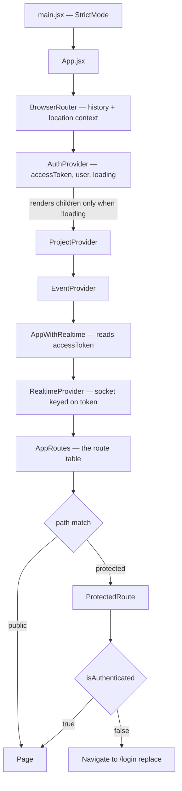
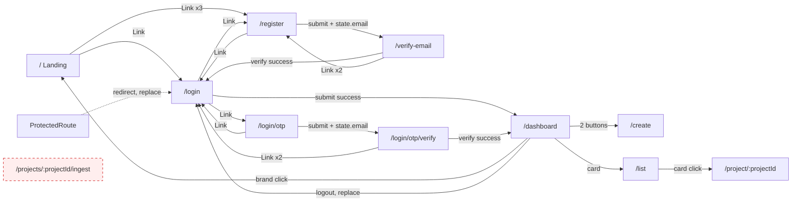
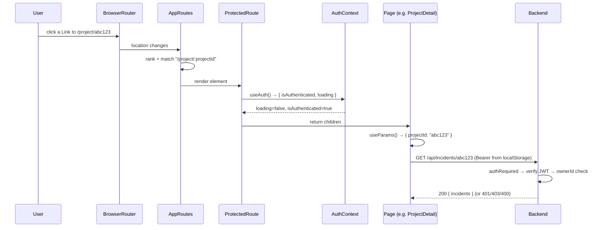
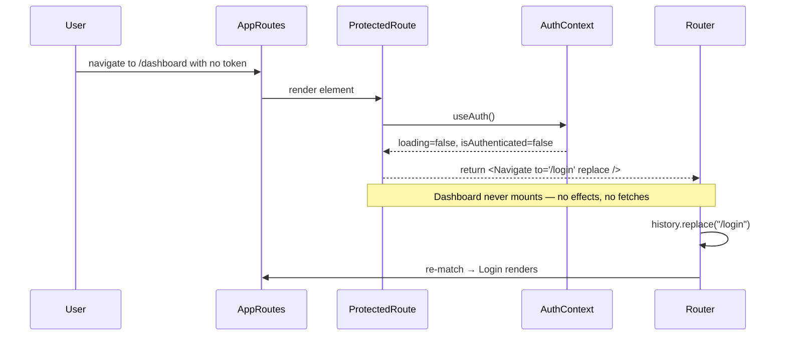
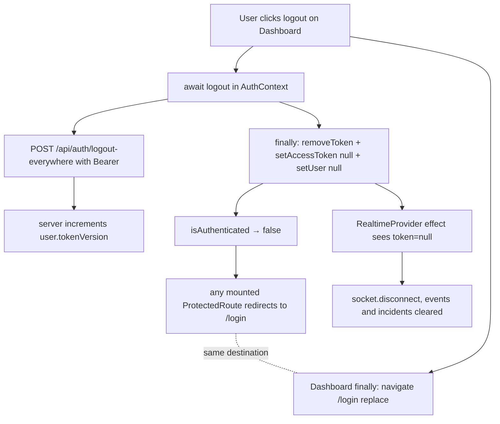

# APILogs Frontend — `routes/` Documentation

> **Source of truth:** every claim below was verified by reading the actual source in
> `frontend/src/routes/` and every file needed to understand its real behaviour — `App.jsx`,
> `main.jsx`, `context/AuthContext.jsx`, `utils/token.js`, all eleven page components, plus
> the backend middleware and routes that decide whether a navigation actually yields data
> (`backend/src/middleware/auth.js`, `backend/src/routes/*.js`). Build and deploy config
> (`vite.config.js`, `index.html`, `package.json`) was checked because `BrowserRouter` has a
> hard server-side requirement. Nothing is assumed. Where the routing table and the rest of
> the app disagree, the **actual** behaviour is documented and listed in
> [§14 Documentation Discrepancies and Bugs](#14-documentation-discrepancies-and-bugs).

---

## Table of Contents

1. [Architecture Overview](#1-architecture-overview)
2. [File Index](#2-file-index)
3. [Complete Route Table](#3-complete-route-table)
4. [Router and Provider Mounting Order](#4-router-and-provider-mounting-order)
5. [AppRoutes.jsx](#5-approutesjsx)
6. [ProtectedRoute.jsx](#6-protectedroutejsx)
7. [Navigation Graph — How Users Actually Move](#7-navigation-graph--how-users-actually-move)
8. [Authentication and Authorization Flow](#8-authentication-and-authorization-flow)
9. [Route Lifecycle Diagrams](#9-route-lifecycle-diagrams)
10. [Route Parameters and Router State](#10-route-parameters-and-router-state)
11. [Error Handling Conventions](#11-error-handling-conventions)
12. [Security Implementation Notes](#12-security-implementation-notes)
13. [Performance, Build and Deployment Notes](#13-performance-build-and-deployment-notes)
14. [Documentation Discrepancies and Bugs](#14-documentation-discrepancies-and-bugs)
15. [Unverified Assumptions](#15-unverified-assumptions)
16. [Interview Preparation Notes](#16-interview-preparation-notes)

---

## 1. Architecture Overview

`frontend/src/routes/` is the **navigation layer** of the APILogs SPA. It is the smallest
folder in `src/` — two files, 66 lines total — but it is the single point that decides which
page renders for a URL and which pages require a session.

```
routes/
├── AppRoutes.jsx      ← the route table: 11 <Route> declarations, 6 public + 5 protected
└── ProtectedRoute.jsx ← the auth gate wrapper used by the 5 protected routes
```

**Responsibility split**

| Concern | Owner | Notes |
|---|---|---|
| History/context creation | `App.jsx` (`<BrowserRouter>`) | **not** in this folder |
| URL → component matching | `AppRoutes.jsx` | flat table, no nesting, no layout routes |
| "Is there a session?" | `ProtectedRoute.jsx` | reads `AuthContext`, redirects if not |
| "Is the session valid?" | the **backend** | `authRequired` middleware; the client never checks |
| Navigation triggers | the pages | `useNavigate()` and `<Link>` inside each page |

**Design characteristics, all verified:**

- **Flat, not nested.** Every `<Route>` is a direct child of `<Routes>`. There are no
  `<Outlet>`s, no layout routes, no index routes, and no nested path segments declared as
  child routes. Each page therefore renders its own full-page chrome (header, background),
  which is why `Dashboard` and `Landing` each duplicate a navbar.
- **Wrapper-based protection, not route-based.** Protection is applied by wrapping the
  element (`element={<ProtectedRoute><Dashboard /></ProtectedRoute>}`) rather than by nesting
  protected routes under a single guarded parent route. That means the guard is repeated five
  times instead of declared once.
- **No data APIs.** React Router 7 is installed (`react-router-dom@^7.13.0`), but none of its
  data-router features are used — no `createBrowserRouter`, no `loader`, no `action`, no
  `errorElement`, no `lazy`. It is used purely as a declarative component router, which is the
  v5/v6-style API that v7 still supports.
- **Eager imports only.** All eleven page modules are imported statically at the top of
  `AppRoutes.jsx`. There is no `React.lazy` / `Suspense` anywhere, so every page — including
  the 708-line `Landing` and the GSAP/Motion animation components it pulls in — is in the
  initial bundle.
- **No catch-all.** There is no `<Route path="*">`, so an unmatched URL renders nothing.

---

## 2. File Index

| File | Lines | Default export | Imports | Consumed by |
|---|---|---|---|---|
| `AppRoutes.jsx` | 49 | `AppRoutes` | `Routes`, `Route` (react-router-dom); `ProtectedRoute`; 11 page components | `App.jsx` → `AppWithRealtime` |
| `ProtectedRoute.jsx` | 17 | `ProtectedRoute` | `Navigate` (react-router-dom); `useAuth` (`../context/AuthContext`) | `AppRoutes.jsx`, 5 times |

Neither file exports anything besides its default. Neither holds state, calls an API, or has
an effect. `ProtectedRoute` is the only one that reads context.

---

## 3. Complete Route Table

Verified line by line against `AppRoutes.jsx`.

| # | Path | Line | Component | File | Guard | Params | Entry points |
|---|---|---|---|---|---|---|---|
| 1 | `/` | 28 | `Landing` | `pages/Landing.jsx` | public | — | direct URL; `Dashboard` brand click |
| 2 | `/login` | 29 | `Login` | `pages/auth/Login.jsx` | public | — | 7 `<Link>`s, `ProtectedRoute` redirect, `Dashboard` logout, `VerifyRegister` success |
| 3 | `/login/otp` | 30 | `LoginWithOtp` | `pages/auth/LoginWithOtp.jsx` | public | — | one `<Link>` on `Login` ("Login with OTP?") |
| 4 | `/login/otp/verify` | 31 | `VerifyLoginOtp` | `pages/auth/VerifyLoginOtp.jsx` | public | — | `LoginWithOtp` submit (**with router state**) |
| 5 | `/register` | 32 | `Register` | `pages/auth/Register.jsx` | public | — | 4 `<Link>`s from Landing / Login / VerifyRegister |
| 6 | `/verify-email` | 33 | `VerifyEmail` | `pages/auth/VerifyRegister.jsx` | public | — | `Register` submit (**with router state**) |
| 7 | `/dashboard` | 36 | `Dashboard` | `pages/Dashboard.jsx` | **protected** | — | `Login` submit, `VerifyLoginOtp` submit |
| 8 | `/create` | 37 | `ProjectCreate` | `pages/project/Project.create.jsx` | **protected** | — | 2 buttons on `Dashboard` |
| 9 | `/list` | 38 | `ProjectList` | `pages/project/Project.list.jsx` | **protected** | — | 1 card on `Dashboard` |
| 10 | `/projects/:projectId/ingest` | 39 | `ProjectIngest` | `pages/Event/Event.ingest.jsx` | **protected** | `projectId` | **none — orphan route** |
| 11 | `/project/:projectId` | 40 | `ProjectDetail` | `pages/project/ProjectDetail.jsx` | **protected** | `projectId` | `ProjectList` card click |
| — | anything else | — | *(nothing renders)* | — | — | — | — |

Two facts stand out and are expanded in §14:

- **Route 10 is unreachable through the UI.** A recursive grep for every `navigate(...)`,
  `<Link to=...>` and `<Navigate to=...>` in `src/` finds no reference to
  `/projects/.../ingest`. The only way to reach the event-ingest page is to type the URL.
- **Routes 9 and 11 use inconsistent path vocabulary**: `/project/:projectId` (singular) for
  detail, `/projects/:projectId/ingest` (plural) for ingest, and `/list` (unscoped) for the
  index. A conventional REST-like scheme would be `/projects`, `/projects/:projectId`,
  `/projects/:projectId/ingest`.

### 3.1 Path-matching notes

React Router 7 ranks static segments above dynamic ones, so there is no ambiguity in this
table — but two adjacencies are worth knowing:

- `/login`, `/login/otp` and `/login/otp/verify` are three **independent flat routes**, not a
  parent with children. Visiting `/login/otp/verify` does not render `Login`.
- `/project/:projectId` will match **any** string in that position, including `/project/abc`.
  Nothing on the client validates the ObjectId shape; `ProjectDetail` passes it straight into
  `getProjectIncidents(projectId)` and into the realtime hook. The rejection happens
  server-side, where `GET /api/incidents/:projectId` responds `400 { message: "Invalid projectId" }`
  and the socket `subscribe` handler emits `subscription-error`. The page then shows its
  generic "Failed to fetch incidents." message.

---

## 4. Router and Provider Mounting Order

`AppRoutes` does **not** create the router. That happens two levels up, and the ordering
matters for how the guard behaves.

```jsx
// src/main.jsx
createRoot(document.getElementById('root')).render(
  <StrictMode><App /></StrictMode>
);

// src/App.jsx
const AppWithRealtime = () => {
  const { accessToken } = useAuth();
  console.log("AppWithRealtime accessToken:", accessToken);   // ⚠ logs a bearer token
  return (
    <RealtimeProvider token={accessToken}>
      <AppRoutes />
    </RealtimeProvider>
  );
};

const App = () => (
  <BrowserRouter>
    <AuthProvider>
      <ProjectProvider>
        <EventProvider>
          <AppWithRealtime />
        </EventProvider>
      </ProjectProvider>
    </AuthProvider>
  </BrowserRouter>
);
```

Three consequences that are invisible from `routes/` alone:

1. **`BrowserRouter` is outermost**, so contexts can use router hooks — but nothing currently
   does; only pages call `useNavigate`/`useParams`/`useLocation`.
2. **`AuthProvider` renders `{!loading && children}`.** The entire route tree — including
   public routes — is withheld until `AuthProvider.loading` flips to `false`. Its mount effect
   sets `loading = false` synchronously in both branches (token present or absent), so this is
   a single extra render, not a visible delay. But it means **`ProtectedRoute`'s `loading`
   branch is effectively dead code**: by the time any route renders, `loading` is already
   `false`, so `<p>Loading...</p>` can never be seen (§14).
3. **`RealtimeProvider` sits between the providers and the routes**, keyed on `accessToken`.
   Logging out sets `accessToken` to `null`, which tears the socket down *and* causes
   `ProtectedRoute` to redirect — both from the same state change.



---

## 5. AppRoutes.jsx

### 5.1 Purpose

Declares the application's complete URL → component mapping. It is a pure, stateless
component: no hooks, no props, no side effects. Its only job is to return a `<Routes>` tree.

### 5.2 Dependencies and exactly how each is used

| Import | Line | Used for |
|---|---|---|
| `React` | 1 | JSX (classic runtime — see §13.3) |
| `Routes`, `Route` | 2 | the matcher and the individual declarations |
| `ProtectedRoute` | 3 | wraps five `element` values |
| `Login`, `Register`, `VerifyEmail`, `LoginWithOtp`, `VerifyLoginOtp` | 5–9 | the five auth pages |
| `ProjectCreate`, `ProjectList` | 12–13 | project pages |
| `ProjectIngest` | 16 | the event page |
| `ProjectDetail` | 18 | project detail |
| `Dashboard`, `Landing` | 21–22 | hub and marketing |

All eleven are **default imports** and all are **eager**. Note line 7:
`import VerifyEmail from "../pages/auth/VerifyRegister"` — the file is named
`VerifyRegister.jsx` but its component is declared `const VerifyEmail`, so the import name
follows the component, not the filename. That mismatch is the reason the route is
`/verify-email` while the file is `VerifyRegister.jsx`.

### 5.3 Exported function

`AppRoutes()` takes no props and returns:

```jsx
<Routes>
  {/* Public Routes */}
  <Route path="/"                 element={<Landing />} />
  <Route path="/login"            element={<Login />} />
  <Route path="/login/otp"        element={<LoginWithOtp />} />
  <Route path="/login/otp/verify" element={<VerifyLoginOtp />} />
  <Route path="/register"         element={<Register />} />
  <Route path="/verify-email"     element={<VerifyEmail />} />

  {/* Protected Routes */}
  <Route path="/dashboard"                  element={<ProtectedRoute> <Dashboard /> </ProtectedRoute>} />
  <Route path="/create"                     element={<ProtectedRoute> <ProjectCreate/> </ProtectedRoute>} />
  <Route path="/list"                       element={<ProtectedRoute> <ProjectList/> </ProtectedRoute>} />
  <Route path="/projects/:projectId/ingest" element={<ProtectedRoute><ProjectIngest /></ProtectedRoute>} />
  <Route path="/project/:projectId"         element={<ProtectedRoute><ProjectDetail /></ProtectedRoute>} />
</Routes>
```

There is no branching, no mapping over a config array, and no conditional route rendering —
the table is fully static, so the same routes exist for authenticated and anonymous users
alike. Authentication changes only what `ProtectedRoute` decides to render, never which routes
exist.

### 5.4 A subtle detail: whitespace inside the guard

Lines 36–38 are written with spaces inside the wrapper:

```jsx
<ProtectedRoute> <Dashboard /> </ProtectedRoute>
```

JSX preserves whitespace that sits on the *same line* between elements, so for these three
routes `ProtectedRoute` receives `children` as an **array of three** — `[" ", <Dashboard/>, " "]` —
whereas lines 39–40 (written without spaces) pass a **single element**. Since `ProtectedRoute`
returns `children` verbatim, the first three protected routes render two stray text nodes
around their page. This is cosmetically invisible in these full-screen layouts and React
handles the array fine, but it is an inconsistency worth normalising.

### 5.5 Return value and side effects

Returns JSX. No state, no effects, no navigation of its own, no cleanup. The component
re-renders only when a parent re-renders; route matching itself is driven by the `location`
context from `BrowserRouter`.

### 5.6 Interview explanation

"`AppRoutes` is the route table and nothing else — a flat list of eleven routes, six public
and five wrapped in a `ProtectedRoute` guard. I'd point out two deliberate-looking but
improvable things: protection is applied per-route by wrapping the element, so the guard is
repeated five times where a single nested layout route with an `<Outlet>` would declare it
once; and every page is imported eagerly, so the marketing landing page and its animation
libraries ship in the same chunk as the dashboard. Adding `React.lazy` plus a `Suspense`
boundary, and a `path="*"` catch-all, would be the first two changes."

---

## 6. ProtectedRoute.jsx

### 6.1 Purpose

A client-side authentication gate. It renders its children only when the auth context reports
a session, and otherwise redirects to `/login`.

### 6.2 Dependencies

| Import | Used for |
|---|---|
| `React` | JSX |
| `Navigate` (react-router-dom) | declarative redirect — renders instead of navigating imperatively in an effect |
| `useAuth` (`../context/AuthContext`) | reads `isAuthenticated` and `loading` |

### 6.3 The exported function, step by step

```jsx
const ProtectedRoute = ({ children }) => {
    const { isAuthenticated, loading } = useAuth();          // 1
    if (loading)          return <p>Loading...</p>;          // 2
    if (!isAuthenticated) return <Navigate to="/login" replace />;  // 3
    return children;                                          // 4
};
```

1. **Read context.** `useAuth()` is `useContext(AuthContext)` with no null check — if this
   component were ever rendered outside `AuthProvider` it would throw
   `TypeError: Cannot destructure property 'isAuthenticated' of null`. In the current tree
   that cannot happen, since `App.jsx` always nests it inside the provider.
2. **Loading branch.** Returns an unstyled `<p>Loading...</p>` — no layout, no spinner.
   As established in §4, this branch is unreachable in practice because `AuthProvider`
   withholds all children until `loading` is already `false`.
3. **Unauthenticated branch.** `<Navigate to="/login" replace />`. Rendering `Navigate`
   (rather than calling `navigate()` in an effect) performs the redirect during the render
   pass, so the protected page never mounts and never fires its data-loading effects — that is
   the correct pattern and it matters here, because `ProjectDetail` and `Project.list` both
   fetch on mount. `replace` swaps the history entry instead of pushing one, so pressing Back
   from `/login` does not bounce the user between the protected URL and the login page.
4. **Authenticated branch.** Returns `children` untouched.

### 6.4 What `isAuthenticated` actually means

Traced into `context/AuthContext.jsx`:

```js
const [accessToken, setAccessToken] = useState(getToken());   // localStorage.getItem("token")
...
isAuthenticated: !!accessToken
```

So the guard's entire test is **"is there a non-empty string in `localStorage` under the key
`token`, as mirrored into React state"**. It does not:

- decode the JWT,
- check the `exp` claim,
- compare the `tv` (token version) claim,
- call the server,
- or distinguish a real token from the string `"x"`.

Setting `localStorage.token = "anything"` in a browser console and reloading is enough to
render every protected page. Nothing sensitive leaks from that, because each page's data comes
from API calls that the backend rejects with `401` — but the user reaches a fully rendered
shell with empty or error-state content rather than being sent to `/login`.

There is a matching comment block in `AuthContext.jsx` (lines 72–73) documenting that
`isAuthenticated` was once `!accessToken` — inverted — and has been fixed to `!!accessToken`.
The current code is correct; only the stale comment remains.

### 6.5 Error handling

None, by design. There is no `try/catch`, no error boundary, and no handling for a missing
provider. The component has exactly three exit paths and all three are total.

### 6.6 Return values

| Condition | Returns |
|---|---|
| `loading === true` | `<p>Loading...</p>` |
| `isAuthenticated === false` | `<Navigate to="/login" replace />` |
| otherwise | `children` verbatim (an element, or an array when the JSX had same-line spaces) |

### 6.7 Interview explanation

"`ProtectedRoute` is a render-time gate. The important choice is returning `<Navigate>` from
render rather than calling `navigate()` inside a `useEffect` — with the effect version the
protected page mounts first and fires its data fetches before the redirect happens, which on
this app would mean firing incident and event requests you're about to throw away. `replace`
keeps the protected URL out of the history stack so Back doesn't ping-pong. The thing I'd be
explicit about in an interview is that this is a **UX** gate, not a security control: it only
checks that a token string exists in state. The real boundary is `authRequired` on the server,
which verifies the signature and the claims, plus the per-resource `ownerId` check in each
controller."

---

## 7. Navigation Graph — How Users Actually Move

Built from a complete grep of every `navigate()`, `<Link to>` and `<Navigate to>` in `src/`.



**Observations from the graph:**

| Finding | Detail |
|---|---|
| `/projects/:projectId/ingest` is an **orphan** | zero inbound links or navigations; reachable only by typing the URL |
| `/create` has **no exit** | `Project.create` never navigates after a successful create — it just clears the form. The user must use the browser Back button |
| `/list` has no "back to dashboard" | only forward navigation into `/project/:id` |
| `/project/:projectId` is a **leaf** | no link onward to the ingest page for the project being viewed — the most natural missing link in the app |
| `/verify-email` sends verified users to `/login` | even though the verify response already contained working tokens that the page stored |
| Only two `replace` navigations exist | the logout in `Dashboard` and the guard's redirect. Every other navigation pushes, so Back after login returns to `/login` |

---

## 8. Authentication and Authorization Flow

### 8.1 The two-layer model

```
Layer 1 — client (this folder)     ProtectedRoute  →  "is there a token string?"      → UX only
Layer 2 — server (backend)         authRequired    →  "is this JWT valid?"            → real security
                                   + ownerId check →  "does this user own this row?"  → real tenancy
```

`ProtectedRoute` decides what **renders**. `authRequired` decides what **data comes back**.
They are independent: passing layer 1 says nothing about passing layer 2, which is exactly the
scenario a stale token produces.

Backend `authRequired` (`backend/src/middleware/auth.js`), verified:

- requires `Authorization: Bearer <token>`, else `401`;
- `jwt.verify(token, env.JWT_ACCESS_SECRET)`, else `401 "Invalid or expired token"`;
- requires both `sub` and `tv` claims, else `401 "Malformed token payload"`;
- sets `req.user = { id: payload.sub, tokenVersion: payload.tv }`;
- **reads `tv` but never compares it to the stored `tokenVersion`**, so "logout everywhere"
  does not actually invalidate previously issued tokens.

### 8.2 Session establishment and teardown, as the router sees it

| Event | What changes | Effect on routing |
|---|---|---|
| Login / OTP verify succeeds | `setAccessToken(token)` + `localStorage.token = token` | `isAuthenticated` → `true`; protected routes render; `RealtimeProvider` opens the socket |
| Page reload | `useState(getToken())` seeds from `localStorage` | session appears restored — **even if the token has expired** |
| Logout (`Dashboard`) | `removeToken()`, `setAccessToken(null)`, `setUser(null)` | `isAuthenticated` → `false`; any mounted protected route immediately redirects; socket tears down; `Dashboard` also navigates to `/login` with `replace` |
| Access token expires | **nothing** | no timer, no 401 interceptor — the guard keeps passing while every API call fails |

That last row is the most consequential routing behaviour in the app: **expiry is invisible to
the router**. There is no axios response interceptor anywhere in `src/api/`, so a `401` never
triggers a redirect. The user sits on a rendered protected page whose content silently fails
to load. The fix is a response interceptor that clears the token and sends the user to
`/login`, which is precisely the hook this routing layer is missing.

### 8.3 Refresh tokens are not part of the flow

`AuthContext`'s init effect contains the comment *"We are not persisting a refresh token yet,
so skip server refresh to avoid 'Missing token'"* and returns early. `refreshToken()` exists in
`api/auth.api.js` but has no caller. So there is no silent renewal and no route-level session
recovery.

---

## 9. Route Lifecycle Diagrams

### 9.1 A protected navigation that succeeds



### 9.2 A protected navigation that is blocked



### 9.3 Logout — one state change, three consequences



Both the guard and the explicit `navigate` target `/login`, so the redirect is idempotent —
the user lands there once regardless of which path wins the race.

---

## 10. Route Parameters and Router State

### 10.1 URL parameters

Only one parameter name exists in the whole table: `projectId`.

| Route | Read by | How | Validation |
|---|---|---|---|
| `/project/:projectId` | `ProjectDetail` | `const { projectId } = useParams()` | none client-side; guarded by `if (projectId)` before fetching, and passed to `useRealtime(projectId)` |
| `/projects/:projectId/ingest` | `ProjectIngest` | `const { projectId } = useParams()` | none; passed straight to `ingestEvent(projectId, ...)` |

`useRealtime` handles a falsy `projectId` by injecting a temporary yellow warning bar into
`document.body` ("No project selected for realtime updates.") and returning early — but since
the route cannot match without a segment, that branch only fires if the hook is used elsewhere.

**No route reads query-string parameters.** `useSearchParams` is never imported. The event
pagination API does take `limit` and `before` query params, but those are sent on the *axios*
request, not carried in the browser URL — so pagination state is not shareable or bookmarkable.

### 10.2 Router state — the out-of-band channel

Two navigations carry `state` instead of a URL segment:

```jsx
// Register.jsx line 33
navigate("/verify-email", { state: { email: form.email } });
// LoginWithOtp.jsx line 19
navigate("/login/otp/verify", { state: { email } });
```

Both destinations read it with `location.state?.email` and both **guard for its absence** by
rendering an "Invalid Session" card with a link back, rather than crashing on `undefined`.

Why this design is right, and what it costs:

| Aspect | Consequence |
|---|---|
| Not in the URL | the email is not in browser history, server logs, or a shareable link — good for a PII-adjacent value mid-auth-flow |
| Not in storage | nothing to clean up, nothing readable by a later XSS |
| **Does not survive reload** | `history.state` is preserved by the browser on reload for the *same* entry, but these pages are reached by a `push`, and a hard refresh or a pasted URL produces no state → the Invalid Session card. This is why both pages need that guard |
| Not typed or validated | any object shape can be passed; the receiver only optional-chains |

---

## 11. Error Handling Conventions

This folder has no `try/catch` and no error boundaries. What it does have is a set of
**structural** error behaviours:

| Situation | Current behaviour | Where |
|---|---|---|
| Unknown URL | **nothing renders** — a blank page, no 404 component | no `path="*"` route |
| Not authenticated | redirect to `/login` with `replace` | `ProtectedRoute` line 13 |
| Auth still loading | `<p>Loading...</p>` (unreachable — see §14) | `ProtectedRoute` line 9 |
| Page component throws during render | **the whole app unmounts** — React 19 with no error boundary blanks the root | nowhere |
| Lazy-load failure | not applicable — no lazy routes | — |
| Invalid `:projectId` | route matches; the page renders; the backend returns `400` and the page shows its own generic error | `ProjectDetail` |
| Missing router state | dedicated "Invalid Session" UI with a recovery link | `VerifyRegister`, `VerifyLoginOtp` |
| API returns `401` mid-session | **nothing** — no redirect, no logout | missing axios response interceptor |

The two genuinely missing pieces are a **catch-all route** and an **error boundary**. Both are
route-layer concerns and both are cheap: a `<Route path="*" element={<NotFound />} />` and an
error boundary wrapped around `<AppRoutes />` (or React Router 7's `errorElement`, which would
require migrating to `createBrowserRouter`).

---

## 12. Security Implementation Notes

### 12.1 What this layer does provide

- **Render-time gating** of five routes, applied before the page mounts, so protected pages
  never fire their data effects for an anonymous visitor.
- **History hygiene** — `replace` on both the guard redirect and the logout navigation, so
  protected URLs do not linger in the back stack after a session ends.
- **Reactive revocation** — because the guard reads `isAuthenticated` from context rather than
  from `localStorage` directly, clearing the token immediately re-renders every mounted
  protected route into a redirect. A guard that read storage on mount only would leave a stale
  page on screen.

### 12.2 What it explicitly does not provide

| Gap | Why it matters | Real mitigation |
|---|---|---|
| No token validation | `localStorage.token = "x"` renders every protected page | server-side `authRequired` (present and correct) |
| No expiry awareness | an expired session renders normally while every request 401s | a 401 response interceptor (**absent**) |
| No role/permission tiers | the guard is binary; there is no admin/member distinction anywhere | not needed today — the backend's model is single-owner-per-project |
| No per-resource authorization | the router lets any authenticated user request `/project/<someone-else's-id>` | server-side `project.ownerId !== req.user.id` → `403` on every project-scoped endpoint, **and** re-checked on the socket `subscribe` handler |
| Token read from `localStorage` | XSS-readable | an httpOnly refresh cookie with an in-memory access token would be stronger |
| `console.log` of the token | `App.jsx` line 12 prints the bearer token to the browser console on every render of `AppWithRealtime` | remove it |

The important framing: **routing is not a security boundary in any SPA.** All route code ships
to the browser and can be edited at runtime. The guard's job is to keep honest users out of
broken states; the backend's job is to keep everyone out of other people's data. In this
codebase the backend does that correctly for every project-scoped resource — REST and
WebSocket alike.

---

## 13. Performance, Build and Deployment Notes

### 13.1 Bundle size — everything is eager

All eleven pages are static imports, so the initial JavaScript chunk contains, transitively:

- `Landing.jsx` (708 lines) plus `Stepper` (Motion) and `StaggeredMenu` (GSAP);
- `ProjectDetail` plus `react-window`, `socket.io-client` and the realtime hook;
- every auth page.

A visitor who only wants `/login` still downloads the dashboard, the virtualised feed, the
socket client and both animation engines. The standard remedy is route-level code splitting:

```jsx
const Landing = React.lazy(() => import("../pages/Landing"));
// ... and wrap <Routes> in <Suspense fallback={...}>
```

That is a pure win here because the route boundaries are already clean — no page shares state
with another except through the providers, which sit above the router.

### 13.2 Re-render behaviour

`AppRoutes` is stateless, but it re-renders whenever `AppWithRealtime` does, which happens
whenever `AuthContext` value changes (login, logout, user set). Since `AuthProvider` builds a
**new `value` object on every render** (it is not memoised), every context consumer re-renders
on any auth change. With eleven cheap `<Route>` declarations this is negligible, but it is the
mechanism by which a logout instantly re-evaluates every guard.

React 18/19 `StrictMode` is enabled in `main.jsx`, so in development every page's effects run
twice on mount — visible as duplicate `GET /api/project/list` and duplicate incident fetches
when landing on `/list` and `/project/:id`.

### 13.3 Build configuration relevant to routing

`vite.config.js` registers **only** the Tailwind plugin:

```js
export default defineConfig({ plugins: [tailwindcss()] });
```

`@vitejs/plugin-react` is present in `devDependencies` but **is not registered**. The practical
consequence is that React Fast Refresh is not active, so editing a page component during
development reloads rather than hot-updating state. JSX itself still compiles because every
file in this project imports `React` explicitly and Vite's esbuild handles `.jsx`. *(The exact
JSX transform Vite falls back to was not confirmed by running a build — see §15.)*

### 13.4 `BrowserRouter` requires a server-side SPA fallback

This is the routing concern with the largest production impact. `BrowserRouter` uses the real
History API, so `https://app.example.com/dashboard` is a genuine HTTP request for `/dashboard`
when the user refreshes or pastes the link. A static host must be configured to serve
`index.html` for **every** unmatched path.

Verified: the repository contains **no** `vercel.json`, `netlify.toml`, `public/_redirects`,
`nginx.conf` or `Dockerfile`, and `vite.config.js` sets no `base` or rewrite configuration.
`vite dev` and `vite preview` handle the fallback automatically, so this is invisible in
development — but on a plain static host, **every protected route would 404 on refresh or
direct link**. Whichever host is used, the fallback rule must be added there (this is a
deployment-config gap, not a code bug). *(Deployment target unknown — see §15.)*

---

## 14. Documentation Discrepancies and Bugs

Ordered by impact. All traced from source; none confirmed by running the app.

### 14.1 Functional gaps

| # | Location | Problem | Effect |
|---|---|---|---|
| 1 | `AppRoutes.jsx` | **No `<Route path="*">` catch-all** | any typo'd or stale URL renders a completely blank page with no explanation and no way back |
| 2 | `AppRoutes.jsx` line 39 | `/projects/:projectId/ingest` is an **orphan route** — grep finds zero `Link`/`navigate` references anywhere in `src/` | the event-ingest page is unreachable through the UI; it can only be opened by typing the URL |
| 3 | `App.jsx` + `ProtectedRoute` | `AuthProvider` renders `{!loading && children}`, so routes never mount while `loading` is `true` | `ProtectedRoute`'s `if (loading) return <p>Loading...</p>` is **unreachable dead code** |
| 4 | missing across `src/api/` | **No axios response interceptor for `401`** | an expired token keeps passing the guard forever; the user stays on a rendered protected page whose every request fails silently. This is the single most valuable addition to the routing layer |
| 5 | `AppRoutes.jsx` | **No `React.lazy` / `Suspense`** on any route | the landing page, dashboard, socket client, `react-window`, GSAP and Motion all ship in one initial chunk |
| 6 | nowhere | **No error boundary** around the route tree | a render-time throw in any page blanks the entire app |
| 7 | deployment config | `BrowserRouter` with **no SPA fallback config** committed (no `vercel.json` / `_redirects` / nginx conf) | on a static host, refreshing or deep-linking any route other than `/` returns 404 |

### 14.2 Consistency and design issues

| # | Location | Problem |
|---|---|---|
| 8 | route table | **Inconsistent path vocabulary**: `/list` (index), `/project/:projectId` (singular), `/projects/:projectId/ingest` (plural), `/create` (unscoped). A consistent scheme would be `/projects`, `/projects/:projectId`, `/projects/:projectId/ingest`, `/projects/new` |
| 9 | `AppRoutes.jsx` lines 36–38 | Same-line whitespace inside `<ProtectedRoute> … </ProtectedRoute>` makes `children` a **3-element array** (two stray text nodes) for `/dashboard`, `/create` and `/list`, but a single element for the other two protected routes |
| 10 | `AppRoutes.jsx` lines 40–44 | Malformed formatting — the `/project/:projectId` route's closing `/>` sits three lines below the element, followed by blank lines |
| 11 | `AppRoutes.jsx` | Protection is repeated per-route (five wrappers) instead of one nested layout route with `<Outlet />`, which is the idiomatic v6/v7 pattern and would make adding a shared authenticated shell (navbar, sidebar) trivial |
| 12 | `AppRoutes.jsx` line 7 | `import VerifyEmail from "../pages/auth/VerifyRegister"` — filename and component name disagree (`VerifyRegister.jsx` exports `VerifyEmail`), which is also why the path is `/verify-email` |
| 13 | navigation graph | `/create` has **no post-success navigation** — creating a project leaves the user on an empty form with no confirmation and no route onward to `/list` |
| 14 | navigation graph | `/project/:projectId` has **no link to that project's ingest page**, which is the missing edge that makes #2 possible |
| 15 | `VerifyRegister.jsx` | Navigates to `/login` after verification even though it just stored working tokens via `loginwithTokens(data)` — `/dashboard` would match the state it created |
| 16 | `ProtectedRoute.jsx` | `useAuth()` is used without a null guard; rendering outside `AuthProvider` throws a destructuring `TypeError` rather than a helpful message (the sibling `useProject` and `useEvent` hooks *do* throw descriptive errors) |
| 17 | `App.jsx` line 12 | `console.log("AppWithRealtime accessToken:", accessToken)` prints the bearer token to the console on every render |
| 18 | `vite.config.js` | `@vitejs/plugin-react` is installed but not registered, so React Fast Refresh is inactive during development |
| 19 | `AuthContext.jsx` lines 72–73 | A stale comment block describes an `isAuthenticated: !accessToken` bug that has already been fixed to `!!accessToken`; the comment now contradicts the code |

### 14.3 Things that are correct and should be preserved

- `<Navigate>` returned from render (not `navigate()` in an effect) — prevents protected pages
  from mounting and firing their fetches before the redirect.
- `replace` on both the guard redirect and the logout navigation — correct history semantics.
- Reading auth from **context**, not from `localStorage`, inside the guard — makes revocation
  reactive.
- Router state (not URL params) for the mid-flow email, with an explicit "Invalid Session"
  fallback on both receiving pages.
- `BrowserRouter` outermost, above all providers — the correct nesting order.
- A flat route table with no ambiguous patterns — React Router's ranking never has to
  disambiguate anything here.

---

## 15. Unverified Assumptions

**Not verified from the available source code:**

1. **Runtime behaviour.** Nothing was confirmed by running the app, a browser, or a test
   suite. Every finding — including the blank page on an unmatched URL and the dead `loading`
   branch — is derived by reading source and applying documented React/React Router semantics.
2. **Deployment target and its SPA fallback.** No host configuration exists in the repo, so
   whether the production environment already rewrites unmatched paths to `index.html`
   (Vercel and Netlify do this by default for SPAs; plain nginx and S3 do not) is unknown.
   §13.4 states the requirement, not a confirmed failure.
3. **The exact JSX transform Vite falls back to** without `@vitejs/plugin-react`. The Fast
   Refresh consequence is certain; the precise esbuild `jsx` mode was not confirmed by
   building.
4. **React Router 7 internals.** Ranking rules, `Navigate` render-phase semantics and
   `history.state` behaviour across reloads are taken from documented behaviour, not read from
   the package source.
5. **Whether the orphan ingest route is intentional.** It may be a deliberate
   developer/debug-only page reached by typing the URL, or an unfinished feature. Intent is
   unknown.
6. **`VITE_Backend_URL`.** No `.env` exists in `frontend/`; if unset, `api/api.js` builds a
   `baseURL` of `"undefined/api"` and every request from every route fails. This affects what
   a routed page displays, though not routing itself.
7. **Whether `StrictMode` remains enabled in production builds** — it is in `main.jsx`, and
   React strips its double-invocation in production, but this was not verified against a build
   output.

---

## 16. Interview Preparation Notes

### 16.1 Questions to expect

**Q: How does route protection work in your app?**
`ProtectedRoute` is a wrapper component read at render time. It pulls `isAuthenticated` and
`loading` from `AuthContext`; if there's no session it returns `<Navigate to="/login" replace />`
instead of the children, so the protected page never mounts. Five routes use it. Then
immediately volunteer the limitation: it only checks that a token string exists in state — it
doesn't decode the JWT or check expiry. The real enforcement is `authRequired` on the server
plus a per-resource `ownerId` comparison in each controller.

**Q: Why return `<Navigate>` instead of calling `navigate()` in a `useEffect`?**
Because with the effect version, React mounts the protected page first, runs its effects, and
*then* redirects. On this app that means `ProjectDetail` would fire its incident fetch and its
socket subscribe before being thrown away. Returning `<Navigate>` from render redirects during
the render pass, so nothing mounts. It's also declarative — the component is a pure function of
auth state.

**Q: Why `replace`?**
Without it, the guard pushes `/login` on top of `/dashboard`, so pressing Back returns to
`/dashboard`, which redirects again — an infinite ping-pong. `replace` swaps the entry so the
protected URL never enters the back stack. Same reasoning for the logout navigation.

**Q: Is client-side route protection secure?**
No, and it can't be — all route code ships to the browser and can be edited at runtime. Setting
`localStorage.token` to any string renders every protected page in this app. What makes that
harmless is that the pages have no data of their own: every request they fire is verified by
`authRequired` and rejected with a 401, and every project-scoped endpoint additionally compares
`project.ownerId` to the JWT subject. The router's job is UX; the server's job is security.

**Q: What happens when the access token expires while the user is browsing?**
Right now, nothing — and that's a gap I'd fix first. There's no expiry timer and no axios
response interceptor for 401, so `isAuthenticated` stays true, the guard keeps passing, and the
user sits on a rendered page whose every request fails silently. The fix is a response
interceptor that clears the token and redirects to `/login`, ideally paired with persisting the
refresh token and doing silent renewal — the refresh endpoint exists, it just has no caller.

**Q: How do you pass data between routes without putting it in the URL?**
Router state: `navigate("/verify-email", { state: { email } })`, read on the other side with
`location.state?.email`. It's used for the mid-auth-flow email so it stays out of the URL,
history and logs. The trade-off is that it doesn't survive a refresh or a pasted link, which
is why both receiving pages guard for its absence and render an "Invalid Session" card with a
link back instead of crashing.

**Q: What would you change about this routing setup?**
Ranked: (1) add a `path="*"` catch-all — right now an unknown URL renders a blank page;
(2) add the 401 interceptor described above; (3) `React.lazy` + `Suspense` per route, since
everything is eagerly imported and `/login` currently ships GSAP, Motion, socket.io and
react-window; (4) restructure the five repeated guards into one nested layout route with an
`<Outlet />`, which also gives you a place to put a shared authenticated navbar; (5) add an
error boundary; (6) link the orphaned ingest route from the project detail page; (7) confirm
the host rewrites unmatched paths to `index.html`, since `BrowserRouter` needs that.

**Q: `BrowserRouter` vs `HashRouter` — why does it matter here?**
`BrowserRouter` produces clean URLs via the History API, but the server has to cooperate:
`/dashboard` is a real HTTP request on refresh, so the host must serve `index.html` for
unmatched paths. `HashRouter` puts everything after `#`, so the server only ever sees `/` — no
config needed, but uglier URLs and worse for SEO. This app uses `BrowserRouter` and has no
rewrite config committed, so that's a deployment checklist item.

### 16.2 Concepts to be able to define cold

Declarative vs imperative navigation · render-phase redirects and why they beat effect-based
ones · `replace` vs `push` history semantics · React Router route ranking (static beats
dynamic) · nested routes and `<Outlet />` · layout routes · `useParams` / `useLocation` /
`useNavigate` / `useSearchParams` · router state vs URL params vs storage · `React.lazy` +
`Suspense` for route-level code splitting · error boundaries and React Router's `errorElement`
· `BrowserRouter` vs `HashRouter` and the SPA-fallback requirement · why client-side guards are
UX, not security · JWT expiry handling and 401 interceptors · StrictMode double-invocation in
development.

### 16.3 The honest framing to use

This is a small, readable routing layer that gets the two subtle things right — redirecting
from render rather than from an effect, and using `replace` so the history stack stays sane —
and it correctly defers real authorization to the server. Its weaknesses are all *absences*
rather than mistakes: no catch-all, no lazy loading, no error boundary, no 401 handling, and
one route that nothing links to. Naming those precisely, with the one-line fix for each, reads
far better than claiming the routing is finished.
