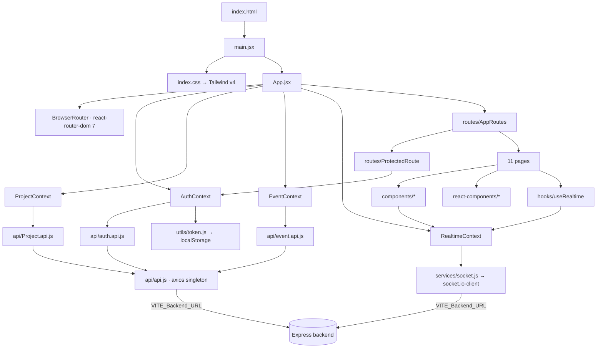

# APILogs Frontend — `src/` Entry Points Documentation

> **Scope:** the two application entry files at the root of `frontend/src/` — **`main.jsx`**
> (the bootstrap) and **`App.jsx`** (the composition root) — plus `index.css`, the third root
> file. The subfolders each have their own document: `api/apis.md`, `components/components.md`,
> `context/context.md`, `hooks/hooks.md`, `pages/pages.md`,
> `react-components/react_components.md`, `routes/routes.md`, `services/services.md`,
> `utils/utils.md`.
>
> **Source of truth:** every claim was verified by reading the actual source of both entry
> files and everything they mount — all four context providers, `routes/AppRoutes.jsx`,
> `index.html`, `vite.config.js`, `eslint.config.js`, and the installed React version in
> `node_modules`. **One finding in this document was verified by execution rather than
> inspection:** `npx eslint src/App.jsx src/main.jsx` was run and its output is quoted verbatim
> in §13.1. Everything else is static analysis. Issues are listed in
> [§13 Documentation Discrepancies and Bugs](#13-documentation-discrepancies-and-bugs).

---

## Table of Contents

1. [Architecture Overview](#1-architecture-overview)
2. [File Index](#2-file-index)
3. [main.jsx — Complete Documentation](#3-mainjsx--complete-documentation)
4. [App.jsx — Complete Documentation](#4-appjsx--complete-documentation)
5. [The Provider Hierarchy — Why the Order Is What It Is](#5-the-provider-hierarchy--why-the-order-is-what-it-is)
6. [Bootstrap Lifecycle](#6-bootstrap-lifecycle)
7. [Application Dependency Map](#7-application-dependency-map)
8. [Re-render Cascade Analysis](#8-re-render-cascade-analysis)
9. [StrictMode Implications](#9-strictmode-implications)
10. [index.css — The Styling Entry Point](#10-indexcss--the-styling-entry-point)
11. [Error Handling Conventions](#11-error-handling-conventions)
12. [Security and Performance Notes](#12-security-and-performance-notes)
13. [Documentation Discrepancies and Bugs](#13-documentation-discrepancies-and-bugs)
14. [Unverified Assumptions](#14-unverified-assumptions)
15. [Interview Preparation Notes](#15-interview-preparation-notes)

---

## 1. Architecture Overview

`frontend/src/` has exactly three files at its root; everything else is a folder. Those three
files are the **entry layer** — the boundary between the browser and the application.

```
src/
├── main.jsx        ← BOOTSTRAP: attaches React to the DOM. 10 lines.
├── App.jsx         ← COMPOSITION ROOT: assembles router + 4 providers + routes. 32 lines.
├── index.css       ← STYLING ENTRY: Tailwind import + one custom font class. 7 lines.
│
├── api/            ← HTTP layer (axios instance + 4 endpoint modules)
├── components/     ← domain UI (ActivityFeed, IncidentList, IncidentSummary)
├── context/        ← 4 global state providers
├── hooks/          ← useRealtime
├── pages/          ← 11 route-level components
├── react-components/ ← animation/visual-effect library components
├── routes/         ← route table + auth guard
├── services/       ← Socket.IO transport factory
└── utils/          ← token storage
```

**The two entry files have cleanly separated jobs:**

| | `main.jsx` | `App.jsx` |
|---|---|---|
| Concern | *how* React attaches to the page | *what* the application is made of |
| Knows about | the DOM, React 19's client renderer, global CSS | routing, global state, the route table |
| Would change when | switching renderer, adding a service worker, wrapping the root | adding a provider, reordering state, adding an error boundary |
| Imperative or declarative | imperative (one `createRoot(...).render(...)` call) | purely declarative (returns JSX) |
| Lines | 10 | 32 |

That separation is the conventional Vite + React structure and it is respected here: `main.jsx`
contains **no application logic**, and `App.jsx` contains **no DOM access**.

**What `App.jsx` establishes for every page in the app:** a history/location context, an auth
session, a project list cache, event-ingest status, and a live WebSocket connection — all
mounted once, above the router, so that navigating between pages never tears any of them down.

---

## 2. File Index

| File | Lines | Exports | Imports | Imported by |
|---|---|---|---|---|
| `main.jsx` | 10 | *(none — it is a side-effect module)* | `React`/`StrictMode`, `createRoot`, `./index.css`, `./App.jsx` | `index.html` via `<script type="module" src="/src/main.jsx">` |
| `App.jsx` | 32 | `App` (default) | `React`/`useContext`, `BrowserRouter`, 4 providers, `AppRoutes` | `main.jsx` |
| `index.css` | 7 | — | `tailwindcss` (CSS `@import`) | `main.jsx` |

`App.jsx` also declares one **non-exported** internal component, `AppWithRealtime`, documented
in §4.3.

Installed versions read from `node_modules`: **react 19.3.0**, **react-dom 19.3.0**
(`package.json` declares `^19.2.0`).

---

## 3. main.jsx — Complete Documentation

### 3.1 Purpose

The application bootstrap: create a React 19 root against the DOM node provided by
`index.html`, load the global stylesheet, and render `<App />` inside `StrictMode`. It is the
first application code the browser executes.

### 3.2 Complete source with line-by-line analysis

```jsx
import React, { StrictMode } from 'react'      // 1
import { createRoot } from 'react-dom/client'  // 2
import './index.css'                           // 3
import App from './App.jsx'                    // 4

createRoot(document.getElementById('root')).render(   // 6
  <StrictMode>                                        // 7
    <App />                                           // 8
  </StrictMode>,                                      // 9
)
```

**Line 1 — `import React, { StrictMode }`.** `StrictMode` is used on line 7. The default
`React` import is **not referenced anywhere in this file**, but unlike `App.jsx`'s unused
import it does *not* fail linting, because `eslint.config.js` sets
`'no-unused-vars': ['error', { varsIgnorePattern: '^[A-Z_]' }]` and `React` starts with a
capital letter. Whether it is also needed for the JSX transform depends on which transform Vite
applies (§14) — under the classic runtime `React` must be in scope; under the automatic runtime
it is redundant.

**Line 2 — `createRoot` from `react-dom/client`.** The React 18+ concurrent root API, as
opposed to the legacy `ReactDOM.render`. Using it is what enables concurrent features
(automatic batching across async boundaries, transitions, and the `StrictMode` double-invoke
behaviour in development).

**Line 3 — `import './index.css'`.** A **side-effect import**: it has no binding because the
value is irrelevant. Vite intercepts it, processes the file through PostCSS/Tailwind, and in
development injects it as a `<style>` tag; in a production build it is extracted into a
stylesheet linked from the generated HTML. Importing it *here* rather than in `index.html`
means the CSS participates in the module graph — so HMR works for it, and the bundler can hash
and cache-bust it.

**Line 4 — `import App from './App.jsx'`.** Note the explicit `.jsx` extension, which the
other imports in this codebase omit. Vite resolves both.

**Line 6 — `createRoot(document.getElementById('root'))`.** The only DOM access in the entire
application (verified — no other file calls `getElementById`, though `useRealtime` does use
`document.createElement`/`document.body.appendChild` for its status bars). The target is
`<div id="root"></div>` in `index.html`, confirmed present.

**There is no null check.** If the element were missing, `createRoot(null)` throws
`Target container is not a DOM element` and the app never mounts — a blank page with a console
error. Since `index.html` is committed alongside this file and always contains the div, this is
a theoretical rather than practical risk; a defensive version would be:

```jsx
const container = document.getElementById('root');
if (!container) throw new Error('Root container #root not found');
createRoot(container).render(...);
```

**Lines 7–9 — `<StrictMode>`.** Wraps the entire tree. In **development** this makes React:

- double-invoke component function bodies, `useState` initialisers, and `useMemo`/`useReducer`
  functions — surfacing impure render logic;
- mount → unmount → re-mount every component once, running each effect's setup, cleanup and
  setup again — surfacing missing cleanup;
- warn about deprecated APIs and unsafe lifecycles.

In **production builds React strips all of it**, so `StrictMode` costs nothing at runtime for
users. Its consequences for this specific app are significant enough to have their own
section — see §9.

### 3.3 Inputs, outputs, side effects

| | |
|---|---|
| **Exports** | none — this is a side-effect module, executed for what it does, not what it returns |
| **Side effects** | creates a React root; mounts the entire component tree; injects/links the global stylesheet |
| **Error modes** | throws if `#root` is absent; any throw during the initial render of `App` propagates here uncaught (no error boundary exists — §11) |
| **Idempotent?** | No. Calling `createRoot` twice on the same container is a React error. The module is imported once by `index.html` |

### 3.4 Interview explanation

"`main.jsx` is the bootstrap — ten lines, no application logic. It uses React 19's
`createRoot` from `react-dom/client` rather than the legacy render API, which is what enables
concurrent features and automatic batching. The CSS is a side-effect import so it goes through
Vite's module graph and gets HMR and cache-busting. And everything is wrapped in `StrictMode`,
which in development double-invokes renders and effects to surface impurity and missing
cleanup, and is stripped entirely in production. The one thing I'd add is a null check on the
root container so a missing `#root` fails with a clear message instead of React's generic one."

---

## 4. App.jsx — Complete Documentation

### 4.1 Purpose

The **composition root**. It assembles the application's cross-cutting infrastructure — routing
context, four state providers, and the realtime connection — in a specific nesting order, and
places the route table at the bottom. Every page in the app renders inside this structure.

### 4.2 Dependencies and exactly how each is used

| Import | Line | Used for |
|---|---|---|
| `React` | 1 | JSX |
| `useContext` | 1 | **nothing — unused import that fails `npm run lint`** (§13.1) |
| `BrowserRouter` | 2 | creates history + location context; uses the HTML5 History API |
| `AuthProvider` | 3 | session state: `accessToken`, `user`, `loading` |
| `useAuth` | 3 | consumed by `AppWithRealtime` to read `accessToken` |
| `ProjectProvider` | 4 | the projects array + `fetchProjects` / `createProject` |
| `EventProvider` | 5 | ingest `loading` / `error` / `success` |
| `RealtimeProvider` | 6 | owns the Socket.IO connection, `events[]`, `incidents[]` |
| `AppRoutes` | 7 | the 11-route table |

Line 9 carries an explanatory comment: *"We use RealtimeProvider instead of RealtimeContext for
clarity and proper context usage"* — i.e. the module exports both the raw context object and a
provider component, and this file deliberately mounts the provider.

### 4.3 `AppWithRealtime` — the internal bridge component

```jsx
const AppWithRealtime = () => {
  const { accessToken } = useAuth();
  console.log("AppWithRealtime accessToken:", accessToken);
  return (
    <RealtimeProvider token={accessToken}>
      <AppRoutes />
    </RealtimeProvider>
  );
};
```

**Why this component has to exist.** `RealtimeProvider` needs the auth token as a prop, and the
token lives in `AuthContext`. A component can only consume a context that an **ancestor**
provides — so `App` itself cannot call `useAuth()`, because `App` is the component *rendering*
`AuthProvider`. `AppWithRealtime` is the standard solution: an intermediate component that sits
*inside* `AuthProvider` and is therefore able to read from it, then passes the value down as a
prop. This is a genuine React constraint, not an arbitrary indirection, and it is the single
most explainable design decision in the file.

**Step by step:**

1. `useAuth()` → `useContext(AuthContext)` → `{ user, accessToken, loading, isAuthenticated, login, register, verifyEmail, logout, loginwithTokens }`; only `accessToken` is destructured.
2. `console.log(...)` — **logs the bearer token to the browser console on every render** (§13).
3. Renders `RealtimeProvider` with `token={accessToken}`, which drives that provider's
   `useEffect([token])`: a non-null token opens the socket; `null` disconnects it and clears
   `events` and `incidents`.
4. `AppRoutes` renders inside it, so every page can call `useRealtimeContext()`.

**The consequence worth naming:** because the socket effect keys on `token`, *login opens the
socket and logout closes it*, automatically, with no explicit connect/disconnect call anywhere
in the UI. Session lifetime and connection lifetime are the same thing by construction.

### 4.4 `App` — the exported component

```jsx
const App = () => (
  <BrowserRouter>
    <AuthProvider>
      <ProjectProvider>
        <EventProvider>
          <AppWithRealtime />
        </EventProvider>
      </ProjectProvider>
    </AuthProvider>
  </BrowserRouter>
);
export default App;
```

An arrow function with an implicit return — no hooks, no state, no props, no effects. It is a
pure structural declaration: five nested wrappers and nothing else. Its entire behaviour is the
*order* of that nesting, which §5 analyses.

### 4.5 Return values and side effects

| | |
|---|---|
| **`AppWithRealtime`** | returns `<RealtimeProvider><AppRoutes /></RealtimeProvider>`; side effect: one `console.log` per render |
| **`App`** | returns the provider tree; no side effects of its own — though mounting it transitively starts `AuthProvider`'s init effect, `RealtimeProvider`'s socket effect, and the router's history subscription |

### 4.6 Interview explanation

"`App.jsx` is the composition root — it declares the provider hierarchy and mounts the router.
The interesting part is `AppWithRealtime`. The realtime provider needs the auth token as a
prop, but the token lives in `AuthContext`, and `App` can't consume a context it's rendering —
only descendants can. So `AppWithRealtime` is an intermediate component inside `AuthProvider`
that reads the token and passes it down. That bridging makes the socket's lifetime equal to the
session's lifetime: logging in opens it, logging out closes it and clears the buffers, with no
imperative connect call anywhere. Two things I'd fix immediately: it logs the bearer token to
the console on every render, and there's an unused `useContext` import that actually fails the
project's own lint script."

---

## 5. The Provider Hierarchy — Why the Order Is What It Is

```
BrowserRouter          ← outermost: history + location
└── AuthProvider       ← session; GATES ALL CHILDREN on !loading
    └── ProjectProvider
        └── EventProvider
            └── AppWithRealtime   ← bridge: reads accessToken
                └── RealtimeProvider   ← socket, keyed on the token
                    └── AppRoutes      ← the 11 routes
```

### 5.1 Which orderings are *required* and which are incidental

| Constraint | Required? | Why |
|---|---|---|
| `BrowserRouter` outside everything | **Yes, if** any provider ever uses a router hook | none currently does, so today it is defensive — but it costs nothing and prevents a future `useNavigate()` inside a provider from breaking |
| `AuthProvider` above `AppWithRealtime` | **Yes** | `useAuth()` requires an ancestor provider; this is the React rule that forces the bridge component to exist |
| `RealtimeProvider` above `AppRoutes` | **Yes** | `ProjectDetail`, `ActivityFeed` and `useRealtime` all call `useRealtimeContext()` |
| `AuthProvider` above `ProjectProvider` / `EventProvider` | **No** | neither reads auth context — they rely on the axios interceptor reading `localStorage` directly. They could sit anywhere. Placing them under `AuthProvider` is conventional (session-scoped data nested inside session) but not enforced by code |
| `ProjectProvider` above `EventProvider` | **No** | they are entirely independent |

So of five nesting decisions, **three are load-bearing and two are convention**.

### 5.2 The gate that shapes everything: `{!loading && children}`

`AuthProvider` ends with:

```jsx
return <AuthContext.Provider value={value}>{!loading && children}</AuthContext.Provider>;
```

**Nothing below `AuthProvider` renders while `loading` is `true`** — not the other providers,
not the router's routes, not even public pages. This single expression has three consequences
documented elsewhere in this suite and worth consolidating here:

1. It prevents a **flash of unauthenticated content**: a user with a valid stored token never
   sees `/login` flicker before the session restores.
2. It makes `ProtectedRoute`'s `if (loading) return <p>Loading...</p>` branch **unreachable
   dead code** — by the time any route mounts, `loading` is already `false`.
3. Because `AuthProvider`'s init effect sets `loading = false` synchronously in both its
   branches (token present or absent), the gate lasts exactly one render — it is not a visible
   delay.

### 5.3 What is deliberately *not* here

| Absent | Consequence |
|---|---|
| **Error boundary** | verified: no `componentDidCatch`, `getDerivedStateFromError`, or `ErrorBoundary` anywhere in `src/`. Any render-time throw in any component unmounts the whole tree → blank page |
| **`Suspense` / `React.lazy`** | verified absent: every page is eagerly imported by `AppRoutes`, so the initial bundle contains all 11 pages plus GSAP, Motion, `react-window` and `socket.io-client` |
| **A theme or i18n provider** | styling is Tailwind utility classes plus inline styles; no theming layer |
| **A global toast/notification provider** | which is why error reporting is fragmented: per-page banners, `alert()` in `IncidentList`, and raw `document.body` DOM bars in `useRealtime` |
| **A query cache (React Query/SWR)** | each page fetches in its own `useEffect`; `ProjectContext` is the only cache, and only for the project list |

---

## 6. Bootstrap Lifecycle

```mermaid
sequenceDiagram
    participant B as Browser
    participant H as index.html
    participant M as main.jsx
    participant R as React 19 root
    participant A as App.jsx
    participant AC as AuthProvider
    participant AWR as AppWithRealtime
    participant RP as RealtimeProvider
    participant RT as AppRoutes

    B->>H: GET /
    H->>M: <script type="module" src="/src/main.jsx">
    M->>M: import ./index.css (Vite injects/links the stylesheet)
    M->>B: document.getElementById('root')
    M->>R: createRoot(container)
    R->>A: render(<StrictMode><App /></StrictMode>)
    A->>A: BrowserRouter reads window.location, subscribes to history
    A->>AC: mount AuthProvider
    AC->>AC: useState(getToken()) — seed accessToken from localStorage["token"]
    AC->>AC: loading = true → children withheld
    AC->>AC: init effect runs → setLoading(false) synchronously (both branches)
    AC->>A: re-render — children now allowed
    A->>A: ProjectProvider, EventProvider mount (empty state)
    A->>AWR: mount bridge
    AWR->>AC: useAuth() → accessToken
    AWR->>RP: <RealtimeProvider token={accessToken}>
    alt token present
        RP->>RP: createSocketConnection(token) → WebSocket handshake
        RP->>RP: start the 100ms event-queue flush interval
    else token null
        RP->>RP: disconnect any socket; clear events + incidents
    end
    RP->>RT: render AppRoutes
    RT->>RT: match window.location.pathname → page (guarded or not)
```

### 6.1 Ordering guarantee worth knowing

The socket connection is attempted **before** the matched route renders, because
`RealtimeProvider` is an ancestor of `AppRoutes`. So on a hard load of `/project/abc123`, the
socket handshake begins first, and `ProjectDetail`'s own `useRealtime` effect then emits
`subscribe` once mounted. Socket.IO buffers emits issued before the connection completes and
flushes them on `connect`, so the ordering is safe — *(buffering behaviour is documented
Socket.IO client behaviour; not verified at runtime here)*.

---

## 7. Application Dependency Map

What the two entry files transitively pull in — the whole application, since they are the root.



**Single points of configuration reachable from the root:**

| Concern | Single definition site |
|---|---|
| Backend origin | `VITE_Backend_URL` — read in `api/api.js` and `services/socket.js` |
| Token storage | `utils/token.js` (the only Web Storage access in `src/`) |
| HTTP client | `api/api.js` (one axios instance; two modules attach interceptors to it) |
| Socket construction | `services/socket.js` (the only `socket.io-client` import) |
| Route table | `routes/AppRoutes.jsx` |
| Global styling | `index.css` |

---

## 8. Re-render Cascade Analysis

This is where the composition root's structure has real runtime consequences.

### 8.1 None of the four context values is memoised

Verified by grep: `AuthContext`, `EventContext` and `Project.Context` each build
`const value = { ... }` as a fresh object literal on every render, and `RealtimeContext` passes
an inline object literal straight into `value={{ ... }}`. **There is no `useMemo` in any
context file.**

Because context consumers re-render when the provider's `value` is referentially different, a
new object every render means **every consumer of that context re-renders whenever the provider
re-renders**, even if the underlying data is unchanged.

### 8.2 What this costs in practice

| Provider re-renders when | Consumers that re-render |
|---|---|
| `AuthProvider` — `user`, `accessToken` or `loading` changes | `AppWithRealtime`, every mounted `ProtectedRoute`, `Dashboard` |
| `ProjectProvider` — `projects`, `loading` or `error` changes | `Project.list`, `Project.create` |
| `EventProvider` — ingest `loading`/`error`/`success` changes | `Event.ingest` |
| `RealtimeProvider` — **every 100 ms flush that has queued events** | `ProjectDetail`, `ActivityFeed`, and any `useRealtimeContext()` consumer |

The last row is the only one on a hot path, and it is already mitigated well: events are queued
in a ref and flushed at most every 100 ms, the array is capped at 50, `ActivityFeed` virtualises
through `react-window`, and its `Row` is `React.memo`'d with memoised `rowProps`. So the
un-memoised value costs little **today** — but it is the reason a future consumer added to
`RealtimeContext` would re-render 10×/second under load.

`RealtimeContext` does wrap its five callbacks in `useCallback(..., [])`, which is what lets
`ProjectDetail` and `useRealtime` list them in effect dependency arrays without looping. That
part is correct; only the container object is unmemoised.

### 8.3 The cheap fix

```jsx
const value = useMemo(() => ({ user, accessToken, loading, isAuthenticated: !!accessToken,
  login, register, verifyEmail, logout, loginwithTokens }), [user, accessToken, loading]);
```

…noting that the function identities (`login`, `logout`, …) are themselves recreated each
render, so a complete fix wraps those in `useCallback` too. The structural alternative — the one
that scales — is splitting the fast-changing slice out: a separate `EventsContext` for the
100 ms event stream, leaving incidents and controls in a stable provider.

---

## 9. StrictMode Implications

`main.jsx` enables `StrictMode`, which in **development only** mounts, unmounts and re-mounts
every component once. The effects in this app react visibly:

| Effect | Double-invoke consequence | Is cleanup correct? |
|---|---|---|
| `AuthProvider` init effect | runs twice; sets `loading = false` twice | ✅ idempotent, no cleanup needed |
| `RealtimeProvider` socket effect | **connects, disconnects, reconnects** — two `connect` logs on first load | ✅ cleanup does `off` both handlers, `disconnect()`, `clearInterval`, empty the queue |
| `useRealtime` effect (`ProjectDetail`) | history fetched twice; `subscribe`/`unsubscribe`/`subscribe` emitted | ✅ cleanup unsubscribes and clears events |
| `Project.list` mount effect | **two identical `GET /api/project/list` requests** | ⚠️ no cancellation — the second response wins, harmless but wasteful |
| `ProjectDetail` incident fetch | two requests, guarded by the `cancelled` flag | ✅ the flag prevents a late `setState` |

**The takeaway to state in an interview:** StrictMode's double-invoke is not a bug to suppress —
it is a test. Every effect here that owns a resource (socket, interval, subscription) cleans up
correctly, which is exactly what the double-mount is designed to prove. The two places it
exposes a gap are the uncancelled fetches in `Project.list`, and — outside effects — the fact
that `Landing.jsx` calls hooks from inside a JSX IIFE, which StrictMode's double-render does not
catch but the lint rule would.

Production builds strip all of this, so none of it costs users anything.

---

## 10. index.css — The Styling Entry Point

```css
@import "tailwindcss";
.bebas-neue-regular {
    font-family: "Bebas Neue", sans-serif;
    font-weight: 400;
    font-style: normal;
  }
```

| Aspect | Detail |
|---|---|
| Tailwind version | **v4** — the single `@import "tailwindcss"` is v4 syntax, replacing v3's three `@tailwind base/components/utilities` directives |
| Configured via | `vite.config.js` → `@tailwindcss/vite` plugin. There is **no `tailwind.config.js`**, which is expected in v4 where configuration moves into CSS |
| Custom CSS | exactly one class, `.bebas-neue-regular`, used by `Landing.jsx`'s section headings |
| Font delivery | the Bebas Neue and Roboto families are loaded by a Google Fonts `<link>` in `index.html`, not by this file |

**What is *not* here, and where the rest of the styling lives** — this is the useful part:

- **`react-components/StaggeredMenu.jsx` ships its own `<style>` block** with ~30 `.sm-*` rules
  inlined in the component, rather than in `index.css`.
- **`SplitText.jsx` references `.split-parent` / `.split-char` / `.split-word` / `.split-line`
  classes that are defined nowhere** — they exist purely as GSAP animation hooks.
- Pages mix Tailwind utilities with large inline `style={{ ... }}` objects (the auth pages in
  particular).
- Two distinct visual themes coexist: pure black/white on the auth pages and Landing, versus
  `#0a0f1c` slate on Dashboard/Project pages, versus a blue-gradient light theme on
  `ProjectDetail` and `Event.ingest`.

So the styling strategy is Tailwind-first with three escape hatches (inline styles, a
component-scoped `<style>` block, and undefined animation-hook classes) — worth knowing when
tracing why a rule applies.

---

## 11. Error Handling Conventions

The entry layer has **no error handling at all**, and that is the most consequential gap in the
whole folder.

| Failure | What happens now |
|---|---|
| `#root` missing from `index.html` | `createRoot(null)` throws; blank page + console error |
| Any component throws during render | **the entire React tree unmounts → blank page.** Verified: no error boundary anywhere in `src/` |
| `localStorage` unavailable (Safari Private, blocked site data) | `getToken()` throws inside `useState(getToken())` — during `AuthProvider`'s render — so the whole app fails to mount, blank page |
| `createSocketConnection` throws (falsy token) | propagates out of `RealtimeProvider`'s effect uncaught |
| A chunk fails to load | not applicable — no lazy loading, so there are no runtime chunk loads |

**The single highest-value addition to this folder** is an error boundary in `App.jsx`:

```jsx
<ErrorBoundary fallback={<SomethingWentWrong />}>
  <BrowserRouter> … </BrowserRouter>
</ErrorBoundary>
```

React 19 still has no built-in boundary component — it must be a class with
`getDerivedStateFromError` / `componentDidCatch`, or a library one. Placing it at the root turns
every "blank page" row above into a recoverable error screen. A second boundary *inside* the
router (around `AppRoutes`) would keep the app chrome alive when a single page fails.

---

## 12. Security and Performance Notes

### 12.1 Security

| Item | Assessment |
|---|---|
| **`console.log("AppWithRealtime accessToken:", accessToken)`** | ❌ **prints the bearer JWT to the browser console on every render of the bridge.** Anyone with devtools access — including over a screen share or in a session-recording tool that captures console output — reads a live credential. The backend does the same on its side (`socket.server.js` logs the raw token and decoded payload). This should be deleted |
| Token reaches the socket as a prop, not from storage | ✅ good dependency direction: `services/socket.js` never imports `utils/token.js` |
| No secrets in the entry files | ✅ only `VITE_Backend_URL` is referenced, indirectly, by modules further down |
| `StrictMode` in production | ✅ stripped by React; no information leak |
| No error boundary | ⚠️ a render throw exposes nothing, but denial-of-availability (blank page) is itself a robustness issue |

### 12.2 Performance

| Item | Assessment |
|---|---|
| One `createRoot` call, one tree | ✅ minimal bootstrap |
| Providers mounted **above** the router | ✅ navigating between pages never remounts them — the socket, the project cache and the session survive every route change. This is the main performance benefit of the chosen hierarchy |
| No `useMemo` on any context value | ⚠️ every consumer re-renders whenever its provider does (§8) |
| No code splitting | ⚠️ all 11 pages + GSAP + Motion + `react-window` + `socket.io-client` are in the initial chunk; `React.lazy` at the route level is the obvious win |
| `console.log` on every bridge render | ⚠️ trivial cost, but it is on a path that re-renders with every auth change |
| CSS imported through the module graph | ✅ enables HMR and content-hashed caching |

---

## 13. Documentation Discrepancies and Bugs

### 13.1 Verified by execution

| # | Finding |
|---|---|
| 1 | **`npm run lint` fails on `App.jsx`.** Running `npx eslint src/App.jsx src/main.jsx` produces, verbatim:<br>`1:17  error  'useContext' is defined but never used. Allowed unused vars must match /^[A-Z_]/u  no-unused-vars`<br>`✖ 1 problem (1 error, 0 warnings)`<br>`useContext` is imported on line 1 and never referenced — `AppWithRealtime` uses the `useAuth()` wrapper instead. `main.jsx` lints clean. This is the project's **own** lint script failing on its own composition root, so any CI step running `npm run lint` would fail today. Fix: delete `, { useContext }` |

### 13.2 Found by inspection

| # | Location | Problem | Effect |
|---|---|---|---|
| 2 | `App.jsx` line 12 | **`console.log` prints the access token** on every render of `AppWithRealtime` | a live bearer credential in the browser console |
| 3 | `App.jsx` / app-wide | **No error boundary** (verified: no `componentDidCatch` / `getDerivedStateFromError` / `ErrorBoundary` anywhere in `src/`) | any render-time throw blanks the entire application |
| 4 | `App.jsx` / `AppRoutes` | **No `React.lazy` + `Suspense`** (verified absent) | the whole app ships in one chunk; `/login` downloads GSAP, Motion, `react-window` and `socket.io-client` |
| 5 | all 4 context files | **No `useMemo` on any context `value`** | every consumer re-renders on every provider render (§8) |
| 6 | `main.jsx` line 6 | **No null check on `document.getElementById('root')`** | a missing container yields React's generic error rather than a clear one |
| 7 | `AuthProvider` + `ProtectedRoute` | `{!loading && children}` means routes never mount while loading, making `ProtectedRoute`'s `if (loading)` branch **dead code** | harmless, but two components implement the same concern and one of them can never run |
| 8 | `App.jsx` | `ProjectProvider` and `EventProvider` are mounted globally although each is consumed by **one or two pages** (`Project.list`/`Project.create`, and `Event.ingest`) | their state is global for no benefit; scoping them lower, or replacing them with local state, would shrink the re-render surface |
| 9 | `main.jsx` line 4 | `import App from './App.jsx'` uses an explicit extension while every other import in the codebase omits it | cosmetic inconsistency |
| 10 | `index.css` | Styling is split across four mechanisms — Tailwind utilities, inline `style` objects, a component-scoped `<style>` block in `StaggeredMenu`, and class names (`.split-*`) that are never defined | makes "where is this styled?" a four-place search |

### 13.3 Things that are correct and should be preserved

- **`AppWithRealtime` as a bridge component** — the correct solution to "a provider needs a
  value from the context above it", and the reason socket lifetime tracks session lifetime.
- **Providers above the router** — route changes never tear down the socket, the session or the
  project cache.
- **`BrowserRouter` outermost** — defensive, costs nothing, prevents a future router hook inside
  a provider from breaking.
- **`StrictMode` enabled** — and every resource-owning effect in the app cleans up correctly
  under it.
- **Concurrent `createRoot`** rather than the legacy render API.
- **CSS as a side-effect import** — participates in the module graph, gets HMR and cache-busting.
- **`main.jsx` containing zero application logic** — a clean bootstrap/composition split.

---

## 14. Unverified Assumptions

**Not verified from the available source code:**

1. **Runtime behaviour.** Apart from the lint run quoted in §13.1, nothing was confirmed by
   executing the app. The blank-page consequences, the StrictMode double-fetch and the bootstrap
   ordering are derived from source plus documented React semantics.
2. **Which JSX transform Vite applies.** `vite.config.js` registers only the Tailwind plugin —
   **`@vitejs/plugin-react` is installed but not registered** — so React Fast Refresh is
   inactive, and whether JSX compiles via the classic runtime (requiring `React` in scope, which
   every file does import) or the automatic one was not confirmed by building.
3. **`VITE_Backend_URL`.** No `.env` exists in `frontend/`; if unset, axios builds
   `"undefined/api"` and the socket falls back to the page origin.
4. **Socket.IO pre-connection emit buffering** (§6.1) is documented client behaviour, not
   observed here.
5. **Production bundle composition** — the claim that all pages land in one chunk follows from
   the absence of `React.lazy`, but no build output was inspected.
6. **React 19.3.0 StrictMode specifics** — the double-invoke and mount/unmount/remount behaviour
   is taken from documented React 18+ semantics, not read from the package source.
7. **Whether `index.html`'s `#root` div can ever be absent** — it is committed and present; the
   null-check concern is theoretical.

---

## 15. Interview Preparation Notes

### 15.1 Questions to expect

**Q: Walk me through what happens when someone loads your app.**
`index.html` loads `main.jsx` as an ES module. It imports the global stylesheet as a side
effect, grabs `#root`, creates a React 19 concurrent root, and renders `<App />` inside
`StrictMode`. `App` mounts `BrowserRouter`, then `AuthProvider` — which seeds its token state
from `localStorage` and withholds all children until `loading` is false, so there's no flash of
unauthenticated content. Then the project and event providers, then `AppWithRealtime`, which
reads the token and passes it to `RealtimeProvider`, which opens the WebSocket. Finally
`AppRoutes` matches the URL and renders the page.

**Q: Why does `AppWithRealtime` exist? Why not read the token in `App`?**
Because a component can't consume a context it renders. `App` renders `AuthProvider`, so `App`
is *above* the context and `useAuth()` there would get nothing. `AppWithRealtime` is an
intermediate component that sits inside the provider, reads `accessToken`, and passes it down as
a prop to `RealtimeProvider`. It's the standard bridge pattern for exactly this constraint.

**Q: Why does the provider order matter?**
Three of the five orderings are load-bearing: `AuthProvider` must be above the bridge for
`useAuth` to work, `RealtimeProvider` must be above the routes because pages call
`useRealtimeContext`, and `BrowserRouter` is outermost so anything can use router hooks. The
project and event providers are conventional placement — neither reads auth context. The bigger
structural point is that all of them sit **above** the router, so navigating between pages never
tears down the socket or the session.

**Q: What does `StrictMode` actually do, and did it find anything?**
In development it double-invokes renders and mounts every component twice — setup, cleanup,
setup — to surface impure renders and missing cleanup. It's stripped in production. In this app
it makes the socket connect/disconnect/reconnect on first load and fires the project-list fetch
twice. Both are fine because the cleanups are correct — the socket effect removes its handlers,
disconnects and clears its interval. That's the point: the double-mount is a test, and the
effects pass it. Where it does expose a gap is the uncancelled duplicate fetch in
`Project.list`.

**Q: What's the biggest weakness in your entry layer?**
No error boundary. React unmounts the whole tree on an uncaught render error, so any single
component throwing gives users a blank page with nothing but a console message. Related: a
`localStorage` throw inside `useState(getToken())` happens during `AuthProvider`'s render, so in
Safari Private Browsing the entire app fails to mount. One boundary at the root converts all of
that into a recoverable error screen; a second one around `AppRoutes` keeps the chrome alive
when a single page fails.

**Q: Any performance concerns with this structure?**
Two. First, none of the four context values is memoised — they're fresh object literals every
render — so every consumer re-renders whenever its provider does. It's cheap today because the
hot path (the realtime event stream) is already batched to 100 ms, capped at 50 items and
virtualised, but it doesn't scale to more consumers. Second, there's no code splitting: every
page is eagerly imported, so someone visiting `/login` downloads GSAP, Motion, `react-window`
and `socket.io-client`. `React.lazy` per route is the obvious fix and the route boundaries are
already clean enough for it.

**Q: Anything you'd flag as an outright bug?**
Yes — and this one is verified, not theoretical: the project's own `npm run lint` fails on
`App.jsx`, because `useContext` is imported and never used and the config sets `no-unused-vars`
to `error`. Any CI running lint fails today. And on the same file, line 12 logs the bearer token
to the console on every render, which should be deleted before anything ships.

### 15.2 Concepts to be able to define cold

Composition root vs bootstrap · `createRoot` vs legacy `ReactDOM.render` · concurrent rendering
and automatic batching · `StrictMode` double-invocation and what it's designed to catch ·
why a component can't consume a context it renders (the bridge pattern) · context value identity
and the re-render cascade · `useMemo` on provider values and when it matters · error boundaries
and why React 19 still needs a class for them · side-effect imports and the CSS module graph ·
route-level code splitting with `React.lazy` + `Suspense` · provider placement above vs below
the router · Tailwind v4's single-import CSS entry.

### 15.3 The honest framing to use

These are 42 lines that get the important structural decisions right: a clean bootstrap/
composition split, providers mounted above the router so navigation never tears down the socket
or session, a correctly-reasoned bridge component, and `StrictMode` on — with effects that
actually survive it. The weaknesses are omissions rather than mistakes: no error boundary, no
code splitting, no memoised context values, a stray `console.log` of a credential, and an unused
import that fails the repo's own lint script. Naming those precisely — especially the lint
failure, which is verifiable in one command — is a stronger answer than presenting the entry
layer as finished.
