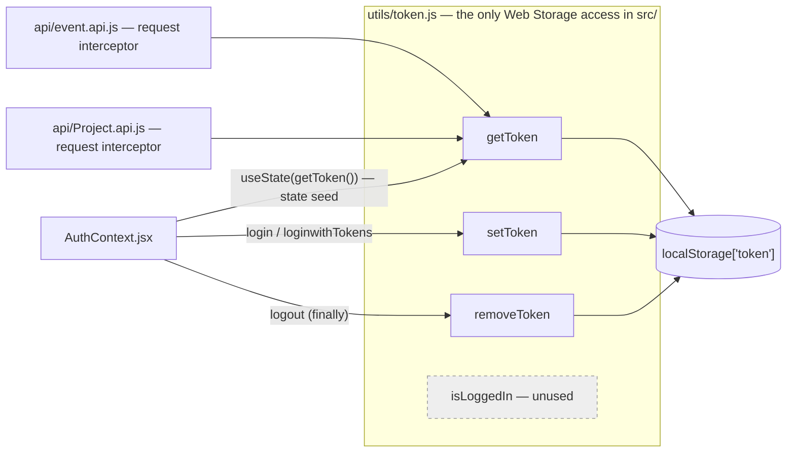

# APILogs Frontend — `utils/` Documentation

> **Source of truth:** every claim below was verified by reading the actual source in
> `frontend/src/utils/` and every file that consumes it — `context/AuthContext.jsx`,
> `api/event.api.js`, `api/Project.api.js`, `api/api.js`, `api/auth.api.js`,
> `routes/ProtectedRoute.jsx`, `App.jsx` and `services/socket.js` — plus the backend
> middleware that ultimately judges the token this module stores
> (`backend/src/middleware/auth.js`, `backend/src/controllers/auth.Controller.js`,
> `backend/src/realtime/socket.auth.js`). A repository-wide grep for `localStorage` and
> `sessionStorage` was run to confirm nothing bypasses this module. Nothing is assumed. Issues
> are listed in [§12 Documentation Discrepancies and Bugs](#12-documentation-discrepancies-and-bugs).

---

## Table of Contents

1. [Architecture Overview](#1-architecture-overview)
2. [File Index](#2-file-index)
3. [token.js — Complete Documentation](#3-tokenjs--complete-documentation)
4. [Consumer Map — Who Calls What](#4-consumer-map--who-calls-what)
5. [The Dual-Write State Model](#5-the-dual-write-state-model)
6. [Token Lifecycle — Login to Logout](#6-token-lifecycle--login-to-logout)
7. [What the Stored Token Actually Is](#7-what-the-stored-token-actually-is)
8. [Error Handling Conventions](#8-error-handling-conventions)
9. [Security Implementation Notes](#9-security-implementation-notes)
10. [Storage Strategy — Trade-offs and Alternatives](#10-storage-strategy--trade-offs-and-alternatives)
11. [Performance Notes](#11-performance-notes)
12. [Documentation Discrepancies and Bugs](#12-documentation-discrepancies-and-bugs)
13. [Unverified Assumptions](#13-unverified-assumptions)
14. [Interview Preparation Notes](#14-interview-preparation-notes)

---

## 1. Architecture Overview

`frontend/src/utils/` is the **persistence layer for the access token**. It contains one file,
17 lines, four exported functions — and despite its size it is one of the most
security-relevant modules in the frontend, because it is the single place where the app's
bearer credential is written to and read from browser storage.

```
utils/
└── token.js      ← setToken / getToken / removeToken / isLoggedIn over localStorage["token"]
```

**Its architectural role: a storage abstraction boundary.**

```
AuthContext ─┐
event.api  ──┼──► utils/token.js ──► localStorage["token"]
Project.api ─┘        (the ONLY module that touches Web Storage)
```

A repository-wide grep for `localStorage` and `sessionStorage` across `src/` returns **three
hits, all inside `token.js` itself**. No page, hook, context or api module reaches around it.
That is the property that makes this module valuable: the storage key, the storage mechanism
and the serialisation format are each defined exactly once, so migrating from `localStorage` to
`sessionStorage`, to an in-memory store, or to a cookie-backed strategy is a change to one file
rather than a codebase-wide search.

**Design characteristics, all verified:**

- **Pure module, no framework coupling.** It imports nothing — not React, not axios, not a
  context. It is plain ES module JavaScript and could be lifted into any browser app unchanged.
- **Synchronous and side-effect-free at import time.** The module body only declares a constant
  and four functions; nothing runs on import.
- **Named exports only.** There is no default export.
- **One key, one value.** Only the access token is persisted. The refresh token — which every
  auth endpoint returns — is **never** passed to this module and never stored anywhere (§7.3).
- **No validation.** It stores and returns opaque strings; it never parses the JWT, checks
  `exp`, or verifies anything.

---

## 2. File Index

| File | Lines | Exports | Imports | Imported by |
|---|---|---|---|---|
| `token.js` | 17 | `setToken`, `getToken`, `removeToken`, `isLoggedIn` (all named) | *(none)* | `context/AuthContext.jsx`, `api/event.api.js`, `api/Project.api.js` |

| Export | Consumers | Status |
|---|---|---|
| `getToken` | `AuthContext` (state seed), `event.api` (interceptor), `Project.api` (interceptor) | ✅ 3 call sites |
| `setToken` | `AuthContext.login`, `AuthContext.loginwithTokens` | ✅ 2 call sites |
| `removeToken` | `AuthContext.logout` | ✅ 1 call site |
| `isLoggedIn` | — | ❌ **dead export — zero importers** |

---

## 3. token.js — Complete Documentation

### 3.1 Purpose

Encapsulate every read, write and delete of the persisted access token behind four named
functions, so that the storage key and mechanism have exactly one definition site.

### 3.2 The module constant

```js
const TOKEN_KEY = "token";
```

Module-private (not exported), so the literal string cannot drift across the codebase. Two
observations:

- **It is deliberately not exported**, which is correct — callers should never construct their
  own `localStorage` access. The trade-off is that a test or a devtools helper cannot reference
  the key symbolically.
- **The value `"token"` is generically named.** `localStorage` is scoped per origin, so on a
  shared origin (multiple apps behind one domain, or a dev server hosting several projects) a
  key this generic risks collision. A namespaced key such as `"apilogs.accessToken"` would be
  safer. This also matters because a stale `token` value left by any other app on the same
  origin would be picked up by `getToken()` and presented as a bearer credential.

### 3.3 `setToken(token)`

```js
export const setToken = (token) => {
    if (!token) return;
    localStorage.setItem(TOKEN_KEY, token);
};
```

| | |
|---|---|
| **Input** | `token: string` — a JWT access token |
| **Output** | `undefined` |
| **Side effect** | writes `localStorage["token"]` |
| **Guard** | returns early, doing nothing, for any falsy input (`null`, `undefined`, `""`, `0`) |

**The guard is the most consequential line in the file**, and its behaviour is subtler than it
looks. It prevents writing the literal strings `"null"` or `"undefined"` into storage — which
is a real hazard, because `localStorage.setItem` coerces its value to a string, so
`setItem("token", undefined)` would store `"undefined"`, and `getToken()` would then return a
truthy 9-character string that `isAuthenticated: !!accessToken` accepts as a valid session.

But the guard **fails silently and leaves the previous value in place**. Consider
`AuthContext.login`:

```js
const data = await loginUser(payload);
setAccessToken(data.accessToken);   // React state ← undefined if the field is missing
setToken(data.accessToken);         // storage ← guard fires, OLD token retained
```

If a response ever lacked `accessToken`, React state would become `undefined` (so
`isAuthenticated` → `false`) while `localStorage` silently kept the *previous user's* token.
The two stores would then disagree, and the next page reload would seed state from the stale
value and appear logged in as the earlier session. Removing the stale key — `if (!token) { removeToken(); return; }`
— would make the guard fail safe instead of fail stale. See §12.

### 3.4 `getToken()`

```js
export const getToken = () => localStorage.getItem(TOKEN_KEY);
```

| | |
|---|---|
| **Input** | none |
| **Output** | `string` when the key exists, **`null`** when it does not (the Web Storage API's documented return for a missing key) |
| **Side effect** | none |

Returning `null` rather than `undefined` matters downstream: `AuthContext` does
`useState(getToken())`, so `accessToken` is `null` — not `undefined` — for a logged-out user,
and `isAuthenticated: !!accessToken` evaluates `false` either way.

It performs **no validation**: the returned string is not parsed, its `exp` claim is not read,
and its signature is obviously not verifiable client-side. `getToken()` answers "what string is
stored?", never "is this a usable credential?".

### 3.5 `removeToken()`

```js
export const removeToken = () => localStorage.removeItem(TOKEN_KEY);
```

| | |
|---|---|
| **Input** | none |
| **Output** | `undefined` |
| **Side effect** | deletes `localStorage["token"]` |

`removeItem` on a non-existent key is a documented no-op, so this is safe to call
unconditionally — which `AuthContext.logout` does, from a `finally` block, so the local session
is cleared even when the server logout call fails.

### 3.6 `isLoggedIn()`

```js
export const isLoggedIn = () => !!getToken();
```

| | |
|---|---|
| **Input** | none |
| **Output** | `boolean` |
| **Consumers** | **none — this export is dead code** |

The app computes the same predicate in `AuthContext` instead:

```js
isAuthenticated: !!accessToken   // from React state, not from storage
```

and `ProtectedRoute` reads *that*. This duplication is not an oversight to "fix" by switching
the guard to `isLoggedIn()` — the opposite. Reading from React state is deliberately correct:

| Source | Reactive? | Consequence |
|---|---|---|
| `isAuthenticated` (React state) | ✅ | clearing the token re-renders every mounted `ProtectedRoute`, which immediately redirects |
| `isLoggedIn()` (storage read) | ❌ | a component would only re-evaluate on its next render; a logged-out user could sit on a rendered protected page indefinitely |

So `isLoggedIn` is genuinely unused and could be deleted — or kept for non-React callers, which
is presumably why it exists. Note it is also the one export that would give a *stale* answer if
React state and storage ever diverged (§3.3).

### 3.7 Return-value summary

| Function | Returns | On the empty/failure case |
|---|---|---|
| `setToken(t)` | `undefined` | silently does nothing if `t` is falsy (**keeps any existing value**) |
| `getToken()` | `string \| null` | `null` when absent |
| `removeToken()` | `undefined` | no-op when absent |
| `isLoggedIn()` | `boolean` | `false` when absent |

### 3.8 Interview explanation

"`token.js` is a storage abstraction over one `localStorage` key. Four functions, and the value
is that it's the *only* module in the app that touches Web Storage — I grepped to confirm
nothing bypasses it — so the key name and the storage mechanism have exactly one definition
site. Swapping `localStorage` for `sessionStorage` or an in-memory store is a one-file change.
The detail worth discussing is the falsy guard in `setToken`: it stops `'undefined'` being
stringified into storage, which would otherwise read back as a truthy fake session — but it
fails *stale* rather than safe, because it leaves the previous token in place. I'd change it to
remove the key instead."

---

## 4. Consumer Map — Who Calls What



### 4.1 Call sites, verified line by line

| Consumer | Line | Call | Purpose |
|---|---|---|---|
| `AuthContext.jsx` | 16 | `useState(getToken())` | **seeds React state from storage on mount** — this single call is what makes a session survive a page reload |
| `AuthContext.jsx` | 39 | `setToken(data.accessToken)` | persist after password login |
| `AuthContext.jsx` | 66 | `setToken(data.accessToken)` | persist after OTP / email-verification login (`loginwithTokens`) |
| `AuthContext.jsx` | 58 | `removeToken()` | clear on logout, inside `finally` |
| `api/event.api.js` | 5–10 | `getToken()` in an axios request interceptor | attach `Authorization: Bearer <token>` |
| `api/Project.api.js` | 5–11 | `getToken()` in an axios request interceptor | identical interceptor body |

### 4.2 The shared-singleton side effect

`event.api.js` and `Project.api.js` register their interceptors on the **same** axios instance
exported by `api/api.js`. Importing either module therefore arms the `Authorization` header for
*every* request in the app — including `incident.api.js` calls, which register no interceptor of
their own. `ProjectDetail` imports `incident.api.js` and (via `useRealtime`) `event.api.js`, so
incident requests are authorised in practice — but by import-order side effect, not by design.

This matters to `utils/`: it means `getToken()` is effectively invoked on **every outgoing HTTP
request**, from two duplicate interceptor registrations. The duplication is the axios layer's
issue, not this module's, but it explains the call frequency discussed in §11.

### 4.3 The one consumer that does *not* go through this module

`services/socket.js` never imports `utils/token`. It receives the token as a **function
argument** from `RealtimeProvider`, which gets it as a prop from `App.jsx`, which reads
`accessToken` from `AuthContext` — i.e. from React state, not storage. That is a cleaner
dependency direction (the transport doesn't reach into storage), and it is why logging out
tears the socket down reactively.

---

## 5. The Dual-Write State Model

Every successful authentication writes the token to **two places**:

```js
// AuthContext.login (lines 38–39) and loginwithTokens (lines 65–66)
setAccessToken(data.accessToken);   // 1. React state  — reactive, in-memory
setToken(data.accessToken);         // 2. localStorage — persistent, cross-reload
```

| Store | Purpose | Read by |
|---|---|---|
| React state (`AuthContext.accessToken`) | drives reactivity | `ProtectedRoute` (via `isAuthenticated`), `App.jsx` → `RealtimeProvider` (socket lifetime), `logout` (to authorise the server call) |
| `localStorage["token"]` | survives reload | the axios interceptors on every request; `useState(getToken())` on next mount |

**Why both are needed**, and why neither alone would do:

- **State only** → a page refresh logs the user out; the socket and guard would work, but the
  session would not survive F5.
- **Storage only** → clearing the token would not re-render anything, so a logged-out user
  would sit on a rendered protected page until something else triggered a render.

The two are synchronised at exactly three moments: mount (`useState(getToken())`), login
(dual write), and logout (`removeToken()` + `setAccessToken(null)`). They can diverge in two
scenarios, both real:

1. **The `setToken` falsy guard fires** (§3.3) — state cleared, storage retained.
2. **Another browser tab logs in or out** — that tab writes storage; this tab's React state is
   untouched, because **no `storage` event listener exists anywhere in the app** (§12).

---

## 6. Token Lifecycle — Login to Logout

```mermaid
sequenceDiagram
    participant U as User
    participant P as Login page
    participant AC as AuthContext
    participant T as utils/token.js
    participant LS as localStorage
    participant AX as axios interceptor
    participant API as Backend

    U->>P: submit credentials
    P->>AC: login(form)
    AC->>API: POST /api/auth/login
    API-->>AC: 200 { accessToken, refreshToken }
    AC->>AC: setAccessToken(data.accessToken)   %% React state
    AC->>T: setToken(data.accessToken)
    T->>T: falsy guard
    T->>LS: setItem("token", jwt)
    Note over AC: data.refreshToken is DISCARDED — never stored

    U->>P: later — any API call
    AX->>T: getToken()
    T->>LS: getItem("token")
    LS-->>AX: jwt
    AX->>API: Authorization: Bearer <jwt>
    API->>API: authRequired — jwt.verify(JWT_ACCESS_SECRET), require sub + tv

    U->>AC: click logout
    AC->>API: POST /api/auth/logout-everywhere (Bearer)
    API->>API: user.tokenVersion += 1
    AC->>T: removeToken()   %% inside finally — runs even if the call failed
    T->>LS: removeItem("token")
    AC->>AC: setAccessToken(null); setUser(null)
    Note over AC: socket tears down; ProtectedRoute redirects
```

### 6.1 Reload path

```
Browser reload
  → AuthProvider mounts
  → useState(getToken())            ← the single line that restores the session
  → accessToken = the stored string (whatever it is)
  → isAuthenticated = true
  → ProtectedRoute passes; every request carries the header again
```

**The token is never re-validated on this path.** `AuthContext`'s init effect explicitly
declines to call the refresh endpoint — its own comment reads *"We are not persisting a refresh
token yet, so skip server refresh to avoid 'Missing token'"* — and simply sets `loading = false`.
So a token that expired while the tab was closed restores a session that *looks* valid and
fails on every request.

### 6.2 Expiry path

There is none. No timer decodes `exp`, no axios **response** interceptor exists for `401`, and
nothing clears storage on an auth failure. The stored string outlives its own validity, and the
app's only recovery is the user manually clicking logout.

---

## 7. What the Stored Token Actually Is

### 7.1 Origin and shape

Produced by `signToken(user)` in `backend/src/controllers/auth.Controller.js`:

```js
const payload = { sub: user.id, tv: user.tokenVersion };
accessToken  = jwt.sign(payload, env.JWT_ACCESS_SECRET,  { expiresIn: env.JWT_ACCESS_EXPIRES_IN });  // default "15m"
refreshToken = jwt.sign(payload, env.JWT_REFRESH_SECRET, { expiresIn: env.JWT_REFRESH_EXPIRES_IN }); // default "7d"
```

So the value in `localStorage["token"]` is a standard three-part JWT whose payload carries
`sub` (the user id), `tv` (token version), plus `iat` and `exp`. It is **signed, not
encrypted** — anyone with the string can Base64-decode the payload and read the user id. That
is expected for a JWT; the signature guarantees integrity, not confidentiality.

Three endpoints return it, and all three flow through `setToken`:
`POST /api/auth/login`, `POST /api/auth/login/otp/verify`, and `POST /api/auth/verify/confirm`.

### 7.2 Who validates it

| Validator | Location | Checks |
|---|---|---|
| **This module** | `utils/token.js` | nothing — it stores and returns an opaque string |
| `ProtectedRoute` | client | only that the string is truthy |
| `authRequired` | `backend/src/middleware/auth.js` | `jwt.verify` signature + expiry; requires both `sub` and `tv`; sets `req.user`. **Reads `tv` but never compares it to the database**, so "logout everywhere" does not invalidate outstanding tokens |
| `verifySocketToken` | `backend/src/realtime/socket.auth.js` | `jwt.verify` + requires `sub`; also ignores `tv` |

With `JWT_ACCESS_EXPIRES_IN` defaulting to `"15m"`, the practical consequence is that **a stored
token is typically useful for 15 minutes but is stored indefinitely** — `localStorage` has no
TTL, so the string persists across reloads, tab closes and browser restarts until `removeToken`
runs or the user clears site data.

### 7.3 The refresh token that is never stored

Every one of those three endpoints also returns `refreshToken`, and **none of it reaches this
module**. `AuthContext` destructures only `accessToken`; `refreshToken` is dropped on the floor.
`api/auth.api.js` exports a `refreshToken()` helper for `POST /api/auth/token/refresh`, but it
has no caller anywhere in `src/`.

This is the single largest gap that `utils/` participates in: the module stores a short-lived
credential with no mechanism to renew it. Adding `setRefreshToken` / `getRefreshToken` here
would be the wrong fix — the correct design is for the refresh token to live in an **httpOnly
cookie** set by the server, so that JavaScript (and therefore XSS) cannot read it, while the
access token stays in memory only. See §10.

---

## 8. Error Handling Conventions

**There is none.** No `try/catch`, no feature detection, no fallback. This is the module's
weakest aspect, because every Web Storage call can throw:

| Failure mode | What throws | Consequence today |
|---|---|---|
| **Safari Private Browsing (older versions)** | `setItem` throws `QuotaExceededError` | `setToken` throws during `login()` → the page's catch shows a generic "Login failed" even though authentication succeeded |
| **Cookies/site data blocked** | accessing `localStorage` itself throws `SecurityError` | `getToken()` throws inside `useState(getToken())` — i.e. **during `AuthProvider`'s render** — and with no error boundary anywhere in the app, the entire tree fails to mount: a blank page |
| **Storage quota exceeded** | `setItem` throws | as above |
| **Iframe with a third-party-storage-blocking browser** | access throws | as above |
| **SSR / non-browser runtime** | `localStorage` is undefined → `ReferenceError` | not applicable to this Vite SPA, but it makes the module non-portable |

The `useState(getToken())` call site is what makes this severe rather than cosmetic: a throw
there happens during render of the provider that wraps the whole application, and §8's
alternative — a blank screen — is strictly worse than a session that silently doesn't persist.

The defensive version is small:

```js
export const getToken = () => {
  try { return localStorage.getItem(TOKEN_KEY); } catch { return null; }
};
export const setToken = (token) => {
  if (!token) { removeToken(); return; }
  try { localStorage.setItem(TOKEN_KEY, token); } catch { /* memory-only session */ }
};
```

That degrades to a memory-only session instead of crashing — the app keeps working for the
current tab, it just won't survive a reload.

**By contrast, what the module does handle correctly:** falsy input to `setToken` (no
`"undefined"` string written), a missing key in `getToken` (`null`, per the Web Storage spec),
and a missing key in `removeToken` (documented no-op).

---

## 9. Security Implementation Notes

### 9.1 Implemented

- **Single point of access.** Every storage read and write goes through these four functions —
  verified by grep. Auditing "where does the token live?" is a one-file answer, and hardening
  it is a one-file change.
- **A private key constant.** `TOKEN_KEY` is not exported, so no consumer can construct an
  ad-hoc key.
- **No accidental `"undefined"` persistence.** The `setToken` guard prevents the class of bug
  where a stringified `undefined` reads back as a truthy fake session.
- **Unconditional clearing on logout.** `removeToken()` is called from `AuthContext.logout`'s
  `finally`, so a failed server round-trip still clears the local credential — failing in the
  safe direction.
- **The token is never logged by this module.** (It *is* logged elsewhere — see §9.2.)

### 9.2 Weaknesses

| Weakness | Evidence | Impact |
|---|---|---|
| **`localStorage` is readable by any JavaScript on the origin** | `token.js` lines 5, 9, 13 | this is the central issue. Any XSS — a compromised npm dependency, an injected script, a malicious browser extension with page access — can read the bearer token and exfiltrate it. `localStorage` offers no `httpOnly` equivalent |
| Token persists indefinitely | no TTL in Web Storage; nothing clears on expiry | the string outlives its 15-minute validity and survives browser restarts |
| No expiry or `exp` awareness | this module never parses the JWT | `ProtectedRoute` keeps passing while every request 401s |
| No cross-tab synchronisation | **no `window.addEventListener('storage', …)` anywhere in `src/`** | logging out in tab A leaves tab B rendering protected pages with cleared storage; logging in as a different user in tab A leaves tab B's React state pointing at the old identity |
| Generic key name | `TOKEN_KEY = "token"` | collision risk on a shared origin; a value left by another app would be sent as a bearer credential |
| `setToken` fails stale, not safe | §3.3 | a malformed login response leaves the previous user's token in storage |
| Token logged elsewhere | `App.jsx` line 12 logs `accessToken`; backend `socket.server.js` logs the raw token and decoded payload | bearer tokens in browser and server logs — not this module's doing, but it is the value this module holds |
| No `Secure`/`SameSite` concept | inherent to Web Storage | storage is origin-scoped, so this is not a CSRF vector (the token is attached explicitly, never sent ambiently), but it also means none of the cookie-level protections apply |

### 9.3 The honest security assessment

This module is **correctly written for the strategy it implements**; the strategy itself is the
weak part. `localStorage` + bearer header is the most common SPA pattern and it is immune to
CSRF by construction — an attacker's site cannot make the browser attach the header. What it
trades away is XSS resistance, which an `httpOnly` cookie would provide.

The right framing in a review or an interview: *"CSRF-safe, XSS-exposed"*, and the mitigation
is not to abandon the module but to change what it stores.

---

## 10. Storage Strategy — Trade-offs and Alternatives

| Strategy | Survives reload | Survives tab close | XSS-readable | CSRF-exposed | Cross-tab sync |
|---|---|---|---|---|---|
| **`localStorage`** ← current | ✅ | ✅ | ❌ **yes, readable** | ✅ safe | needs a `storage` listener |
| `sessionStorage` | ✅ | ❌ per-tab | ❌ yes | ✅ safe | never shared |
| In-memory only (React state) | ❌ | ❌ | ✅ not persisted | ✅ safe | ❌ |
| `httpOnly` cookie | ✅ | ✅ | ✅ **unreadable by JS** | needs `SameSite`/CSRF token | automatic |
| **Hybrid: in-memory access token + `httpOnly` refresh cookie** | ✅ via silent refresh | ✅ | ✅ access token never persisted | `SameSite=Strict` mitigates | automatic |

The hybrid row is the industry-standard answer and the one this codebase is closest to
adopting, because the backend **already issues a refresh token** on all three auth endpoints
and **already exposes** `POST /api/auth/token/refresh`. What is missing is:

1. the server setting the refresh token as an `httpOnly; Secure; SameSite` cookie rather than
   returning it in the JSON body;
2. the client calling `refreshToken()` on mount and on `401`;
3. `utils/token.js` shrinking to an in-memory store — which, because everything already goes
   through these four functions, would be a change to **this file alone**.

That last point is the payoff of the abstraction boundary: the migration path is short
precisely because nothing bypasses the module.

Also worth noting: `api/api.js` already sets `withCredentials: true` on the axios instance, so
the client is already configured to send and receive cookies — the plumbing for a cookie-based
refresh token is half-built, it is just unused today.

---

## 11. Performance Notes

`localStorage` is a **synchronous, main-thread** API — every call blocks. In practice the cost
here is negligible, but the access pattern is worth stating precisely:

| Call site | Frequency |
|---|---|
| `useState(getToken())` | once per `AuthProvider` mount (twice in development under `StrictMode`) |
| interceptor `getToken()` | **once per outgoing HTTP request** |
| `setToken` | once per login |
| `removeToken` | once per logout |

The interceptor case is the only one on a hot path. A `getItem` on a short string is
microsecond-scale, so this is not a real bottleneck — but it is a synchronous disk-backed read
per request where an in-memory variable would do. The reason it reads storage rather than
context is architectural: the axios instance is a module-level singleton created outside React,
so it has no access to context and must reach for the persisted copy.

Minor related notes: the interceptor is **registered twice** (once in `event.api.js`, once in
`Project.api.js`) on the same shared axios instance, so every request runs two functionally
identical interceptor callbacks and performs two `getToken()` reads. That duplication belongs to
the api layer, but it doubles this module's call frequency.

Nothing here allocates, caches or memoises — appropriate for functions this small, where a cache
would cost more correctness than it saves time.

---

## 12. Documentation Discrepancies and Bugs

Ordered by impact. All traced from source; none confirmed by running the app.

| # | Location | Problem | Effect |
|---|---|---|---|
| 1 | `token.js` — all four functions | **No `try/catch` around any Web Storage call.** `getToken()` is invoked inside `useState(getToken())` during `AuthProvider`'s render | in Safari Private Browsing, with site data blocked, or over quota, the throw happens while rendering the provider that wraps the entire app — and with no error boundary anywhere, the result is a **blank page**, not a degraded session |
| 2 | `token.js` line 4 | **`setToken`'s falsy guard fails stale, not safe** — it returns without clearing, leaving the previous token in storage | a login response missing `accessToken` would set React state to `undefined` while storage keeps the prior user's token; the next reload restores that stale session. `if (!token) { removeToken(); return; }` fixes it |
| 3 | app-wide | **No `storage` event listener anywhere in `src/`** | no cross-tab synchronisation: logging out in one tab leaves other tabs rendering protected pages; logging in as a different user leaves other tabs on the old identity |
| 4 | app-wide | **The refresh token is never stored or used.** All three auth endpoints return one; `AuthContext` discards it; `api/auth.api.js`'s `refreshToken()` helper has zero callers | no silent renewal — the 15-minute access token simply dies and the user is stranded on pages whose every request 401s |
| 5 | app-wide | **No axios *response* interceptor for `401`**, so nothing ever calls `removeToken()` on an auth failure | an expired token stays in storage indefinitely and keeps passing `ProtectedRoute` |
| 6 | `token.js` lines 16–18 | **`isLoggedIn` is dead code** — zero importers. `AuthContext` computes `!!accessToken` from React state instead | harmless, but it is a second source of truth that would report differently from the app's real guard if state and storage ever diverged (#2) |
| 7 | `api/Project.api.js` line 4 | **Comment contradicts the code:** *"use getToken from the token utils file, and use TOKEN_KEY `accessToken`"* — the actual `TOKEN_KEY` is `"token"` | misleading to a reader; the code is correct, the comment is wrong |
| 8 | `token.js` line 1 | `TOKEN_KEY = "token"` is generically named for an origin-scoped store | collision risk on a shared origin; a namespaced key like `"apilogs.accessToken"` would be safer |
| 9 | `token.js` | No `typeof window` / feature-detection guard | not an issue in this Vite SPA, but it makes an otherwise framework-agnostic module non-portable to SSR or non-browser runtimes |
| 10 | `token.js` | The module stores an opaque string with **no `exp` awareness** — nothing decodes the JWT to detect expiry proactively | the app cannot distinguish "no session" from "expired session", so it cannot show a useful message |

### 12.1 Things that are correct and should be preserved

- **The abstraction boundary itself** — verified by grep that nothing bypasses it. This is what
  makes the migration in §10 a one-file change.
- **`TOKEN_KEY` kept module-private.**
- **The falsy guard's intent** — preventing `"undefined"` from being stringified into storage is
  a real class of bug avoided (the implementation just needs to clear rather than return).
- **`removeToken()` called from `logout`'s `finally`** — clears locally even when the server
  call fails.
- **`AuthContext` reading `isAuthenticated` from React state, not from `isLoggedIn()`** — this
  is deliberately right, because only state is reactive.
- **`services/socket.js` receiving the token as an argument** rather than importing this module
  — keeps the dependency direction clean.
- **Named exports with no default** — explicit at every call site.

---

## 13. Unverified Assumptions

**Not verified from the available source code:**

1. **Runtime behaviour.** Nothing was confirmed by running the app or a browser. Every finding —
   including the blank-page consequence of a storage throw and the stale-token scenario — is
   derived by reading source and applying documented Web Storage and React semantics.
2. **The specific browsers/modes where `localStorage` throws.** Safari Private Browsing quota
   behaviour and third-party storage blocking are quoted as known platform behaviours; they were
   not reproduced.
3. **`JWT_ACCESS_EXPIRES_IN`'s configured value.** The code default is `"15m"`
   (`example.env.js`), but no `.env` is committed, so the deployed lifetime is unknown.
4. **Whether the login response can ever omit `accessToken`.** Bug #2 is a latent hazard derived
   from the guard's logic; the backend always includes the field on the success path, so it is
   currently unreachable through normal operation.
5. **`isLoggedIn`'s intent** — whether it is leftover scaffolding, or deliberately kept for a
   future non-React consumer, is unknown.
6. **Bundle/tree-shaking** — whether Vite eliminates the unused `isLoggedIn` export from the
   production build was not measured.

---

## 14. Interview Preparation Notes

### 14.1 Questions to expect

**Q: Where do you store the JWT, and why?**
`localStorage`, behind a four-function module so it's the only place in the app that touches Web
Storage. The honest trade-off: `localStorage` is immune to CSRF — an attacker's site can't make
the browser attach a bearer header the way it would attach a cookie — but it's readable by any
JavaScript on the origin, so a single XSS or a compromised dependency leaks the token. The
stronger design is a hybrid: the access token in memory only, and the refresh token in an
`httpOnly; Secure; SameSite` cookie that JavaScript can't read.

**Q: Then why isn't it built that way here?**
Partly unfinished. The backend already issues a refresh token on all three auth endpoints and
already exposes `/auth/token/refresh`, and the axios instance already sets
`withCredentials: true` — so the plumbing is half-built. What's missing is the server setting
the cookie instead of returning it in the body, and the client calling refresh on mount and on
401. The useful point is that because *everything* goes through `utils/token.js`, that migration
is a change to one file.

**Q: Why store the token in both React state and localStorage?**
They do different jobs. State is reactive: clearing it re-renders every `ProtectedRoute`, which
immediately redirects. Storage is persistent: `useState(getToken())` on mount is the single line
that makes a session survive a refresh. State alone logs you out on F5; storage alone means
logging out doesn't visibly log you out until something else triggers a render.

**Q: You export `isLoggedIn()` but the route guard doesn't use it. Why?**
Deliberately. `isLoggedIn()` reads storage, which isn't reactive — a component calling it would
only re-evaluate on its next render, so a logged-out user could sit on a rendered protected page.
`AuthContext` computes `!!accessToken` from React state instead, so clearing the token
immediately re-renders every guard. `isLoggedIn` is genuinely dead code as a result.

**Q: What's the bug in `setToken`?**
The falsy guard returns early without clearing. Its intent is right — without it,
`setItem('token', undefined)` would stringify to `"undefined"`, a truthy 9-character string that
`!!accessToken` accepts as a valid session. But by returning silently it *keeps the previous
value*, so a malformed login response would leave the previous user's token in storage while
React state went undefined. Two stores, disagreeing. The fix is one line: call `removeToken()`
before returning, so it fails safe instead of stale.

**Q: What happens if `localStorage` is unavailable?**
Right now, the app breaks badly. There's no `try/catch`, and `getToken()` is called inside
`useState(getToken())` — during the render of the provider that wraps the whole app. With site
data blocked or in Safari Private Browsing, that throws during render, and since there's no error
boundary anywhere, you get a blank page. Wrapping each accessor in `try/catch` and returning
`null` degrades to a memory-only session instead — the app still works for the current tab, it
just won't survive a reload.

**Q: How would you handle a user logging out in one tab?**
Listen for the `storage` event — it fires in *other* tabs on the same origin whenever storage
changes. On a change to the token key you'd sync React state, which would cascade through
`isAuthenticated` and redirect the other tabs. There's no such listener in this codebase today,
so tabs drift apart after a login or logout.

**Q: How does the token actually get onto a request?**
Not from this module directly — axios request interceptors in `event.api.js` and
`Project.api.js` call `getToken()` and set `Authorization: Bearer <token>`. Worth flagging that
both register on the *same* shared axios instance, so importing either one arms the header
globally, and every request runs two functionally identical interceptors.

### 14.2 Concepts to be able to define cold

`localStorage` vs `sessionStorage` vs cookies vs in-memory storage · `httpOnly`, `Secure`,
`SameSite` · XSS vs CSRF and which storage strategy defends against which · why Web Storage is
synchronous and main-thread · the `storage` event and cross-tab sync · JWT structure —
signed, not encrypted · access vs refresh token split and silent renewal · token versioning
(`tv`) and why reading it without comparing it is a no-op · why a client-side auth check is UX
not security · abstraction boundaries and single-definition-site refactoring · why reactive
state beats a storage read for a route guard.

### 14.3 The honest framing to use

This is 17 lines that do one job cleanly: every Web Storage access in the application funnels
through four named functions, which is exactly the boundary you want around a credential. The
weaknesses are the strategy and the omissions rather than the code — `localStorage` is
XSS-exposed, there's no `try/catch`, no cross-tab sync, no expiry awareness, and the refresh
token the backend issues is thrown away. Being able to say *"CSRF-safe, XSS-exposed, and here's
the one-file migration path to the hybrid model"* is a much stronger answer than either
defending `localStorage` or reflexively calling it insecure.
